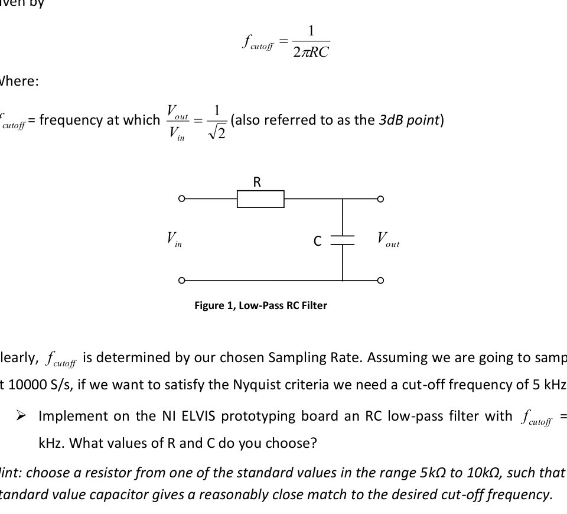
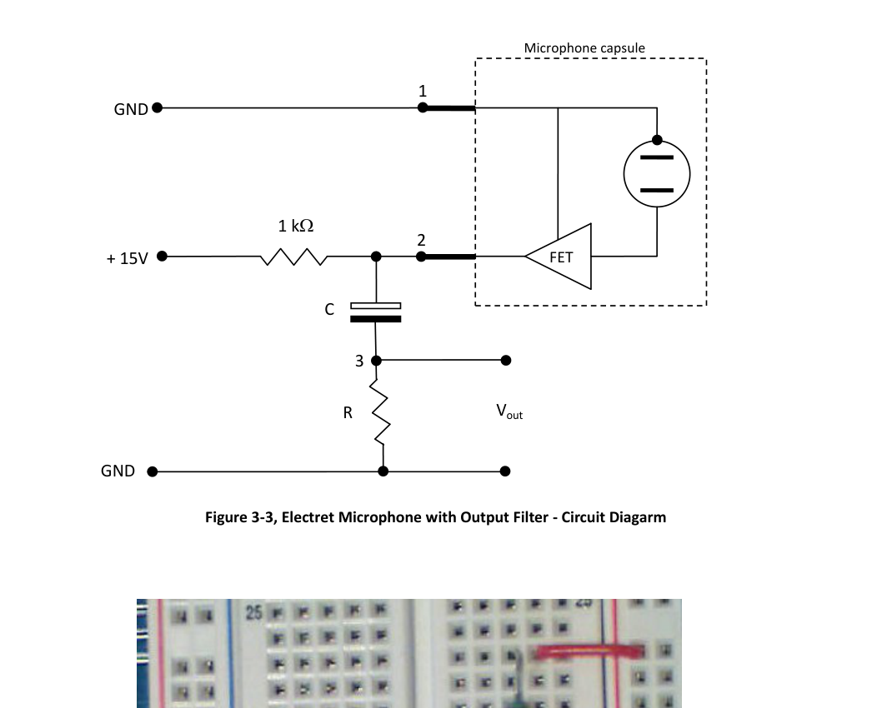
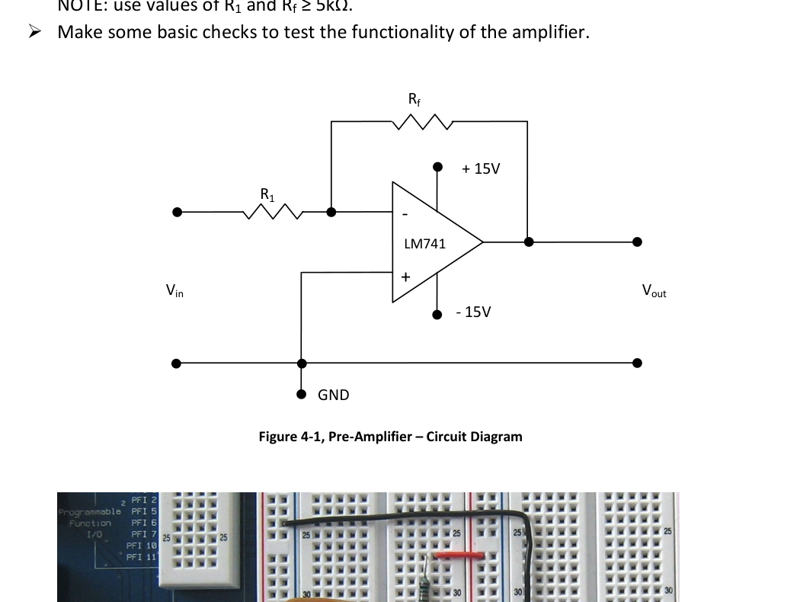
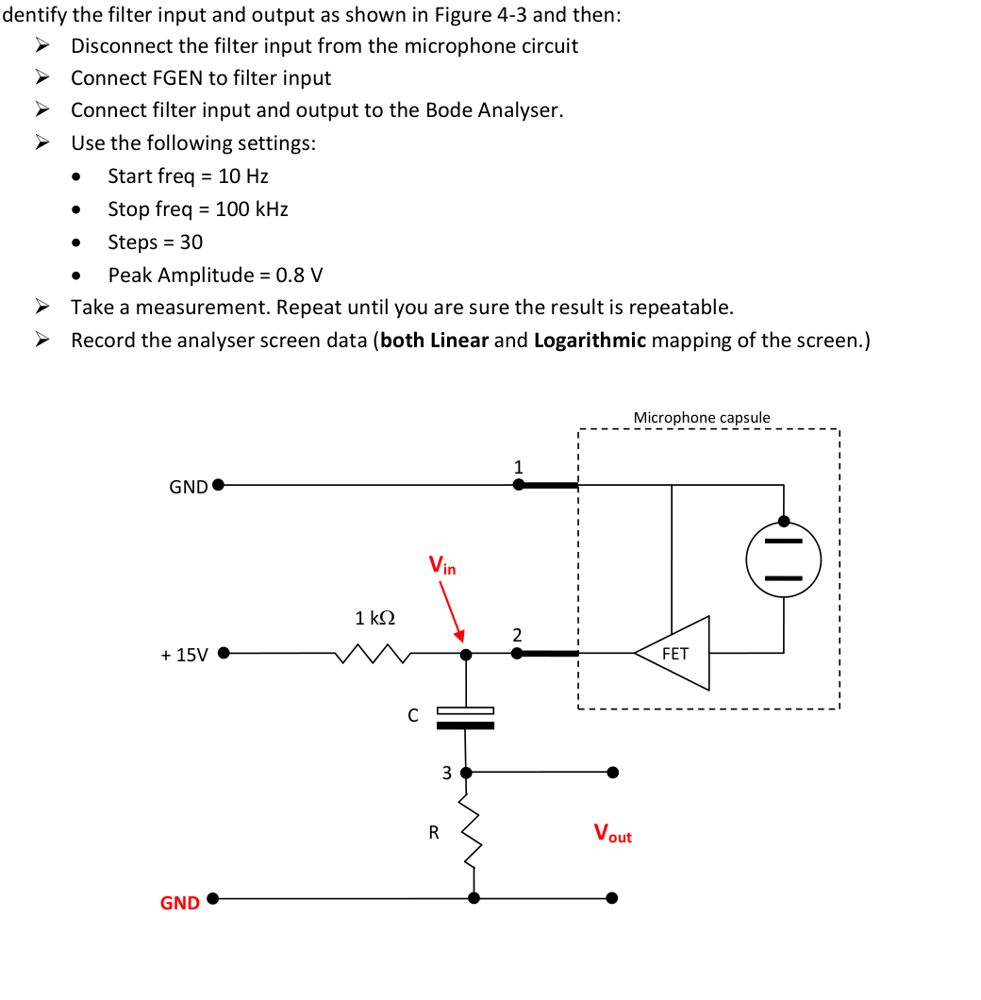
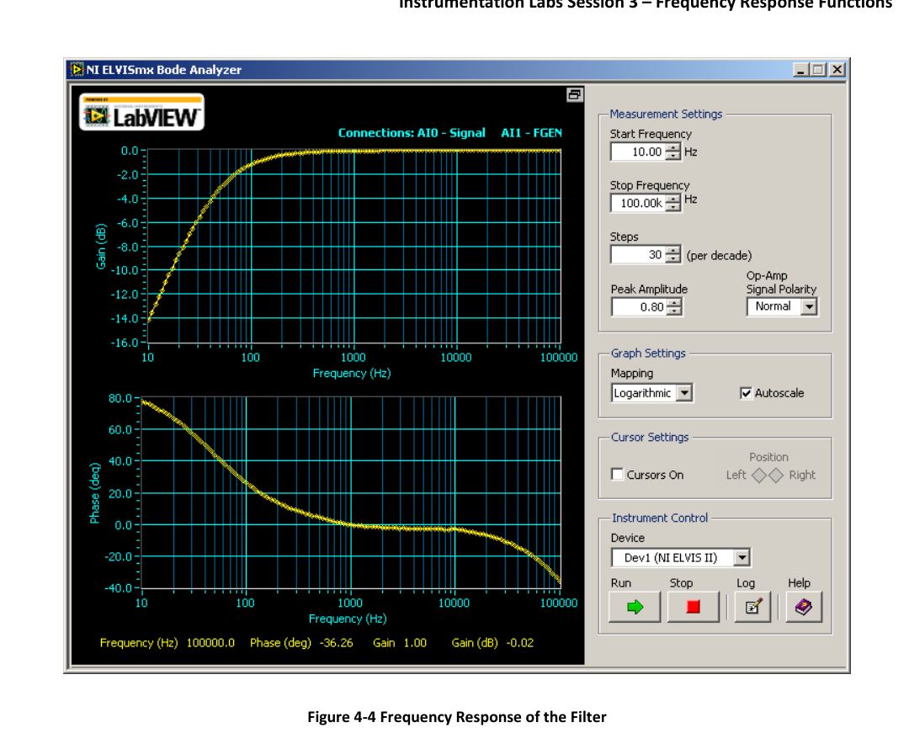

# Foundation interview notes (Labs 1-4, mostly Labs 1-3)

## 1) What this sheet is for
This is my quick theory base for the short lab interview.  
Main aim: if asked "what did you do in the lab and why?", I can explain clearly, sketch circuits, and use equations correctly.

---

## 2) Quick glossary (so symbols stop being confusing)

- **RC circuit**: a circuit with a resistor $R$ and capacitor $C$.
- **LP / Low-pass filter**: passes low frequencies, attenuates high frequencies.
- **HP / High-pass filter**: passes high frequencies, attenuates low frequencies (including DC).
- **$H(j\omega)$ or $G(j\omega)$**: transfer function in frequency domain.
- **Transfer function**: output/input ratio at a given frequency:
$$
H(j\omega)=\frac{V_{out}(j\omega)}{V_{in}(j\omega)}
$$
Here:
- $V_{in}$ is input signal (voltage),
- $V_{out}$ is output signal (voltage),
- $\omega=2\pi f$ is angular frequency (rad/s),
- $j=\sqrt{-1}$.
- **Bode plot**: magnitude and phase of $H(j\omega)$ versus frequency (log axis).
- **$f_s$**: sampling frequency.
- **$f_N=f_s/2$**: Nyquist frequency.

---

## 3) Lab 1 core theory (sampling, aliasing, anti-alias filter)

### 3.1 What I did in Lab 1
- Looked at sampling and aliasing behavior.
- Used/checked anti-alias filtering (low-pass before ADC).
- Used Bode-style thinking to understand bandwidth and cutoff.

### 3.2 Nyquist condition
$$
f_s \ge 2f_{max}
$$
Where:
- $f_s$ = sampling frequency,
- $f_{max}$ = highest frequency present in the analog signal.

If this is violated, aliasing happens.

### 3.3 Aliasing equation
General form:
$$
f_a = |n f_s - f|,\quad n\in \mathbb{Z}
$$
Where:
- $f$ = original analog frequency,
- $f_a$ = aliased (observed) frequency after sampling.

Common first-zone case:
$$
f_a=f_s-f \quad \text{for } \frac{f_s}{2}<f<f_s
$$
Example: if $f_s=1000$ Hz and $f=950$ Hz, then $f_a=50$ Hz.

### 3.4 Why anti-alias filter is needed
I low-pass filter the analog signal before sampling so energy above $f_s/2$ is removed.  
Otherwise high-frequency parts fold into low frequency and corrupt measurement.

For a first-order RC low-pass:
$$
H_{LP}(j\omega)=\frac{1}{1+j\omega RC}
$$
Where:
- $H_{LP}$ = low-pass transfer function,
- $R$ = resistor value (ohms),
- $C$ = capacitor value (farads),
- $RC=\tau$ = time constant (seconds).

---

## 4) Lab 2 core theory (microphone bias, high-pass coupling, pre-amp)

### 4.1 What I did in Lab 2
- Worked with electret microphone signal conditioning.
- Added a high-pass coupling stage to remove DC bias from mic output.
- Used pre-amplifier stage (inverting op-amp) to boost small AC signal.

### 4.2 Why I add a high-pass filter after the mic
Mic output has:
- DC bias (from powering/biasing the capsule),
- small AC audio signal (what I want).

I want to block DC and pass AC.  
So I use coupling capacitor + resistor (first-order high-pass).

### 4.3 Key capacitor impedance idea
$$
Z_C=\frac{1}{j\omega C}
$$
At DC ($\omega=0$), $|Z_C|\to\infty$ so capacitor behaves open-circuit.  
So DC is blocked.

At higher frequency, $|Z_C|$ decreases, so AC can pass.

### 4.4 High-pass transfer function
$$
H_{HP}(j\omega)=\frac{j\omega RC}{1+j\omega RC}
$$
Where:
- $H_{HP}$ = high-pass transfer function,
- numerator $j\omega RC$ grows with frequency, so low $f$ is attenuated,
- denominator sets the full first-order shape.

### 4.5 Cutoff frequency
$$
f_c=\frac{1}{2\pi RC}
$$
At $f=f_c$, magnitude is down by 3 dB (amplitude factor $1/\sqrt{2}$ from passband).

### 4.6 Pre-amp gain (inverting op-amp)
$$
A_v=\frac{V_{out}}{V_{in}}=-\frac{R_f}{R_{in}}
$$
Where:
- $R_f$ = feedback resistor,
- $R_{in}$ = input resistor,
- minus sign means phase inversion (180 degrees).

---

## 5) Lab 3 core theory (frequency response of full chain)

### 5.1 What I did in Lab 3
- Measured frequency response of blocks and/or whole system with Bode Analyzer.
- Interpreted gain + phase vs frequency.
- Compared expected filter behavior to measured plots.

### 5.2 Block-chain model
If system has 4 cascaded blocks:
$$
G(j\omega)=G_1(j\omega)G_2(j\omega)G_3(j\omega)G_4(j\omega)
$$
Magnitude and phase combine as:
$$
|G|=|G_1||G_2||G_3||G_4|,\qquad
\phi=\phi_1+\phi_2+\phi_3+\phi_4
$$

### 5.3 Bode Analyzer measurement meaning
It measures output/input ratio between two channels:
$$
G_{measured}(f)=\frac{A(f)}{B(f)}
$$
So I must be clear what $A$ and $B$ physically are in that setup.

### 5.4 High-pass filter check in Lab 3
Expected:
- low frequency: gain near 0 (attenuated),
- around cutoff: transition,
- high frequency: flat passband (near constant gain).

If measured curve does not match this trend, I check wiring, ground, instrument scaling, and channel mapping.

---

## 6) Lab 4 (what to say briefly)

Lab 4 was lighter on new analog theory and more on virtual instrument / workflow usage.  
If asked, I should connect it back to Labs 1-3 fundamentals:
- sampling limits,
- filtering before/after amplification,
- reading magnitude/phase correctly.

---

## 7) Fundamentals most likely to be tested

### 7.1 Time domain vs frequency domain
- Time domain: waveform vs time $v(t)$.
- Frequency domain: amplitude/phase vs frequency.
- Same signal, different view.
- Frequency domain is easiest for filters and gain/phase reasoning.

### 7.2 Bode plot in plain words
A Bode plot has:
1. Magnitude (often dB) vs log frequency,
2. Phase vs log frequency.

For a first-order filter, slope magnitude is about $20$ dB/decade in the roll-off region.

### 7.3 Why swapping R and C changes LP to HP
Same RC divider idea, different output node:
- output across capacitor $\Rightarrow$ low-pass,
- output across resistor $\Rightarrow$ high-pass.

Reason: capacitor impedance depends on frequency.

### 7.4 RC transient response (step input)
Low-pass step:
$$
V_{out}(t)=V\left(1-e^{-t/RC}\right)
$$
High-pass step:
$$
V_{out}(t)=V e^{-t/RC}
$$
Time constant:
$$
\tau=RC
$$
Useful facts:
- at $t=\tau$, low-pass has reached 63.2% of final value,
- around $5\tau$, first-order response is nearly settled.

### 7.5 Ideal op-amp rules (for quick solving)
Under negative feedback:
$$
i_+\approx i_-\approx 0,\qquad V_+\approx V_-
$$
This gives virtual short behavior and makes KCL analysis easy.

### 7.6 Square wave + Nyquist (common confusion)
Square wave Fourier series:
$$
x(t)=\frac{4}{\pi}\left(\sin\omega t+\frac{1}{3}\sin 3\omega t+\frac{1}{5}\sin 5\omega t+\cdots\right)
$$
It has infinite odd harmonics, so some harmonic is always above any finite $f_s/2$.  
So a perfectly sharp square wave cannot be captured perfectly with finite bandwidth/sample rate.

### 7.7 Differentiation/integration intuition
In certain frequency ranges:
- RC high-pass behaves approximately like differentiator:
$$
v_{out}\approx RC\frac{dv_{in}}{dt}
$$
- RC low-pass behaves approximately like integrator:
$$
v_{out}\approx \frac{1}{RC}\int v_{in}(t)\,dt
$$

---

## 8) Quick sketch templates (must be drawable fast)

### 8.1 High-pass (DC-blocking coupling)
```text
Vin -- C --+-- Vout
           |
           R
           |
          GND
```

### 8.2 Low-pass (anti-alias style)
```text
Vin -- R --+-- Vout
           |
           C
           |
          GND
```

### 8.3 Inverting pre-amp
```text
Vin -- Rin --(-) op-amp ---- Vout
              |      ^
              +--Rf--+
          (+) tied to ground
```

---

## 9) Minimal image pack (only lab-relevant)







---

## 10) 60-second memory sheet (just before viva)

1. $Z_C=\dfrac{1}{j\omega C}$, so at DC capacitor blocks.
2. High-pass for mic coupling: blocks DC bias, passes AC signal.
3. RC cutoff: $f_c=\dfrac{1}{2\pi RC}$.
4. Inverting pre-amp gain: $A_v=-R_f/R_{in}$.
5. Nyquist: $f_N=f_s/2$, and anti-alias LPF goes before ADC.
6. Aliasing: $f_a=|n f_s-f|$.
7. Transfer function = output/input in frequency domain.
8. In cascaded blocks, magnitudes multiply and phases add.

If I can explain each line in normal words and sketch HP/LP/inverting op-amp quickly, I am ready.
