# Chapter 13-14 Study Notes (Detailed, Beginner-Friendly, Problem Sheet 6 Ready)

Sources:
- `Instrumentation/Course notes/chp13-14.pdf`
- `Instrumentation/Course notes/Problem Sheet 6.pdf`

This file keeps the visual style (screenshots/figures) but adds fuller explanations, first-use symbol definitions, and a clear formula reference so you can solve Problem Sheet 6 later.

## How To Use This File

- Read each section in order once.
- Use the `Key Formula Table` as a quick lookup.
- Use the `Problem Sheet 6 Readiness` section before attempting questions.

## Symbols, Units, And Meanings (first-use glossary)

| Symbol | Meaning | Typical units |
|---|---|---|
| `Vout` | Output voltage of a circuit block | `V` (volts) |
| `Vin` | Input voltage of a circuit block | `V` |
| `A` | Signal amplitude (in Chapter 13 phase detector input) | `V` |
| `phi` | Phase difference between two signals | `rad` (radians) |
| `omega` | Angular frequency (`omega = 2*pi*f`) | `rad/s` |
| `Delta_omega` | Frequency difference between two signals | `rad/s` |
| `f` | Frequency | `Hz` |
| `R` | Electrical resistance | `ohm` |
| `C` | Electrical capacitance | `F` (farads) |
| `tau` | Time constant | `s` |
| `x(t)` | System output as a function of time | depends on system |
| `y(t)` | System input (forcing function) | depends on system |
| `Ks` | Static sensitivity (steady output/input ratio) | output-unit per input-unit |
| `omega0` | Natural angular frequency of a second-order system | `rad/s` |
| `xi` | Damping ratio (dimensionless) | no units |
| `Q` | Heat energy transferred | `J` (joules) |
| `dQ/dt` | Heat transfer rate (thermal power) | `W` (`J/s`) |
| `kappa` | Thermal conductivity (glass wall in PS6 Q2) | `W/(m*K)` |
| `A_surf` | Surface area for heat transfer | `m^2` |
| `d` | Wall thickness | `m` |
| `m` | Mass | `kg` |
| `c` | Specific heat capacity | `J/(kg*K)` |
| `T(t)` | Thermometer/mercury temperature | `degC` or `K` (differences are equivalent) |
| `T0` | Heat-bath temperature (step input) | `degC` or `K` |

## Key Formula Table

| Topic | Formula | What it means |
|---|---|---|
| Phase detector (same frequency) | $\langle V_{out} \rangle = \dfrac{2A}{\pi}\cos\phi$ | DC output depends on phase difference only |
| Phase detector average (integral form) | $\langle V_{out} \rangle = \dfrac{1}{T}\left[\int_0^{T/2} V_{in}\,dt-\int_{T/2}^{T} V_{in}\,dt\right]$ | Multiply by $+1/-1$ square reference then average |
| Product identity used in mixing | $\sin a\sin b=\dfrac{1}{2}\left[\cos(a-b)-\cos(a+b)\right]$ | Gives difference and sum frequencies |
| Phase detector (frequency mismatch) | $V_{out}\approx\dfrac{2A}{\pi}\cos(\Delta\omega t)$ for small $\Delta\omega$ | Low-pass keeps difference-frequency term |
| LTI general model | $a_0x+a_1\dfrac{dx}{dt}+\cdots+a_n\dfrac{d^nx}{dt^n}=b_0y$ | Linear time-invariant differential equation form |
| Zero-order static sensitivity | $K_s=\dfrac{b_0}{a_0}$ | Immediate output scaling |
| First-order model | $a_1\dfrac{dx}{dt}+a_0x=b_0y$ | Exponential settling behavior |
| First-order time constant | $\tau=\dfrac{a_1}{a_0}$ | Speed of settling: $63.2\%$ at $t=\tau$ |
| First-order step response | $x(t)=K_s\left[x_0+(x_{\infty}-x_0)(1-e^{-t/\tau})\right]$ | Standard RC-like curve |
| Second-order model | $a_2\dfrac{d^2x}{dt^2}+a_1\dfrac{dx}{dt}+a_0x=b_0y$ | Oscillatory/settling dynamics |
| Normalized second-order form | $\dfrac{d^2x}{dt^2}+2\xi\omega_0\dfrac{dx}{dt}+\omega_0^2x=\text{forcing}$ | Makes damping/frequency roles explicit |
| Natural frequency | $\omega_0^2=\dfrac{a_0}{a_2}$ | Base oscillation scale |
| Damping ratio | $\xi=\dfrac{a_1}{2\sqrt{a_0a_2}}$ | Controls overshoot vs sluggish response |
| Thermal conduction (PS6 Q2) | $\dfrac{dQ}{dt}=\dfrac{\kappa A_{surf}}{d}(T_0-T)$ | Heat flow through bulb wall |
| Thermal first-order ODE | $mc\dfrac{dT}{dt}=\dfrac{\kappa A_{surf}}{d}(T_0-T)$ | Energy balance for thermometer |
| Thermal time constant | $\tau_{th}=\dfrac{mcd}{\kappa A_{surf}}$ | Thermometer response speed |
| Thermal-electrical analogy | $R_{th}=\dfrac{d}{\kappa A_{surf}}$, $C_{th}=mc$ | Equivalent RC system |

## Chapter 13: Phase Sensitive Detector (PSD)

## 13.1 Rectification idea and why PSD exists

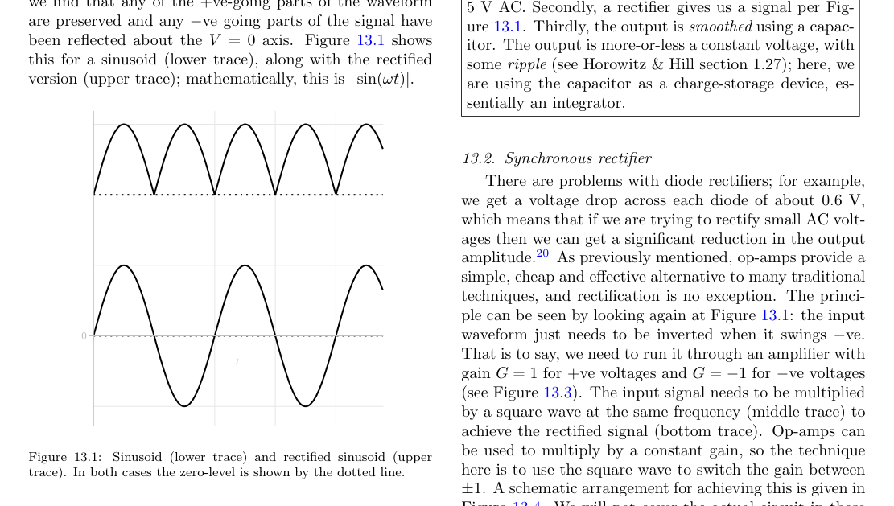

Plain words:
- Rectification means turning an AC waveform that changes sign into a waveform that stays one sign (or mostly one sign).
- For a sinusoid, this often means flipping negative half-cycles upward.
- This is useful whenever we care about signal magnitude/envelope, not sign.
- In instrumentation, rectification is part of phase-sensitive measurement, where we use a known reference to extract weak signals.

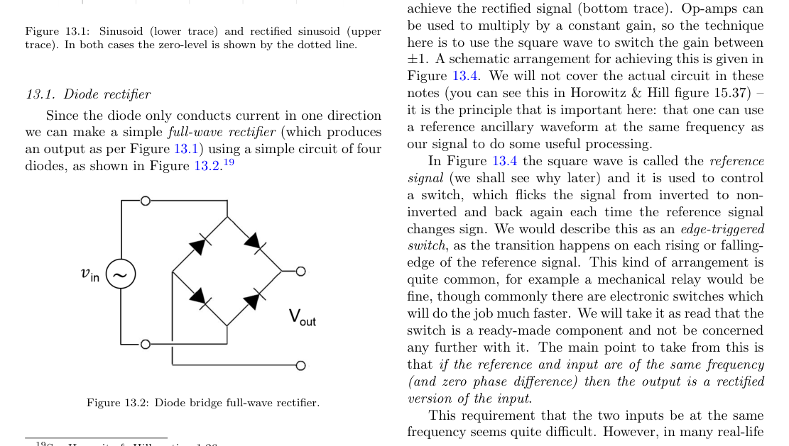

Plain words:
- A bridge rectifier uses four diodes so current through the load always flows in one direction.
- Practical issue: each conducting diode drops voltage (roughly `0.6 V` for silicon), which is a big penalty for small signals.
- That loss motivates synchronous (switching) rectification using active circuits.

## 13.2 Synchronous rectifier principle

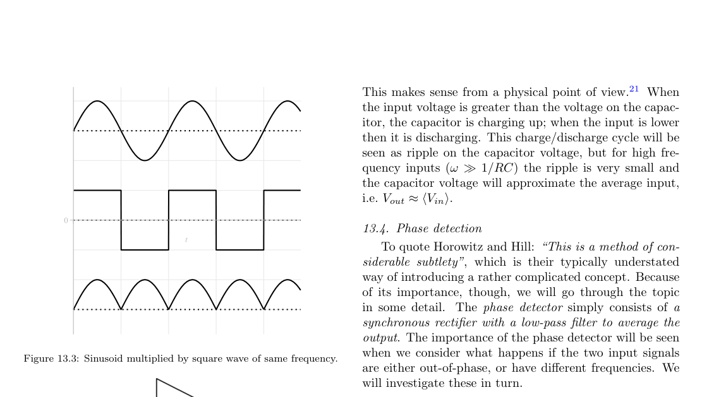

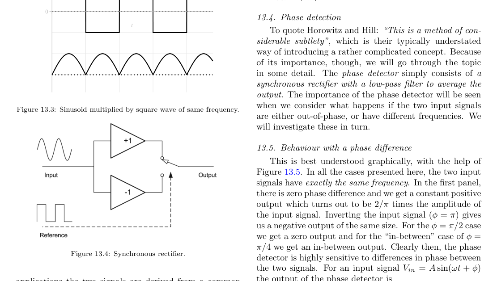

Plain words:
- Instead of passive diode conduction, we multiply input by a square-wave reference.
- The square wave acts like a `+1/-1` gain selector: when reference is positive keep sign, when negative flip sign.
- If reference frequency matches input frequency and phase is aligned, output becomes a rectified version with maximum average value.
- This is phase-sensitive: output depends strongly on phase relation between input and reference.

## 13.3 PSD output with phase difference

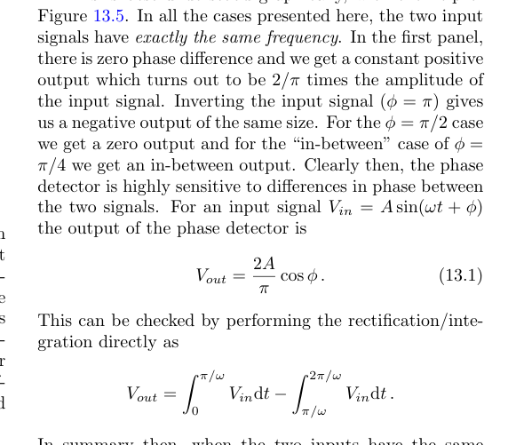

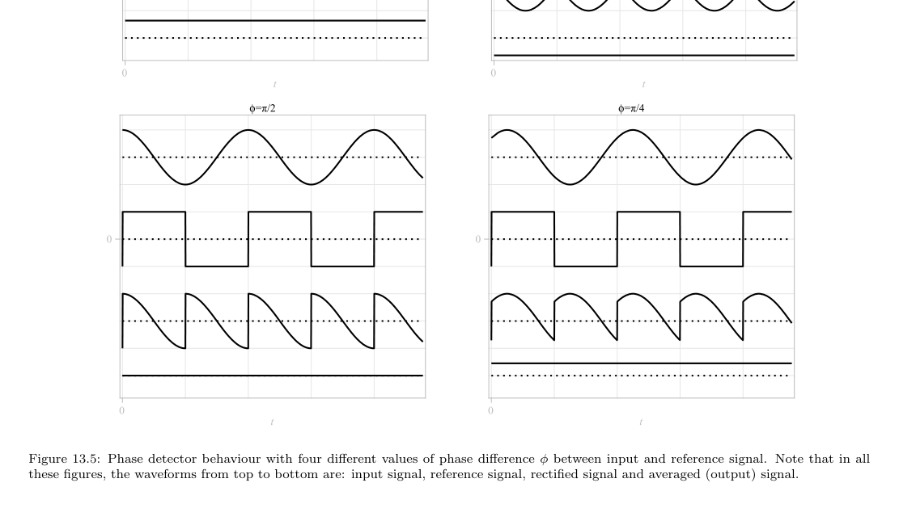

Plain words:
- Keep `omega_in = omega_ref = omega`; only vary phase `phi`.
- After multiply-then-average, output is:
- `<Vout> = (2A/pi) cos(phi)`.
- So:
- `phi = 0` gives maximum positive output.
- `phi = pi/2` gives near zero output.
- `phi = pi` gives maximum negative output.
- This is why PSD can measure phase (or sign) very sensitively.

## 13.4 PSD output with frequency difference

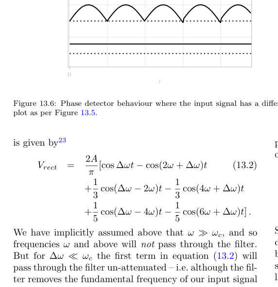

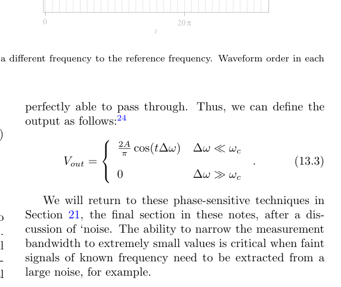

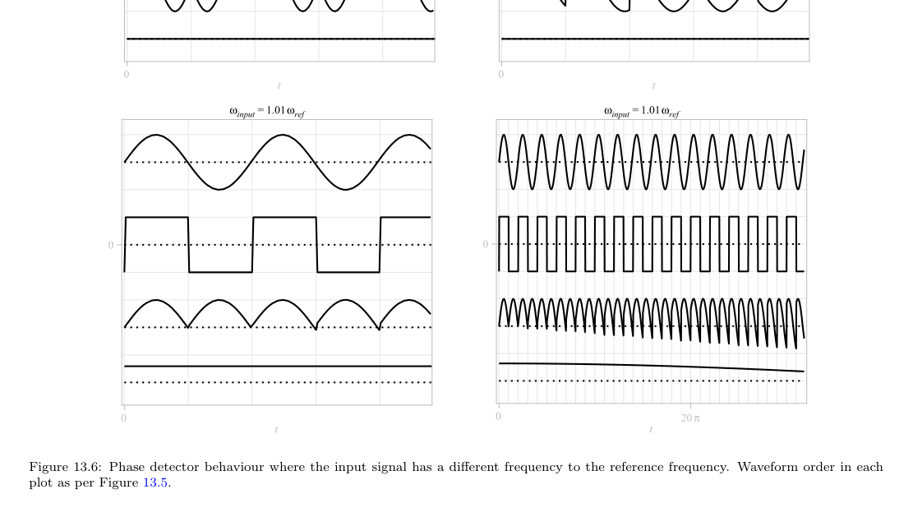

Plain words:
- Let input frequency be `omega + Delta_omega`, reference be `omega`.
- Multiplication creates terms at sum and difference frequencies.
- The low-pass stage rejects high-frequency sum terms and keeps low-frequency difference term if it is inside filter bandwidth.
- If `Delta_omega` is small: output oscillates slowly as `cos(Delta_omega t)`.
- If `Delta_omega` is too large for filter bandwidth: output averages to near zero.
- This is the basis of lock-in style detection: only near-reference content survives.

## Chapter 14: Linear Systems

## 14.1 LTI system concept and properties

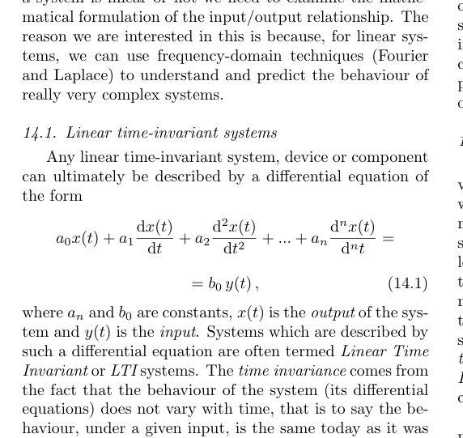

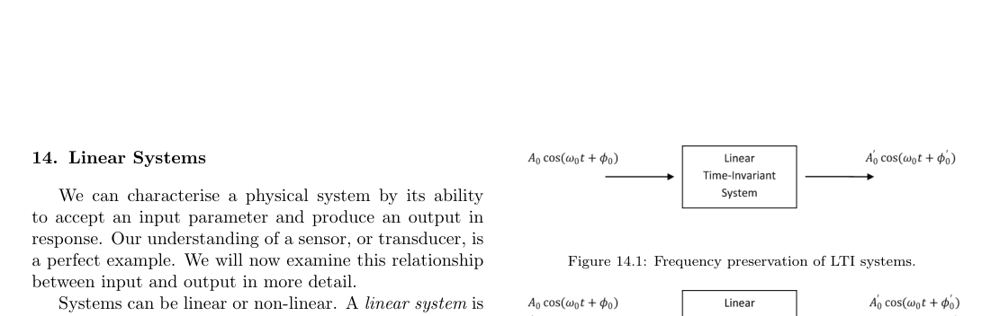

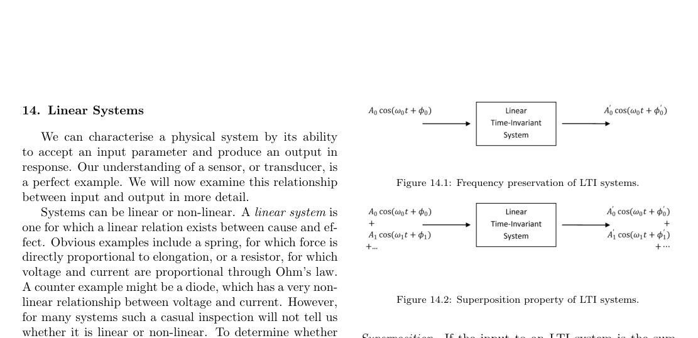

Plain words:
- LTI means Linear Time-Invariant.
- Linear: scaling and superposition work (responses add).
- Time-invariant: same input shape gives same behavior regardless of when it is applied.
- Frequency preservation: sinusoid in -> sinusoid out at the same frequency (only amplitude and phase change).
- Superposition: for a sum of sinusoids, compute each output separately and add.
- This is why Fourier/Bode methods work for instrumentation models.

## 14.2 Zero-order and first-order behavior

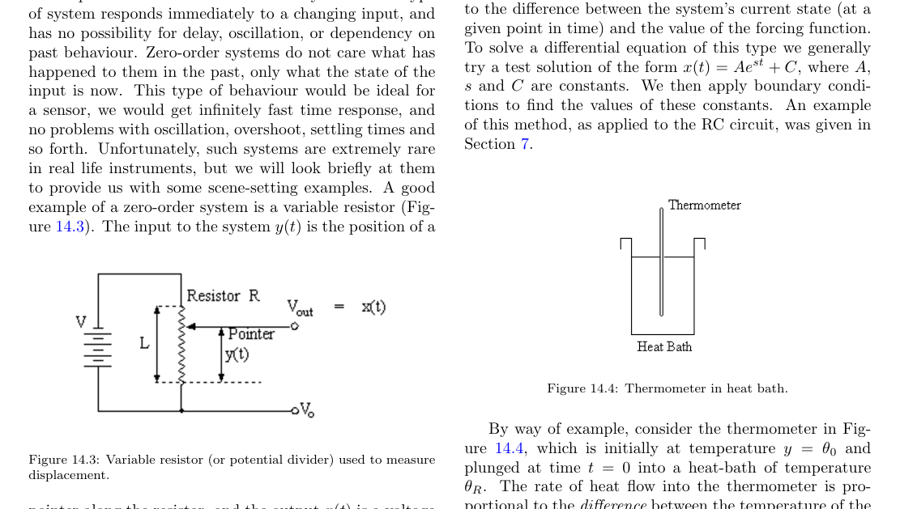

Plain words:
- Zero-order model has no derivative terms, so output tracks input instantly in the idealized math model.
- Real instruments are almost never perfectly zero-order, but static sensitivity `Ks` is still useful.

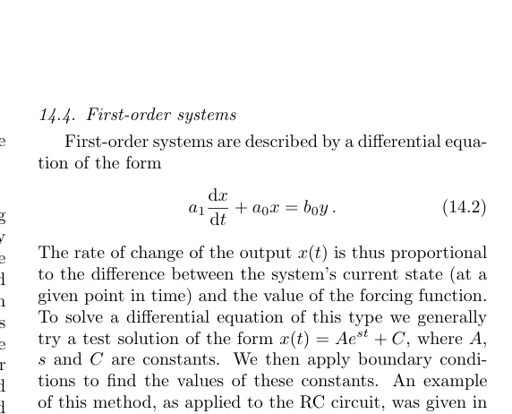

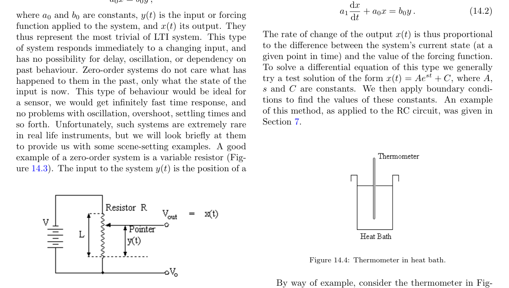

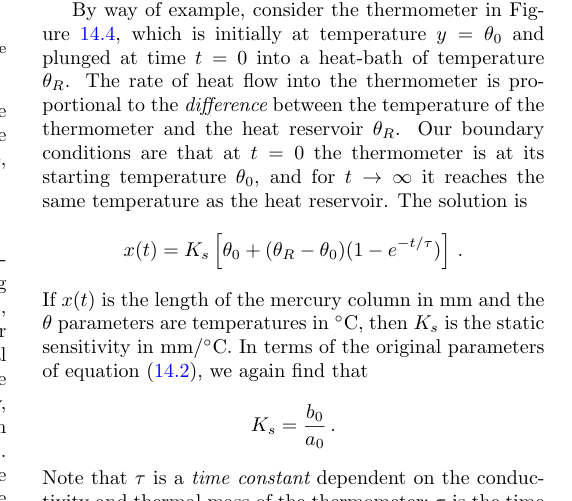

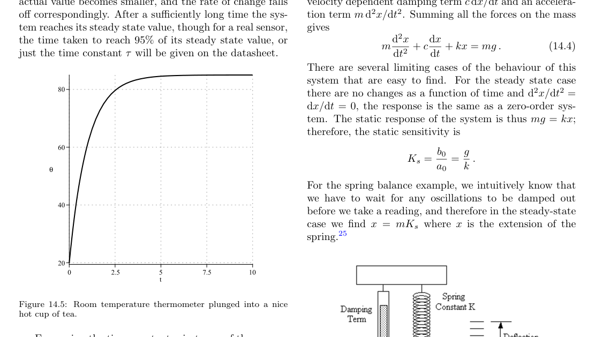

Plain words:
- First-order systems include one derivative term and show exponential approach to steady state.
- They are memory systems: present rate of change depends on current error to target.
- Time constant `tau` sets response speed; at `t=tau`, output reaches `63.2%` of total step change.
- Typical measurement workflow: wait multiple time constants before reading/calibration to reduce transient error.

## 14.3 Second-order behavior and damping

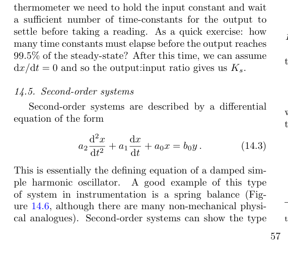

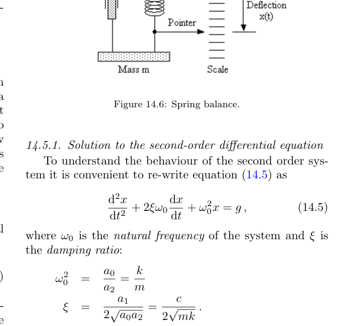

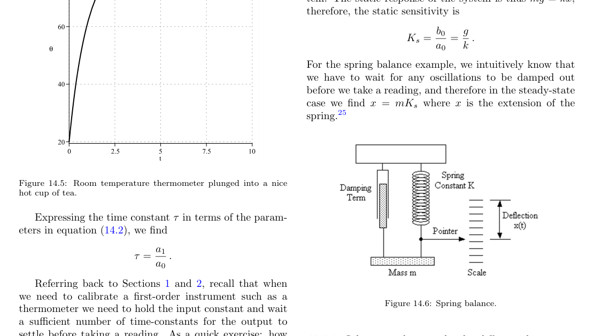

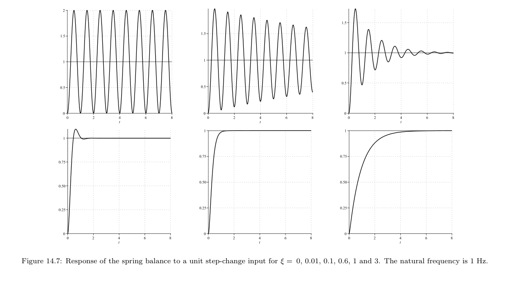

Plain words:
- Second-order systems can overshoot and oscillate, unlike first-order systems.
- `omega0` sets natural oscillation scale; `xi` controls damping.
- Cases:
- `xi = 0`: undamped oscillation.
- `0 < xi < 1`: underdamped (oscillatory decay).
- `xi = 1`: critically damped (fastest no-overshoot case).
- `xi > 1`: overdamped (slow, no oscillation).
- Instrument design tradeoff is usually speed vs overshoot/ringing.

## Problem Sheet 6 Readiness

Start with this sheet for PS6. The only essential topics are the phase-sensitive detector in Chapter 13 and the first-order thermal/LTI response in Chapter 14.

## Q1: Phase detector integral and closed form

What the question asks:
- Write average output integral when $V_{in}=A\sin(\omega t+\phi)$ and reference is a square wave at the same $\omega$.
- Show $\langle V_{out}\rangle=\dfrac{2A}{\pi}\cos\phi$.

Minimal setup to use:
- Period $T=\dfrac{2\pi}{\omega}$.
- Reference square wave is $+1$ on first half-cycle and $-1$ on second half-cycle.
- Therefore:
- $\langle V_{out}\rangle=\dfrac{1}{T}\left[\int_0^{T/2}A\sin(\omega t+\phi)\,dt-\int_{T/2}^{T}A\sin(\omega t+\phi)\,dt\right]$.
- Evaluate to $\dfrac{2A}{\pi}\cos\phi$; the sign can flip if reference polarity is defined opposite.

Memorize vs derive:
- Memorize: final form $\dfrac{2A}{\pi}\cos\phi$ and why phase $\pi/2$ gives zero.
- Derive in exam: write piecewise integral from square-wave sign, integrate sine, simplify using trig identities.

## Q2 Seminar: thermometer transient + electrical analogy

What the question asks:
- Derive heat-flow equation through glass wall.
- Solve temperature response $T(t)$ after step immersion into bath $T_0$.
- Identify thermal equivalents of electrical resistance $R$, capacitance $C$, and voltage $V$.

Derivation skeleton:
- Conduction through wall:
- $\dfrac{dQ}{dt}=\dfrac{\kappa A_{surf}}{d}(T_0-T)$.
- Energy storage in mercury:
- $\dfrac{dQ}{dt}=mc\dfrac{dT}{dt}$.
- Equate:
- $mc\dfrac{dT}{dt}=\dfrac{\kappa A_{surf}}{d}(T_0-T)$.
- Rearranged first-order form:
- $\dfrac{dT}{dt}+\dfrac{1}{\tau_{th}}T=\dfrac{1}{\tau_{th}}T_0$,
- where $\tau_{th}=\dfrac{mcd}{\kappa A_{surf}}$.
- For $T(0)=0$: $T(t)=T_0\left(1-e^{-t/\tau_{th}}\right)$.

Thermal-electrical mapping:
- Temperature difference $\Delta T$ behaves like voltage $V$.
- Heat flow rate $\dfrac{dQ}{dt}$ behaves like current $I$.
- Thermal resistance $R_{th}=\dfrac{d}{\kappa A_{surf}}$ behaves like electrical resistance.
- Thermal capacitance $C_{th}=mc$ behaves like electrical capacitance.
- Equivalent circuit behavior is first-order RC charging.

Memorize vs derive:
- Memorize: $R_{th}$, $C_{th}$, $\tau_{th}=R_{th}C_{th}$, and the exponential step form.
- Derive in exam: start from conduction law + energy balance, then solve linear first-order ODE.

## Quick Revision Checklist

- I can explain why PSD output depends on `cos(phi)`.
- I can write the PSD average integral over one reference period.
- I can explain sum/difference frequencies from signal multiplication.
- I can classify `xi` cases (`underdamped`, `critical`, `overdamped`).
- I can derive `dQ/dt = (kappa A_surf/d)(T0-T)` and map thermal to RC.
- I can define every symbol and unit before using it in a derivation.
