# Chapter 15-16 Study Notes (Laplace, Transfer Function, System Response)

Sources:
- `Instrumentation/Course notes/chp15-16.pdf`
- `Instrumentation/Course notes/Problem Sheet 7.pdf`

These notes are written for first-time learning plus exam revision.  
They emphasize:
- clear formulas (in LaTeX markdown),
- symbol definitions before use,
- visual links to key diagrams/snippets,
- direct mapping to Problem Sheet 7.

## 1. Symbols, Definitions, and Units

| Symbol | Meaning | Typical units |
|---|---|---|
| $t$ | time | s |
| $f(t)$ | generic time-domain signal/function | depends on quantity |
| $F(\omega)$ | Fourier transform of $f(t)$ | depends on transform convention |
| $F(s)$ | Laplace transform of $f(t)$ | depends on signal and $s$ |
| $s$ | Laplace complex frequency variable, $s=\sigma + j\omega$ | s$^{-1}$ |
| $\omega$ | angular frequency, $\omega=2\pi f$ | rad s$^{-1}$ |
| $u(t)$ | unit step function | dimensionless |
| $\delta(t)$ | Dirac delta (unit impulse) | s$^{-1}$ (distribution) |
| $x(t)$ | system output in time domain | depends on system |
| $y(t)$ | system input (forcing function) | depends on system |
| $X(s)$ | Laplace transform of output | depends on output and $s$ |
| $Y(s)$ | Laplace transform of input | depends on input and $s$ |
| $G(s)$ | transfer function in Laplace domain | dimensionless or output/input units |
| $g(t)$ | impulse response in time domain | depends on system |
| $k_1, k_2$ | constants | depends on context |
| $a_0,a_1,\dots$ | differential-equation coefficients | system-specific |

## 2. Key Formula Sheet (High Priority)

| Topic | Formula | Why it matters |
|---|---|---|
| Fourier transform | $F(\omega)=\int_{-\infty}^{\infty} f(t)e^{-j\omega t}\,dt$ | frequency analysis of steady/periodic behavior |
| Laplace transform | $F(s)=\int_{0}^{\infty} f(t)e^{-st}\,dt$ | transient analysis from $t=0^+$ onward |
| Complex frequency | $s=\sigma+j\omega$ | unifies growth/decay and oscillation |
| Linearity | $\mathcal{L}\{k_1f_1+k_2f_2\}=k_1F_1+k_2F_2$ | transform DE terms separately |
| 1st derivative | $\mathcal{L}\{\frac{df}{dt}\}=sF(s)-f(0^+)$ | includes initial condition automatically |
| 2nd derivative | $\mathcal{L}\{\frac{d^2f}{dt^2}\}=s^2F(s)-sf(0^+)-f'(0^+)$ | needed for 2nd-order ODEs |
| Integration | $\mathcal{L}\{\int_0^t f(\xi)\,d\xi\}=\frac{F(s)}{s}$ | integrator modeling |
| Time shift | $\mathcal{L}\{f(t-\lambda)u(t-\lambda)\}=e^{-s\lambda}F(s)$ | delayed inputs |
| Frequency shift | $\mathcal{L}\{e^{at}f(t)\}=F(s-a)$ | exponential modulation |
| Transfer function | $G(s)=\frac{X(s)}{Y(s)}=\frac{\mathcal{L}\{x(t)\}}{\mathcal{L}\{y(t)\}}$ | core model of an LTI block |
| Cascade rule | $G_{\text{series}}(s)=G_2(s)G_1(s)$ | combine blocks in series |
| Parallel rule | $G_{\text{parallel}}(s)=G_1(s)+G_2(s)$ | combine paths in parallel |
| Negative feedback | $G_{\text{cl}}(s)=\frac{G_1(s)}{1+G_1(s)G_2(s)}$ | closed-loop transfer function |
| Step transform | $\mathcal{L}\{u(t)\}=\frac{1}{s}$ | step-response questions |
| Impulse transform | $\mathcal{L}\{\delta(t)\}=1$ | impulse-response questions |
| Impulse response relation | $g(t)=\mathcal{L}^{-1}\{G(s)\}$ | central in system ID and convolution logic |

## 3. Chapter 15: Laplace Transform and Transfer Function

## 3.1 Fourier vs Laplace: what changes and why

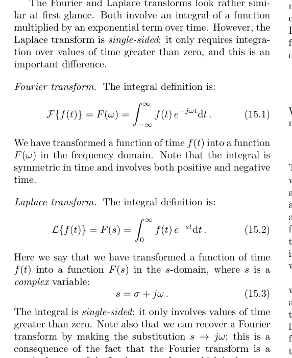

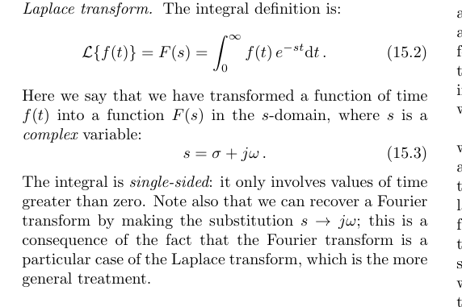

Plain words:
- Fourier integrates over all time ($-\infty$ to $\infty$).  
- Laplace integrates only from $0$ to $\infty$, which matches most lab setups: we switch something at $t=0$ and care what happens after.
- Laplace is especially strong for transient behavior and initial-condition problems.
- Fourier is still excellent for steady-state sinusoidal/frequency-response work.

## 3.2 Why Laplace is practical in instrumentation

Plain words:
- Real instruments are built from blocks (sensor, filter, amplifier, actuator).
- Time-domain differential equations become algebraic equations in $s$-domain.
- Algebra in $s$-domain is usually much easier than solving coupled ODEs directly.
- Initial conditions appear naturally in derivative transforms, so start-up behavior is handled cleanly.

## 3.3 Core Laplace properties you must know

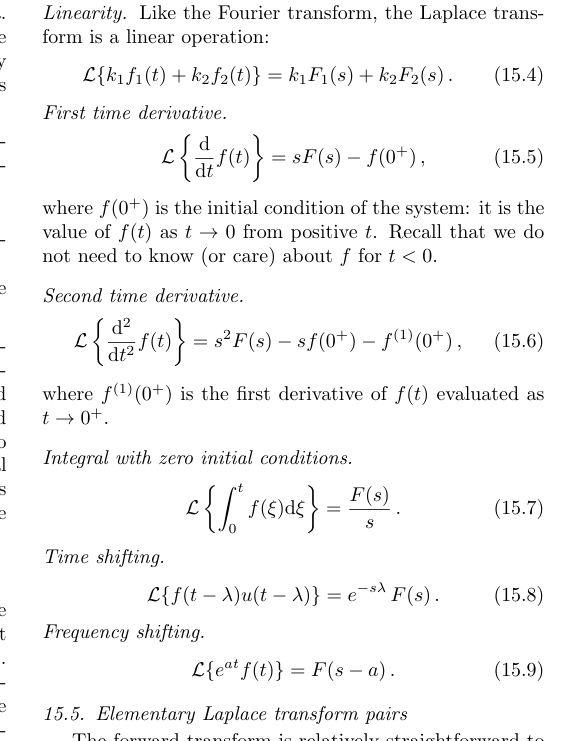

Plain words:
- Linearity lets you split complicated signals into simpler pieces.
- Derivative formulas are the core reason Laplace solves ODEs efficiently.
- Time shift and frequency shift are common in delayed/weighted signals.

Exam note:
- At minimum, memorize the transforms/properties for $u(t)$, $\delta(t)$, constants, exponentials, and first two derivatives.

## 3.4 Transfer function definition and block algebra

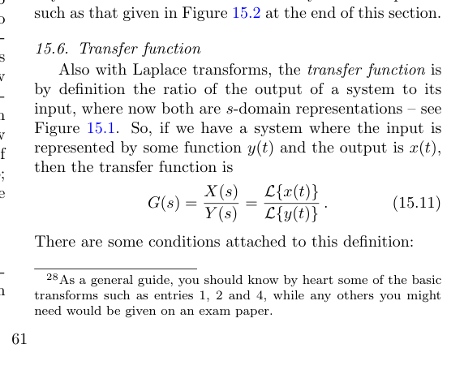

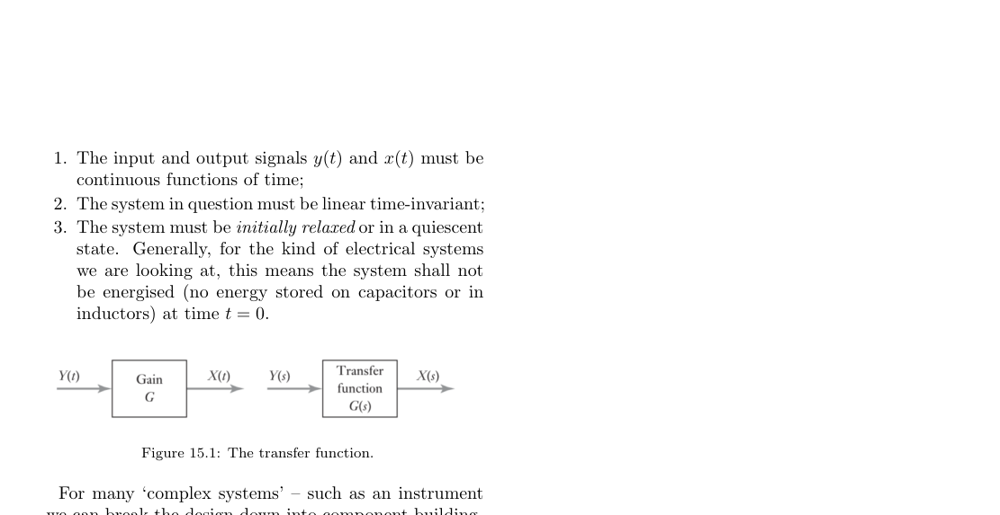

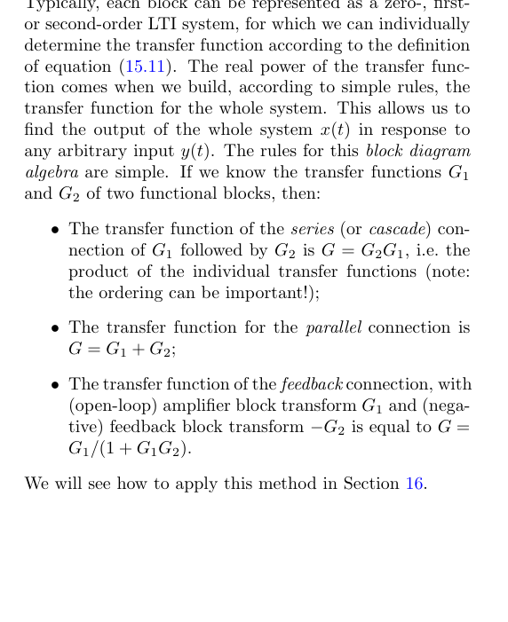

Plain words:
- $G(s)$ is output divided by input in transform domain.
- For LTI, initially relaxed systems, once $G(s)$ is known, output for any input follows from:
$$
X(s)=G(s)Y(s),\qquad x(t)=\mathcal{L}^{-1}\{X(s)\}.
$$
- Complex instruments are analyzed by combining block transfer functions using series/parallel/feedback rules.

High-value exam habit:
- Always state assumptions before writing $G(s)$: LTI, continuous signals, initial conditions specified (often relaxed).

## 3.5 Laplace transform pair table (use, do not re-derive every time)

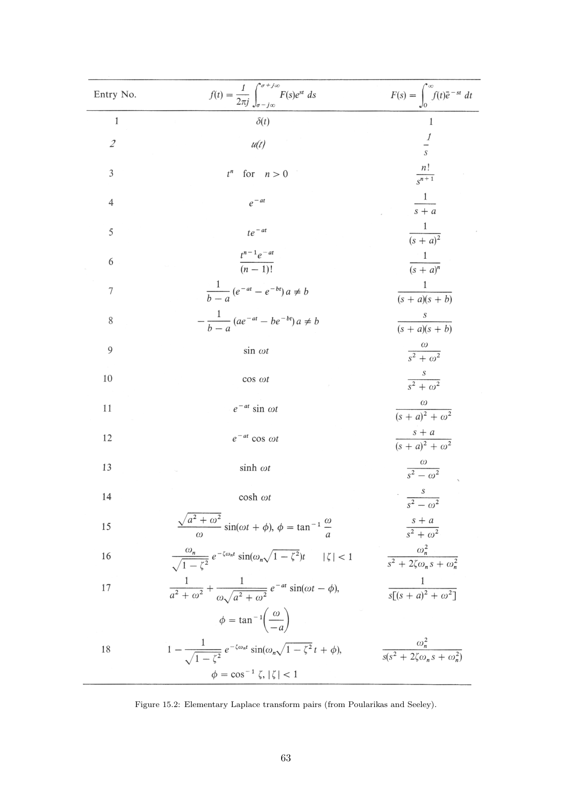

Plain words:
- Inverse Laplace integrals are complex-contour integrals in general.
- In practice, you use transform tables + algebra (especially partial fractions).

## 4. Chapter 16: Solving System Problems with $G(s)$

## 4.1 Impulse response is inverse Laplace of transfer function

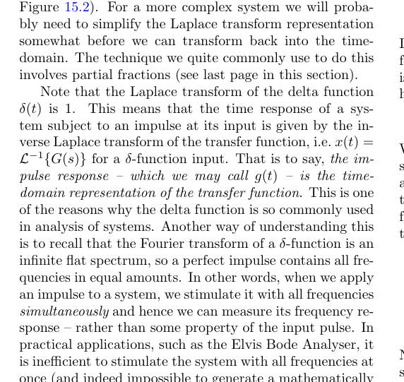

Core result:
$$
y(t)=\delta(t)\ \Rightarrow\ Y(s)=1,\quad X(s)=G(s),\quad g(t)=\mathcal{L}^{-1}\{G(s)\}.
$$

Plain words:
- An impulse input directly reveals system dynamics.
- In ideal theory, impulse contains all frequencies; in practice, instruments approximate this via sweeps or short pulses.

## 4.2 Worked style: series system with step input

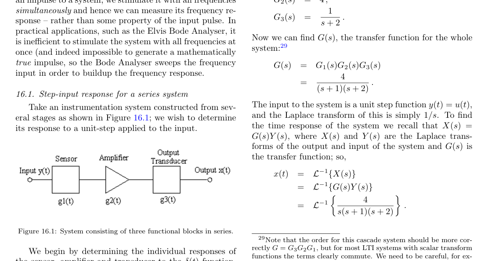

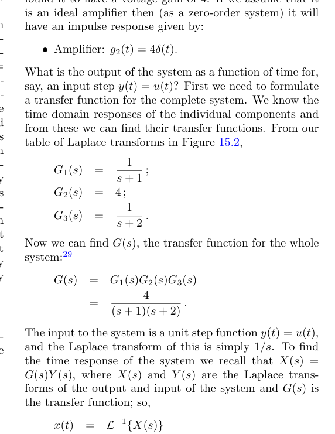

Method template (important):
1. Get each block transfer function $G_1(s),G_2(s),\dots$.
2. Combine to total $G(s)$ using block rules.
3. Transform input to $Y(s)$.
4. Compute $X(s)=G(s)Y(s)$.
5. Use partial fractions if needed.
6. Inverse transform term-by-term.

Example structure from notes:
$$
G(s)=\frac{4}{(s+1)(s+2)},\qquad Y(s)=\frac{1}{s},
$$
$$
X(s)=\frac{4}{s(s+1)(s+2)}.
$$

Then decompose and invert to get time response.

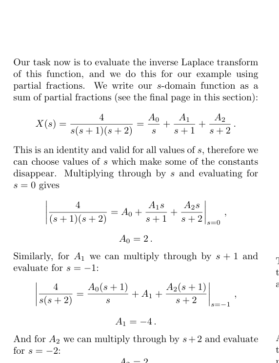

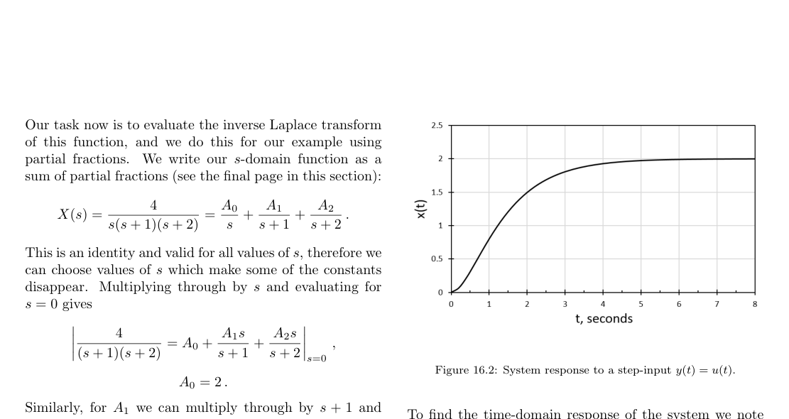

## 4.3 Worked style: known $G(s)$, find impulse response

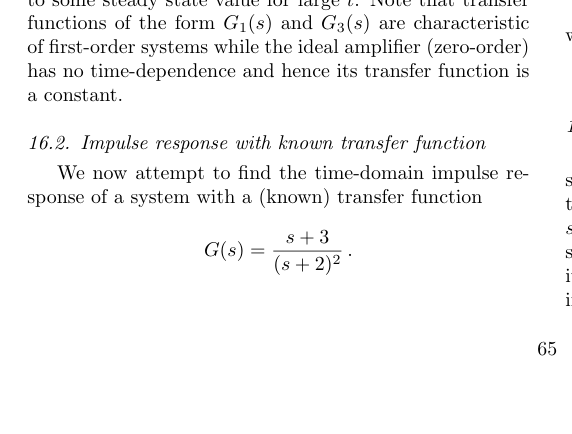

Pattern:
$$
g(t)=\mathcal{L}^{-1}\{G(s)\}.
$$
If denominator has repeated factors, include repeated-power terms in partial fraction form.

## 4.4 Partial fractions: reliable exam workflow

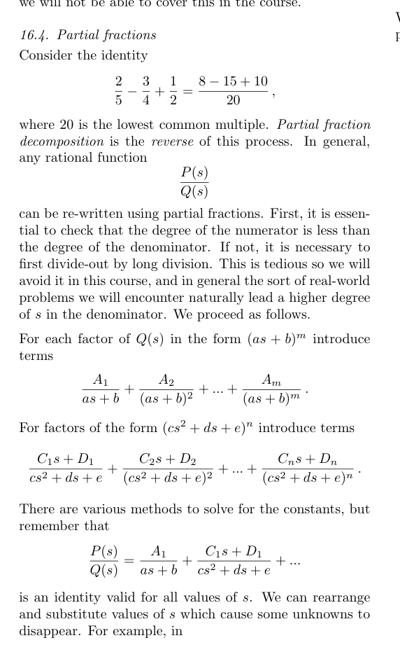

Checklist:
- Ensure denominator degree is greater than numerator degree (otherwise do long division first).
- Write full partial-fraction template including repeated factors.
- Solve constants by substitution at poles and/or coefficient matching.
- Inverse-transform each simple term using table pairs.

## 5. Problem Sheet 7 Rundown (Targeted Prep)

## Q1: Basic Laplace transform computation

Question focus:
- State integral definition.
- Compute transforms of constants/exponentials/sums with $u(t)$.

Use:
$$
\mathcal{L}\{f(t)\}=\int_0^\infty f(t)e^{-st}\,dt.
$$

Key quick transforms:
$$
\mathcal{L}\{u(t)\}=\frac{1}{s},\quad
\mathcal{L}\{e^{-at}u(t)\}=\frac{1}{s+a},\quad
\mathcal{L}\{k\,u(t)\}=\frac{k}{s}.
$$

Linearity for part (iii):
$$
\mathcal{L}\{u(t)+e^{-t}u(t)\}
=\frac{1}{s}+\frac{1}{s+1}
=\frac{2s+1}{s(s+1)}.
$$

Exam importance:
- High-frequency marks for quick transform fluency.

## Q2: Solve ODEs using Laplace (impulse and IC cases)

Question focus:
- Prove linearity.
- Solve second-order ODE with $\delta(t)$ input and relaxed initial state.
- Solve homogeneous ODE with given initial conditions.

General second-order transform template:
$$
\mathcal{L}\{y''\}+3\mathcal{L}\{y'\}+2\mathcal{L}\{y\}=\mathcal{L}\{\text{input}\}.
$$
$$
(s^2Y-sy(0^+)-y'(0^+))+3(sY-y(0^+))+2Y=\text{RHS}(s).
$$

For relaxed system and impulse input:
$$
y(0^+)=0,\ y'(0^+)=0,\ \mathcal{L}\{\delta(t)\}=1.
$$
So:
$$
Y(s)=\frac{1}{(s+1)(s+2)}=\frac{1}{s+1}-\frac{1}{s+2},
$$
$$
y(t)=e^{-t}-e^{-2t}.
$$

For homogeneous equation with given ICs:
- Same transform method, but RHS is $0$ and IC terms stay.
- Solve for $Y(s)$, then inverse transform.

Exam importance:
- This is a core “method marks” question type.

## Q3 Seminar I: Transfer function meaning + integrator block

Question focus:
- Define transfer function.
- Convert amplifier gain in dB to linear.
- Explain impulse response relevance and delta-function properties.
- Find integrator transfer function.

Key facts:
$$
G(s)=\frac{X(s)}{Y(s)}.
$$
For voltage gain in dB:
$$
20\log_{10}(A_v)=40\ \Rightarrow\ A_v=10^{40/20}=100.
$$
Perfect amplifier transfer function:
$$
G(s)=100,\qquad g(t)=100\,\delta(t).
$$

Integrator:
$$
x(t)=\int_0^t y(\xi)\,d\xi
\Rightarrow
X(s)=\frac{Y(s)}{s}
\Rightarrow
G(s)=\frac{1}{s}.
$$
For $y(t)=\delta(t)$:
$$
x(t)=u(t),
$$
so output jumps to 1 at $t=0^+$.

Exam importance:
- Conceptual + computational blend; common seminar/oral topic.

## Q4 Seminar II: Two amplifiers in series

Given single-block impulse response:
$$
g(t)=t e^{-t}.
$$

Single-block transfer function:
$$
G_1(s)=\mathcal{L}\{t e^{-t}\}=\frac{1}{(s+1)^2}.
$$

Two identical blocks in series:
$$
G_{\text{tot}}(s)=G_1^2(s)=\frac{1}{(s+1)^4}.
$$

For step input $y(t)=u(t)$:
$$
Y(s)=\frac{1}{s},\qquad
X(s)=\frac{1}{s(s+1)^4}.
$$

Then use partial fractions and inverse Laplace.  
Expected form (from sheet hints) is:
$$
x(t)=u(t)-e^{-t}-t e^{-t}-\frac{t^2 e^{-t}}{2!}-\frac{t^3 e^{-t}}{3!}.
$$

Exam importance:
- Strong test of block algebra + repeated-pole partial fractions.

## 6. What To Memorize vs What To Derive

Memorize:
- $\mathcal{L}$ definition, derivative rules, $\mathcal{L}\{u\}$, $\mathcal{L}\{\delta\}$, $\mathcal{L}\{e^{-at}\}$.
- $G(s)=X(s)/Y(s)$ and series/parallel/feedback combination rules.
- dB-to-linear conversion for voltage gain: $A_v=10^{G_{\mathrm{dB}}/20}$.

Derive during exam:
- ODE-to-$Y(s)$ algebra with correct initial-condition terms.
- Partial-fraction constants.
- Final inverse transform steps.

## 7. Final Quick Checklist

- I can set up $X(s)=G(s)Y(s)$ without sign mistakes.
- I can include $y(0^+)$ and $y'(0^+)$ correctly in derivative transforms.
- I can decompose repeated poles in partial fractions.
- I can move between $g(t)$ and $G(s)$ in either direction.
- I can map each Problem Sheet 7 question to the right method quickly.

