# Chapter 17-18 Notes (Seminar Focus: Problem Sheet 8, Question 3)

Sources:
- `Instrumentation/Course notes/chp17-18.pdf`
- `Instrumentation/Course notes/Problem sheet 8.pdf`
- `Instrumentation/Course notes/Problem Sheet 8 Solutions.pdf`

Primary goal for this document:
- Understand Chapter 17-18 as usual.
- Put extra focus on **Problem Sheet 8, Q3** so you can explain the solution clearly in seminar.
- Explicitly point out where each Q3 step comes from.

## 1. Symbols and quick definitions

| Symbol | Meaning |
|---|---|
| $Y(s)$ | Laplace-domain input signal |
| $X(s)$ | Laplace-domain output signal |
| $G(s)$ | Overall transfer function, $G(s)=\dfrac{X(s)}{Y(s)}$ |
| $G_0(s),G_1(s),G_2(s)$ | Transfer functions of the three internal blocks |
| $g_0(t)$ | Impulse response of block $G_0$ |
| $s$ | Complex variable, $s=\sigma + j\omega$ |
| Pole | Value of $s$ that makes denominator of $G(s)$ zero |
| Stable root | Pole with $\sigma<0$ |
| Unstable root | Pole with $\sigma>0$ |

---

## 2. Chapter 17 Core Ideas (Stability in LTI systems)

### 2.1 Stability intuition

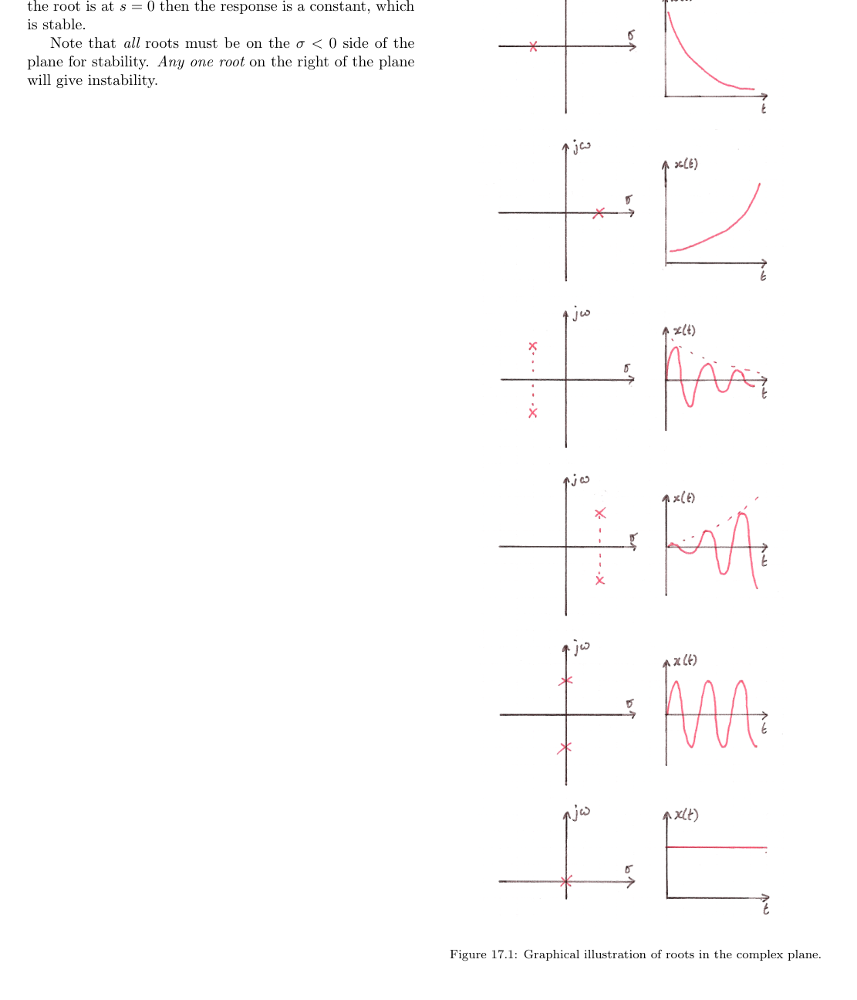

Plain words:
- A system is stable if transients die out and output stays bounded.
- A system is unstable if output grows without bound.
- Sustained sinusoid (constant amplitude) is a boundary case: not decaying, but still bounded.

### 2.2 Feedback form and instability condition

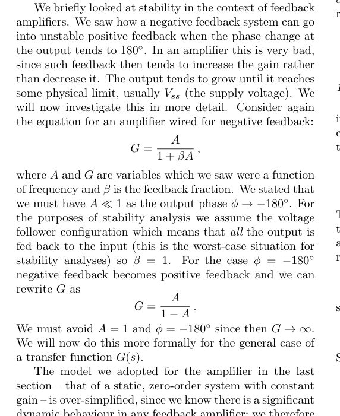

Key equations:
$$
G=\frac{A}{1+\beta A}, \qquad
G(s)=\frac{A(s)}{1+H(s)A(s)}.
$$

Stability warning:
$$
1+H(s)A(s)=0
$$
causes denominator collapse and very large response (instability condition).

### 2.3 Poles, zeros, and root-location test

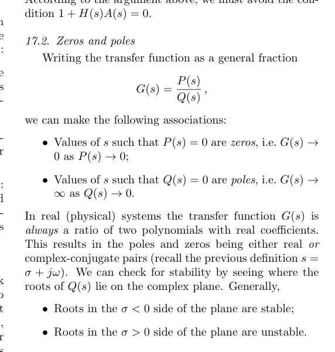

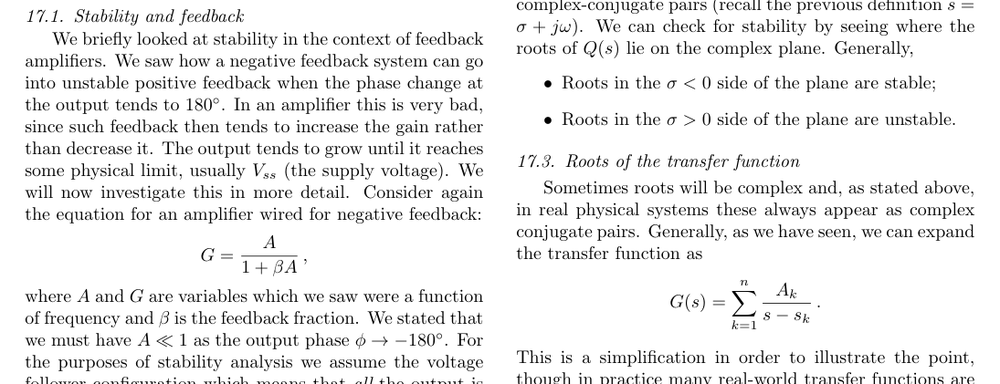

Core rule used in exams:
- If **any pole** has $\Re(s)>0$, system is unstable.
- Poles with $\Re(s)<0$ are stable.
- Complex poles with positive real part give growing oscillation; real positive poles give non-oscillatory exponential growth.

---

## 3. Chapter 18 Core Ideas (Initial-condition transient analysis)

### 3.1 Why this chapter matters

Chapter 18 is not directly the block-diagram question style of PS8 Q3, but it reinforces the same Laplace workflow:
1. Write governing equation.
2. Laplace transform with initial conditions.
3. Solve algebraically in $s$-domain.
4. Inverse transform.

### 3.2 RLC switched-circuit example

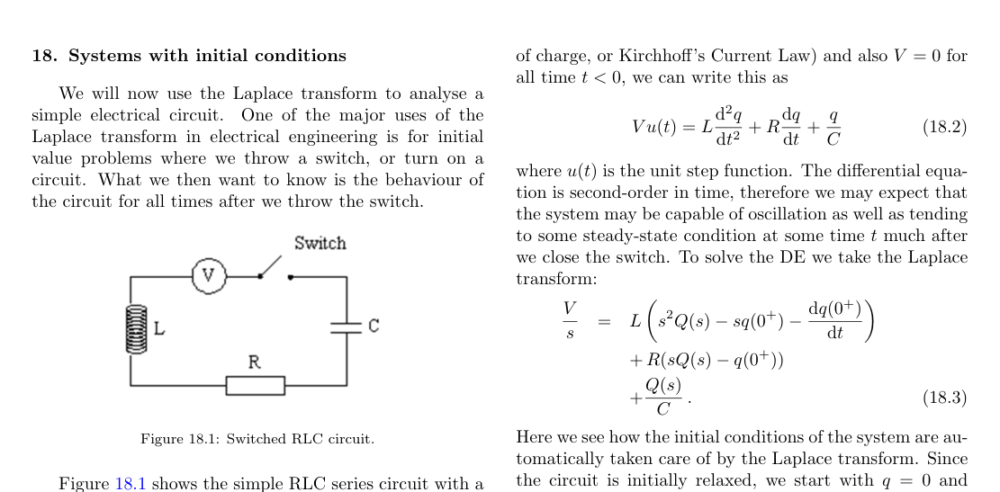

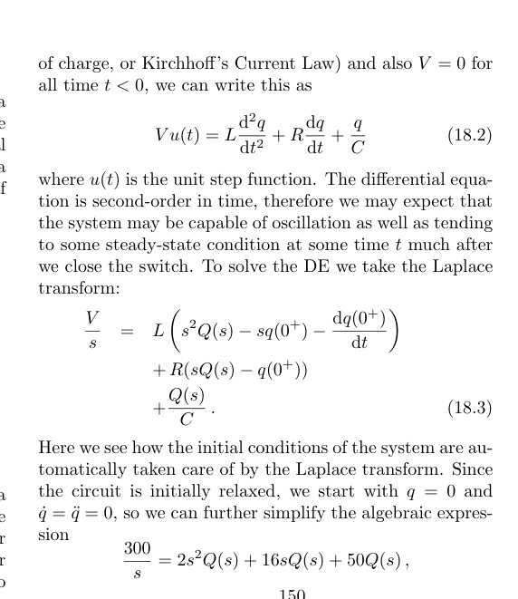

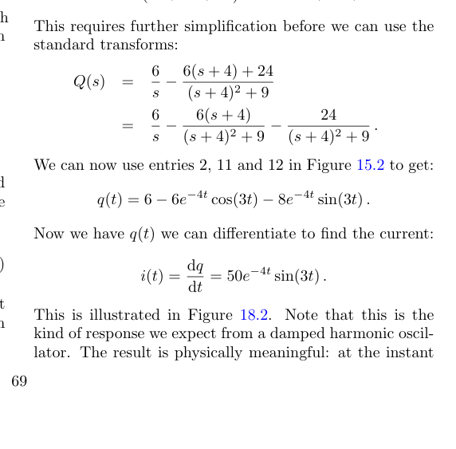

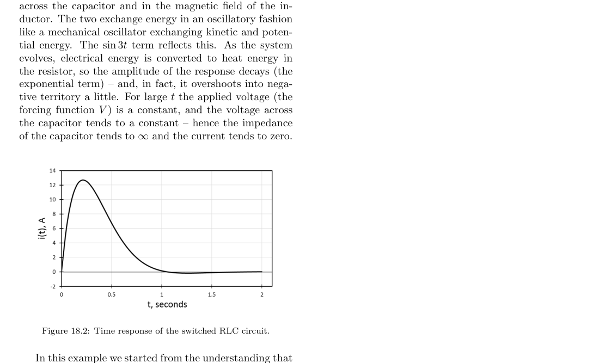

Key takeaways for your seminar style:
- Laplace automatically includes initial conditions via derivative transforms.
- Partial fractions are often the bridge from $X(s)$ to $x(t)$.
- Result shape (damped sinusoid vs growth) is interpreted from poles.

---

## 4. Problem Sheet 8 Q3: Complete Seminar Map

### 4.1 The question block you are presenting

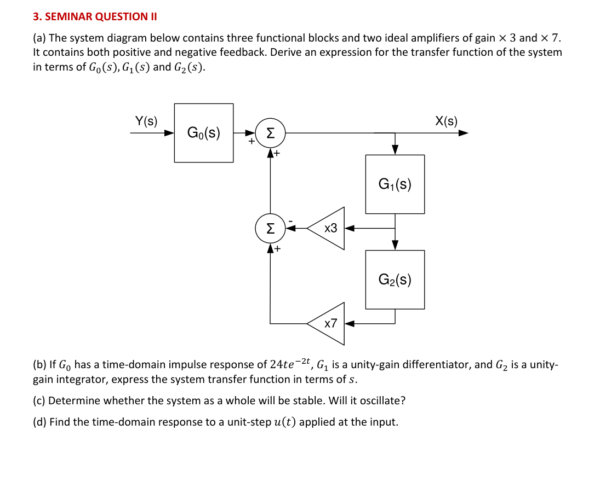

This question mixes:
- block-diagram algebra,
- Laplace transform pairs,
- stability via pole locations,
- inverse Laplace/partial fractions for step response.

### 4.2 Part (a): derive overall transfer function from the diagram

From marked signal flow (as in the provided solution):
$$
X(s)=Y(s)G_0(s)+7X(s)G_1(s)G_2(s)-3X(s)G_1(s).
$$
Rearrange:
$$
X(s)\left[1+G_1(s)\left(3-7G_2(s)\right)\right]=Y(s)G_0(s),
$$
so
$$
G(s)=\frac{X(s)}{Y(s)}=\frac{G_0(s)}{1+G_1(s)\left(3-7G_2(s)\right)}.
$$

Where this came from:
- Transfer-function definition and block algebra logic (Chapter 15/16 background).
- Feedback stability mindset from Chapter 17 (denominator structure matters).

### 4.3 Part (b): substitute given block behaviors

Given:
$$
g_0(t)=24te^{-2t}\quad\Rightarrow\quad G_0(s)=\frac{24}{(s+2)^2},
$$
unity differentiator:
$$
G_1(s)=s,
$$
unity integrator:
$$
G_2(s)=\frac{1}{s}.
$$
Substitute into part (a):
$$
G(s)=\frac{24}{(s+2)^2}\cdot\frac{1}{1+s\left(3-\frac{7}{s}\right)}
=\frac{24}{(s+2)^2(3s-6)}.
$$

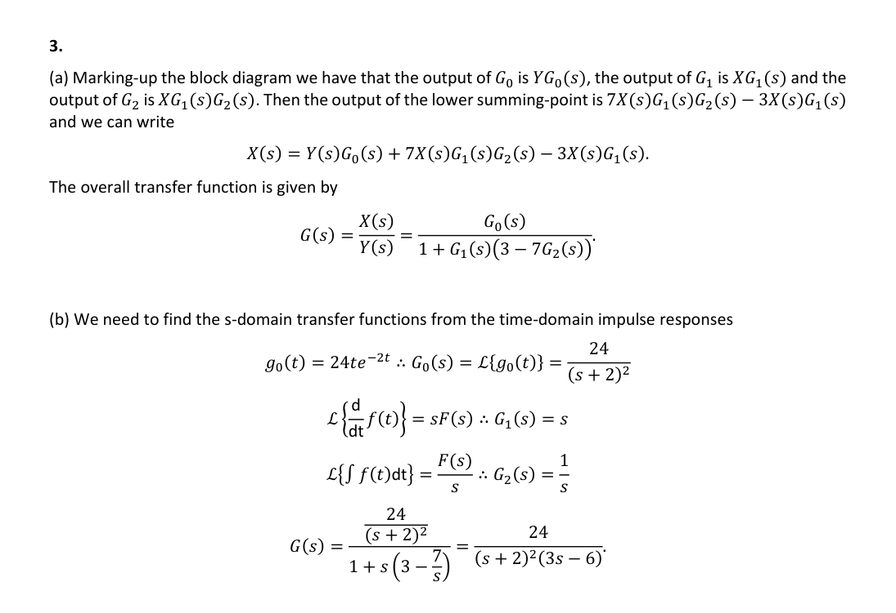

### 4.4 Part (c): stability and oscillation check

From
$$
G(s)=\frac{24}{(s+2)^2(3s-6)},
$$
poles are:
$$
s=-2 \text{ (double pole)},\qquad s=+2.
$$

Interpretation using Chapter 17:
- $s=+2$ is in right half-plane $\Rightarrow$ unstable.
- Poles are real, not complex-conjugate with nonzero imaginary part, so no sinusoidal oscillation mode.
- Therefore: **unstable, non-oscillatory growth component**.

### 4.5 Part (d): step response in time domain

For unit step input:
$$
y(t)=u(t)\Rightarrow Y(s)=\frac{1}{s}.
$$
Hence:
$$
X(s)=G(s)Y(s)=\frac{8}{s(s+2)^2(s-2)}.
$$
Using partial fractions:
$$
X(s)=\frac{A}{s}+\frac{B}{s+2}+\frac{C}{(s+2)^2}+\frac{D}{s-2},
$$
with constants from the provided solution:
$$
A=-1,\quad B=\frac{3}{4},\quad C=1,\quad D=\frac14.
$$
Inverse Laplace:
$$
x(t)=-1+\frac{1}{4}e^{2t}+\frac{3}{4}e^{-2t}+te^{-2t},\qquad t>0.
$$
The $e^{2t}$ term is the explicit instability signature.

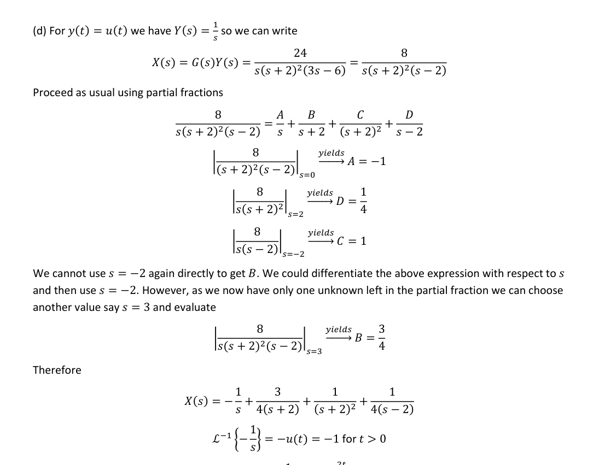

---

## 5. Exactly what to say in seminar (fast script)

1. Start with part (a): write node equation for $X(s)$ from the two summing points, then isolate $X/Y$.
2. Part (b): convert each block to $s$-domain ($24te^{-2t}$, differentiator, integrator), then substitute cleanly.
3. Part (c): read poles from denominator and apply Chapter 17 right-half-plane test.
4. Part (d): apply step input $Y=1/s$, do partial fractions, inverse transform.
5. Close by pointing out: instability is visible both in pole test ($s=+2$) and time response ($e^{2t}$ term).

---

## 6. Problem Sheet 8 quick rundown (for context)

- Q1: step decomposition, time shift, and geometric series in Laplace domain.
- Q2: switched RL with inductors, initial-condition handling, flux continuity across switching instant.
- **Q3 (your section): mixed-sign feedback block system, transfer function derivation, stability, and step response.**

If someone asks where Q3 theory comes from:
- Stability criterion and pole location: Chapter 17.
- Laplace/inverse Laplace and partial fractions workflow: Chapter 15-16 method applied again.

---

## 7. Pre-seminar Kahoot add-ons (higher-value set)

Use these before the seminar derivation questions.

Note on wording:
- "According to these notes" means: use the Chapter 17 convention in this course handout.
- In this convention, purely imaginary roots and the $s=0$ constant case are treated as stable (bounded), while any root with $\Re(s)>0$ is unstable.

### Q1 (multi-select): stable pole sets

Question:
- Which pole sets are stable according to Chapter 17 convention?

Options:
- A) $\{-1,-3\}$  **[Correct]**
- B) $\{+0.5,-2\}$
- C) $\{\pm j4\}$  **[Correct]**
- D) $\{0\}$  **[Correct]**
- E) $\{-0.2\pm j3\}$  **[Correct]**

### Q2: oscillation vs growth from pole type

Question:
- A response oscillates with increasing amplitude. Most likely pole type?

Options:
- A) $\sigma<0\pm j\omega$
- B) $\sigma>0\pm j\omega$  **[Correct]**
- C) single real $\sigma<0$
- D) single real $\sigma>0$

### Q3: initial-condition term in Laplace derivative

Question:
- If $f(0^+)=5$, what is $\mathcal{L}\{df/dt\}$?

Options:
- A) $sF(s)$
- B) $sF(s)-5$  **[Correct]**
- C) $\frac{F(s)}{s}$
- D) $s^2F(s)-5$

### Q4 (diagram): identify stable damped oscillation in Figure 17.1

Question:
- Which panel in Figure 17.1 represents stable damped oscillation?

Options:
- A) Panel 1 (real negative root, monotonic decay)
- B) Panel 2 (real positive root, monotonic growth)
- C) Panel 3 (complex-conjugate roots in left half-plane)  **[Correct]**
- D) Panel 5 (purely imaginary roots, sustained oscillation)

### Q5 (diagram/context): switched RLC long-time behavior

Question:
- In the switched series RLC example from Chapter 18 (constant DC source), what happens as $t\to\infty$?

Options:
- A) Current tends to a non-zero constant, capacitor charge tends to zero
- B) Current tends to zero, capacitor charge tends to a constant  **[Correct]**
- C) Current oscillates forever with constant amplitude
- D) Current and charge both grow without bound

Context:
- This corresponds to the worked example with $V=300\,$V, $L=2\,$H, $C=0.02\,$F, $R=16\,\Omega$.
- In the solution, $i(t)$ decays to zero while $q(t)$ settles to a finite constant.
