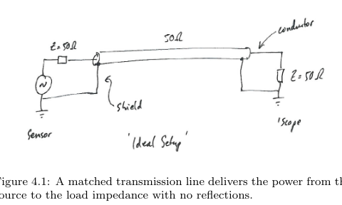
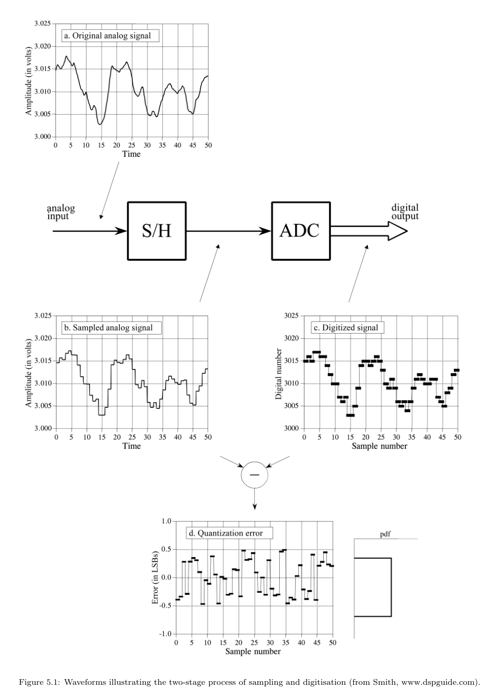
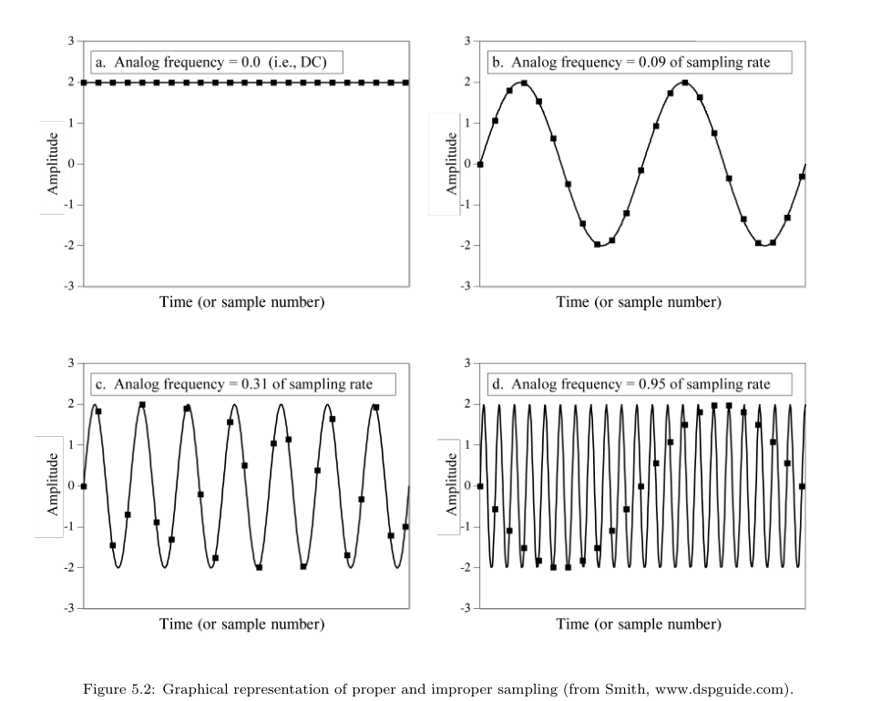
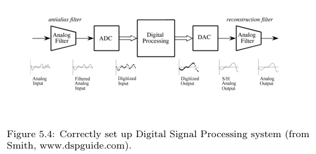
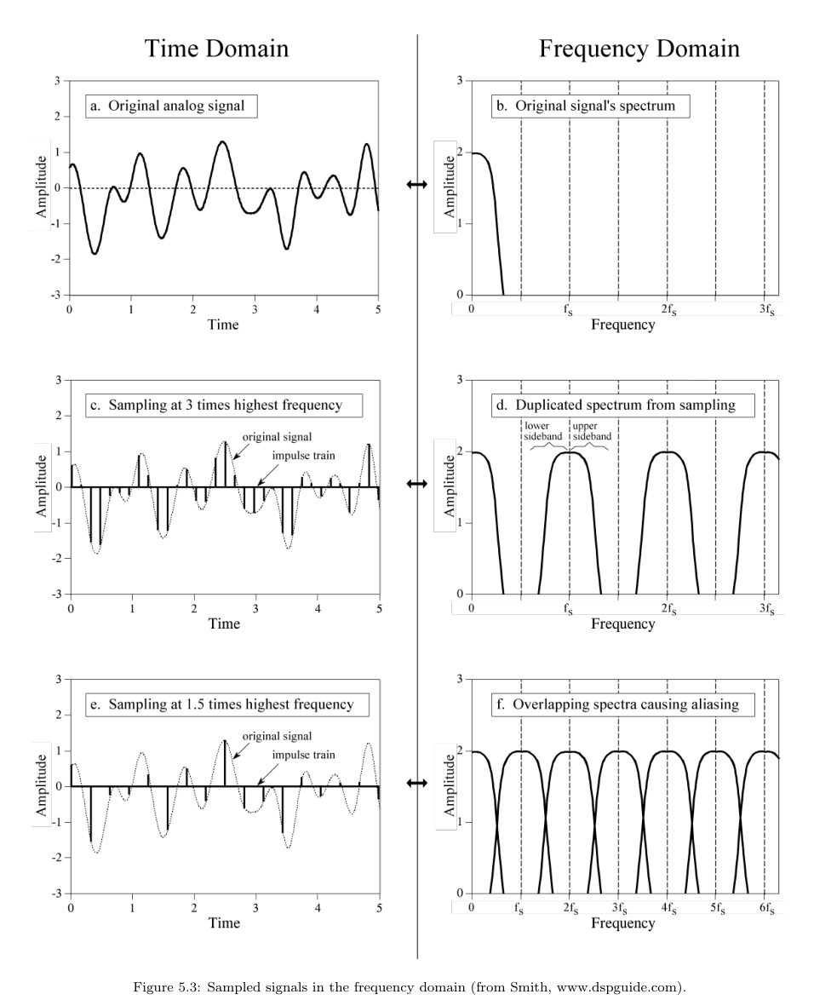
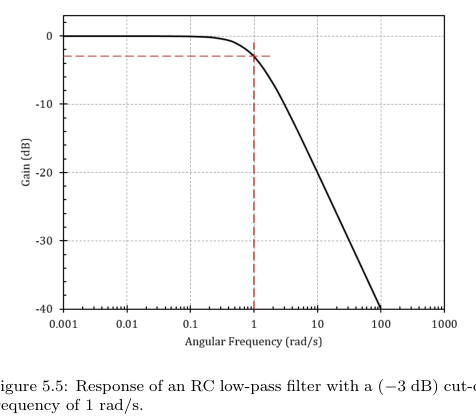

# 
    Chapters 4-5 Exam Notes: Transmission Lines and Digital Signals

Sources:

- `Instrumentation/Course notes/chp4-5.pdf`
- `Instrumentation/Course notes/Problem sheets + solutions/Problem Sheet 2.pdf`
- `Instrumentation/Course notes/Problem sheets + solutions/Problem Sheet 3.pdf`

Purpose: compact notes for transmission-line, impedance matching, sampling, digitisation, and aliasing questions.

## Useful Figures From The PDF

## 1. When Wires Become Transmission Lines

Normal circuit theory assumes voltage and current changes appear instantly everywhere in a wire. This is only a good approximation when the wire is short compared with the signal wavelength.

Rule of thumb:

$L \gtrsim \frac{\lambda}{10}$

Terms:

- $L$: physical cable/wire length, in metres.
- $\lambda$: wavelength of the signal in the cable, in metres.
- $v$: propagation speed of the signal in the cable, in m/s.
- $f$: signal frequency, in Hz.
- $\lambda=\frac{v}{f}$.

Plain words:

- A signal does not teleport along a cable. It travels at a finite speed, usually a fraction of the speed of light.
- If the cable is a significant fraction of a wavelength, different parts of the cable are at different phases of the wave.
- At that point, the cable must be treated as a transmission line rather than just a simple wire.

Why this matters:

- Long/high-frequency cables can reflect signals.
- Reflections distort pulses and waveforms.
- Mismatched cables can also radiate or pick up electromagnetic interference.

## 2. Coaxial Cable Parameters

A coaxial cable is described by distributed inductance and capacitance.

Terms:

- $L'$: inductance per unit length, in H/m.
- $C'$: capacitance per unit length, in F/m.
- $Z_0$: characteristic impedance of the cable, in ohms.
- $v$: signal propagation speed, in m/s.
- $r$: radius of the central conductor.
- $R$: inner radius of the outer conductor/shield.
- $\epsilon_r$: relative permittivity of the dielectric between conductors.
- $\mu_r$: relative permeability of the dielectric, usually about 1 for non-magnetic materials.

Geometry formulas from the handout:

$C'=\frac{2\pi\epsilon_0\epsilon_r}{\ln(R/r)}$

$L'=\frac{\mu_0\mu_r\ln(R/r)}{2\pi}$

Use these only if the question gives cable geometry. Most problem-sheet and past-paper questions give $L'$ and $C'$ directly.

Characteristic impedance:

$Z_0 = \sqrt{\frac{L'}{C'}}$

Propagation speed:

$v = \frac{1}{\sqrt{L'C'}}$

Cable delay:

$t_{delay}=\frac{L}{v}$

Plain words:

- $Z_0$ is the impedance a travelling signal "sees" as it moves down a very long or properly terminated cable.
- $Z_0$ is a property of the cable geometry/materials, not the cable length.
- Therefore a 10 m, 20 m, and 30 m length of the same ideal cable all have the same $Z_0$.
- A correctly terminated cable behaves as if it is infinitely long: signal enters and does not reflect back.
- In ideal coax, the only effect of the cable is delay; real cables also have attenuation and dispersion.

Matched line:

- A cable with load $Z_L=Z_0$ is matched.
- Matched means no reflected signal returns from the load.
- From the source end, a matched finite cable looks like a resistor of value $Z_0$.

Exam trap:

- Do not multiply $Z_0$ by cable length.
- Use cable length for delay, not characteristic impedance.

## 3. Reflection and Transmission

When a travelling signal reaches a change in impedance, part can be transmitted and part can be reflected.

Load reflection coefficient:

$\Gamma = \frac{Z_L-Z_0}{Z_L+Z_0}$

Terms:

- $\Gamma$: voltage reflection coefficient.
- $Z_L$: load impedance at the end of the cable, in ohms.
- $Z_0$: characteristic impedance of the cable, in ohms.

Interpretation:

- $\Gamma=0$: matched load, no reflected voltage wave.
- $\Gamma>0$: reflected voltage has same sign as incident wave.
- $\Gamma<0$: reflected voltage is inverted.
- $\Gamma=1$: open circuit reflection.
- $\Gamma=-1$: short circuit reflection.

Voltage transmission coefficient:

$T = 1+\Gamma = \frac{2Z_L}{Z_L+Z_0}$

Boundary-condition idea:

- Voltage must be continuous at the junction.
- Current must be conserved at the junction.
- These constraints force a reflected wave whenever the load impedance does not match the line.

Plain words:

- Matching the load to the cable makes the cable look endless to the travelling signal.
- If the signal sees a sudden impedance change, it partly bounces back.

Pulse reflection method:

1. Identify incident voltage amplitude $V_i$.
2. Calculate $\Gamma$ at the boundary.
3. Reflected voltage amplitude is $V_r=\Gamma V_i$.
4. If $\Gamma<0$, reflected pulse is inverted.
5. If $\Gamma>0$, reflected pulse is not inverted.

For a short circuit:

- $Z_L=0$.
- $\Gamma=-1$.
- Reflected voltage has same magnitude but opposite sign.

For an open circuit:

- $Z_L\to\infty$.
- $\Gamma=+1$.
- Reflected voltage has same magnitude and same sign.

## 4. Impedance Matching vs Bridging

These two ideas solve different problems.

Impedance matching:

- Goal: maximum power transfer or no transmission-line reflections.
- Condition for simple resistive source/load: $R_L=R_s$.
- Condition for cable termination: $Z_L=Z_0$.
- Common in RF, coaxial cables, antennas, and high-speed pulses.

Impedance bridging:

- Goal: measure a voltage without disturbing it.
- Condition: $R_{in} \gg R_s$.
- Common in voltmeters, oscilloscopes, and sensor readout.

Maximum power transfer:

- $R_s$: source resistance.
- $R_L$: load resistance.
- Load power is maximized when $R_L=R_s$.

Why:

- If $R_L$ is too small, current is high but load voltage is small.
- If $R_L$ is too large, voltage is high but current is tiny.
- Maximum power occurs at the balance point, $R_L=R_s$.

Efficiency:

$\eta = \frac{R_L}{R_L+R_s}$

At $R_L=R_s$:

- $\eta=\frac{1}{2}$.
- Half the power is lost in the source resistance.

Transformer matching:

For an ideal transformer:

$R_{seen}=\left(\frac{n_1}{n_2}\right)^2R_L$

To match a source resistance $R_s$:

$\frac{n_1}{n_2}=\sqrt{\frac{R_s}{R_L}}$

Terms:

- $n_1$: number of turns on primary winding.
- $n_2$: number of turns on secondary winding.
- $R_{seen}$: effective load resistance seen by the source.

Transmission-line impedance transformation:

Sometimes we want to connect impedance $Z_1$ to impedance $Z_2$ using a short intermediate section.

Intermediate impedance for reduced reflection:

$Z_{mid}=\sqrt{Z_1Z_2}$

Quarter-wave transformer:

- If the intermediate section has length $\lambda/4$, reflections can cancel by interference.
- This works well at one chosen frequency.
- Same idea appears in optics as anti-reflection coatings.

Quarter-wave length:

$l=\frac{\lambda}{4}=\frac{v}{4f}$

Terms:

- $l$: physical length of matching section.
- $f$: frequency to match.
- $v$: wave speed in that section.

Parallel transmission lines:

- Two identical transmission lines connected in parallel behave like impedances in parallel.
- Two $50\,\Omega$ lines in parallel give $25\,\Omega$.
- Reason: for the same voltage wave, the current splits into two lines, so total current doubles and effective $Z=V/I$ halves.

Attenuation in dB:

If cable loss is given as $a\,dB/m$ over length $L$:

$A_{dB}=aL$

Voltage amplitude ratio:

$\frac{V_{out}}{V_{in}}=10^{-A_{dB}/20}$

Power ratio:

$\frac{P_{out}}{P_{in}}=10^{-A_{dB}/10}$

Why 20 for voltage:

- dB uses $10\log_{10}$ for power.
- Power is proportional to voltage amplitude squared, so voltage ratios use $20\log_{10}$.

## 5. Digital Sampling

Sampling means measuring a continuous-time signal at discrete time intervals.

Terms:

- $f_s$: sampling frequency, in samples per second or Hz.
- $T_s$: sampling period, in seconds.
- $T_s=\frac{1}{f_s}$.
- $f_N$: Nyquist frequency.

Nyquist frequency:

$f_N=\frac{f_s}{2}$

Sampling theorem:

$f_s > 2f_{max}$

Terms:

- $f_{max}$: highest frequency component in the analogue signal.

Plain words:

- To reconstruct a signal, you need at least two samples per cycle of the highest frequency present.
- If high-frequency content enters the ADC above Nyquist, it disguises itself as a lower frequency.
- Sampling quantises time: you only keep values at sample instants.
- Digitisation quantises amplitude: each sampled value is rounded to a digital level.

Useful distinction:

- Sampling error/aliasing is about time/frequency.
- Digitisation error/quantisation is about amplitude/resolution.

Aliasing:

- Aliasing is false low-frequency content caused by undersampling.
- Once aliasing has happened, the original frequency information is lost.
- This is why anti-alias filtering must happen before digitisation.

Common alias calculation:

Choose an integer $k$ so that the result lies between $0$ and $\frac{f_s}{2}$:

$f_{alias}=|f-kf_s|$

Example logic:

- If $f_s=1\,MHz$, then $f_N=500\,kHz$.
- A $502\,kHz$ signal is just above Nyquist, so it aliases to about $498\,kHz$.
- A $1.6\,MHz$ signal aliases by comparing it with nearby multiples of $1\,MHz$.

Anti-alias filter:

- A low-pass filter before the ADC.
- Removes frequency components above Nyquist.
- It protects the digitised data from false frequencies.
- It must be analogue, because aliasing happens during sampling.
- Once aliasing is in the digitised data, software cannot know which frequency was original.

Sampled spectra:

Key idea:

- Sampling copies the spectrum at multiples of the sampling frequency $f_s$.
- Proper sampling keeps these copied spectra separated.
- Improper sampling makes copied spectra overlap; that overlap is aliasing.

Anti-alias filter response:

Practical compromise:

- A real low-pass filter does not cut off infinitely sharply.
- Set the useful signal bandwidth comfortably below Nyquist.
- Leave transition-band space for the filter to roll off before $f_N$.

## 6. Digitisation and ADC Resolution

An ADC converts an analogue voltage into a digital number.

Terms:

- ADC: analogue-to-digital converter.
- $N$: number of bits.
- $2^N$: number of digital levels.
- $V_{range}$: full input voltage range represented by the ADC.
- $\Delta$: quantisation step size, also called one LSB.
- LSB: least significant bit; the smallest digital step.

Step size:

$\Delta = \frac{V_{range}}{2^N}$

Maximum quantisation error:

$\pm \frac{\Delta}{2}$

RMS quantisation noise:

$\frac{\Delta}{\sqrt{12}}$

Dynamic range estimate:

$DR \approx 20\log_{10}(2^N)$

Shortcut:

- Each bit gives about $6\,dB$.
- A 12-bit ADC gives about $72\,dB$ dynamic range.

Plain words:

- More bits means smaller voltage steps.
- Smaller steps mean better resolution and lower quantisation noise.
- But no ADC can represent arbitrary analogue voltage exactly; it rounds to the nearest level.

Digital number to voltage:

For a unipolar ADC from $0$ to $V_{max}$:

$V(n)\approx n\Delta$

where $n$ is the digital code. Depending on convention, full scale may be treated as $2^N\Delta$ or $(2^N-1)\Delta$; in this course's problem sheets, use the convention implied by the given resolution.

Noise combination:

If independent RMS noise sources are present, combine in quadrature:

$v_{total}=\sqrt{v_1^2+v_2^2+\cdots}$

This appears when combining analogue random noise with quantisation noise.

## Problem Sheet Focus

PS2 high-yield methods:

- Maximum power transfer: show $R_L=R_s$.
- Efficiency: use $\eta=\frac{R_L}{R_L+R_s}$.
- Transformer matching: use $R_{seen}=\left(\frac{n_1}{n_2}\right)^2R_L$.
- Cable properties: use $Z_0=\sqrt{\frac{L'}{C'}}$ and $v=\frac{1}{\sqrt{L'C'}}$.
- Reflections: use $\Gamma=\frac{Z_L-Z_0}{Z_L+Z_0}$.

PS3 high-yield methods:

- Nyquist frequency: $f_N=\frac{f_s}{2}$.
- Aliasing: fold frequencies into $0$ to $f_N$.
- ADC resolution: $\Delta=\frac{V_{range}}{2^N}$.
- Quantisation error: $\pm\frac{\Delta}{2}$.
- RMS quantisation noise: $\frac{\Delta}{\sqrt{12}}$.

Seminar-style cable method:

1. Identify $L'$ and $C'$.
2. Compute $Z_0=\sqrt{\frac{L'}{C'}}$.
3. Compute $v=\frac{1}{\sqrt{L'C'}}$.
4. Compute travel time $t=\frac{L}{v}$.
5. Use source/load terminations to discuss reflections.
