# Chapter 9-12 Notes (Screenshot + Simple Explanations + Problem Sheet Focus)

Sources:

- `chp9-12.pdf`
- `Problem sheet 4.pdf`
- `Problem Sheet 5.pdf`

How this file is structured:

- Screenshot from the handout (text paragraph or figure).
- Short simplified explanation in plain words.
- Explicit note on where it helps in Problem Sheet 4.

## Core Definitions (quick reference)

| Symbol / term | Meaning |
|---|---|
| $V_+$ | Voltage at the non-inverting input pin, labelled $+$. |
| $V_-$ | Voltage at the inverting input pin, labelled $-$. |
| $V_{out}$ | Output voltage of the op-amp. |
| $A$ | Open-loop gain: the raw internal gain of the op-amp without feedback. It is very large but finite in real devices. |
| $G$ | Closed-loop gain: the actual circuit gain after feedback is applied. |
| $\beta$ | Feedback fraction: the fraction of $V_{out}$ fed back to the input. |
| $V_D$ | Differential signal: $V_D=V_+-V_-$. This is the useful difference signal. |
| $V_{CM}$ | Common-mode signal: $V_{CM}=\dfrac{V_++V_-}{2}$. This is the shared/background voltage. |
| $A_D$ | Differential gain: gain applied to the wanted differential signal. |
| $A_{CM}$ | Common-mode gain: gain accidentally applied to the shared/common signal. Ideally tiny. |

Basic op-amp relation:

$$
V_{out}=A(V_+-V_-)
$$

Plain words:

- The op-amp amplifies the difference between its two input pins.
- If $V_+>V_-$, the output tries to move positive.
- If $V_+<V_-$, the output tries to move negative.
- Because $A$ is huge, a tiny input difference can cause a large output swing.
- In real op-amps, $V_{out}$ cannot exceed the supply rails, so it can saturate or clip.

Closed-loop feedback gain:

$$
G=\frac{A}{1+\beta A}
$$

If $A$ is very large:

$$
G\approx\frac{1}{\beta}
$$

CMRR:

$$
\mathrm{CMRR}=20\log_{10}\left(\frac{A_D}{A_{CM}}\right)
$$

Plain words:

- Differential signal is what you want.
- Common-mode signal is shared background you usually want to reject.
- Large CMRR means the amplifier responds strongly to the difference but barely responds to shared voltage.

## Chapter 9: Negative Feedback and Standard Op-Amp Circuits

### Key handout text: feedback gain equation

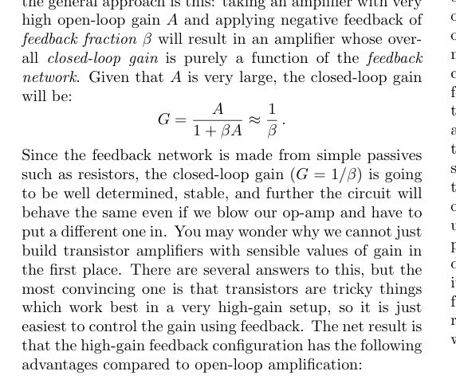

Plain words:

- High open-loop gain plus negative feedback gives stable, predictable gain.
- When `A` is huge, `G = A/(1+beta*A)` behaves like `1/beta`.
- This is why resistor ratios set gain in practical op-amp circuits.

Problem-sheet relevance:

- Directly needed for Q3 (Seminar I), especially parts (a)-(e).

### Key handout text: golden rules

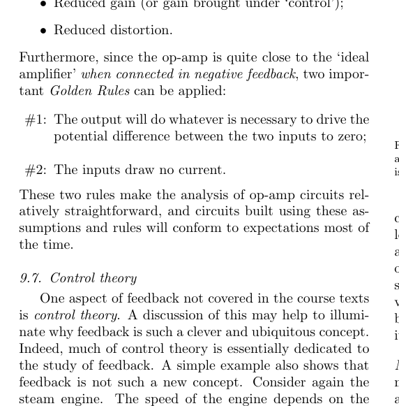

Plain words:

- Rule 1: with negative feedback, the output moves until the input voltages are almost equal:

$$
V_+\approx V_-
$$

- Rule 2: ideal op-amp inputs draw almost no current:

$$
i_+\approx 0,\qquad i_-\approx 0
$$

- These are approximations, but they are the main exam tools for ideal op-amp circuits.

How to use KCL in op-amp questions:

1. Find the important node, usually the inverting input node where resistors meet.
2. Use Rule 1 to set its voltage. If $V_+$ is grounded, then $V_-\approx 0\,\mathrm{V}$. This is called a virtual ground.
3. Use Rule 2: no current enters the op-amp input, so resistor currents must balance each other.
4. Write each resistor current using Ohm's law:

$$
I=\frac{V_{from}-V_{to}}{R}
$$

5. Apply KCL: currents into the node equal currents out of the node.
6. Solve for $V_{out}/V_{in}$.

Mini-example: inverting amplifier.

If $V_+=0$, then $V_-\approx 0$. Current through the input resistor is:

$$
I_{in}=\frac{V_{in}}{R_{in}}
$$

Current through the feedback resistor is:

$$
I_f=\frac{0-V_{out}}{R_f}
$$

No current enters the op-amp, so $I_{in}=I_f$:

$$
\frac{V_{in}}{R_{in}}=\frac{-V_{out}}{R_f}
$$

Therefore:

$$
\frac{V_{out}}{V_{in}}=-\frac{R_f}{R_{in}}
$$

Problem-sheet relevance:

- Q1 derivation.
- Q2 gain analysis.
- Q3 ideal amplifier steps.
- Q5 summing amplifier design.

### Diagram set: Chapter 9 circuits

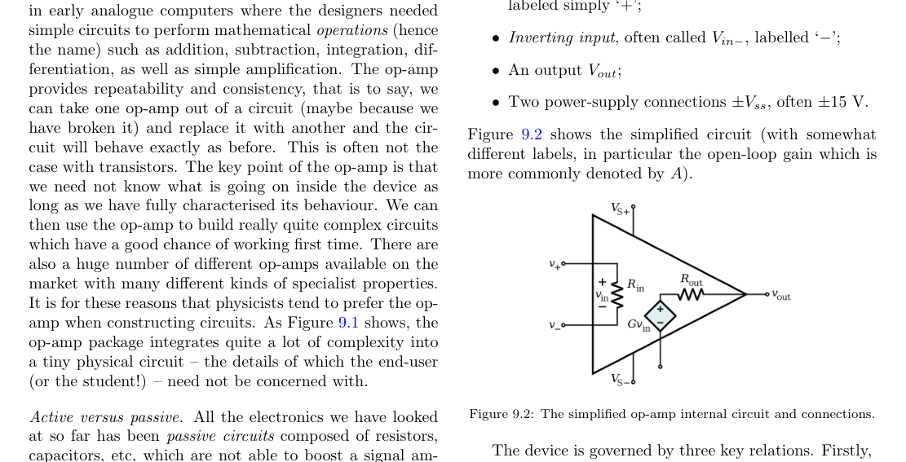

Simplified point:

- Think of op-amp as: huge gain block + input/output impedances + rail limits.

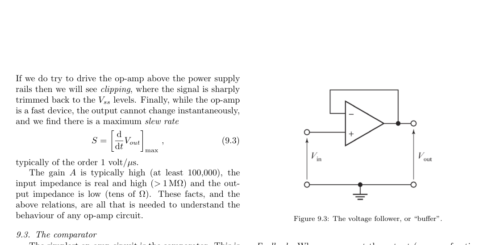

Simplified point:

- Buffer has gain 1 but solves loading problems (high input Z, low output Z).

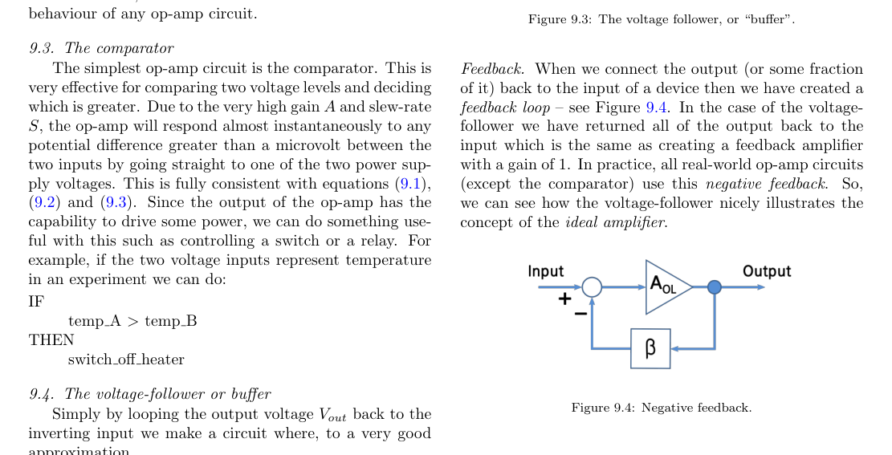

Simplified point:

- This block diagram is the universal idea behind closed-loop control.

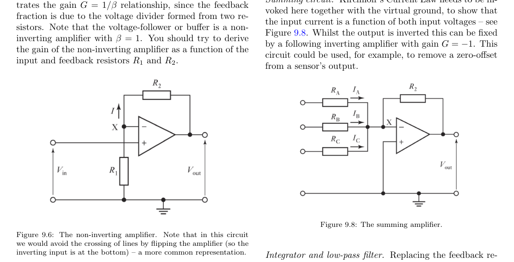

Simplified point:

- Non-inverting gain is `1 + Rf/R0`.
- Feedback fraction is `beta = R0/(R0+Rf)`.

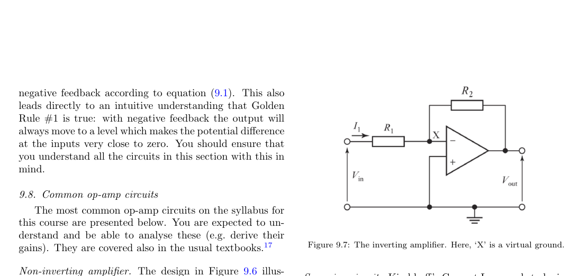

Simplified point:

- Inverting node is virtual ground.
- `Gain = -Rf/Rin`.

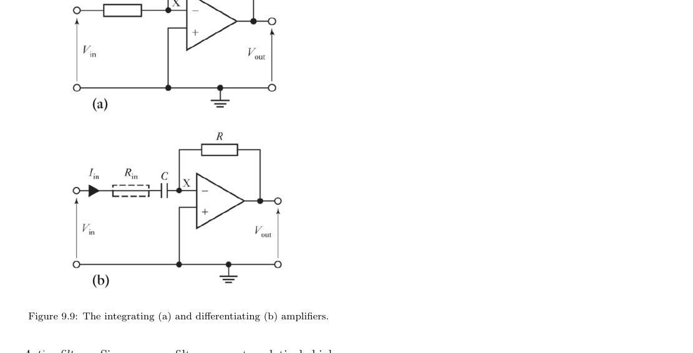

Simplified point:

- Capacitor location decides integrator vs differentiator behavior.

## Chapter 10: Differential Signals and Instrumentation Amplifier

### Key handout text: differential definition context

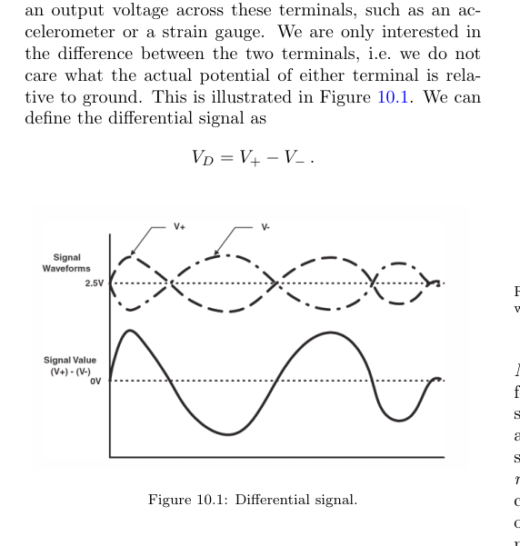

Plain words:

- Useful signal is often the voltage difference between two nodes.
- Absolute voltage of either node to ground may be irrelevant.
- This is common in bridge sensors.

Problem-sheet relevance:

- Conceptual background for Q4.

### Key handout text: CMRR definition

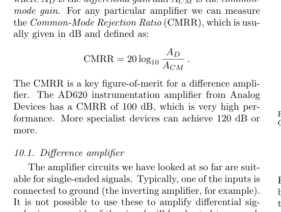

Plain words:

- `AD` should be large, `ACM` should be tiny.
- CMRR tells how strongly common-mode is rejected.
- `120 dB` means `AD/ACM = 10^6`.

Problem-sheet relevance:

- Exactly needed in Q4(b).

### Diagram set: Chapter 10

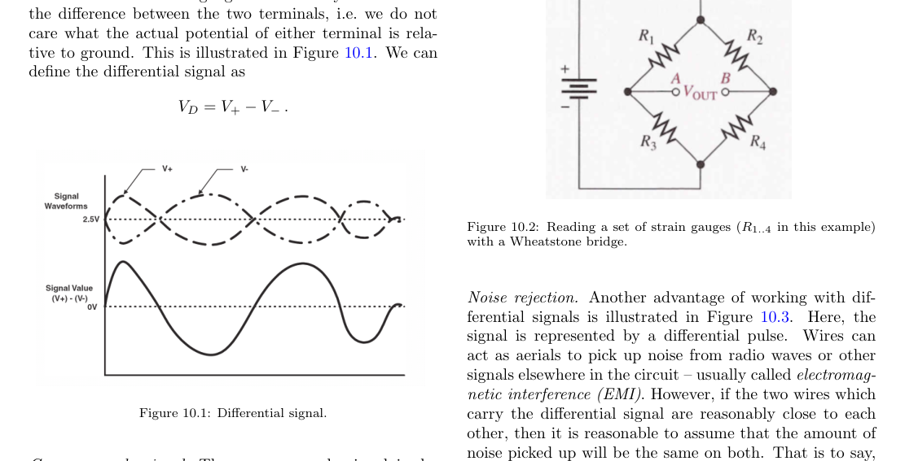

Simplified point:

- Differential waveform can be small even when each individual line is large.

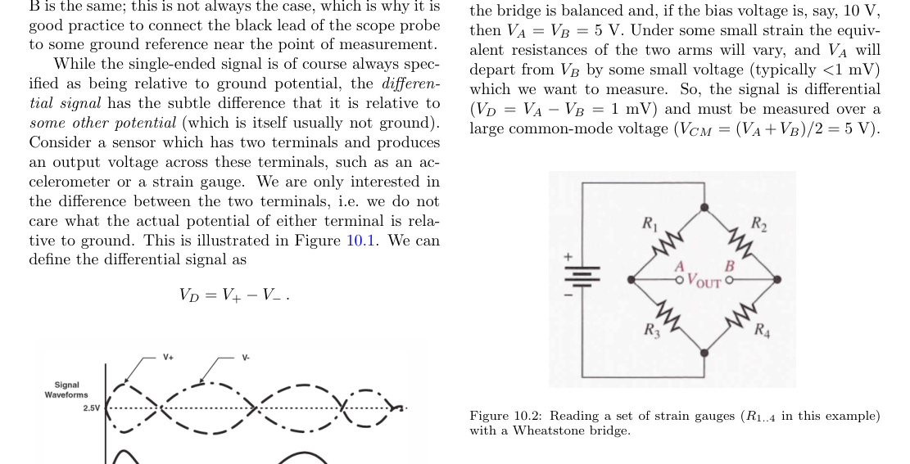

Simplified point:

- Wheatstone bridge: tiny mismatch becomes measurable differential output.
- Treat it as two voltage dividers side by side.
- If the left midpoint is $V_A$ and the right midpoint is $V_B$, then the bridge output is:

$$
V_{out}=V_A-V_B
$$

where:

$$
V_A=V_s\frac{R_2}{R_1+R_2}
$$

and:

$$
V_B=V_s\frac{R_4}{R_3+R_4}
$$

- If all four bridge arms are active sensors and two resistances increase by $\Delta R$ while two decrease by $\Delta R$, the small-signal bridge output is approximately:

$$
V_{out}\approx V_s\frac{\Delta R}{R}
$$

- This is useful for strain gauges, magnetoresistors, thermistors, and other sensors where a tiny resistance change needs to become a voltage.
- Bridge questions usually reduce to: find the two midpoint voltages with voltage dividers, then subtract them.

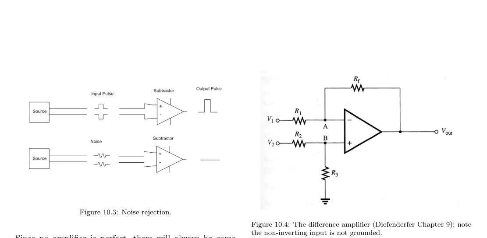

Simplified point:

- Noise picked up equally on both lines tends to cancel in differential measurement.

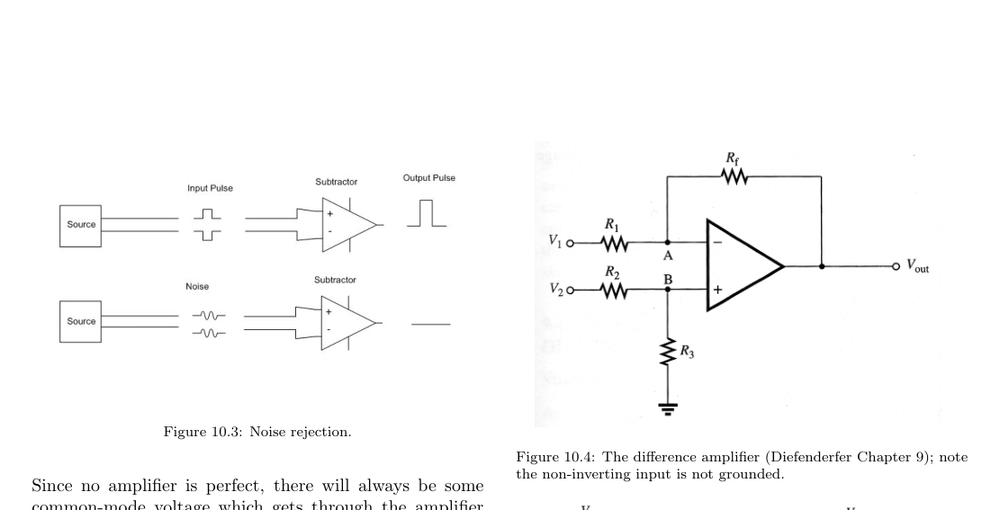

Simplified point:

- Difference amplifier works but resistor matching and input loading are limitations.

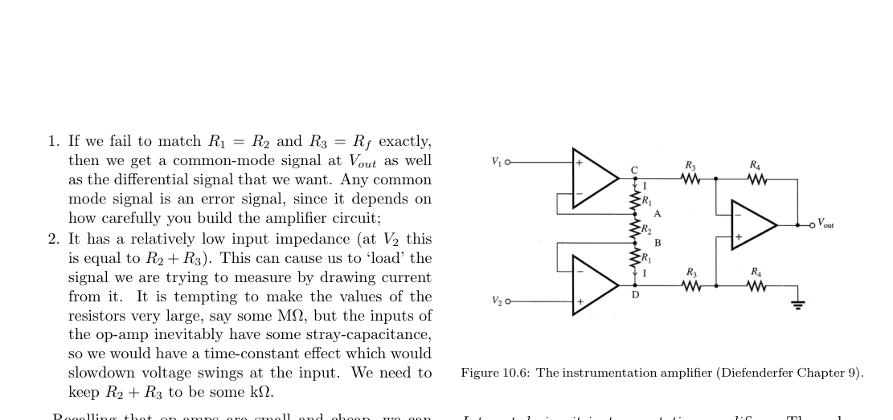

Simplified point:

- Instrumentation amplifier fixes input impedance and common-mode rejection issues.

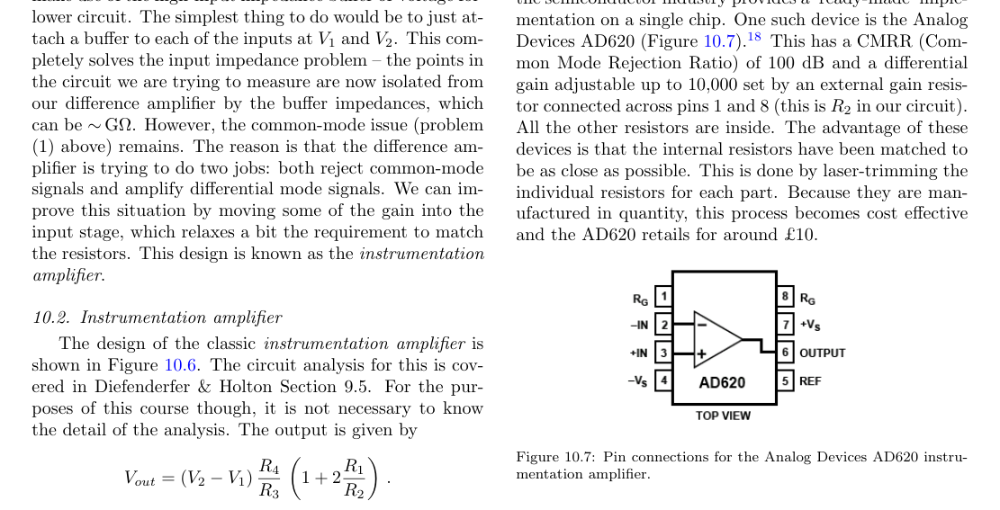

Simplified point:

- Real parts like AD620 package this architecture in one chip.

## Chapter 11: Real-World Op-Amp Limits and Stability

### Key handout text: gain-bandwidth product

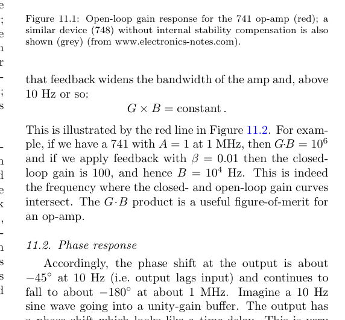

Plain words:

- Gain and bandwidth trade against each other.
- If you design for larger closed-loop gain, usable frequency range shrinks.

Problem-sheet relevance:

- Helps for Q2(c) Bode sketch reasoning.

### Key handout text: stability criterion

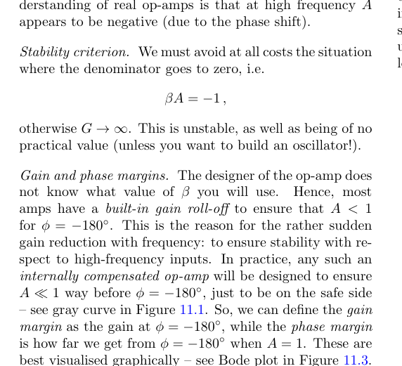

Plain words:

- At high frequency, phase lag can make feedback effectively positive.
- If denominator of closed-loop formula approaches zero, circuit can oscillate.

Problem-sheet relevance:

- Useful context for Q3(e): why finite open-loop behavior matters.

### Diagram set: Chapter 11

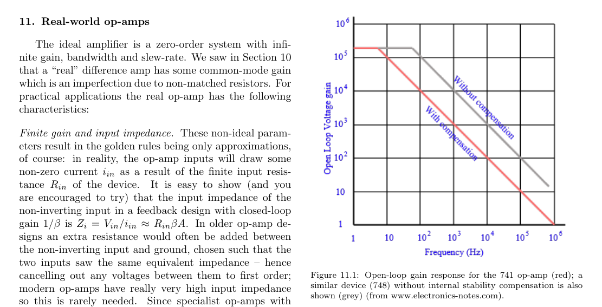

Simplified point:

- Open-loop gain is not flat forever; it rolls off strongly with frequency.

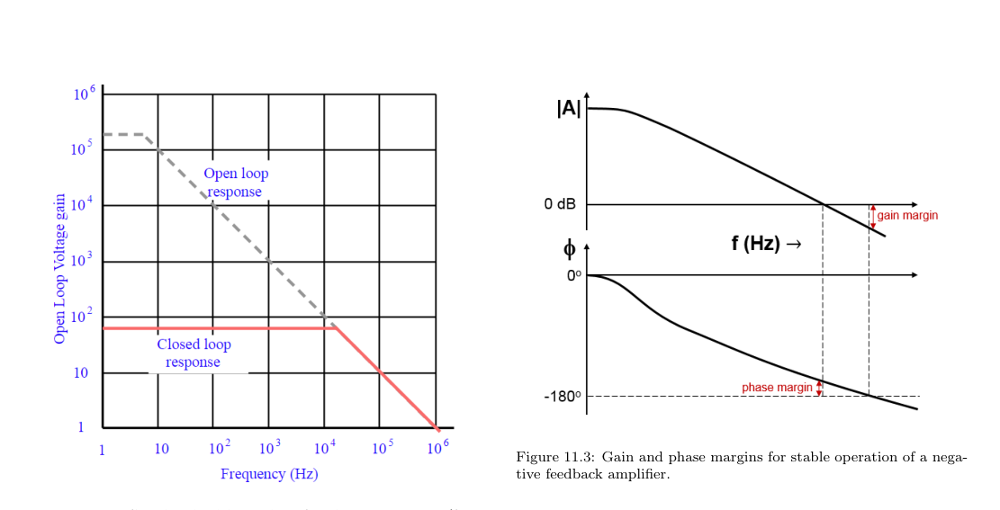

Simplified point:

- Positive gain and phase margins are what keep feedback stable.

## Chapter 12: ADC and DAC Concepts

### Key handout text: sample-and-hold motivation

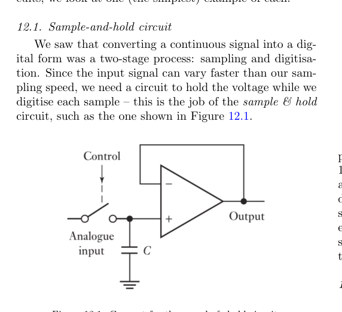

Plain words:

- ADC needs a stable input during conversion.
- Sample-and-hold freezes the signal briefly so conversion is accurate.

### Diagram set: Chapter 12

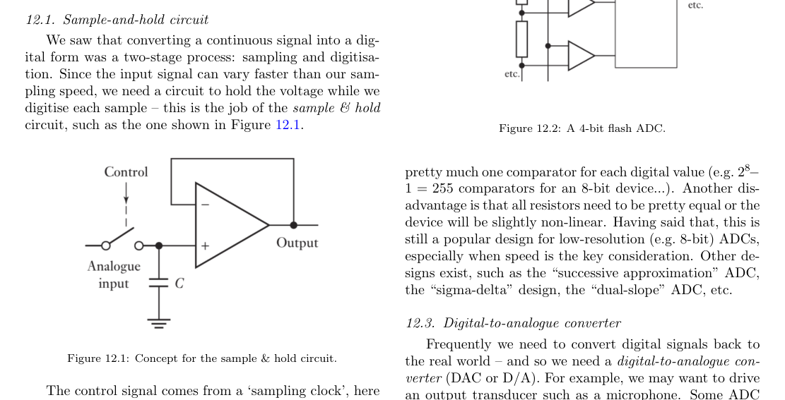

Simplified point:

- Switch + capacitor + buffer is the core sample-and-hold idea.

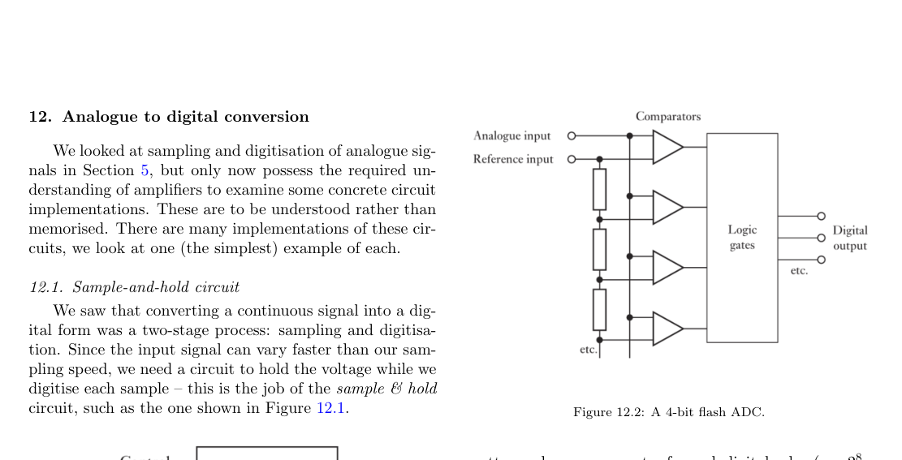

Simplified point:

- Flash ADC is very fast but needs many comparators.

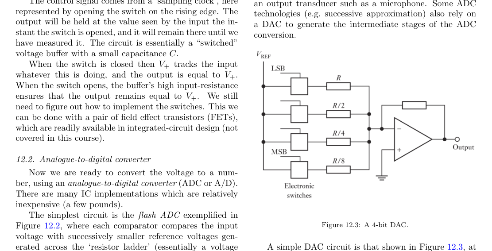

Simplified point:

- DAC can be built as weighted summing of digital bits.

## Problem Sheet 4: Targeted Working Notes

For the current revision plan, prioritise:

- Q1: inverting amplifier derivation.
- Q3: negative feedback, feedback fraction, finite open-loop gain.
- Q4: instrumentation amplifier and CMRR.

Q2 and Q5 are still useful, but they are lower priority for now.

## Q1 Inverting Amplifier Derivation

Goal:

$$
\frac{V_{out}}{V_{in}}=-\frac{R_f}{R_{in}}
$$

Circuit idea:

- $R_{in}$ connects $V_{in}$ to the inverting input node.
- $R_f$ connects $V_{out}$ back to the same node.
- $V_+$ is grounded, so $V_+ = 0$.
- Negative feedback makes $V_-\approx V_+=0$.
- The inverting input node is therefore a virtual ground.

Important wording:

- Virtual ground means the node is at approximately $0\,\mathrm{V}$.
- It does **not** mean it is physically connected to ground.
- Since op-amp input current is zero, current cannot disappear into the op-amp.

Currents:

$$
I_1=\frac{V_{in}-0}{R_{in}}=\frac{V_{in}}{R_{in}}
$$

$$
I_2=\frac{0-V_{out}}{R_f}=\frac{-V_{out}}{R_f}
$$

KCL at the virtual ground node:

$$
I_1=I_2
$$

So:

$$
\frac{V_{in}}{R_{in}}=\frac{-V_{out}}{R_f}
$$

Rearrange:

$$
\frac{V_{out}}{V_{in}}=-\frac{R_f}{R_{in}}
$$

Why the sign is negative:

- A positive input current through $R_{in}$ must be balanced by current through $R_f$.
- That requires $V_{out}$ to move negative.
- Therefore the output is inverted.

## Q2 AC Non-Inverting Amplifier With Input High-Pass (Lower Priority)

This is mainly Chapter 7-8 plus non-inverting op-amp gain.

Treat as a cascade because the op-amp input impedance is high and does not load the filter:

$$
|G_{total}|=|G_{HP}|G_{amp}
$$

High-pass magnitude:

$$
|G_{HP}|=\frac{\omega R_{in}C_{in}}{\sqrt{1+(\omega R_{in}C_{in})^2}}
$$

Non-inverting amplifier gain:

$$
G_{amp}=1+\frac{R_f}{R_0}
$$

Given values:

$$
R_{in}=100\,\mathrm{k\Omega},\qquad C_{in}=0.1\,\mu\mathrm{F}
$$

$$
R_{in}C_{in}=0.01\,\mathrm{s}
$$

$$
f_c=\frac{1}{2\pi R_{in}C_{in}}\approx 15.9\,\mathrm{Hz}
$$

Amplifier gain:

$$
G_{amp}=1+\frac{1\,\mathrm{M\Omega}}{20\,\mathrm{k\Omega}}=51
$$

At $10\,\mathrm{kHz}$, the high-pass filter is far above cutoff, so $|G_{HP}|\approx 1$ and total gain is about $51$.

At $10\,\mathrm{Hz}$, $\omega R_{in}C_{in}\approx 0.628$, so $|G_{HP}|\approx 0.532$ and total gain is about $27$.

## Q3 Seminar I: Negative Feedback Gain

This is a high-priority PS4 question.

Given a non-inverting amplifier with $R_0$ to ground and $R_f$ to output.

### Q3(a): Derive $\beta$

The inverting input sits at the middle of a potential divider from $V_{out}$ to ground:

$$
V_-=V_{out}\frac{R_0}{R_0+R_f}
$$

The feedback fraction is:

$$
\beta=\frac{V_-}{V_{out}}
$$

Therefore:

$$
\beta=\frac{R_0}{R_0+R_f}
$$

### Q3(b): Ideal Gain

For ideal negative feedback:

$$
V_+\approx V_-
$$

Since $V_+=V_{in}$:

$$
V_{in}=\beta V_{out}
$$

Therefore:

$$
\frac{V_{out}}{V_{in}}=\frac{1}{\beta}
$$

Substitute $\beta$:

$$
G_{ideal}=\frac{1}{\beta}=1+\frac{R_f}{R_0}
$$

### Q3(c): Finite Open-Loop Gain

For a real op-amp:

$$
V_{out}=A(V_+-V_-)
$$

Here:

$$
V_+=V_{in},\qquad V_- = \beta V_{out}
$$

So:

$$
V_{out}=A(V_{in}-\beta V_{out})
$$

Expand:

$$
V_{out}=AV_{in}-A\beta V_{out}
$$

Collect $V_{out}$ terms:

$$
V_{out}(1+\beta A)=AV_{in}
$$

Therefore:

$$
G_{real}=\frac{V_{out}}{V_{in}}=\frac{A}{1+\beta A}
$$

Why the ideal approximation works:

If $A$ is huge, then $1+\beta A\approx \beta A$, so:

$$
G_{real}\approx \frac{A}{\beta A}=\frac{1}{\beta}
$$

### Q3(d): Numeric Ideal Gain

Given:

$$
R_0=10\,\mathrm{k\Omega},\qquad R_f=990\,\mathrm{k\Omega}
$$

$$
G_{ideal}=1+\frac{990}{10}=100
$$

Also:

$$
\beta=\frac{1}{100}=0.01
$$

### Q3(e): Error From Finite $A$

Use:

$$
G_{real}=\frac{A}{1+0.01A}
$$

Percentage error compared with ideal gain:

$$
\mathrm{error}\%=\frac{|G_{ideal}-G_{real}|}{G_{ideal}}\times 100
$$

Results:

| Open-loop gain $A$ | Real gain $G_{real}$ | Error |
|---:|---:|---:|
| $10^9$ | $99.99999$ | about $10^{-5}\%$ |
| $10^6$ | $99.99$ | about $10^{-2}\%$ |
| $10^3$ | $90.9$ | about $10\%$ |

Exam point:

- The ideal formula is excellent when $A\beta\gg 1$.
- It becomes poor when the desired closed-loop gain is too large compared with available open-loop gain.

## Q4 Instrumentation Amplifier and CMRR

This is a high-priority PS4 question.

### Q4(a): Differential Gain

Formula from the handout for this instrumentation amplifier:

$$
V_{out}=(V_2-V_1)\left(\frac{R_4}{R_3}\right)\left(1+2\frac{R_1}{R_2}\right)
$$

So the differential gain is:

$$
A_D=\left(\frac{R_4}{R_3}\right)\left(1+2\frac{R_1}{R_2}\right)
$$

Given:

$$
R_1=R_3=R_4=25\,\mathrm{k\Omega},\qquad R_2=1\,\mathrm{k\Omega}
$$

Then:

$$
\frac{R_4}{R_3}=1
$$

and:

$$
1+2\frac{R_1}{R_2}=1+2\frac{25}{1}=51
$$

Therefore:

$$
A_D=51
$$

### Q4(b): CMRR and Common-Mode Output

Definitions:

$$
V_D=V_2-V_1
$$

$$
V_{CM}=\frac{V_2+V_1}{2}
$$

Real instrumentation amplifier output:

$$
V_{out}=A_DV_D+A_{CM}V_{CM}
$$

CMRR definition:

$$
\mathrm{CMRR}=20\log_{10}\left(\frac{A_D}{A_{CM}}\right)
$$

Given:

$$
\mathrm{CMRR}=120\,\mathrm{dB}
$$

Convert from dB:

$$
\frac{A_D}{A_{CM}}=10^{120/20}=10^6
$$

So:

$$
A_{CM}=\frac{A_D}{10^6}=\frac{51}{10^6}=51\times10^{-6}
$$

Case 1: $V_D=0.1\,\mathrm{V}$ and $V_{CM}=0$.

$$
V_{out}=51(0.1)+A_{CM}(0)=5.1\,\mathrm{V}
$$

Case 2: $V_D=0.1\,\mathrm{V}$ and $V_{CM}=10\,\mathrm{V}$.

$$
V_{out}=51(0.1)+(51\times10^{-6})(10)
$$

$$
V_{out}=5.1+0.00051=5.10051\,\mathrm{V}
$$

Note: the solution sheet appears to quote $5.10005\,\mathrm{V}$; using $A_{CM}=51\times10^{-6}$ and $V_{CM}=10\,\mathrm{V}$ gives $5.10051\,\mathrm{V}$. The method is the important exam point: convert CMRR to $A_D/A_{CM}$, find $A_{CM}$, then add $A_{CM}V_{CM}$.

Plain words:

- The differential part gives the useful output.
- The common-mode part is an unwanted leakage term.
- Huge CMRR makes this leakage very small even when the common-mode voltage is large.

## Q5 Seminar II (Lower Priority)

Target:

$$
-A\cos^3(\omega t)
$$

Identity:

$$
\cos^3x=\frac{3\cos x+\cos 3x}{4}
$$

So:

$$
-A\cos^3(\omega t)=-\frac{A}{4}\left[3\cos(\omega t)+\cos(3\omega t)\right]
$$

An inverting summing amplifier can implement weighted addition:

$$
V_{out}=-R_f\left(\frac{V_1}{R_1}+\frac{V_2}{R_2}+\cdots\right)
$$

Useful if you come back to Q5 later.

## 60-second Checklist Before Attempting PS4 Q1/Q3/Q4

- I can explain virtual ground: approximately $0\,\mathrm{V}$ but not physically connected to ground.
- I can derive inverting gain using KCL at the inverting node.
- I can write $\beta=R_0/(R_0+R_f)$ for the non-inverting feedback divider.
- I can move between $G_{ideal}=1/\beta$ and $G_{real}=A/(1+\beta A)$.
- I can define $V_D$, $V_{CM}$, $A_D$, and $A_{CM}$.
- I can convert CMRR from dB using $A_D/A_{CM}=10^{\mathrm{CMRR}/20}$.
- I can compute $V_{out}=A_DV_D+A_{CM}V_{CM}$.

## Problem Sheet 5: Targeted Working Notes

For the current revision plan, do all three PS5 questions:

- Q1: real op-amp Bode plot, closed-loop bandwidth, gain margin, phase margin.
- Q2: flash ADC design.
- Q3: weighted-resistor DAC.

Main notes to read before PS5:

- Chapter 11 section above: real op-amp limits and stability.
- Chapter 12 section above: ADC/DAC diagrams.
- `chp4-5_exam_notes.md` sections on ADC resolution, bits, and quantisation if you feel rusty.

## PS5 Q1: Real Op-Amp Bode Plot and Stability

This question uses the open-loop Bode plot from the op-amp data sheet.

### Key Definitions

Open-loop gain $A(f)$:

- The op-amp's raw gain with no feedback.
- It is very large at low frequency, then rolls off at high frequency.

Closed-loop gain $G$:

- The gain set by the external feedback resistors.
- For a non-inverting amplifier:

$$
G=1+rac{R_f}{R_0}
$$

Gain in dB:

$$
G_{dB}=20\log_{10}(G)
$$

Gain-bandwidth product:

$$
G\times B\approx \text{constant}
$$

where:

- $G$: closed-loop gain in real number form, not dB.
- $B$: closed-loop bandwidth, in Hz.

Plain words:

- If you ask for high gain, you get lower bandwidth.
- If you ask for low gain, you get higher bandwidth.
- The closed-loop amplifier works properly until the required gain line meets the falling open-loop gain curve.

### Q1(a): Closed-Loop Bandwidth / Intersection Frequency

Given the circuit values:

$$
R_f=1\,\mathrm{M\Omega},\qquad R_0=3\,\mathrm{k\Omega}
$$

Closed-loop gain:

$$
G=1+rac{10^6}{3\times10^3}
$$

$$
G=1+333.3\approx334.3
$$

In dB:

$$
G_{dB}=20\log_{10}(334.3)\approx50.5\,\mathrm{dB}
$$

Method using the Bode plot:

1. Draw a horizontal line at about $50\,\mathrm{dB}$.
2. Find where it intersects the open-loop gain curve.
3. That frequency is the estimated closed-loop bandwidth.

From the solution/data sheet plot:

$$
B\approx20\,\mathrm{kHz}
$$

Alternative gain-bandwidth method:

If the unity-gain frequency is about:

$$
f_T\approx7\,\mathrm{MHz}
$$

then:

$$
B\approx\frac{f_T}{G}
$$

$$
B\approx\frac{7\times10^6}{334.3}\approx21\,\mathrm{kHz}
$$

### Q1(b): Roll-Off Above Bandwidth

Above the intersection frequency, the amplifier cannot maintain the requested closed-loop gain.

The closed-loop gain then follows the open-loop roll-off:

$$
-20\,\mathrm{dB/decade}
$$

A decade means a factor of 10 in frequency.

### Q1(c): Gain Margin and Phase Margin

These are graphical stability measures from the Bode plot.

Stability criterion for negative feedback:

$$
\beta A=-1
$$

This means trouble occurs if loop gain magnitude is 1 while phase shift has reached $-180^\circ$.

Phase margin:

- Look at the frequency where gain crosses $0\,\mathrm{dB}$, meaning $|A\beta|=1$.
- Check how far the phase is from $-180^\circ$.

$$
\text{phase margin}=180^\circ-|\phi|\quad\text{at unity loop gain}
$$

Gain margin:

- Look at the frequency where phase reaches $-180^\circ$.
- Check how much gain is still below/above $0\,\mathrm{dB}$.
- Positive gain margin means the circuit still has safety margin before oscillation.

For the PS5 plot, the expected estimates are roughly:

$$
\text{gain margin}\approx10\,\mathrm{dB}
$$

$$
\text{phase margin}\approx50^\circ
$$

Plain words:

- Phase margin says: how much more phase lag can we tolerate before feedback becomes effectively positive?
- Gain margin says: how much more gain could we tolerate before oscillation?
- Positive margins mean stable; larger positive margins mean more comfortable stability.

### Q1(d): Voltage Follower Stability

A voltage follower has:

$$
G=1
$$

and:

$$
\beta=1
$$

This is the hardest closed-loop case for stability because the loop gain $\beta A$ is as large as possible.

If the data sheet / Bode plot still shows positive gain and phase margins for unity gain, the op-amp is unity-gain stable.

Expected answer:

- The OPA227 is stable as a voltage follower.
- It has positive gain margin and positive phase margin.
- Therefore it is described as unity-gain stable.

## PS5 Q2: Flash ADC

A flash ADC converts an analogue voltage into a digital number using many comparators in parallel.

Definitions:

- ADC: analogue-to-digital converter.
- Comparator: circuit that outputs high/true if input exceeds a reference threshold.
- Resolution: voltage width represented by one digital step.
- Reference ladder: resistor chain that creates equally spaced threshold voltages.

Given:

$$
V_{range}=0\text{ to }1\,\mathrm{V}
$$

$$
\Delta=125\,\mathrm{mV}=0.125\,\mathrm{V}
$$

Number of digital levels:

$$
N_{levels}=\frac{1}{0.125}=8
$$

### Q2(a): Number of Comparators

A flash ADC with $N_{levels}$ output codes needs:

$$
N_{comparators}=N_{levels}-1
$$

So:

$$
N_{comparators}=8-1=7
$$

Why minus one:

- Eight output bins need seven boundaries between them.
- Each comparator checks one boundary threshold.

### Q2(b): Number of Bits

Bits needed:

$$
2^n=N_{levels}
$$

$$
2^n=8
$$

$$
n=3
$$

So the output is a 3-bit digital number:

$$
000\text{ to }111
$$

### Q2(c): Flash ADC Design

Use:

- Seven comparators.
- A resistor ladder from $0$ to $1\,\mathrm{V}$.
- Thresholds at:

$$
125,\;250,\;375,\;500,\;625,\;750,\;875\,\mathrm{mV}
$$

Each comparator tests whether $V_{in}$ is greater than its threshold.

Plain words:

- Low input voltage turns on few or no comparators.
- Higher input voltage turns on more comparators.
- Logic gates convert the comparator pattern into binary.

### Q2(d): Analogue Ranges and Digital Codes

| Analogue input range | Decimal code | Binary code |
|---|---:|---:|
| $0$ to $125\,\mathrm{mV}$ | 0 | 000 |
| $125$ to $250\,\mathrm{mV}$ | 1 | 001 |
| $250$ to $375\,\mathrm{mV}$ | 2 | 010 |
| $375$ to $500\,\mathrm{mV}$ | 3 | 011 |
| $500$ to $625\,\mathrm{mV}$ | 4 | 100 |
| $625$ to $750\,\mathrm{mV}$ | 5 | 101 |
| $750$ to $875\,\mathrm{mV}$ | 6 | 110 |
| $875\,\mathrm{mV}$ to $1\,\mathrm{V}$ | 7 | 111 |

### Q2(e): Out-of-Range and Boundary Inputs

For $V_{in}=1.2\,\mathrm{V}$:

- Above ADC range.
- Positive saturation.
- Output is maximum code:

$$
111
$$

For $V_{in}=-0.125\,\mathrm{V}$:

- Below ADC range.
- Negative saturation.
- Output is minimum code:

$$
000
$$

For $V_{in}=0.5\,\mathrm{V}$:

- Exactly on a comparator threshold.
- Small noise/offset can flip the comparator either way.
- Output may jitter between adjacent codes.
- Practical ADCs may use hysteresis to reduce this ambiguity.

### Q2(f): Resistor Values

The resistor ladder only sets reference voltages. Comparator inputs draw negligible current.

So choose resistors in the k$\Omega$ range, e.g.:

$$
R=10\,\mathrm{k\Omega}
$$

Reason:

- Large enough to avoid wasting power.
- Small enough not to be too sensitive to leakage/noise.
- Equal values create equal voltage steps.

## PS5 Q3: Weighted-Resistor DAC

A DAC converts a digital number back into an analogue voltage.

This question uses an inverting summing amplifier.

Core formula:

$$
V_{out}=-R_f\left(\frac{V_1}{R_1}+\frac{V_2}{R_2}+\cdots\right)
$$

Each digital bit controls a switch:

- Bit $1$: switch connects that branch to $1\,\mathrm{V}$.
- Bit $0$: switch connects that branch to $0\,\mathrm{V}$ or ground.

Each resistor weights that bit's contribution.

### Q3(a): Bits Needed For Decimal 0 To 63

Need to represent 64 numbers:

$$
0,1,2,\ldots,63
$$

Since:

$$
2^6=64
$$

we need:

$$
6\text{ bits}
$$

### Q3(b): Switches and Resistors

Use one switch and one weighted resistor per bit.

For 6 bits:

$$
6\text{ switches and }6\text{ resistors}
$$

### Q3(c): Completing The DAC

A binary-weighted DAC uses resistor weights roughly proportional to:

$$
R,\;2R,\;4R,\;8R,\;16R,\;32R
$$

The exact problem uses real standard resistor values, so the values are approximate rather than perfect powers of two.

From the solution, the added lower-bit resistors are approximately:

$$
82\,\mathrm{k\Omega},\quad160\,\mathrm{k\Omega},\quad330\,\mathrm{k\Omega}
$$

Plain words:

- Most significant bit uses the smallest resistor, so it contributes the largest current.
- Least significant bit uses the largest resistor, so it contributes the smallest current.
- Since the op-amp node is a virtual ground, currents add, and the output is proportional to the weighted sum.

### Q3(d): Output For Digital Inputs 0, 1, 63

For input 0:

- All bits are off.
- No input current enters the summing node.

$$
V_{out}=0
$$

For input 1:

- Only the least significant bit is on.
- Using the solution's LSB resistor $330\,\mathrm{k\Omega}$ and feedback resistor $49.9\,\mathrm{k\Omega}$:

$$
\frac{1}{330\,\mathrm{k\Omega}}=\frac{-V_{out}}{49.9\,\mathrm{k\Omega}}
$$

$$
V_{out}\approx-0.151\,\mathrm{V}
$$

For input 63:

- All 6 bits are on.
- Add all branch currents:

$$
\frac{1}{10}+\frac{1}{20}+\frac{1}{39}+\frac{1}{82}+\frac{1}{160}+\frac{1}{330}
=
\frac{-V_{out}}{49.9}
$$

where resistor values are in k$\Omega$.

Expected result:

$$
V_{out}\approx-9.84\,\mathrm{V}
$$

The output is negative because this is an inverting summing amplifier.

### Q3(e): Linearity

A perfectly binary-weighted DAC should give output proportional to digital input number.

Ideal behaviour:

$$
V_{out}\propto -N
$$

where $N$ is the decimal input number.

But real standard resistor values are not exact powers of two, so the DAC is slightly non-linear.

Exam phrase:

> The design is only approximately linear because the available resistor values do not exactly match the required binary weighting.

### Q3(f): Feedback Resistor For $-0.1$ Times Input Number

For an ideal DAC, one way is to choose a known bit and set the scaling.

The solution uses the MSB case:

- Decimal input $32$ should give:

$$
V_{out}=-3.2\,\mathrm{V}
$$

For the MSB branch, $V=1\,\mathrm{V}$ and $R=10\,\mathrm{k\Omega}$:

$$
\frac{-3.2}{R_f}=-\frac{1}{10\,\mathrm{k\Omega}}
$$

So:

$$
R_f=32\,\mathrm{k\Omega}
$$

The sheet hint says $33\,\mathrm{k\Omega}$ is also a possible practical standard value.

## 60-second Checklist Before Attempting PS5

- I can calculate non-inverting gain $G=1+R_f/R_0$.
- I can convert gain to dB using $20\log_{10}G$.
- I can use gain-bandwidth product: $G\times B\approx\text{constant}$.
- I can explain gain margin and phase margin from a Bode plot.
- I know a flash ADC with $N$ levels needs $N-1$ comparators.
- I can convert levels to bits using $2^n=N$.
- I can build ADC thresholds using equal voltage steps.
- I can use the inverting summing formula for a DAC.
- I understand that resistor ratios weight DAC bit contributions.

