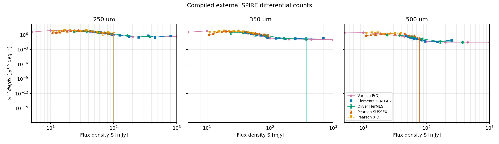
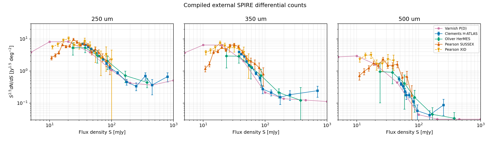

### pop-cosmos main goal:

## **Understanding Galaxy Evolution: Extending Pop-Cosmos to

Multi-wavelength Validation: FIR, Radio, and X-ray Cross
checks**

The study of galaxy evolution- how galaxies change over time, their relationship to each
other and other phenomena such as active galactic nuclei, and how various observed scaling
relations emerge- is central to modern astrophysics. This work depends on studying large
samples of galaxies at a variety of wavelengths using a range of statistical, physical and
other techniques. Recently deployed telescopes such as Euclid and the Rubin-LSST will
produce catalogues of billions of galaxies, for which traditional parametric models will not
work. To address this problem we have developed the pop-cosmos framework to model the
galaxy population using a combination of physical models, machine learning methods and
traditional statistics. This Masters project will validate and extend the pop-cosmos galaxy
population synthesis model by comparing its predictions to observational data at wavelengths
beyond its current optical/near-IR training range (0.3-5 µm). Students will leverage existing
multi-wavelength survey data from X-COSMOS, Herschel, and radio observations to test
model consistency across different emission mechanisms. Key tasks include comparing pop
cosmos star formation rate predictions with direct FIR/submm measurements, validating AGN
classifications using X-ray and radio flux cross-checks, and testing the radio-FIR relation
for non-AGN sources. The project will also involve extending the pop-cosmos framework
by running additional Flexible Stellar Population Synthesis (FSPS) calculations to generate
predictions at 24 microns and other far-infrared bands for direct comparison with MIPS,
Herschel, and ALMA data, and providing predictions for future projects such as the NASA
PRIMA mission. This work will provide crucial independent validation of the model‘s physical
assumptions while exploring its potential for multi-wavelength applications in galaxy evolution
studies.

## Task 1: Quantitative MS comparison to Speagle+2014

Method implemented in notebook:

- Speagle relation:
  - `log10 SFR(M*, t) = (0.84 - 0.026 t) log10 M* - (6.51 - 0.11 t)`
  - `t` is Universe age in Gyr (Giga year, 1 Billion)
  - Gives us the expected SFR for a galaxy given mass at a given cosmic time.
- Comparison sample:
  - finite values only
  - `log10sSFR_selected > -11`
  - `8.5 <= log10M_selected <= 11.5`
  - `0 <= z < 4`
- Residual used: If its 0, pop cosmos matches Speagle and +/- means pop cosmos predicts higher/lower SFR respectively
  - `Delta_MS = log10SFR_popcosmos - log10SFR_speagle`

Seeded run summary (`np.random.seed(7)`, `torch.manual_seed(7)`):

- Overall SF sample size: `N = 2155`
- Median `Delta_MS = -0.531 dex (dex is log10, so 10x so -0.53 is about 3x smaller)`
- Robust scatter `~ 0.460 dex`
- 16-84 half-width `~ 0.439 dex`

Per-redshift bins from notebook table:

- `[0.0, 0.5)`: `N=127`, median `Delta_MS=-0.682`, slope fit `1.018`, Speagle slope `0.596`
- `[0.5, 1.0)`: `N=547`, median `Delta_MS=-0.737`, slope fit `0.838`, Speagle slope `0.664`
- `[1.0, 2.0)`: `N=1023`, median `Delta_MS=-0.531`, slope fit `0.775`, Speagle slope `0.721`
- `[2.0, 3.0)`: `N=375`, median `Delta_MS=-0.283`, slope fit `0.720`, Speagle slope `0.769`
- `[3.0, 4.0)`: `N=83`, median `Delta_MS=-0.194`, slope fit `0.821`, Speagle slope `0.789`

Interpretation for discussion:

- Trend with mass and redshift is consistent with main seq behavior.
- Compared to Speagle’s expected SFR values, pop-cosmos sample gives lower SFR overall. The difference is biggest at low redshift, and it becomes smaller by around redshift 3.”.

## Task 2: Starburst definition applied to plot

Method implemented in notebook:

- Start bin: `1.0 <= z < 2.0`
- Starburst cut: `Delta_MS >= 0.6 dex` (relative to Speagle baseline)
- Plot added: non-starbursts (gray), starbursts (red), MS line, and `+0.6 dex` threshold line.

Measured how far each galaxy is above normal main seq line
`Delta_MS = log10SFR_galaxy - log10SFR_MS`

decided its starburst is >= 0.6dex (~4x greater)

run summary:

- In `1.0 <= z < 2.0`, `9 <= log10M <= 11.5`:

  - `N=791`, starbursts `N=5` (`0.63%` by number)
  - starburst SFR share `6.71%`

Interpretation for discussion:

* Starbursts are a **small fraction by number** (about **0.6%** in my run).
* But they still contribute a noticeable amount to total star formation (about **6–7%** SFR share in that bin).

## Task 3: What SFR means in each source

### pop-cosmos (Alsing+2024 / Thorp+2025)

- SFH is 7-bin piecewise-constant.
- First two bins fixed at `0-30 Myr` and `30-100 Myr`.
- Free SFH parameters are adjacent-bin SFR ratios `Delta log10(SFR)_k`.
- SFR definition (Thorp+2025 Appendix C):
  - `SFR/M_form = (M_form,1/M_form + M_form,2/M_form) / 0.1 Gyr`
  - i.e. SFR averaged over the latest 100 Myr.
- In this notebook:
  - `log10SFR_selected` = this 100 Myr-averaged absolute SFR in `Msun/yr`.
  - `log10sSFR_selected` is corrected to use mass remaining (`M_remain`) not mass formed.

### Speagle et al. (2014)

- Empirical, homogenized literature MS fit:
  - `log10 SFR(M*, t) = (0.84 - 0.026 t) log10 M* - (6.51 - 0.11 t)`.
- Not tied to one SPS model and not specifically the same 100 Myr SFH-bin definition.
- Reported intrinsic MS width is about `0.2 dex` after deconvolution.

### COSMOS2020 catalog SFR parameters (Weaver+2022 release docs)

- LePhare/BC03 columns at `zPDF`:
  - `lp_SFR_med`, `lp_SFR_best` (plus confidence limits)
  - based on BC03 templates, Chabrier IMF, BC03 tau+delayed SFHs.
- EAZY/FSPS columns:
  - `ez_sfr` (and percentiles)
- Important note in release docs:
  - LePhare SFR/sSFR are computed without IR, so uncertainties can be large.

## Feb 24, 2026 meeting follow-up

Notes from supervisor and actions:

Slope notes:

    At each redshift bin we fit`log10(SFR) = a log10(M*) + c`
    `slope_fit` = measured a from pop cosmos data in that bin
    `slope_speagle` = expected a from Speagle at that bin's median redsfhit/time

    So if slope fit is close to speagle they match well.

### 1) Add visual Speagle comparison plot (not only summary numbers)

Currently:

- have quantitative comparison numbers from Task 1:
- `N = 2155`
- median `Delta_MS = -0.531 dex`

to add:

- Make a direct visual plot in the same style as the existing `log10(SFR)` vs `log10(M*)` plot, but with Speagle as reference.
- Recommended figure setup:
  - keep pop-cosmos points/background as before
  - overplot Speagle MS as one or more lines (at representative redshifts, or in the selected redshift bin)
  - optionally add `pop-cosmos - Speagle` residual coloring for quick visual offset check

Goal:

- Easy side-by-side visual comparison with the previous MS plot, not just table/stat outputs.
- Added a new Task 1 visual cell in `catalogue_generation.ipynb`:

  - `Task 1 visual: pop-cosmos vs Speagle in 1 <= z < 2`
  - Uses the same `log10(SFR)` vs `log10(M*)` plane, with:
    - pop-cosmos density (hexbin)
    - Speagle MS line at median redshift of the bin
    - pop-cosmos best-fit line for direct visual comparison

explanation:

- We now have a picture where the old galaxy cloud and the Speagle “expected trend line” are in the same graph.
- This makes it easy to see by eye whether our galaxies mostly sit above, below, or on the reference line.
- In short: this is the visual version of the `Delta_MS` numbers.

### 2) Starburst test with larger mock sample

Issue in current run:

- In `1 <= z < 2` and `9 <= log10M <= 11.5`, only `5` starbursts were found.
- This is too small for stable tail/statistical interpretation.

What to add:

- Increase generated sample size (for example 5x to 10x more than 10,000 base samples).
- Re-run starburst classification (`Delta_MS >= 0.6`) and update:
  - starburst number fraction
  - starburst contribution to SFR
  - optional z~2 high-mass check

Goal:

- Improve tail statistics and reduce noise from small-number counts.

Status (implemented in notebook):

- Added a larger-sample rerun cell in `catalogue_generation.ipynb`:
  - `Task 2 rerun with larger sample size`
  - Runs starburst summary at `n_samples = 10,000`, `50,000`, and `100,000` with the same cuts/definition.

Latest rerun outputs:

- `10,000` samples:
  - `N(1<=z<2)=791`, `N_SB=5`, starburst fraction `0.632%`, starburst SFR share `6.710%`
  - `N(1.5<=z<2.5, M>=10)=126`, `N_SB=2`, fraction `1.587%`, SFR share `26.862%`
- `50,000` samples:
  - `N(1<=z<2)=3844`, `N_SB=12`, starburst fraction `0.312%`, starburst SFR share `6.041%`
  - `N(1.5<=z<2.5, M>=10)=632`, `N_SB=4`, fraction `0.633%`, SFR share `13.829%`
- `100,000` samples:
  - `N(1<=z<2)=7686`, `N_SB=20`, starburst fraction `0.260%`, starburst SFR share `7.280%`
  - `N(1.5<=z<2.5, M>=10)=1303`, `N_SB=9`, fraction `0.691%`, SFR share `12.821% (look at d.p accuracy)`

Quick read:

- Larger sample improved tail stability and reduced small-number noise, especially in the z~2 high-mass slice.

Brief explanation:

- With only a few starburst galaxies, percentages can jump around a lot.
- Increasing sample size gives us more rare objects in the tail, so the final percentages are more trustworthy.
- Here, the starburst counts increased from `5` (10k) to `20` (100k), and the SFR-share estimates became less noisy.

Matches literature ?

 **yes.., mostly consistent on SFR share; lower on number fraction**.

Source:

- arXiv: https://arxiv.org/abs/1108.0933

latest results:

- `(1 <= z < 2)`: starburst fraction `~sim 0.26%-0.63%`, SFR share `~6%-7%`
- 1.5 <= z < 2.5  fraction: ~0.63%-1.59%, SFR share ~13%-27%
  (100k run: 0.69%, 12.8%)

Literature target (Rodighiero+2011 at z~2, mass-selected SF sample:

- number fraction ~2%
- SFR density share <~ 10%

So:

- **SFR share:** at 100k value (~12.8% in the z~2 high-mass slice) is close-ish, slightly high.
- **number fraction:** at value (~0.7%) is lower than 2%

### Why not exact?

setup differs from that paper in several ways:

- different parent sample/selection (`Ch1<26`, pop-cosmos mock, spitzer/irac channel 1 ~3.6 micron near-IR on brighter than mag 26 galaxies in the band)
- different MS reference (Speagle baseline)
- your extra SF cuts and mass/redshift cuts are not exactly their selection pipeline
- finite-sample tail noise still matters, even at 100k

If we want a closer comparison, next step is: replicate their selection as closely as possible (their z range, mass completeness, SF selection, and MS definition), then recompute.

#### 3) What did Rodighiero+2011 do?

- Used **Herschel/PACS** data + optical/near-IR data in **COSMOS + GOODS-South**.
- Focused on **z = 1.5 to 2.5** (cosmic peak of star formation).
- Looked at **mass-selected star-forming galaxies**.
- Defined starbursts as galaxies with SFR **>4x above MS** (equivalent to `Delta_MS >= 0.6 dex`).
- Reported ``~2%`` by number and about ``~10%`` of SFR density at ``z~2``.

#### 4) Why our setup is not exactly the same (main differences)

- **Sample definition**:
  - Ours: pop-cosmos mock with `Ch1 < 26`
  - Paper: observed PACS-based sample in COSMOS/GOODS-S
- **MS reference**:
  - Ours: offset computed against **Speagle** relation (external baseline)

$$
\Delta MS = \log_{10}(\mathrm{SFR}_{\text{your galaxy}}) \;-\; \log_{10}(\mathrm{SFR}_{\text{Speagle}}(M, z))
$$

- Paper: MS defined from their own z~2 observed SFR-M* distribution
- **Cuts**:
  - Ours: global pre-cuts (`log10sSFR > -11`, `8.5<=logM<=11.5`, `0<=z<4`) + Task 2 bin cuts
  - Paper: their own star-forming/mass-complete cuts at z~2
- **SFR estimator origin**:
  - Ours: pop-cosmos model-derived SFR
  - Paper: observational SFR workflow tied to Herschel/PACS data

### 3) Open follow-up: wavelength dependence and external catalogs

Question to investigate:

- Are starburst conclusions changing because of wavelength coverage / selection?
- Need to trace what wavelength information the current SFR inference is sensitive to, and compare with longer-wavelength-selected catalogs.

where to go ?:

- Compare against longer-wavelength datasets (for example HERMES, H-ATLAS) after applying cuts to match pop-cosmos selection as closely as possible.
- Start with matched redshift and mass cuts, then compare starburst fraction and SFR contribution.

Brief motivation.

- Different telescopes see different parts of galaxy light.
- Dust can hide star formation in optical data, but infrared/sub-mm can reveal it.
- So we should check whether our starburst conclusion changes when we use catalogs that are more sensitive to dusty star-forming galaxies.

Data needs:

- Download external catalogs and prepare matched subsamples.
- If local files are not already available, provide/confirm data access location and preferred catalog versions.

#### Longer-wavelength expansion (new: where to get data + comparison plan)

Core equations for the comparison (use same definitions across datasets):

$$
\Delta_{\mathrm{MS}} = \log_{10}\!\big(\mathrm{SFR}_{\mathrm{gal}}\big) - \log_{10}\!\big(\mathrm{SFR}_{\mathrm{MS}}(M_\star,z)\big)
$$

$$
\text{Starburst if } \Delta_{\mathrm{MS}} \ge 0.6
$$

$$
f_{\mathrm{SB}}^{N} = \frac{N(\Delta_{\mathrm{MS}} \ge 0.6)}{N_{\mathrm{SF}}}
$$

$$
f_{\mathrm{SB}}^{\mathrm{SFR}} = \frac{\sum_{\Delta_{\mathrm{MS}} \ge 0.6}\mathrm{SFR}_i}{\sum_{\mathrm{SF}}\mathrm{SFR}_i}
$$

Optional IR conversion check (if catalogs provide total IR luminosity):

$$
\mathrm{SFR}_{\mathrm{IR}} \approx 10^{-10}\,L_{\mathrm{IR}} \quad (\text{in } M_\odot\,\mathrm{yr}^{-1} \text{ for } L_{\mathrm{IR}} \text{ in } L_\odot,\ \text{IMF-dependent})
$$

Plain-language meaning of the above:

- **Distance from the main sequence**

  $$
  \Delta_{\mathrm{MS}}
  $$

  measures “distance from the normal star‑forming trend.”
- **Starburst threshold**

  $$
  \Delta_{\mathrm{MS}} \ge 0.6
  $$

  means roughly

  $$
  \sim 4\times
  $$

  above that trend (starburst region).
- **Starburst fraction by number**

  $$
  f_{\mathrm{SB}}^{N}
  $$

  = “Out of all star‑forming galaxies, what percent are starbursts?”
- **Starburst fraction by SFR contribution**

  $$
  f_{\mathrm{SB}}^{\mathrm{SFR}}
  $$

  = “Out of total star formation, what percent is produced by starbursts?”

---

### Papers and likely data access points

1) **pop-cosmos: Star formation over 12 Gyr...**
   Link: https://arxiv.org/pdf/2509.20430
   Likely data path (pop-cosmos public releases):

- Galaxy posterior products: https://zenodo.org/records/17426655
- Mock catalogs: https://zenodo.org/records/15622325
- Code/tools: https://github.com/Cosmo-Pop

2) **ALPINE-ALMA [CII] survey: nature/LF/SFH of dusty galaxies up to z~6**
   Link: https://www.aanda.org/articles/aa/full_html/2020/11/aa38487-20/aa38487-20.html
   Useful catalog/data entry points:

- ALPINE products portal: https://cesam.lam.fr/a2c2s/
- ALPINE data-processing/catalog paper indicates CDS catalog access:
  http://cdsarc.u-strasbg.fr/viz-bin/cat/J/A+A/643/A2

3) **Ex-MORA survey (5 sigma source catalog and redshift distribution)**
   Link: https://arxiv.org/abs/2408.14546
   Current status:

- arXiv comment notes the fully reduced mosaic will be shared upon publication.
- For now, use source tables in paper/supplement and track publication repository link when posted.

---

### Short relevant notes from the 3 papers (simple terms)

1) **pop-cosmos: Star formation over 12 Gyr (arXiv:2509.20430)**

- Uses a deep IR-selected COSMOS sample and a generative SPS model.
- Reports SFRD peaking near

  $$
  z \approx 1.3
  $$
- Shows SF/Q classification can shift depending on whether you use

  $$
  \mathrm{sSFR}
  $$

  cuts or color cuts.
- Relevance for us:

  - solid pop-cosmos baseline for SFR/starburst comparisons.

2) **ALPINE continuum paper (A&A 2020, aa38487-20)**

- Characterizes 56 ALMA Band-7 serendipitous continuum sources in COSMOS/ECDFS.
- Derives IR luminosity functions and SFRD up to

  $$
  z \sim 6
  $$
- Finds dusty-obscured SF remains important at high redshift; UV/optical-only estimates can be lower.
- Reports a meaningful contribution from optically/near-IR dark sources at high

  $$
  z
  $$

  (e.g. contribution to high-z SFRD discussed in paper).
- Relevance for us:

  - direct long-wavelength benchmark for how much SF can be missed by optical/NIR selection.

3) **Ex-MORA (arXiv:2408.14546)**

- 2 mm ALMA blank-field survey in COSMOS-Web targeting dusty high-z systems.
- Reports a high-redshift-heavy sample with median around

  $$
  z \sim 3.6
  $$

  and many sources at

  $$
  z > 3
  $$
- Shows rest-optical methods miss a substantial fraction of dusty high-z galaxies.
- Relevance for us:

  - strong motivation to test starburst fractions under longer-wavelength selection.

---

### Practical methodology to compare with pop-cosmos

Step 1: Build a harmonized sample definition

- Match redshift bins first (for example

  $$
  1.5 \le z < 2.5
  $$

  and higher-z bins if needed).
- Apply a common mass floor where all datasets are reasonably complete.
- Keep a consistent star-forming selection rule across datasets.

Step 2: Harmonize SFR/Mass conventions

- Confirm Intial mass Function (IMF, implied dist of stellar masses when stars form) assumptions and convert if needed (Chabrier/Kroupa/Salpeter differences).
- Align stellar mass and SFR units/scales before computing offsets.
- Use one MS baseline consistently (e.g., Speagle or dataset-native MS), and report which was used.

Step 3: Compute the same summary metrics in each dataset

$$
f_{\mathrm{SB}}^{N} \quad \text{and} \quad f_{\mathrm{SB}}^{\mathrm{SFR}}
$$

- Median/dispersion of
  $$
  \Delta_{\mathrm{MS}}
  $$
- Optional: split by mass bins to check mass dependence of starburst incidence.

Step 4: Report wavelength-sensitive differences explicitly

- Compare optical/NIR-selected versus IR/sub-mm-selected samples at matched cuts.
- Flag where dusty systems appear in IR/sub-mm but are weak/missed in optical selections.

---

## First implemented comparison (pop-cosmos vs Wang 2024)

### Some motivation

Wang gives deblended far-IR/sub-mm photometry in COSMOS (24–850 µm).

* longer wavelengths are sensitive to dusty star formation.
* optical/NIR can miss dusty systems.
* we wanted to test if starburst fractions/SFR share change when looking at long-λ-detected subsamples.

So Wang is our first “longer-wavelength lens” on the same COSMOS population.

### Files used

- pop-cosmos:
  - `catalog data/real pop-cosmos data/mcmc_summaries.h5.gz`
  - `catalog data/real pop-cosmos data/README_v2_2_0.txt`
- Wang 2024:
  - `catalog data/wang/master.dat.gz`
  - `catalog data/wang/ReadMe.txt`

### Script walkthrough

- The script reads two catalogs:

  - pop-cosmos posterior summaries
  - Wang long-wavelength deblended catalog
- It keeps one representative value per pop-cosmos galaxy (median posterior).
- It matches galaxies between the two catalogs by shared COSMOS ID.
- It marks whether each matched galaxy is detected at long wavelengths (SPIRE/SCUBA) using SNR.
- It computes

  $$
  \Delta_{\mathrm{MS}} = \log_{10}\mathrm{SFR}_{\mathrm{pop}} - \log_{10}\mathrm{SFR}_{\mathrm{Speagle}}(M_\star,z)
  $$

  and flags starbursts with

  $$
  \Delta_{\mathrm{MS}} \ge 0.6.
  $$
- It then reports starburst fractions for:

  - all matched galaxies in each bin
  - long-lambda detected subset
  - not-long-lambdadetected subset

### run notes

Method (first pass):

1. Decompress and load pop-cosmos summaries.
2. Use median posterior values (50th percentile) for:
   - $$
     \log_{10}M_\star,\ \log_{10}\mathrm{SFR},\ \log_{10}\mathrm{sSFR},\ z
     $$
3. Load Wang master catalog via CDS schema from `ReadMe.txt`.
4. Join on COSMOS ID:
   - pop-cosmos `index_farmer` ↔ Wang `ID`
5. Define long-wavelength detection flag:
   - SPIRE/SCUBA detected if any of

     $$
     250,350,500,850\,\mu\mathrm{m}
     $$

     has (singal to noise ratio = F_lambda/sigma_lamba)
     meaning measured flux density at given wavelenght/ uncertainty on that flux
     3 => flux is three times greater than noise

     $$
     \mathrm{SNR}\ge 3
     $$

     .
6. Compute:
   - $$
     \Delta_{\mathrm{MS}} = \log_{10}\mathrm{SFR}_{\mathrm{pop}} - \log_{10}\mathrm{SFR}_{\mathrm{Speagle}}(M_\star,z)
     $$
   - starburst if
     $$
     \Delta_{\mathrm{MS}}\ge 0.6
     $$
   - fractions in the same bins used previously.

### First-pass results

What is happening:

So all matched is all galaxies in both catalog after cuts,

long_detect is only matched galaxies with the Wang long-lamba detection and not long is its compliment

So we do not recompute SFR from wang yet, we use pop cosmos SFR for all matched galaxies. wang is just used as a tag for the 250-800um or not.

using external baseline speagle that is strict +0.6 dex and script is using median posterior values per galaxy, so extreme tails are being

Data linkage:

- pop-cosmos rows (valid COSMOS IDs): `429,669`
- Wang rows used (positive COSMOS IDs): `128,387`
- Matched rows (inner join on ID): `114,048`
- Long-detected fraction (SPIRE/SCUBA, SNR>=3): `5.65%`

Bin A (`1 <= z < 2`, `9 <= log10M <= 11.5`):

- All matched: `N=37,149`, `N_SB=8`, starburst fraction `0.0215%`, SFR share `0.2628%`
- Long-detected: `N=2,673`, `N_SB=2`, starburst fraction `0.0748%`, SFR share `0.2761%`
- Not long-detected: `N=34,476`, `N_SB=6`, starburst fraction `0.0174%`, SFR share `0.2596%`

Bin B (`1.5 <= z < 2.5`, `log10M >= 10`):

- All matched: `N=15,807`, `N_SB=3`, starburst fraction `0.0190%`, SFR share `0.1695%`
- Long-detected: `N=1,494`, `N_SB=0`, starburst fraction `0.0000%`, SFR share `0.0000%`
- Not long-detected: `N=14,313`, `N_SB=3`, starburst fraction `0.0210%`, SFR share `0.2057%`

### Comparison to previous findings ?

Previous pop-cosmos mock (my 100k run)

* **1<=z<2**: starburst SFR share **7.28%(Fraction: 0.26%)**
* **1.5<=z<2.5, M>=10**: starburst SFR share **12.82%(Fraction:0.691%)**

These were in the ballpark of the expected literature range

### New pop-cosmos × Wang matched real-data run

From the CSV:

* **1<=z<2** all matched: starburst SFR share **0.2628%**
* **1.5<=z<2.5, M>=10** all matched: **0.1695%**
* long-λ detected subsets are also very low.

So Wang-matched run is **much lower** than your earlier mock result and lower than the expected 8–14% figure.

### Interpretation

- Under current Speagle-based

  $$
  \Delta_{\mathrm{MS}}
  $$

  settings, starburst fractions are extremely low in this matched real-data run.
- This is prob a calibration/definition mismatch signal (selection + MS baseline + SFR conventions), not a final physics conclusion yet.
- Next step: test alternative MS baseline choices and IMF/SFR harmonization before drawing physical conclusions.

We likely got very low starburst/SFR-share numbers because this was a much stricter and different comparison than before, not because starbursts disappear physically.

Ideas ?

* We changed sample: earlier was a mock-generated pop-cosmos sample; now it is a real-data ID-matched subset with Wang, which can remove part of the extreme high-SFR tail.
* We used an external baseline (Speagle)
  If our sample sits below Speagle normalization, very few galaxies pass the starburst cut .**Δ**MS≥**0.6.**
* SFR definitions are not identical across datasets/papers (model-based 100 Myr average vs IR-based observational SFRs), so offsets are expected.
* Detection/matching choices (e.g., SNR threshold, matched IDs only, quality cuts) can strongly reduce rare starbursts.
* Using median posterior values also suppresses extremes.

## Plain-language clarifications

### 1) What does `all_matched, N = 37,149` mean?

- `all_matched` means galaxies that are in **both** pop-cosmos and Wang after matching by ID.
- Then we apply the bin cuts (`1 <= z < 2`, `9 <= log10M <= 11.5`, and SF quality cuts).
- `N = 37,149` is the number of galaxies left in that bin after those steps.

### 2) Why is Wang smaller than pop-cosmos?

- pop-cosmos has more total objects (`429,669` valid IDs).
- Wang is a smaller long-wavelength-focused catalog (`128,387` positive IDs).
- Matched overlap is `114,048`.

Match fractions:

$$
\frac{114048}{429669} \approx 26.5\%
$$

of pop-cosmos has a Wang match, and

$$
\frac{114048}{128387} \approx 88.8\%
$$

of Wang has a pop-cosmos match.

### 3) What are we comparing in this first pass?

Starburst classification is from pop-cosmos + Speagle:

$$
\Delta_{\mathrm{MS}} = \log_{10}(\mathrm{SFR}_{\mathrm{pop}}) - \log_{10}(\mathrm{SFR}_{\mathrm{Speagle}}(M_\star,z))
$$

$$
\text{starburst if } \Delta_{\mathrm{MS}} \ge 0.6
$$

Wang is used as a **label** only:

- long-wavelength detected (`SNR >= 3` in any of `250,350,500,850` um)
- not long-wavelength detected

Important: we did **not** recalculate SFR from Wang IR photometry in this run.

### 4) How incidence is tested

We recompute starburst fraction in each subgroup:

$$
f_{\mathrm{SB}}^{N} = \frac{N(\Delta_{\mathrm{MS}} \ge 0.6)}{N_{\mathrm{group}}}
$$

Bin A results:

$$
f_{\mathrm{SB}}^{N}(\text{all matched}) = \frac{8}{37149} = 0.0215\%
$$

$$
f_{\mathrm{SB}}^{N}(\text{long-detected}) = \frac{2}{2673} = 0.0748\%
$$

$$
f_{\mathrm{SB}}^{N}(\text{not long-detected}) = \frac{6}{34476} = 0.0174\%
$$

So yes, we do recalculate the fraction in the same bin; `all_matched` is the baseline.

### 5) Why are matched-sample rates so low vs earlier mock runs?

- Different parent sample (real matched subset vs mock generation).
- External MS baseline (Speagle) can shift offsets lower.
- Median posterior values reduce extreme-tail objects.
- Matching and cuts can remove rare high-SFR galaxies.

### 6) What this means right now

- Similar all-vs-long-detected values do **not** yet prove success or failure on dusty galaxies.
- It is a first-pass consistency check; final dust validation needs IR-based SFR comparison on the same matched galaxies.

## Week of Mar 15, 2026: Light-work planning notes

### 1) How I would test pop-cosmos at extended wavelengths

What I expect physically:

- Long wavelengths (far-IR/sub-mm) are more sensitive to dusty star formation.
- So if dust is important, some galaxies that look normal in optical/NIR can move upward in SFR when I use IR-based SFR, and a subset can cross into the starburst region.

What I want to test:

$$
\Delta_{\mathrm{MS}} = \log_{10}(\mathrm{SFR}) - \log_{10}(\mathrm{SFR}_{\mathrm{MS}}(M_\star,z))
$$

and whether starburst labels change when SFR comes from longer wavelengths.

Practical steps:

1. Build one matched per-source table with: `ID, z, log10M, log10SFR_pop, DeltaMS_pop, SNR250/350/500/850, long_detect`.
2. Add an IR-based SFR estimate for the same sources (from external IR-based product/model; Wang master has fluxes and errors, not direct SFR in the subset I used).
3. Recompute:
   - `DeltaMS_IR`
   - starburst flags from pop and IR versions.
4. Make a transition matrix:
   - non-SB (pop) -> SB (IR)
   - SB (pop) -> non-SB (IR)
5. Report changes in:
   - number fraction of starbursts
   - SFR share from starbursts
     in the same bins I already use (Bin A and Bin B).

What success/failure would look like:

- If many sources go non-SB -> SB with IR SFR, optical/NIR-only likely misses dusty bursts.
- If labels are stable, pop-cosmos is more robust than I expected to dust-obscuration effects.

Simple action I can do quickly next:

- Run a short sensitivity test before full IR-SFR modeling:
  - compare `DeltaMS_pop` distributions across long-detected vs not-long-detected and across SNR thresholds (`>=2.5, >=3, >=5`).
  - this is not the final answer, but it tells me whether the long-lambda subset is already systematically shifted.

### 2) Speagle vs quenched sources (important caveat)

My understanding:

- Speagle MS relation is a star-forming main-sequence baseline.
- It is not designed as a quenched-galaxy model.

Implication for my analysis:

- If quenched galaxies enter the sample, they naturally get very negative `DeltaMS`, which can dilute starburst fractions.
- So I should keep a clear star-forming pre-selection before using Speagle offsets.

What I should state clearly in slides/notes:

- Speagle is used as a reference for SF galaxies, not for quiescent population modeling.
- Any quenched contamination can bias absolute fractions downward.

### 3) Sigma clipping: where useful and where not

Useful:

- Sigma clipping is useful when fitting a baseline MS line/slope, to reduce outlier leverage.

Not useful (or risky):

- I should not sigma-clip when measuring starburst incidence itself, because starbursts are in the high-SFR tail I care about.

Practical rule I will follow:

- Clip only for baseline fitting.
- Do not clip for final starburst counts/shares.
- Report both clipped and unclipped baseline fits if needed for transparency.

### 4) Rodighiero+2011 optical/NIR-only comparison idea (useful?)

 useful as a test.

Why ?:

- Rodighiero-style starburst framing is what I used for thresholding.
- Repeating that style but with optical/NIR-only SFR (no IR boost) gives me a direct "what do I miss without long-lambda" estimate.

How I would do it:

1. Keep Rodighiero-like bin/cuts as close as possible (especially `1.5 <= z < 2.5`, high-mass slice).
2. Compute starburst fractions using optical/NIR-based SFR definitions.
3. Compare against the same matched sources with IR-informed SFR.
4. Quantify missed-burst fraction and SFR-share difference.

Expected outcome:

- I expect optical/NIR-only to miss at least part of dusty starburst activity, especially at higher mass and around z~2.

### 5) Recap of what I'm showing this week

- I now have the matched-catalog setup done.
- Next I will do an explicit label-transition test using IR-based SFR on the same sources.
- I will keep Speagle use limited to SF-selected samples, and only use sigma clipping for baseline fitting (not for starburst counting).
- I also plan a Rodighiero-style optical/NIR-only stress test to quantify what long-lambda adds.

## Week of Mar 24, 2026: follow-up work from supervisor meeting

### 1) Simpler direct SFR comparison

This week I switched to a simpler comparison idea:

- same matched galaxies
- compare the SFR values directly between methods
- do not go through the starburst threshold first

This makes sense, and it is easier to explain.

What I can compare directly right now:

- pop-cosmos vs COSMOS2020 LePhare SFR
- pop-cosmos vs COSMOS2020 EAZY SFR

Important caveat:

- the SFR methods are not identical, so I expect some systematic offset
- but if the offset is large and consistent, that is still a useful result

Main results from the new direct SFR table:

- Overall star-forming-like matched sample:

  - LePhare minus pop-cosmos median `Delta log10(SFR) = +0.224 dex`
  - this is about a factor `1.67` higher than pop-cosmos
  - EAZY minus pop-cosmos median `Delta log10(SFR) = +0.082 dex`
  - this is about a factor `1.21` higher than pop-cosmos
- Bin A (`1 <= z < 2`, `9 <= log10M <= 11.5`):

  - LePhare minus pop-cosmos median `+0.318 dex`
  - about a factor `2.08` higher
  - EAZY minus pop-cosmos median `+0.138 dex`
  - about a factor `1.37` higher
- Bin B (`1.5 <= z < 2.5`, `log10M >= 10`):

  - LePhare minus pop-cosmos median `+0.260 dex`
  - about a factor `1.82` higher
  - EAZY minus pop-cosmos median `+0.122 dex`
  - about a factor `1.32` higher

My reading of this:

- LePhare is systematically higher in SFR than pop-cosmos on the same matched galaxies.
- EAZY is also higher than pop-cosmos, but the offset is smaller.
- So the very low pop-cosmos starburst fractions are at least partly consistent with pop-cosmos sitting lower in SFR than the COSMOS2020 estimators.

### 2) Narrower redshift-bin MS comparison

The previous MS-plane comparison used a broad `1 <= z < 2` bin.

I now also looked at narrower bins:

- `1.0 <= z < 1.5`
- `1.5 <= z < 2.0`

Direct SFR offset results in the narrower bins:

- `1.0 <= z < 1.5`:

  - LePhare minus pop-cosmos median `+0.358 dex` (factor `2.28`)
  - EAZY minus pop-cosmos median `+0.170 dex` (factor `1.48`)
- `1.5 <= z < 2.0`:

  - LePhare minus pop-cosmos median `+0.256 dex` (factor `1.80`)
  - EAZY minus pop-cosmos median `+0.091 dex` (factor `1.23`)

What I take from that:

- the same ordering stays there even after narrowing the redshift bin:
  - LePhare highest
  - EAZY in the middle
  - pop-cosmos lowest
- the offset is a bit stronger in the lower half of Bin A (`1.0 <= z < 1.5`) than in the upper half (`1.5 <= z < 2.0`)
- so the earlier broad-bin pattern was not just caused by mixing too much redshift evolution together

### 3) Wang comparison: what I can and cannot do from the current file

Supervisor suggestion was to cross-match and compare SFR more directly.

For Wang, there is one important limitation:

- the local `master.dat` file I downloaded has long-wavelength fluxes
- it does **not** have a direct SFR column

So from the current Wang file, I cannot yet do a true:

- `SFR_Wang` vs `SFR_pop-cosmos`

comparison.

What I did instead as the closest local test:

- matched Wang to pop-cosmos by ID
- checked whether galaxies with brighter long-wavelength fluxes also have higher pop-cosmos SFR

Main Wang flux vs pop-cosmos SFR results in Bin A:

- `24 um`: `N_detect = 17,571`, median `log10SFR_pop = 1.18`, Spearman `rho = 0.53`
- `250 um`: `N_detect = 2,569`, median `log10SFR_pop = 1.43`, Spearman `rho = 0.19`
- `350 um`: `N_detect = 1,875`, median `log10SFR_pop = 1.45`, Spearman `rho = 0.16`
- `500 um`: `N_detect = 834`, median `log10SFR_pop = 1.45`, Spearman `rho = 0.11`
- `850 um`: `N_detect = 294`, median `log10SFR_pop = 1.57`, Spearman `rho = 0.14`

Also, for the long-detected split in Bin A:

- long-detected median `log10SFR_pop = 1.425`
- not-long-detected median `log10SFR_pop = 0.862`
- long-detected median `log10M_pop = 10.742`
- not-long-detected median `log10M_pop = 10.143`

My reading of this:

- the Wang long-wavelength detections are, on average, the higher-SFR and higher-mass pop-cosmos galaxies
- that is qualitatively sensible
- but this is still **not** the same as a direct Wang SFR comparison
- to do the real SFR-vs-SFR test with Wang, I still need an IR-based SFR estimate for the same matched sources

### 4) Spectroscopic redshift comparison: local status

I checked whether the currently downloaded local files actually contain a spectroscopic redshift field.

Result:

- `COSMOS2020 farmer.dat.gz`: no spec-like field found
- `pop-cosmos mcmc_summaries.h5` metadata: no spec-like field found

So with the files currently downloaded, I cannot yet run a direct local:

- pop-cosmos vs spec-z
- EAZY vs spec-z
- LePhare vs spec-z

comparison.

What I would do once I have the spec-z compilation / matching file:

$$
\Delta z = \frac{z_{est} - z_{spec}}{1 + z_{spec}}
$$

then report:

- median bias
- `sigma_MAD`
- outlier fraction

### 5) Mass / luminosity functions and `1 / V_max`

I only wrote this up as methodology for now.

Why I did not run a full `1 / V_max` mass function yet:

- I need a clear parent selection band and magnitude limit
- I need a consistent `z_max` calculation
- I need to think about completeness / masking

So for now my position is:

- it is a sensible next step
- but it should come after I lock down the comparison sample and selection definition more carefully

### 6) Short recap I can say out loud

- I simplified the comparison by looking at direct SFR offsets on the same matched galaxies.
- LePhare is typically higher in SFR than pop-cosmos, and EAZY is also higher but by less.
- The same ordering stays there in narrower redshift bins, so it is not just a broad-bin effect.
- Wang is useful right now as a long-wavelength flux check, but not yet a direct SFR-vs-SFR comparison because the file I have does not include SFR.
- For spectroscopic redshift benchmarking, I need the spec-z compilation file because it is not in the currently downloaded local Farmer/pop-cosmos files.

## Week of Mar 29, 2026: MIR / IRAC follow-up from Boris

### 1) What Boris loaded

Boris sent three useful files:

- `cosmos2020_mir_photometry.h5`
- `cosmos2020_fsps_subset.h5`
- `crossmatch_cosmos2020.py`

My read of them:

- `cosmos2020_mir_photometry.h5` is the main full-sample product
  - it has `429,669` galaxies, so it lines up with the pop-cosmos sample size
  - it contains predicted MIR quantities for:
    - `Ch1`
    - `Ch2`
    - `Ch3`
    - `Ch4`
    - `MIPS24`
- `cosmos2020_fsps_subset.h5` looks like a smaller `1000` galaxy sanity-check file
  - this seems to be there to compare the faster emulator-style predictions against direct FSPS outputs on a smaller subset
- `crossmatch_cosmos2020.py` is a utility script that joins Boris's MIR predictions to:
  - the COSMOS2020 Farmer catalog
  - the pop-cosmos `mcmc_summaries.h5`

So overall, this is definitely useful for the main project goal:

- testing pop-cosmos beyond the shorter-wavelength regime
- especially by checking how well the model does in the MIR before moving further out to FIR / radio / X-ray

### 2) What the script is doing

In simple terms, the script is doing three comparisons.

First:

- take Boris's predicted MIR magnitudes
- match them to the same objects in COSMOS2020
- compare prediction vs observed MIR photometry

Second:

- load the stored pop-cosmos model values for `Ch1` and `Ch2`
- compare those directly to the observed COSMOS2020 `IRAC_CH1` and `IRAC_CH2`

Third:

- print a few example objects to sanity-check the matching

The matching itself is simple:

- COSMOS2020 match is by `index_farmer == ID`
- pop-cosmos match is by row alignment / slice

That part makes sense and is efficient.

### 3) What bands are actually available

From the local COSMOS2020 `ReadMe`, the Farmer catalog does have:

- `IRAC_CH1`
- `IRAC_CH2`
- `IRAC_CH3`
- `IRAC_CH4`
- `SPLASH_CH1`
- `SPLASH_CH2`
- `SPLASH_CH3`
- `SPLASH_CH4`

So the professor's memory on the COSMOS2020 side checks out.

On the Boris HDF5 side, I found:

- `speculator` predictions for `Ch1`, `Ch2`, `Ch3`, `Ch4`, `MIPS24`
- `photulator` predictions for `Ch1`, `Ch2`
- stored pop-cosmos validation values for `Ch1`, `Ch2`

So right now:

- `Ch1` and `Ch2` are immediately usable
- `Ch3` and `Ch4` are available on Boris's side and in COSMOS2020, so they are worth testing
- `MIPS24` is present in the file structure, but current coverage is effectively zero, so I cannot use it yet from the current product

### 4) Quick evaluation: is this useful

Yes, definitely.

But I think the usefulness is different by band.

#### `Ch1` / `Ch2`

These are the strongest immediate checks.

Why:

- they have high coverage
- the residuals are small
- we can compare directly to observed COSMOS2020 fluxes now

I checked the local Farmer photometry against Boris's full MIR file.

For residuals, I used:

- `model_mag - observed_mag`

So:

- residual near `0` means good agreement
- positive residual means the model is a bit fainter than the data
- negative residual means the model is a bit brighter than the data

Stored pop-cosmos model vs observed IRAC:

- `Ch1`: `N = 423,272`, median residual `+0.020 mag`, MAD `0.084 mag`
- `Ch2`: `N = 414,272`, median residual `-0.012 mag`, MAD `0.041 mag`

That is good.

My simple read:

- pop-cosmos is modelling `Ch1` and `Ch2` pretty well overall
- the typical bias is very small
- the scatter is modest, especially in `Ch2`

This means I can now answer the original professor question:

- yes, I can load the model fluxes for `Ch1` / `Ch2`
- and yes, they seem good enough to use as a proper validation check

#### `Ch3` / `Ch4`

These are more interesting scientifically, because they go further into the MIR.

They are also less clean right now.

Coverage in Boris's full file:

- `Ch1`: `94.8%`
- `Ch2`: `80.9%`
- `Ch3`: `55.4%`
- `Ch4`: `22.3%`
- `MIPS24`: `0%`

So the file is already telling me that longer MIR coverage gets much patchier.

Comparing Boris's `speculator` predictions to observed COSMOS2020 IRAC:

- `IRAC_CH3`: `N = 150,712`, median residual `+0.507 mag`, MAD `0.889 mag`
- `IRAC_CH4`: `N = 55,394`, median residual `+0.866 mag`, MAD `1.037 mag`

Comparing to observed SPLASH instead:

- `SPLASH_CH3`: `N = 71,800`, median residual `-0.181 mag`, MAD `0.629 mag`
- `SPLASH_CH4`: `N = 5,442`, median residual `-0.703 mag`, MAD `0.740 mag`

My read:

- `Ch3` / `Ch4` are not yet nearly as tight as `Ch1` / `Ch2`
- the answer depends quite a lot on whether I compare to `IRAC_*` or `SPLASH_*`
- so these bands are useful, but I would treat them as exploratory for now, not as the cleanest headline result

### 5) What I think this means scientifically

For the overall project, I think this is a nice bridge step.

Why:

- `Ch1` / `Ch2` are close enough to the fitted regime that they let me check whether the modelling pipeline is behaving sensibly
- `Ch3` / `Ch4` start to push further out in wavelength, so they are more like a real extension test
- `MIPS24` would be even more interesting for dust-obscured star formation, but I do not have usable coverage for it yet

So my current view is:

- `Ch1` / `Ch2` = strong validation / sanity-check bands
- `Ch3` / `Ch4` = promising extension bands, but noisier and more sensitive to which observed product I use
- `MIPS24` = potentially very useful next target if Boris can synthesise it properly

This fits the bigger project story well:

- first show the method behaves properly in the near-to-mid IR
- then push further into bands that are more sensitive to dust-obscured emission
- then later compare to FIR / radio / X-ray products

### 6) Questions

- Is `Ch2` also in the original pop-cosmos stored model output, or is it only in the new synthetic MIR file?
- For `Ch3` / `Ch4`, which observed comparison should I trust more as the main reference:
  - `IRAC_*`
  - or `SPLASH_*`
- Are the `stored_mag_Ch1` / `stored_mag_Ch2` values straight from `mcmc_summaries`, or re-derived during the MIR synthesis step?
- Why is `MIPS24` coverage currently `0%` in the full MIR file:
  - wavelength coverage issue
  - emulator coverage issue
  - or just not populated yet
- Do we want the main validation plots in:
  - magnitudes
  - fluxes
  - or residuals normalized by photometric uncertainty

### 7) What next

I think there is a clean next step here.

Immediate next plot set:

- observed vs model `Ch1`
- observed vs model `Ch2`
- residual vs redshift
- residual vs stellar mass
- residual vs dust attenuation if available

Why:

- that would directly answer "how well has pop-cosmos modelled the IRAC bands?"
- and it is already supported by the current files

Then after that:

- do the same for `Ch3` / `Ch4`
- but treat them more as a first extension test, because the scatter is much larger

And finally:

- if Boris can populate `MIPS24`, that is probably the most interesting next MIR band for the main science goal, because it gets closer to dust-obscured star formation

### 8) Short version I can say out loud

- Boris's new files are definitely useful.
- They give me predicted MIR photometry matched to the pop-cosmos sample.
- `Ch1` and `Ch2` already look good: the model-observed residuals are small, so pop-cosmos seems to be modelling those bands reasonably well.
- `Ch3` and `Ch4` are available too, but they are much noisier, so I would treat them as an extension test rather than the cleanest validation result.
- `MIPS24` would be very useful for the obscured-star-formation side of the project, but the current file does not yet have usable coverage there.

### 9) Quick note: what MIR means

`MIR` = `mid-infrared`.

Very roughly, this means wavelengths of a few to a few tens of microns.

For this work, the main MIR bands I am looking at are:

- `IRAC Ch1`
- `IRAC Ch2`
- `IRAC Ch3`
- `IRAC Ch4`
- `MIPS24`

### 10) Quick reading of Boris's 7 figures

Important note:

- most of these figures are internal checks of the synthetic MIR pipeline
- so they are mostly asking "do Boris's fast predictions agree with stored model photometry / other fast predictions?"
- they are not all direct "model vs observed COSMOS2020" plots

#### Figure 1: `fig1_speculator_vs_stored.png`

What it shows:

- `Speculator` predicted `Ch1` / `Ch2` magnitudes compared against stored photometry values
- top panels: point clouds near the `1:1` line
- bottom panels: residual histograms

My read:

- this is a strong internal consistency check
- `Ch1` and `Ch2` agree very well overall
- offsets are small:
  - `Ch1` median about `-0.024 mag`
  - `Ch2` median about `-0.052 mag`
- so the synthetic `Speculator` outputs are reproducing the stored values closely

#### Figure 2: `fig2_residuals_vs_properties.png`

What it shows:

- residuals `Speculator - Stored` for `Ch1` and `Ch2`
- plotted against:
  - redshift
  - stellar mass
  - `dust2`
  - `lnfAGN`

My read:

- the residuals stay fairly close to `0` for most of the sample
- there are some trends, especially with stellar mass and at some redshifts
- but nothing here looks like a huge catastrophic failure
- so this suggests the internal MIR prediction is mostly stable, with some mild systematic structure

#### Figure 3: `fig3_coverage_map.png`

What it shows:

- where the model wavelength coverage overlaps the observed filter bands as redshift changes

My read:

- `Ch1` and `Ch2` are well covered over a broad redshift range
- `Ch3` is more limited
- `Ch4` is even more limited
- `MIPS24` is effectively not covered in the current setup

This is useful because it explains why:

- `Ch1` / `Ch2` look like the safest first validation bands
- `Ch3` / `Ch4` are patchier
- `MIPS24` is not ready yet

#### Figure 4: `fig4_color_magnitude.png`

What it shows:

- left: predicted `Ch1` magnitude distribution
- middle: `Ch1 - Ch2` color vs redshift
- right: IRAC color-color plane

My read:

- this is more of a sanity-check / population-view figure
- the predicted MIR photometry is not random; it forms structured color trends with redshift and mass
- the model produces a sensible-looking galaxy population in MIR color space

#### Figure 5: `fig5_speculator_vs_photulator.png`

What it shows:

- `Speculator` vs `Photulator` predictions for `Ch1` and `Ch2`
- with residuals vs redshift underneath

My read:

- these two fast prediction methods agree almost perfectly
- the points sit right on the `1:1` line
- residuals are extremely small

So this is basically saying:

- the two synthetic pipelines are internally consistent for `Ch1` / `Ch2`

#### Figure 6: `fig6_example_seds.png`

What it shows:

- a few example galaxy SEDs at different redshifts
- with the IRAC / MIPS filter curves drawn on top

My read:

- this is mainly a visual explanation figure
- it helps show where the MIR filters sit relative to the galaxy spectrum as redshift changes
- it also helps explain why some bands are easier to model than others, and why coverage gets worse at longer wavelengths

#### Figure 7: `fig7_photulator_vs_stored.png`

What it shows:

- `Photulator - Stored` residuals for `Ch1` and `Ch2` as a function of redshift

My read:

- overall offsets are still small:
  - `Ch1` median about `-0.026 mag`
  - `Ch2` median about `-0.058 mag`
- but this figure makes the redshift-dependent structure easier to see
- agreement is generally fine, but it looks less clean at the highest redshifts

So I would read this as:

- still good overall for `Ch1` / `Ch2`
- but there are some redshift-dependent systematics worth keeping in mind

### 11) My overall take on the figures

The main story from these figures is:

- `Ch1` / `Ch2` look strong internally
- the synthetic MIR machinery seems self-consistent
- `Ch3` / `Ch4` are more limited by coverage and likely harder to trust as clean headline bands
- `MIPS24` is clearly the missing next step

Also, these figures are mostly telling me:

- "is the synthetic MIR pipeline behaving sensibly?"

rather than:

- "does it match the real observed COSMOS2020 photometry?"

So I think the next best step is still:

- make a small set of direct observed-vs-model plots for `IRAC Ch1` and `Ch2`
- then extend to `Ch3` / `Ch4` carefully

### 12) Direct observed-vs-model IRAC check I made now

#### What I actually did

For the same matched pop-cosmos sample:

- took the stored pop-cosmos model magnitudes for `Ch1` / `Ch2` from Boris's MIR file
- took the observed `IRAC_CH1` / `IRAC_CH2` fluxes from COSMOS2020 Farmer
- converted the observed fluxes to AB magnitudes
- plotted observed vs model directly
- then plotted residuals against redshift

Here residual means:

- `model - observed`

So:

- positive residual = model is a bit fainter than the data
- negative residual = model is a bit brighter than the data

#### Main result

Overall summary:

- `Ch1`: `N = 423,272`, median residual `+0.020 mag`, MAD `0.084 mag`
- `Ch2`: `N = 414,272`, median residual `-0.012 mag`, MAD `0.041 mag`

My quick read:

- both bands look good overall
- `Ch2` is clearly tighter than `Ch1`
- the typical bias in both bands is small

#### What the observed-vs-model plots show

For both `Ch1` and `Ch2`:

- the dense cloud sits close to the `1:1` line
- so the model is tracking the real observed magnitudes pretty well

Difference between the two:

- `Ch1` has a broader scatter around the line
- `Ch2` is tighter and cleaner

So if I want the cleanest simple validation statement right now, it is probably:

- pop-cosmos does a decent job in both `IRAC Ch1` and `Ch2`
- and the agreement looks especially strong in `Ch2`

#### What the residual-vs-redshift plot shows

`Ch1`:

- mostly near zero through a lot of the redshift range
- small positive bump around roughly `z ~ 1 to 1.5`
- small negative dip around roughly `z ~ 2 to 4`
- then it starts to drift more at the very highest redshift end

`Ch2`:

- starts slightly negative at low `z`
- stays very close to zero from about `z ~ 1.5` to `z ~ 4.5`
- gets messy at the very highest redshift end, where there are fewer objects

So the simple overall message is:

- most of the redshift range looks stable
- the high-redshift tail is less reliable / noisier
- `Ch2` looks more stable than `Ch1`

#### Why this is different from Boris's figure set

Boris's script already did the direct comparison numerically.

But the figures he shared before were mostly:

- internal consistency checks
- model vs stored
- speculator vs photulator
- coverage / sanity plots

The new three plots are different because they are the cleaner direct answer to:

- "does the pop-cosmos model reproduce the observed `IRAC Ch1/Ch2` measurements?"

So I think these are better meeting figures.

#### Short version

- I now have the clean direct `observed vs model` plots for `IRAC Ch1` and `Ch2`.
- Both look good overall.
- `Ch2` is tighter than `Ch1`.
- Residuals stay close to zero across most of the redshift range.
- The highest-redshift tail is where things start to get noisier.

## March 31, 2026 add-on: how the recent pop-cosmos papers do mass / luminosity-function style calculations

Papers checked:

- `arXiv:2506.12122` - `pop-cosmos: Insights from generative modeling of a deep, infrared-selected galaxy population`
- `arXiv:2509.20430` - `pop-cosmos: Star formation over 12 Gyr from generative modelling of a deep infrared-selected galaxy catalogue`

### Quick answer

- These are **not** doing a classic per-galaxy `1/Vmax` estimate.
- In `1/Vmax`, each observed galaxy contributes `1 / Vmax,i`, where `Vmax,i` is the maximum comoving volume over which that galaxy could have entered the survey given the flux limit.
- In the pop-cosmos papers, the workflow is instead: apply a completeness cut, normalize to the COSMOS survey area / counts, and then use the generative model to histogram or integrate galaxy properties in redshift bins.

### Paper 1: `2506.12122`

- This paper mainly uses the **stellar mass function as a shape comparison / validation test** for the generative model.
- Their Figure 11 shows:
  - pop-cosmos stellar-mass histogram
  - histogram from galaxy-level COSMOS SED fits
  - Leja+2020 double-Schechter mass function
- Important detail:
  - the caption says the histograms are **normalized to integrate to 1** between the mass-completeness limit and the high-mass cut.
- They estimate the mass-completeness limit from the **turnover** of the pop-cosmos stellar-mass distribution as a function of redshift.
- So this is **not** an absolute `1/Vmax` number-density estimate. It is more a comparison of the **shape** of the mass distribution after completeness cuts.

### Paper 2: `2509.20430`

- For the cosmic SFR density they explicitly move away from luminosity-function style methods and instead **sum individual galaxy SFRs** in redshift bins.
- Their estimator is:

`Psi_b = (N f_b / Vco,b) * mean(SFR of sampled galaxies in bin b)`

where:

- `N` = total number of COSMOS galaxies passing the selection
- `f_b` = pop-cosmos predicted fraction of galaxies in redshift bin `b`
- `Vco,b` = comoving volume of that redshift bin over the COSMOS sky area
- So the normalization is done using:

  - survey area
  - comoving volume of the bin
  - total counts / predicted fractions from the model
- This is **not** a per-object `Vmax` weighting scheme.
- For the stellar mass functions in that paper, they again work above a **mass-completeness threshold** and use the COSMOS normalization plus redshift-bin volume / count information. I did **not** find any explicit `Vmax` or `1/Vmax` weighting in the paper text.
- Their uncertainties are described in terms of **Poisson noise + cosmic variance** (and compared against Weaver+2023b Schechter-function results).

### Bottom line for meeting

- If asked "is this the same as `1/Vmax`?" the answer is:

  - **No, not formally.**
- Better wording:

  - `1/Vmax` is a **per-galaxy observational weighting estimator**
  - these pop-cosmos papers are using a **forward-model / survey-normalized population estimate**
- So they are trying to estimate the same kind of physical quantities:

  - stellar-mass distributions
  - cosmic SFR density
- But they are **not** doing it with the standard `sum_i (1 / Vmax,i)` recipe.

### April 20, 2026 add-on: IRAC redshift histograms + Kennicutt / obscured-SFR follow-up

This is the follow-up to the meeting note:

- do histogram for the 2 IRAC plots
- check the build-up around `z ~ 3.5`
- read Kennicutt
- pick a standard IMF
- think about how to go from pop-cosmos SFR to IR / FIR luminosity for an obscured-SFR test

### 1) Histogram check for the IRAC validation sample

* **model** = pop-cosmos stored **Ch1** / **Ch2** magnitudes from Boris’s MIR file
* **observed** = real **IRAC_CH1** / **IRAC_CH2** measurements from COSMOS2020 Farmer

Plots:


#### What I did

For the same matched `Ch1` / `Ch2` validation sample:

- took the redshifts of all galaxies used in the direct `observed vs model` plots
- made full redshift histograms for `Ch1` and `Ch2`
- then defined the "worst residual" objects as the top `5%` in absolute residual
- and made redshift histograms for those worst-residual subsets

Residual means:

- `model - observed`

So this histogram check is not changing the photometry result. It is just asking:

- are the odd-looking redshift features in the residual plot real model problems,
- or are they just places where the sample has a lot of galaxies?

#### Threshold I used for the "worst residual" subset ( are the bad fit galaxies concentrated at some ~z)

- `Ch1`: top `5%` means `|residual| >= 0.674 mag`
- `Ch2`: top `5%` means `|residual| >= 0.543 mag`

Counts:

- `Ch1 matched`: `423,272`
- `Ch2 matched`: `414,272`
- `Ch1 worst 5%`: `21,164`
- `Ch2 worst 5%`: `20,714`

### 2) What the histograms show

#### Full matched sample

Main redshift pile-up for both `Ch1` and `Ch2` is not at `z ~ 3.5`.

The biggest counts are around:

- `z ~ 0.8 to 1.2`

Examples from the top bins:

- `Ch1` highest bin: `0.9 <= z < 1.0` with `25,341` galaxies
- `Ch2` highest bin: `0.9 <= z < 1.0` with `24,730` galaxies

### 4) Where do the worst residuals seem more concentrated?

The highest worst-residual fractions are mostly:

- very high redshift bins (`z > 5`)
- and, for `Ch1`, also some low-redshift bins around `z ~ 0.2 to 0.5`

I do not want to over-interpret the `z > 5` bins too much because:

- the total counts there are small
- so the fraction is noisy

### 5) IMF choice for the Kennicutt step

I need to pick one IMF convention and keep everything in that system.

My working choice:

- use **Chabrier-equivalent** as the standard comparison IMF

Reason:

- COSMOS2020 physical parameters already use `Chabrier` in the LePhare setup
- modern COSMOS-area work often reports results in `Chabrier`
- Wang+2024 also states they adopt `Chabrier (2003)` in the paper

But:

- the classic Kennicutt 1998 IR calibration is written for a **Salpeter** IMF over `0.1-100 stellar masses (IMF tells us how many low/high mass stars form when they do, dist of stars masses at birth)`

So the safe workflow is:

1. write the Kennicutt relation in its original Salpeter form
2. convert it to a Chabrier-equivalent form before comparing across modern catalogs

So I am not going to mix IMF conventions silently.

### 6) What I got from Kennicutt 1998

The key relation I need is the IR luminosity calibration:

$$
\mathrm{SFR}\;[M_\odot\,\mathrm{yr}^{-1}] = 4.5\times10^{-44}\;L_{\mathrm{IR}}\;[\mathrm{erg\,s^{-1}}]
$$

Equivalent solar-luminosity form:

$$
\mathrm{SFR}\;[M_\odot\,\mathrm{yr}^{-1}] \approx 1.7\times10^{-10}\;L_{\mathrm{IR}}\;[L_\odot]
$$

So inverted:

$$
L_{\mathrm{IR}}\;[L_\odot] \approx 5.8\times10^{9}\;\mathrm{SFR}\;[M_\odot\,\mathrm{yr}^{-1}]
$$

Important assumptions:

- this is for **integrated IR luminosity**, not just one FIR band
- it is a dust-obscured star-formation calibration
- it assumes a Salpeter IMF in the original paper

So this does **not** let me convert one raw `250 micron` flux directly into SFR.

It only works cleanly if I have:

- total integrated `L_IR`

### 7) What pop-cosmos SFR I should feed into this

I re-checked the local pop-cosmos notes / notebook setup.

Current working definition is:

- pop-cosmos `log10SFR` is the **average SFR over the most recent `100 Myr`**

This comes from the first two SFH bins:

- `0-30 Myr`
- `30-100 Myr`

So for this exercise I should treat the pop-cosmos SFR as:

$$
\mathrm{SFR}_{100}
$$

That is useful because it makes the timescale explicit.

It also means I should be careful when comparing to any IR-based SFR catalog, because:

- IR SFRs are observationally calibrated tracers of obscured recent star formation
- but they are not the same in definition to the pop-cosmos `100 Myr` model average

### 8) Which long-wave catalog looks like the best next one if I want `L_IR`

From what I checked, the best immediate next catalog is probably:

- **Jin et al. 2018 COSMOS super-deblended catalog**

Why this looks better than Wang for the obscured-SFR test:

- my local Wang `master.dat` file gives deblended long-wave photometry, but no direct `L_IR` column
- so Wang is good for a flux-based sanity check, but not the cleanest first `SFR -> L_IR` comparison

Why Jin looks promising:

- it is in the same COSMOS field
- it is FIR/(sub)mm focused
- the abstract says the **photometric and value-added catalogs are publicly released**
- later COSMOS papers explicitly describe the super-deblended sample as having SFR derived from integrated IR luminosity `L_IR`

So right now:

- `Wang 2024` = good for deblended long-wave flux checks
- `Jin 2018 super-deblended` = better next step if I want direct `L_IR` / obscured-SFR style validation

### 9) What I think the next concrete step should be

 I want to actually test obscured SFR with Kennicutt:

1. download the COSMOS super-deblended value-added catalog
2. check whether it has:
   - `L_IR`
   - or an IR-based SFR column
3. cross-match it to pop-cosmos / COSMOS2020 IDs
4. convert pop-cosmos `SFR_100` to predicted `L_IR` using one IMF convention
5. compare:
   - predicted `L_IR` from pop-cosmos
   - observed `L_IR` from the long-wave catalog

That would be the first real direct obscured-SFR test.

### 10) quick summary..

- I made the redshift histograms for the IRAC validation sample and the worst-residual subsets.
- The main sample build-up is around `z ~ 0.8-1.2`, not `z ~ 3.5`.
- There is a smaller bump around `z ~ 3.4-3.6`, but the worst-residual fraction there is only around `3-4%`, so it is not a standout failure region.
- For the Kennicutt step, I am going to use a Chabrier-equivalent convention overall, but convert the original Salpeter Kennicutt calibration first.
- The pop-cosmos SFR I should use is the `100 Myr`-averaged recent SFR.
- For a real obscured-SFR test, Jin+2018 super-deblended COSMOS looks like the better next catalog because it is more likely to give me `L_IR` directly, unlike the local Wang flux table.

### May 5, 2026: first check with the new `L_IR` catalog

For today's meeting I used `fsps_lir_scalars.h5` as the first proper FIR-side quantity from pop-cosmos.

Recap:

- `L_IR` is the total infrared luminosity integrated over rest-frame `8-1000 um`.
- simply, bigger `L_IR` means more energy is coming out in the infrared, so more dust-reprocessed / obscured emission.
- Important: this is still a **model-derived** quantity from the pop-cosmos posterior medians, not a direct Herschel observation.

#### What I checked

- merged `fsps_lir_scalars.h5` onto the real pop-cosmos catalog using the Farmer ID
- confirmed the match is exact:
  - `index` in the new file matches `metadata/index_farmer`
  - `z` matches exactly too (`max |z_pop - z_lir| = 0`)
- kept the same broad SF-like cut as before:
  - `8.5 <= log10M <= 11.5`
  - `z < 4`
  - `log10sSFR > -11`
- compared model `L_IR` to pop-cosmos `log10SFR`
- compared model `L_IR` to a simple Kennicutt 1998 IR-SFR reference line
- re-used the Wang matched sample to see whether long-wavelength detected galaxies sit at higher model `L_IR`, which is what I would expect physically

For the quick Kennicutt reference I used the original simple form:

$$
L_{\mathrm{IR,K98}}\,[L_\odot] \approx 5.8\times 10^9\; \mathrm{SFR}\,[M_\odot\,\mathrm{yr}^{-1}]
$$

or in log form:

$$
\log_{10} L_{\mathrm{IR,K98}} = \log_{10}(\mathrm{SFR}_{pop}) + \log_{10}(5.8\times 10^9)
$$

I am treating this as a quick/general reference , not a final truth, because:

- Kennicutt is a simple calibration
- the new `L_IR` values come from the full FSPS dust-emission model (more detailed model, not just one formula but full Spectral energy dist model)
- the file was generated with the AGN torus switched on (so some of the L_IR may come from the AGN-heated dust)
- IMF / timescale conventions are not fully harmonized yet (which IMF used or what recent time period SFR is defined over)

So if the model sits above the Kennicutt line, that is not automatically a failure. It is just the first thing to quantify.

#### Main results from the summary table

Saved table:

- `outputs/popcosmos_lir_summary.csv`

Key rows:

- `all_sf_like`: `N = 354,562 (all galaxies in the pop cosmos cat after cuts: finite mass, SFR, redshift)`

  - median `z = 1.40`
  - median `log10SFR = 0.20`
  - median `log10LIR = 10.31`
  - median offset from the simple Kennicutt line = `+0.32 dex`
  - `rho(logSFR, logLIR) = 0.95 (how strongly SFR and L_IR rise together): closer to 1 = stronger`
- `Bin A (1 <= z < 2, 9 <= logM <= 11.5)`: `N = 107,628`

  - median `z = 1.42`
  - median `log10SFR = 0.33`
  - median `log10LIR = 10.51`
  - median offset from the simple Kennicutt line = `+0.42 dex`
  - `rho(logSFR, logLIR) = 0.92`
- `Bin B (1.5 <= z < 2.5, logM >= 10)`: `N = 19,300`

  - median `z = 1.89`
  - median `log10SFR = 1.25`
  - median `log10LIR = 11.54`
  - median offset from the simple Kennicutt line = `+0.60 dex`
  - `rho(logSFR, logLIR) = 0.82`

Simple read:

- the new model `L_IR` tracks pop-cosmos SFR very strongly, which is good as a first sanity check
- the relation stays tight in the narrower Bin A / Bin B samples too
- the model `L_IR` is usually **above** the simple Kennicutt reference line by about `0.3-0.6 dex`
- the offset is bigger in the higher-mass / higher-SFR Bin B sample

`0.3 dex` is about a factor of `2`, and `0.6 dex` is about a factor of `4`, so these are noticeable offsets, not tiny ones.

#### Plot: model `L_IR` vs pop-cosmos SFR


What this plot is showing:

- x-axis = pop-cosmos SFR
- y-axis = model total infrared luminosity
- red dashed line = the simple Kennicutt reference
- yellow = where most galaxies are

What I take from it:

- there is a very clear positive relation, so galaxies with higher pop-cosmos SFR usually also have higher model `L_IR`
- most of the dense cloud sits **above** the simple Kennicutt line
- that means the FSPS-based `L_IR` is generally higher than what the simple one-line Kennicutt conversion would predict from the pop-cosmos SFR alone
- this doesn't necessarily mean the model is wrong, just that the simple calibration is maybe not capturing all the complexity
- **What assumptions is the Kennicutt model making??, pop cosmos wrong in FIR?..**

#### Plot: how the offset changes with redshift


**Legend**:

Blue line - Main result, shows the median offset in each redshift bin, so all above the ---0-- line meaning predicting L_IR higher than Kennicutt

Blue area - Spread around mean, the ~16th to 84th percentile. Where most galaxies in that redshift bin sit. Narrow = more tightly grouped. Here it's pretty wide so though the median trend is clear, there is a decent amount of galaxy-to-galaxy srpead.

Histograms: How many galaxies in each redshift bin (read from right side counts axis)

Saved table for the exact redshift-bin values:

- `outputs/popcosmos_lir_offset_redshift_bins.csv`

Main numbers from that table:

- `z ~ 0.25`: median offset `+0.21 dex`
- `z ~ 0.75`: median offset `+0.27 dex`
- `z ~ 1.25`: median offset `+0.38 dex`
- `z ~ 1.75`: median offset `+0.44 dex` (largest median offset in this quick check)
- `z ~ 2.25`: median offset `+0.33 dex`
- `z ~ 2.75`: median offset `+0.26 dex`
- `z ~ 3.25`: median offset `+0.25 dex`
- `z ~ 3.75`: median offset `+0.23 dex`

quick interpretation:

- the offset is not flat with redshift
- it grows from low z up to around `z ~ 1.5-2`
- then it drops back down a bit at higher z
- so if I keep using the simple Kennicutt line as a reference, the mismatch looks strongest around the main `z ~ 1-2` regime where a lot of the sample lies

#### Wang cross-match: does the new model `L_IR` agree against the longer-wave detections?

Saved tables:

- `outputs/popcosmos_wang_lir_group_summary.csv`
- `outputs/popcosmos_wang_lir_band_summary.csv`

For the same matched Bin A sample as before:

- `all_matched`: `N = 37,149 (all galaxies in both pop-cosmos and Wang after cuts)`

  - median `log10LIR = 11.18`
  - median `log10SFR = 0.90`
- `long_detect`: `N = 2,673 (those where Wang has a significant long-wavelenght detection)`

  - median `log10LIR = 11.78`
  - median `log10SFR = 1.42`
- `not_long_detect`: `N = 34,476`

  - median `log10LIR = 11.13`
  - median `log10SFR = 0.86`

Simple read:

- the long-detected Wang subset sits at clearly higher model `L_IR`
- it also sits at higher pop-cosmos SFR and higher mass, which is physically sensible
- the difference in median `log10LIR` between long-detected and not-long-detected is about `0.65 dex`, so roughly a factor of `4-5`

That is encouraging, because it means the galaxies that really do show up at longer wavelengths are also the ones the model is flagging as more IR-luminous.

#### Plot: Wang split + direct flux checks


What I take from this figure:

- left panel: the long-detected galaxies are shifted to higher `L_IR` than the rest of the matched sample
- middle panel (`250 um`): there is a positive trend, but it is broad rather than very tight: (x axis: Model L_IR from file vs Wang flux,)
- right panel (`850 um`): the trend is still in the expected direction, but it is much noisier because the sample is smaller and the single-band flux is a rougher tracer of total `L_IR`

Band-by-band Spearman rank correlations in Bin A:

- `250 um`: `rho = 0.23` (`N = 2,569`)
- `350 um`: `rho = 0.22` (`N = 1,875`)
- `500 um`: `rho = 0.17` (`N = 834`)
- `850 um`: `rho = 0.16` (`N = 294`)

So the direct single-band flux to total-`L_IR` correlation is only weak-to-moderate here. I do **not** think that is surprising, because one observed-frame FIR/sub-mm flux depends on more than just total `L_IR`:

- redshift
- SED shape
- dust temperature
- bandpass / K-correction effects

So the group split is the cleaner result here than the single-band correlation strength.

#### What this gives me for the project

This is the first real step from:

- "pop-cosmos optical/NIR fit"

to

- "does pop-cosmos imply sensible FIR-side dusty emission?"

So this feels like the right bridge into the multi-wavelength-validation part of the project.

At the moment the strongest safe takeaway is:

- the new model `L_IR` behaves sensibly with pop-cosmos SFR
- it also behaves sensibly with the Wang long-wavelength detected subset
- but I still need a true **observed `L_IR` or IR-based SFR catalog** to turn this into a direct observed-vs-model obscured-SFR comparison

#### What I would do next

- use this `L_IR` file as the main pop-cosmos FIR-side quantity from now on
- next real external comparison should be against a catalog that gives observed `L_IR` (or an IR-based SFR), not just a long-wave detection flag
- if I can get a COSMOS super-deblended value-added catalog with observed `L_IR`, that should be the cleanest next comparison (any quantity that proves FIR, what model constraints there even if they dont hv L_IR)
- **AGN, dust params,.. of galaxies and plot against the metrics as b4 to find where/what is causing the discrepencies in our data.**
- (how did wang extract data here.. Sed etc.), lack of correlation suprising ? .. email Dave.

#### Files

Code used here in:

- `pop_cosmos_notebook/popcosmos_lir_obscured_sfr_check.py`

### May 12, 2026: follow-up from Pf Clements on Wang flux vs model `L_IR`

suggested checking whether the ratio of the model FIR quantity to the Wang single-band flux changes with redshift.

So this week I did the direct diagnostic:

$$
\log_{10}(L_{IR}) - \log_{10}(F_{\lambda})
$$

for the Wang bands, using the matched pop-cosmos redshift.

Important note:

- this isn't a physically calibrated luminosity/flux conversion by itself because the units are mixed (`L_\odot` and observed flux units)
- so I am **not** using the absolute value of the ratio as the main result
- I am only using it as a trend diagnostic: does the ratio change systematically with redshift?

If it does, that supports the idea that part of the scatter is coming from the fact that:

- `L_IR` is a **rest-frame integrated** quantity (`8-1000 um`)
- Wang `250/350/500/850 um` are **observed-frame single-band** fluxes

So the same observed Wang band is sampling different parts of the IR SED at different redshifts.

#### Files

Code inside:

- `pop_cosmos_notebook/popcosmos_wang_lir_redshift_ratio_check.py`

Outputs:

- `outputs/popcosmos_wang_lir_fluxratio_summary.csv`
- `outputs/popcosmos_wang_lir_fluxratio_redshift_bins.csv`
- `outputs/popcosmos_wang_lir_fluxratio_vs_redshift.png`

#### Main plot


What this plot shows:

- x-axis = redshift
- y-axis = `log10(L_IR) - log10(F_band)`
- left panel = Wang `250 um`
- right panel = Wang `850 um`
- colored hexagons = where most galaxies are
- blue line = median trend with redshift
- blue shaded area = spread around that median trend

Simple interpretation:

- both panels show the ratio rising with redshift
- this is strongest and clearest for `250 um`
- `850 um` is noisier, but still broadly rises with redshift too

That is exactly the kind of effect I would expect if observed-frame vs rest-frame shifting is part of the reason the direct `L_IR` vs Wang flux relation looked broad.

#### Summary table

From `outputs/popcosmos_wang_lir_fluxratio_summary.csv`:

- `250 um`

  - `N = 5,896`
  - median `z = 1.03`
  - Spearman `rho(ratio, z) = 0.75`
- `350 um`

  - `N = 3,787`
  - median `z = 1.17`
  - Spearman `rho(ratio, z) = 0.68`
- `500 um`

  - `N = 1,603`
  - median `z = 1.32`
  - Spearman `rho(ratio, z) = 0.65`
- `850 um`

  - `N = 588`
  - median `z = 1.66`
  - Spearman `rho(ratio, z) = 0.63`

Simple read:

- all four bands show a fairly strong positive correlation between the `L_IR / F_band` style ratio and redshift
- the clearest case is `250 um`, which also has the biggest sample
- so the Wang flux discrepancy is **not** just random scatter: a lot of it looks redshift-dependent

#### A few exact redshift-bin values

From `outputs/popcosmos_wang_lir_fluxratio_redshift_bins.csv`:

For `250 um`:

- `z ~ 0.25`: median ratio `9.67`
- `z ~ 0.75`: median ratio `10.24`
- `z ~ 1.25`: median ratio `10.62`
- `z ~ 1.75`: median ratio `10.89`
- `z ~ 2.25`: median ratio `11.00`
- `z ~ 2.75`: median ratio `11.21`

For `850 um`:

- `z ~ 0.25`: median ratio `10.08`
- `z ~ 0.75`: median ratio `10.64`
- `z ~ 1.25`: median ratio `11.17`
- `z ~ 1.75`: median ratio `11.54`
- `z ~ 2.25`: median ratio `11.58`
- `z ~ 2.75`: median ratio `11.72`

So even without over-interpreting the exact numbers, the direction is clear: the ratio gets larger as redshift increases.

#### What I think this means

This supports Pf Clements idea

My current interpretation is:

- the weak direct `L_IR` vs Wang single-band correlations are at least partly expected
- a single observed-frame band is not tracing the same rest-frame part of the dust SED at all redshifts
- so one reason the `250 um` / `850 um` plots looked broad is simply that the same flux does not map to the same total `L_IR` in the same way across the whole sample

So this makes me less worried that the low direct Spearman coefficients automatically mean pop-cosmos is failing.

#### main conclusion is

- the Wang discrepancy now looks at least partly like a **redshift / observed-frame effect**, not just a bad model-vs-data mismatch
- this means the direct single-band Wang comparison is useful as a sanity check, but not the best final validation metric
- for a stronger obscured-SFR test, I still want a catalog with observed `L_IR` or IR-based SFR rather than only single-band fluxes

#### Next steps from here

- keep the Wang analysis as a useful long-wave sanity check
- do not over-interpret the raw `L_IR` vs `250/850 um` by itself
- try get a COSMOS catalog with observed `L_IR` (or IR-based SFR) so the next comparison is more apples-to-apples

### May 18, 2026: planning reset - what is actually worth comparing next?

Taking a step back, the main question now is not "what else can I plot?" but:

- what comparison is actually close to apples-to-apples
- what public COSMOS data already exists
- what is the highest-yield route to the project goal without getting lost in side quests

#### Big-picture reminder

Project goal:

- test whether pop-cosmos, which is built from optical/NIR SED fitting, still gives galaxy properties that make sense when checked against **independent FIR, radio, and X-ray data**

Where I am now:

- I already checked the optical/NIR side quite a lot (`IRAC`, `COSMOS2020`, SFR comparisons)
- I now have model `L_IR` from Boris, so I finally have a proper FIR-side model quantity
- I tested Wang fluxes against model `L_IR`
- that was useful, but the Wang scatter is clearly redshift-dependent, so it is **not** the cleanest final apples-to-apples test

So the gap now is:

- I still do **not** have the clean external comparison of the same physical quantity to the same physical quantity, especially on the FIR side

#### What I mean by "apples-to-apples"

Best case:

- compare the **same physical quantity** on both sides
- ideally with similar assumptions / IMF / timescale / rest-frame definition

Examples of good apples-to-apples comparisons:

- observed `L_IR` vs model `L_IR`
- observed IR-based SFR vs model SFR
- observed MIPS24 flux vs model MIPS24 flux
- observed radio luminosity vs model quantity that should track radio star formation
- observed X-ray luminosity / AGN flag vs model AGN-related parameters

Examples that are **not** as apples-to-apples:

- model `L_IR` vs one observed `250 um` flux over a broad redshift range
- model SFR vs raw SPIRE flux without any rest-frame or color correction

Those are still useful sanity checks, but not the cleanest final validation.

## Ranked list: easiest + most impactful next comparisons

### 1) Quickest high-yield subset: VLA-COSMOS 3 GHz AGN catalog

What it gives me:

- public IRSA catalog
- `7,903` radio sources with optical/NIR counterparts
- best redshift
- rest-frame radio luminosities
- AGN flags
- **`L_TIR_SF`** = total infrared luminosity from star formation
- **`SFR_IR`** = IR-based star-formation rate

Why this is so attractive:

- it already contains the exact kind of quantities I want on the **observed side**
- it gives me a bridge to **both FIR and radio** at once
- it already includes AGN classification information, which is useful for separating star formation from AGN contamination

Pros:

- very high yield for effort
- public and well documented
- gives me observed `L_IR`, observed `SFR_IR`, radio luminosity, and AGN flags in one place
- naturally connects to the full project goal, not just FIR

Cons:

- it is a **radio-selected subset**, so it is not the full pop-cosmos sample
- selection bias will matter
- I will need to be careful about interpreting it as representative of all galaxies

Why I rank it first:

- this is probably the fastest route to a genuinely interesting external comparison that is much more apples-to-apples than the Wang flux plots

Useful source:

- IRSA 3 GHz AGN catalog docs: https://irsa.ipac.caltech.edu/data/COSMOS/gator_docs/cosmos_3ghzagn_colDescriptions.html
- NASA dataset page: https://data.nasa.gov/dataset/cosmos-3ghz-agn-catalog
- COSMOS public data overview: https://irsa.ipac.caltech.edu/data/COSMOS/overview.html

Download note for later:

- this is probably the single quickest high-yield file to grab first
- once downloaded, the main columns I want to inspect first are:
  - `L_TIR_SF`
  - `SFR_IR`
  - radio luminosity
  - AGN flags / source classification

### 2) Best pure FIR target: Jin et al. 2018 super-deblended COSMOS value-added catalog

What it gives me:

- FIR to (sub)mm photometry across COSMOS
- value-added catalog publicly released
- validated against ALMA in the paper

Why it matters:

- this is probably the cleanest **FIR-first** route if I want observed `L_IR` style quantities for a much larger and more directly FIR-relevant sample

Pros:

- strong FIR focus
- public release
- validated against ALMA
- likely the best target for a clean observed-`L_IR` vs model-`L_IR` test

Cons:

- I still need to get the exact value-added file and inspect its columns carefully
- deblended FIR catalogs are more complex than a standard optical catalog
- matching may be less trivial than with COSMOS2020/Farmer IDs

Why I rank it second:

- probably the best **physics** comparison on the FIR side
- just a bit less turnkey right now than the 3 GHz AGN catalog

Useful source:

- Jin et al. 2018 paper page: https://authors.library.caltech.edu/records/nrs4v-z2v88/latest
- COSMOS public data overview: https://irsa.ipac.caltech.edu/data/COSMOS/overview.html
- COSMOS datasets page: https://cosmos.astro.caltech.edu/page/datasets

Download note for later:

- this is probably the best pure-FIR file to chase after the 3 GHz AGN catalog
- once downloaded, the first thing to check is whether the value-added catalog includes:
  - observed `L_IR`
  - or an IR-based SFR column
  - and what ID / matching scheme it uses relative to COSMOS2020 / Farmer IDs

### 3) Same-band observed vs model: MIPS 24 um

What it would be:

- compare observed MIPS `24 um` flux to model observed-frame MIPS `24 um` flux

Why this is useful:

- it is a more direct same-band comparison than raw SPIRE plots
- avoids some of the broad confusion that comes from comparing integrated `L_IR` to a single long-wave band over wide redshift ranges

Pros:

- very intuitive
- same observed band on both sides
- public S-COSMOS MIPS products already exist

Cons:

- only useful if Boris can populate the model `MIPS24` fluxes properly for the sample
- still only one band, so still not as physical as full `L_IR`
- mid-IR can be affected by AGN and template details

Why I rank it here:

- very nice direct check if the model file becomes available
- but not as fundamental as observed `L_IR` vs model `L_IR`

Useful sources:

- COSMOS IRSA overview: https://irsa.ipac.caltech.edu/data/COSMOS/overview.html
- S-COSMOS maps/products: https://cade.irap.omp.eu/dokuwiki/doku.php?id=s-cosmos

### 4) Radio validation proper: radio luminosity / `q_IR`

What it would be:

- compare radio luminosity to model `L_IR` or model SFR
- or compare against the infrared-radio correlation (`q_IR`) literature

Why this matters:

- radio is one of the big wavelength regimes in the project title
- it is also a strong obscured-SFR tracer when AGN contamination is handled properly

Pros:

- genuinely independent check from FIR
- strong literature benchmark already exists in COSMOS
- moves the project beyond just FIR

Cons:

- I need to handle radio K-corrections / spectral index assumptions
- AGN contamination matters a lot
- interpreting radio-selected subsets takes care

Why I rank it fourth:

- very important scientifically
- but I would rather enter radio with a clean plan and good observed `L_IR` support, not too early

Useful benchmark already out there:

- Delhaize et al. 2017 find the COSMOS infrared-radio correlation evolves with redshift as

$$
q_{\mathrm{TIR}}(z) = (2.88 \pm 0.03)(1+z)^{-0.19 \pm 0.01}
$$

Source:

- arXiv page: https://arxiv.org/abs/1703.09723

### 5) X-ray AGN validation: Chandra COSMOS Legacy

What it would be:

- compare X-ray detection / X-ray luminosity / AGN flag against pop-cosmos AGN-related parameters like `lnfAGN` or the torus settings

Why this matters:

- X-ray is the cleanest external AGN regime in the project title
- useful for testing whether pop-cosmos AGN-related parameters line up with real AGN indicators

Pros:

- very important for the full project scope
- public and mature catalog
- counterpart catalog already exists with redshifts and optical/IR IDs

Cons:

- this is more AGN validation than star-formation validation
- non-detections and selection effects matter
- interpretation is less direct than the FIR-side `L_IR` test

Why I rank it fifth:

- important, but I do not think it is the first thing I should do before closing the FIR/radio story a bit more

Useful sources:

- Chandra COSMOS Legacy overview: https://authors.library.caltech.edu/records/8w96h-04689/latest
- counterpart catalog summary: https://scholarship.miami.edu/esploro/outputs/journalArticle/THE-CHANDRA-COSMOS-LEGACY-SURVEY-OPTICALIR/991031713706602976
- COSMOS public data overview: https://irsa.ipac.caltech.edu/data/COSMOS/overview.html

### 6) Population-level SPIRE check: number counts

What it would be:

- synthesize observed-frame `250/350/500 um` model fluxes
- make source counts / number counts
- compare to published Herschel counts

Why this matters:

- this is the route Dave was hinting at
- it tests whether the model gets the **population statistics** right, not just individual matched objects

Pros:

- scientifically useful
- population-level check avoids needing perfect source-by-source matching
- good connection to Herschel literature

Cons:

- needs model SPIRE fluxes first
- needs careful treatment of noise, completeness, and what counts should be compared to
- less apples-to-apples at the individual-galaxy level

Why I rank it sixth:

- still worth doing
- but I think it is a second-wave test after I get a cleaner source-level observed `L_IR` comparison

Useful sources:

- Wang 2024 deblended FIR/submm COSMOS catalog and methodology: https://ui.adsabs.harvard.edu/abs/2024A&A...688A..20W
- COSMOS public Herschel data overview: https://irsa.ipac.caltech.edu/data/COSMOS/overview.html

### 7) Keep Wang, but only as a sanity-check lane

What I have already learned from Wang:

- model `L_IR` is higher for the long-detected subset, which is sensible
- direct `L_IR` vs single-band flux correlations are weak
- a lot of that weak correlation is redshift-dependent and probably expected

Pros:

- I already have the data and code
- useful for quick checks and for understanding the observed-frame problem

Cons:

- not the cleanest final comparison
- easy to over-interpret if I am not careful

So I think Wang should stay in the project, but more as:

- sanity check
- diagnostic tool
- supporting figure

rather than the main headline comparison.

## Useful public data already out there

### FIR / submm

- **Wang et al. 2024**

  - deblended `24-500 um` + `850 um` COSMOS photometry
  - validated against ALMA in the paper
  - great for flux-level sanity checks
  - not the cleanest direct observed-`L_IR` dataset from the local file I have
- **Jin et al. 2018 super-deblended COSMOS**

  - FIR to (sub)mm photometry
  - value-added catalogs publicly released
  - likely the best next FIR target for observed `L_IR`-style comparison

### MIR

- **S-COSMOS / Spitzer MIPS**
  - public `24`, `70`, `160 um` products and catalogs in COSMOS
  - useful if Boris can synthesize model `MIPS24`

### Radio

- **VLA-COSMOS 3 GHz Large Project**
  - public source catalog and counterpart catalog
  - public AGN catalog at IRSA
  - includes radio luminosities and AGN classification
  - AGN catalog also includes `L_TIR_SF` and `SFR_IR`

### X-ray

- **Chandra COSMOS Legacy**
  - public point-source catalog
  - public multiwavelength counterpart catalog
  - `4016` X-ray sources, with `97%` optical/IR counterparts and photo-z in the counterpart paper

## Useful literature benchmarks I can lean on instead of reinventing everything

- **Wang 2024** already validates the deblended long-wave fluxes against ALMA, so if I use Wang I am not starting from a random noisy observed product.
- **Jin 2018** also validates the super-deblended FIR/(sub)mm photometry against ALMA and releases value-added products.
- **Delhaize 2017** already gives the COSMOS infrared-radio correlation trend with redshift, so if I later do radio I already have a benchmark curve.
- **Civano 2016 / Marchesi 2016** already provide the X-ray catalog and counterpart infrastructure, so the X-ray side is not a data-discovery problem anymore.

## My current plan

If I want the best return for the next stage, I think the order should be:

1. try get the **VLA-COSMOS 3 GHz AGN catalog** or the **Jin 2018 value-added catalog** loaded locally first
2. do the first real observed `L_IR` / `SFR_IR` vs model `L_IR` / SFR comparison
3. if the 3 GHz catalog comes first, use it to extend naturally into the radio side with `Lradio`, `SFR_IR`, `L_TIR_SF`, and AGN flags
4. only after that, come back to population-level SPIRE number counts or more advanced Wang corrections
5. keep Chandra as the next independent AGN-validation lane once FIR/radio are more settled

## Short version of where I think the project should go next

- the cleanest final FIR comparison is still **observed `L_IR` vs model `L_IR`**
- the quickest high-yield public route may actually be the **VLA-COSMOS 3 GHz AGN catalog**, because it already contains observed `L_TIR_SF`, `SFR_IR`, radio luminosity, and AGN flags
- the best broader FIR-only route is probably the **Jin 2018 super-deblended value-added catalog**
- Wang remains useful, but mainly as a supporting sanity-check / observed-frame diagnostic lane

### May 25, 2026: response to Prof feedback + possible AI/agents pivot

Feedback from last week:

the validation does not have to be only on physical quantities like `L_IR` or SFR. It can also be on observed quantities like number counts.

So I could instead:

- observed side: how many sources are there above a flux limit?
- model side: how many pop-cosmos sources would I predict above the same observed flux limit?
- no need to convert `250 um` flux into `L_FIR`
- fewer assumptions about dust templates, IMF, IR-SFR conversion, etc.

#### How this changes my ranked list

I think I should move **population-level observed-flux validation** higher up.

so the better way might be:

1. **Observed-quantity validation**

   - MIPS24 / SPIRE / SCUBA style fluxes and number counts
   - compare observed counts to model-predicted counts
2. **Physical-quantity validation**

   - observed `L_IR`, `SFR_IR`, radio SFR, etc.
3. **AGN validation**

   - X-ray / radio AGN flags against pop-cosmos AGN parameters

#### Number counts as the bridge between astronomy and AI

This is also a surprisingly good hook for the AI/agents idea.

The recent AI-agent work is very evaluator-driven:

- generate an idea or analysis
- run it
- score it with an automatic evaluator
- keep the useful changes
- iterate

That is basically what Google DeepMind's **AlphaEvolve** does for algorithms: LLMs propose code, automated evaluators score it, and the system evolves better solutions.

Source:

- https://deepmind.google/blog/alphaevolve-a-gemini-powered-coding-agent-for-designing-advanced-algorithms/

For my project, number counts can become the evaluator.

Instead of saying:

- "agent, go discover galaxy evolution"

which is too vague and probably silly, I can say:

- "agent, build a reproducible comparison between pop-cosmos predicted 250/350/500/850 um counts and published observed counts"
- "agent, check which cuts, flux thresholds, and completeness assumptions change the agreement"
- "agent, produce a short validation report with plots, caveats, and next tests"

That is much more concrete.

#### Recent AI work that feels relevant

Some relevant examples:

- **AlphaEvolve**: evolutionary coding agent from Google DeepMind. The key idea for me is not the exact algorithm, but the evaluator loop: propose code, score it automatically, keep improvements.

  - https://deepmind.google/blog/alphaevolve-a-gemini-powered-coding-agent-for-designing-advanced-algorithms/
- **AI Scientist-v2**: an end-to-end research agent that formulates hypotheses, runs experiments, analyzes data, makes figures, and writes manuscripts using agentic tree search.

  - https://arxiv.org/abs/2504.08066
- **The AI Cosmologist**: more directly relevant because it is about automating cosmology/astronomy-style data analysis workflows.

  - https://huggingface.co/papers/2504.03424
- **Astrophysics RAG-agent evaluation**: useful because it treats literature QA in astrophysics as something that needs actual evaluation, not just vibes. They test multiple RAG agent setups on cosmology QA pairs.

  - https://arxiv.org/abs/2507.07155
- **Kosmos AI Scientist**: interesting because it explicitly uses a structured "world model" to keep literature search and data analysis coherent over longer runs.

  - https://arxiv.org/abs/2511.02824
- **Self-evolving agent surveys / self-improving coding agents**: relevant, but I should be careful here. The useful version for a thesis is not a fully autonomous self-modifying system; it is a controlled loop where the agent proposes analysis improvements and a human/evaluator accepts or rejects them.

  - https://arxiv.org/abs/2507.21046
  - https://huggingface.co/papers/2504.15228

#### Concrete expansion idea: an agentic validation pipeline

The best AI-flavoured addition would be a small but real pipeline, not just a paragraph in the intro.

Possible title:

> Agentic multi-wavelength validation of a generative galaxy-population model

What it would do:

1. **Data/literature agent**

   - reads catalog docs / ReadMe files
   - records units, column meanings, flux limits, survey areas, caveats
   - finds which observed benchmark is usable
2. **Benchmark builder**

   - turns each comparison into a standard config:
     - band
     - flux column
     - flux limits
     - survey area
     - completeness rule
     - comparison metric
3. **Analysis agent**

   - writes/runs the code to compute counts or matched comparisons
   - saves plots and CSVs
   - refuses to overwrite old outputs without versioning
4. **Critic/checker agent**

   - checks whether the comparison is apples-to-apples
   - flags unit mistakes, selection mismatch, missing completeness correction, AGN contamination, etc.
5. **Report agent**

   - writes a short meeting-style summary:
     - what was compared
     - what matched
     - what failed
     - what is probably selection/systematics
     - what to try next

The important thing: this should be **human-in-the-loop**.

I do not want the thesis to depend on an agent hallucinating science. The agent should automate boring/repetitive validation work, while I still make the scientific judgement.

#### Recursive improvement?

- the agent proposes alternative analysis choices
- runs them
- scores them against explicit metrics
- logs what improved or got worse
- I decide what is scientifically valid

Example loop for number counts:

1. start with raw Wang `250 um` counts
2. compare to published HerMES / COSMOS counts
3. score mismatch in flux bins
4. try:
   - SNR threshold changes
   - completeness corrections
   - deboosted vs raw flux if available
   - COSMOS-only vs generic-field benchmark
   - excluding radio-only negative IDs
5. log which choice changes the result and whether it is scientifically justified

This gives me the AI/recursive-improvement story without making the project fragile.

#### Public observed-count benchmarks worth using

For `250/350/500 um`, the obvious benchmark family is Herschel/SPIRE number counts.

Useful sources:

- HerMES SPIRE number counts at `250/350/500 um`:

  - https://arxiv.org/abs/1005.2184
- NASA/IPAC HerMES 250 micron StarFinder catalog:

  - https://data.nasa.gov/dataset/hermes-250-micron-starfinder-catalog
- S2CLS / SCUBA-2 `850 um` number counts:

  - https://academic.oup.com/mnras/article/465/2/1789/2454739

Ideas recap.

1. build a small agentic validation assistant around the repeated workflow:
2. - find benchmark
   - parse catalog/docs
   - run comparison
   - score agreement
   - generate meeting report
3. use one concrete case first:
   - `250 um` number counts, probably Wang/COSMOS or HerMES
4. only then extend to:
   - `350/500 um`
   - `850 um`
   - radio `q_IR`
   - X-ray AGN flags

### May 26, 2026: Just spitballing some ideas on implementing AI.

how will it be used ?

I think the answer should be one of these:

1. help me decide **which validation test to run next**
2. help me run **controlled model interventions**
3. help me identify **which model parameters cause failures**
4. help me build a small **extension/calibration layer** without pretending I retrained pop-cosmos
5. help me make the workflow reproducible enough that it looks like a real scientific system

#### Can I directly modify pop-cosmos?

There are different levels:

1. **Full retraining of pop-cosmos**

   - probably out of scope
2. **Changing generated samples / latent draws**

   - more realistic
   - I can generate mock catalogs, then perturb or filter them
   - examples:

     - change dust parameters
     - change AGN fraction-related parameters
     - change SFH/SFR-ratio parameters
     - change selection cuts
     - change assumed FIR flux limits
3. **Post-hoc reweighting**

   - keep pop-cosmos as the base generative model
   - learn weights on galaxies / regions of parameter space so the mock better matches observed counts
   - then ask:
     - what got upweighted?
     - dusty high-SFR galaxies?
     - high AGN fraction objects?
     - specific redshift ranges?
     - high-mass systems?
   - this turns external validation into model diagnosis
4. **Add an extension layer**

   - keep pop-cosmos fixed
   - train a small calibration model from pop-cosmos outputs to external observables
   - example:
     - inputs: `z`, `logM`, `logSFR`, `dust2`, `lnfAGN`, `lntauAGN`, `L_IR`
     - outputs: predicted probability of Wang `250 um` detection, or predicted flux/count bin
   - then inspect what the model needs to explain the FIR/radio/X-ray data
   - this feels more defensible than pretending I can retrain the whole galaxy model

#### Where AI can add value beyond longer-wavelength validation

##### X) parameter-intervention loop

similar to recursive improvement

propose a model intervention, run the validation metric, save the score and keep log of what got better/worse.
Here that would be things like agreement between observed quantities like number counts, flux dist..
Then repeat.

Workflow:

1. pick a benchmark, e.g. `250 um` number counts
2. compute baseline mismatch
3. agent proposes one controlled intervention:
   - reweight high-dust galaxies
   - perturb `lnfAGN`
   - alter SFR cut
   - split by redshift
   - change flux threshold / completeness rule
4. run the comparison again
5. score whether the mismatch improved
6. record what changed

This could produce a table like:

| intervention            | metric improved? | interpretation                              |
| ----------------------- | ---------------: | ------------------------------------------- |
| upweight high dust      |              yes | FIR deficit may be dust/SFR tail issue      |
| remove AGN-like objects |               no | mismatch probably not AGN dominated         |
| split at z=2            |              yes | observed-frame K-correction/redshift effect |

That would look much more like a real model-diagnosis workflow.

##### 4) AI as benchmark builder

For every new catalog need to:

- find columns
- identify units
- identify IDs
- identify detection flags
- identify flux errors
- identify survey area
- identify completeness limits
- write the loader
- write a short caveat summary

An agent can help build a structured benchmark card:

```yaml
name: Wang2024_250um_counts
observable: F250
unit: mJy
match_key: COSMOS2020_ID
selection: ID > 0, SNR250 >= 3
comparison_type: number_counts
model_requirement: model observed-frame 250um flux
main_caveat: deblended fluxes and completeness
```

This is more like something we would use for a RAG/data engineering project though.

Recap

> The core project remains multi-wavelength validation of pop-cosmos. The AI addition is a human-supervised agentic model-diagnosis workflow: it builds benchmark cards from survey catalogs, runs observed-space validation tests such as number counts, proposes controlled parameter-space interventions or reweightings, and records which model regimes cause agreement or disagreement.

#### next steps?....

If I want to make this real, the first small build should be:

1. create a `benchmarks/` folder
2. recap of where things are going right/wrong in pop cosmos.
3. define one benchmark config for Wang `250 um` counts
4. write a script that computes observed counts from Wang
5. later add model-predicted counts when I have model `250 um` fluxes
6. add a simple "critic report" that says:
   - what assumptions were used
   - what cuts were used
   - what changed from last run
   - what parameter split looks most suspicious

#### Sources worth mentioning if needed

- **AI Cosmologist** is the closest reference for agentic astronomy/cosmology data analysis:

  - https://arxiv.org/abs/2504.03424
- **AlphaEvolve** is useful as the general evaluator-loop inspiration:

  - https://deepmind.google/blog/alphaevolve-a-gemini-powered-coding-agent-for-designing-advanced-algorithms/
- **Kosmos AI Scientist** is useful for the idea that longer scientific workflows need structured memory / world models:

  - https://arxiv.org/abs/2511.02824

> I probably wouldnt't try to retrain pop-cosmos. But I can use AI to make validation more diagnostic: build benchmarks, run number-count comparisons, test controlled parameter interventions, and maybe learn a post-hoc reweighting or extension layer that tells us which galaxy populations cause the mismatch.

### June 4, 2026 Thursday

Considering..

1. **post-hoc reweighting**
2. **recursive improvement / evaluator loop**

#### 1) Post-hoc reweighting

Simple version:

keep pop-cosmos fixed, but change how much each kind of galaxy counts.

if galaxies like this were more common, would the model agree better with FIR/radio/X-ray data?

Example with dusty galaxies:

- normal galaxy counts once
- high-dust galaxy counts twice
- then I recompute predicted FIR number counts

This is basically like saying:

> maybe pop-cosmos has the right type of dusty galaxy, but not enough of them.

Or:

> maybe this galaxy type needs to be more important in the population.

How I would actually do it:

1. Load pop-cosmos galaxies and their parameters.
2. Choose a benchmark, for example Wang/Herschel `250 um` number counts.
3. Give every galaxy a starting weight of `1`.
4. Define a simple population to test, for example:
   - high `dust2`
   - high `L_IR`
   - high SFR
   - high `lnfAGN`
   - `1.5 < z < 2.5`
5. Increase or decrease the weights for that population.
6. Recompute the model prediction.
7. Compare the new prediction to the observed benchmark.

Very simple mental picture:

```text
observed 250 um counts = 1000
baseline pop-cosmos prediction = 700

try giving dusty galaxies more weight:
new prediction = 900
```

That would not prove the model is fixed.

But it would suggest:

the mismatch might be connected to dusty FIR-bright galaxies being underrepresented.

If reweighting high-dust galaxies does nothing, then the problem is probably somewhere else.

Possible value:

- diagnoses which galaxy population causes the mismatch
- does not require retraining the full model
- gives a simple bridge from validation to "what would need to change?"
- gives me a more employer-friendly ML angle without derailing the astronomy

Important caveat:

- reweighting is not a new physical truth
- it is a diagnostic tool
- it tells me what kind of population shift would improve agreement

#### 2) Recursive improvement / evaluator loop

This is the AlphaEvolve-style idea

AlphaEvolve style, in simple terms:

```text
suggest a change
run it
score it
keep/log the useful ones
try again
```

For my project:

```text
suggest a validation/model-intervention change
run the comparison
score against observed data
record whether it helped
try the next change
```

The agent does not decide science truth.

The evaluator does the scoring.

The evaluator could be something like:

- mismatch between model and observed `250 um` number counts
- median residual between observed and model flux
- scatter/MAD(median absolute deviation) of residuals for some regression model
- Spearman correlation between model quantity and observed quantity
- starburst fraction/SFR-share difference from a benchmark

Example loop:

1. Baseline:

   - compare pop-cosmos predicted `250 um` counts to observed counts
   - score = count mismatch per flux bin
2. Try one change:

   - upweight high-dust galaxies
3. Run again:

   - recompute counts
4. Score:

   - did the mismatch get smaller?
5. Try another change:

   - upweight high-SFR galaxies
   - or split by redshift
   - or change SNR/completeness threshold
   - or remove AGN-like objects
6. Keep a log:

   - what improved?
   - what got worse?
   - what does that imply?

Possible table:

| Test               | What changed                 | Did score improve? | What it might mean                         |
| ------------------ | ---------------------------- | -----------------: | ------------------------------------------ |
| baseline           | no reweighting               |                 no | model low in FIR counts                    |
| high-dust reweight | dusty galaxies count more    |                yes | dust-rich galaxies may be underrepresented |
| high-SFR reweight  | high-SFR galaxies count more |             partly | SFR tail matters but not enough            |
| remove AGN-like    | exclude high`lnfAGN`       |                 no | mismatch probably not mostly AGN           |
| split at z=2       | separate low/high z          |                yes | redshift/K-correction is important         |

#### What parameters would the loop change?

- weights for high `dust` galaxies
- weights for high `L_IR` galaxies
- weights for high-SFR galaxies
- weights for high `lnfAGN` / AGN-like galaxies
- redshift-bin splits
- SFR/sSFR cuts
- SNR cuts in observed catalogs
- completeness assumptions
- maybe simple calibration offsets for predicted long-wave fluxes, if those become available

So the model is not being retrained.

The generated/inferred population is being tested and reweighted.

#### Need for an evaluator

With an evaluator, every proposed change gets a score.

For this project, the best evaluator is probably an observed-space metric:

```text
how close are model-predicted number counts to observed number counts?
```

Possible evaluator metric:

```text
score = sum over flux bins of (model_count - observed_count)^2 / uncertainty^2
```

Simpler version for now:

```text
score = average absolute fractional error in the number-count bins
```

Example:

```text
observed counts: [100, 50, 20]
model counts:    [70, 45, 10]

score says model is low, especially in faint and bright bins
```

Then the loop tries reweighting or splitting changes and sees if the score improves.

#### Does the pop-cosmos notebook already have an evaluator?

It already has a couple of manual evaluation metrics

- `Delta_MS = logSFR_pop - logSFR_Speagle`
- median `Delta_MS`
- robust scatter / MAD
- per-redshift-bin slopes
- starburst number fraction
- starburst SFR share
- larger-sample starburst stability checks

So the notebook already has evaluation-style quantities, but not auto/recursive ones.

Example:

- evaluator for main-sequence validation = median `Delta_MS`
- evaluator for starburst validation = starburst fraction/SFR share
- evaluator for IRAC validation = median residual + MAD
- evaluator for FIR validation = number-count mismatch

#### What about the actual pop-cosmos GitHub?

The `CatalogueGenerator` code has useful pieces for my idea:

- `generate_base_samples(...)`
- `selection_cut(...)`
- forward generation of noisy fluxes, magnitudes, SPS parameters, and model fluxes
- parameter names like dust, AGN, SFR-ratio parameters, and redshift

So the repo gives me the code to generate/test populations.

#### Overall idea

I will keep pop-cosmos fixed, then build an agent-assisted evaluator loop around it. The first focus is post-hoc reweighting: test whether increasing the effective abundance of high-dust, high-SFR, or AGN-like galaxies improves agreement with observed FIR number counts. This turns multi-wavelength validation into model diagnosis.

Simple:

Instead of just asking whether pop-cosmos passes or fails, I ask what type of galaxy would need to change for it to pass.

That is the value added.

#### Where has the model been right/wrong so far?

This is probably the main thing I need to be able to say clearly.

##### A) Mock catalogue vs Speagle main sequence

What I tested:

- generated mock pop-cosmos catalogues
- selected star-forming-like galaxies
- compared pop-cosmos SFR to Speagle+2014 main sequence

What looked right:

- the model produces a sensible star-forming main-sequence shape
- the fitted slopes are broadly in the same family as Speagle, especially at higher redshift
- the offset gets smaller at higher redshift

What looked off:

- pop-cosmos SFR is lower than Speagle overall
- median `Delta_MS = -0.531 dex`
- simple meaning:
  - pop-cosmos is typically about `10^0.531 ~ 3.4x` lower in SFR than Speagle for that selected mock sample

By redshift:

| z bin   |    N | median Delta_MS | simple read       |
| ------- | ---: | --------------: | ----------------- |
| 0.0-0.5 |  127 |      -0.682 dex | low by about 4.8x |
| 0.5-1.0 |  547 |      -0.737 dex | low by about 5.5x |
| 1.0-2.0 | 1023 |      -0.531 dex | low by about 3.4x |
| 2.0-3.0 |  375 |      -0.283 dex | low by about 1.9x |
| 3.0-4.0 |   83 |      -0.194 dex | low by about 1.6x |

So:

> the shape is okay-ish, but the normalization is low, especially at low redshift.

##### B) Starburst fractions

What I tested:

- starburst = `Delta_MS >= 0.6 dex`
- this means about 4x above the main sequence

Mock result:

- in `1 <= z < 2`, starbursts are very rare
- 10k run:
  - `0.632%` by number
  - `6.710%` of SFR share
- 100k run:
  - `0.260%` by number
  - `7.280%` of SFR share

z~2 high-mass slice:

- 100k run:
  - `0.691%` by number
  - `12.821%` of SFR share

Simple read:

- number fraction is lower than the classic `~2%` Rodighiero-style value
- SFR share is closer, maybe slightly high in the z~2 high-mass slice

So:

> pop-cosmos seems to produce too few starbursts by number, but the few starbursts it does produce are strong enough to matter for total SFR.

##### C) COSMOS2020 ID matching / coordinates

This part is good.

In `popcosmos_cosmos2020_comparison_v3.ipynb`:

- pop-cosmos rows with valid ID: `429,669`
- matched rows by Farmer ID: `429,669`
- match fraction of pop-cosmos: `100%`

Coordinate check:

- median separation: `0.0345 arcsec`
- p90: `0.1016 arcsec`
- p99: `0.2888 arcsec`

Simple read:

> the catalog joining is not the problem. The IDs/positions line up very well.

##### D) COSMOS2020 SFR comparison

This is one of the clearest mismatch/definition-warning areas.

Compared to pop-cosmos:

- COSMOS2020 LePhare SFR is higher by median `+0.224 dex` overall
  - about `1.67x` higher
- COSMOS2020 EAZY SFR is higher by median `+0.082 dex` overall
  - about `1.21x` higher

In Bin A (`1 <= z < 2`, `9 <= logM <= 11.5`):

- LePhare is higher by `+0.318 dex`
  - about `2.08x`
- EAZY is higher by `+0.138 dex`
  - about `1.37x`

Simple read:

> other COSMOS2020 SFR estimators often put the same galaxies at higher SFR than pop-cosmos.

But this is not automatically a failure because:

- SFR definitions differ
- timescales differ
- LePhare/EAZY template assumptions differ
- LePhare SFRs do not include IR in the same way

Still, it is a real warning sign:

> pop-cosmos sits on the low-SFR side compared with other catalog SFR estimates.

##### E) Starburst comparison across pop-cosmos / LePhare / EAZY

This is the biggest difference in the tables.

Bin A:

| catalog    | starburst fraction |  SFR share |
| ---------- | -----------------: | ---------: |
| pop-cosmos |         `0.008%` |  `0.20%` |
| LePhare    |          `4.99%` | `28.50%` |
| EAZY       |         `0.246%` |  `4.63%` |

Bin B (`1.5 <= z < 2.5`, `logM >= 10`):

| catalog    | starburst fraction |  SFR share |
| ---------- | -----------------: | ---------: |
| pop-cosmos |         `0.016%` |  `0.16%` |
| LePhare    |          `3.32%` | `19.41%` |
| EAZY       |         `0.833%` |  `6.23%` |

Simple read:

> pop-cosmos has a much weaker high-SFR/starburst tail than LePhare and weaker than EAZY too.

This might connect directly to the AI reweighting idea:

> if FIR counts are low, maybe the model is underweighting the dusty/high-SFR tail.

##### F) IRAC Ch1 / Ch2 validation

This is the strongest "model right" result.

Observed vs stored pop-cosmos model magnitudes:

| band     |       N | median model-observed |           MAD |
| -------- | ------: | --------------------: | ------------: |
| IRAC Ch1 | 423,272 |        `+0.020 mag` | `0.084 mag` |
| IRAC Ch2 | 414,272 |        `-0.012 mag` | `0.041 mag` |

Simple meaning:

- Ch1 model is only about `0.02 mag` fainter than observed on average
- Ch2 model is only about `0.01 mag` brighter than observed on average
- these are tiny offsets

So:

> pop-cosmos is doing very well where the model/photometry is close to the fitted optical-NIR/MIR regime.

Redshift residuals are mostly small too.

The main caveat:

- high-z bins have fewer objects and larger residual tails
- worst 5% thresholds:
  - Ch1: `|residual| >= 0.674 mag`
  - Ch2: `|residual| >= 0.543 mag`

So:

> overall IRAC is good, but the outlier population still deserves checking.

##### G) New FSPS `L_IR` from Boris

This was a useful bridge into FIR.

What looked right:

- model `L_IR` strongly tracks pop-cosmos SFR
- Spearman `rho(logSFR, logLIR)`:
  - all SF-like sample: `0.949`
  - Bin A: `0.923`
  - z~2 high-mass Bin B: `0.824`

Simple read:

> higher pop-cosmos SFR usually means higher model infrared luminosity.

What looked off / needs explanation:

- model `L_IR` is above the simple Kennicutt 1998 reference
- median offset:
  - all SF-like: `+0.322 dex`
  - Bin A: `+0.420 dex`
  - z~2 high-mass Bin B: `+0.599 dex`

Simple meaning:

- `+0.322 dex` = about `2.1x` higher than the simple Kennicutt line
- `+0.599 dex` = about `4.0x` higher

This is not automatically wrong because:

- Kennicutt is a simple conversion
- IMF assumptions matter
- pop-cosmos `L_IR` is full FSPS dust emission
- AGN-heated dust may contribute
- SFR timescale definitions differ

But it is a thing to explain.

##### H) Wang long-wavelength detection split

This is encouraging.

In Bin A, Wang long-detected galaxies have much higher pop-cosmos/FIR-side quantities:

| group             |      N | median logM | median logSFR | median logLIR |
| ----------------- | -----: | ----------: | ------------: | ------------: |
| all matched       | 37,149 |       10.18 |         0.904 |         11.18 |
| long-detected     |  2,673 |       10.74 |         1.425 |         11.78 |
| not long-detected | 34,476 |       10.14 |         0.862 |         11.13 |

Simple read:

> the galaxies Wang sees at long wavelengths are also the ones pop-cosmos says are more massive, more star-forming, and more IR-luminous.

That is a good sanity check.

##### I) Wang raw flux correlations

This is weaker.

Flux vs pop-cosmos SFR:

| band   | N detected | Spearman rho flux vs SFR |
| ------ | ---------: | -----------------------: |
| 24 um  |     17,571 |                `0.531` |
| 250 um |      2,569 |                `0.189` |
| 350 um |      1,875 |                `0.161` |
| 500 um |        834 |                `0.113` |
| 850 um |        294 |                `0.140` |

Flux vs model `L_IR`:

| band   | N detected | Spearman rho flux vs LIR |
| ------ | ---------: | -----------------------: |
| 250 um |      2,569 |                `0.233` |
| 350 um |      1,875 |                `0.217` |
| 500 um |        834 |                `0.172` |
| 850 um |        294 |                `0.156` |

Simple read:

> MIPS24 behaves more clearly, but the far-IR/sub-mm single-band fluxes are only weakly correlated with pop-cosmos SFR or integrated `L_IR`.

This is not necessarily a model failure.

It is partly because:

- `L_IR` is rest-frame integrated `8-1000 um`
- Wang bands are observed-frame single fluxes
- the same observed band samples different rest-frame wavelengths at different redshifts
- flux also depends on distance, K-correction, dust temperature, confusion/deblending, etc.

##### J) Wang `L_IR / flux` redshift trend

This actually explains part of the weak raw flux result.

For `log10(L_IR) - log10(F_band)`, correlation with redshift:

| band   |     N | rho with redshift |
| ------ | ----: | ----------------: |
| 250 um | 5,896 |         `0.749` |
| 350 um | 3,787 |         `0.676` |
| 500 um | 1,603 |         `0.654` |
| 850 um |   588 |         `0.626` |

Simple read:

> the relation between observed flux and integrated `L_IR` changes strongly with redshift.

So:

> raw `L_IR` vs single-band Wang flux is not the best final validation metric.

This supports Prof's point:

> use observed-space quantities like number counts, where possible, instead of over-converting fluxes into physical quantities.

#### Overall summary of right/wrong

What looks right:

- catalog matching is solid
- IRAC Ch1/Ch2 model magnitudes match observed data very well
- model `L_IR` rises strongly with pop-cosmos SFR
- Wang long-detected galaxies are the high-mass/high-SFR/high-`L_IR` galaxies, as expected
- redshift dependence explains why raw single-band FIR fluxes are messy

What looks wrong / suspicious:

- pop-cosmos SFR is low relative to Speagle in mock tests
- pop-cosmos SFR is lower than COSMOS2020 LePhare/EAZY for the same galaxies
- pop-cosmos has a much weaker starburst/high-SFR tail than LePhare and EAZY
- raw far-IR/sub-mm flux correlations are weak
- model `L_IR` sits above simple Kennicutt expectations, especially in the z~2 high-mass bin

My current interpretation:

> pop-cosmos seems strong in the fitted optical/NIR/IRAC regime and broadly sensible in how SFR maps to model `L_IR`, but the high-SFR / dusty / FIR-bright tail is the place to investigate. That is exactly where post-hoc reweighting and evaluator-loop testing could add value.

#### Next concrete work from this

If I want to make this real, I should do one focused prototype:

1. pick an observed-space benchmark:
   - probably `250 um` number counts first
2. compute the current observed counts from Wang
3. define a simple evaluator score
4. test one intervention:
   - high-dust reweighting
5. log:
   - baseline score
   - reweighted score
   - what galaxies got boosted
   - whether the improvement is real or just gaming the metric

This would be the first small version of:

> agentic evaluator-loop model diagnosis for pop-cosmos.

And if I need to explain it simply:

> I am not rebuilding pop-cosmos. I am asking which types of galaxies would need to become more/less common for pop-cosmos to match the longer-wavelength data.

### June 8, 2026: first ALESS SED template check

Notes from last meeting:

- use the ALESS average SED as a real SMG FIR SED shape
- use it to go from total FIR/IR information to individual observed fluxes like `250 um`
- try this for high-SFR pop-cosmos galaxies
- test thresholds like SFR `>10`, `>30`, `>100 Msun/yr`
- compare the resulting fluxes to Wang / FIR data

Data

- source : http://astronomy.swinburne.edu.au/~ecunha/ecunha/SED_Templates.html
- file columns are:
  - wavelength in microns
  - ALESS average `Fnu`
  - optically bright ALESS `Fnu`
  - optically faint ALESS `Fnu`

#### Outputs

- `outputs/popcosmos_aless_template_shape.png`
- `outputs/popcosmos_aless_scaled_seds_by_sfr.png`
- `outputs/popcosmos_aless_predicted_flux_distributions.png`
- `outputs/popcosmos_aless_wang_observed_vs_template_flux.png`
- `outputs/popcosmos_aless_template_summary.csv`
- `outputs/popcosmos_aless_predicted_flux_summary.csv`
- `outputs/popcosmos_aless_wang_comparison_summary.csv`

#### What the script does

Simple version:

assume high-SFR pop-cosmos galaxies have an ALESS-like FIR SED shape.

Then:

1. load the ALESS average SED
2. use it as a rest-frame FIR SED shape
3. scale the ALESS shape so its `8-1000 um` integral matches each pop-cosmos galaxy's model `L_IR`
4. use the pop-cosmos redshift to predict observed fluxes at:
   - `24 um`
   - `100 um`
   - `160 um`
   - `250 um`
   - `350 um`
   - `500 um`
   - `850 um`
5. compare those ALESS-predicted fluxes to Wang observed fluxes where Wang has `SNR >= 3`

So this isn't an actual pop cosmos FIR SED

It's a template match:

pop-cosmos gives me `L_IR`; ALESS gives me a plausible FIR shape; together they give a predicted flux.

#### What the ALESS template looks like

**Fnu** means  **flux density per unit frequency** .

i.e: brightness measured at a wavelength/band.

Units:

* **mJy** = milliJansky
* **1 Jy = 10^-26 W m^-2 Hz^-1**
* **1 mJy = 10^-29 W m^-2 Hz^-1**

From the file:

- the average SED peaks around rest-frame `~87 um`
- average `Fnu` at rest `250 um` is basically `4 mJy`
- average `Fnu` at rest `850 um` is much lower, about `0.092 mJy`


What this plot shows:

- x-axis = rest wavelength
- y-axis = ALESS template flux shape
- black = average ALESS SED
- blue/red = optically bright/faint ALESS versions

read:

- the big dust peak is around rest `~80-100 um`
- so ALESS is useful for FIR/sub-mm predictions

#### Predicted fluxes for high-SFR pop-cosmos galaxies

Using the ALESS shape scaled to each galaxy's pop-cosmos `L_IR`:

| pop-cosmos cut |      N | median z | median logLIR | median F250 | median F850 |
| -------------- | -----: | -------: | ------------: | ----------: | ----------: |
| SFR >= 10      | 74,910 |     2.62 |         11.44 |    1.04 mJy |    0.29 mJy |
| SFR >= 30      | 23,205 |     2.86 |         11.79 |    1.71 mJy |    0.65 mJy |
| SFR >= 100     |  2,163 |     2.97 |         12.28 |    4.86 mJy |    1.96 mJy |


What this plot shows:

- the ALESS SED shape after scaling to the median pop-cosmos `L_IR` in each SFR cut
- blue = SFR `>=10`
- orange = SFR `>=30`
- red = SFR `>=100`
- dashed vertical lines show where observed `250 um` lands in rest-frame wavelength at the median redshift

Simple read:

- higher-SFR cuts shift the whole SED upward
- SFR `>=100` galaxies are much more FIR-luminous

Counts above simple flux cuts:

| pop-cosmos cut | N with F250 > 3 mJy | N with F850 > 3 mJy |
| -------------- | ------------------: | ------------------: |
| SFR >= 10      |              18,801 |                 716 |
| SFR >= 30      |               8,473 |                 715 |
| SFR >= 100     |               1,415 |                 617 |

Simple read:

- `250 um` is easier to reach at `>3 mJy`
- `850 um` only becomes common for the very high-SFR objects
- the `SFR >= 100` subset is much more ALESS/SMG-like


What this plot shows:

- predicted observed `250 um` and `850 um` fluxes after applying the ALESS template
- separate curves for SFR `>=10`, `>=30`, and `>=100`
- vertical lines mark `1 mJy` and `3 mJy`

Simple read:

- the `SFR >=100` population is shifted to much brighter FIR/sub-mm fluxes
- `250 um` becomes bright for many more objects than `850 um`
- this is the kind of plot that can turn into number counts next

#### Comparison to Wang observed fluxes

I matched the ALESS-predicted fluxes to Wang observed fluxes by COSMOS ID.

I only used Wang detections with `SNR >= 3`.

For `SFR >= 10`:

| band   |      N | median observed | median ALESS-predicted | median log(pred/obs) |
| ------ | -----: | --------------: | ---------------------: | -------------------: |
| 24 um  | 21,246 |       0.098 mJy |              0.081 mJy |                -0.10 |
| 250 um |  4,003 |       11.91 mJy |               8.11 mJy |                -0.17 |
| 350 um |  2,759 |       11.82 mJy |               5.90 mJy |                -0.29 |
| 500 um |  1,185 |       10.33 mJy |               3.21 mJy |                -0.49 |
| 850 um |    479 |        3.64 mJy |               1.23 mJy |                -0.47 |

Simple read:

- if I apply ALESS to every `SFR >= 10` object, the predicted long-wave fluxes are usually too low
- this probably means `SFR >= 10` is too broad
- many of those galaxies are not really ALESS-like SMGs

For `SFR >= 100`:

| band   |     N | median observed | median ALESS-predicted | median log(pred/obs) |
| ------ | ----: | --------------: | ---------------------: | -------------------: |
| 24 um  | 1,022 |       0.137 mJy |              0.148 mJy |                +0.02 |
| 250 um |   285 |       16.02 mJy |              19.38 mJy |                +0.09 |
| 350 um |   235 |       16.49 mJy |              17.22 mJy |                -0.02 |
| 500 um |   138 |       12.72 mJy |              10.73 mJy |                -0.13 |
| 850 um |    98 |        4.32 mJy |               3.54 mJy |                -0.09 |

Simple read:

- for the very high-SFR galaxies, ALESS is much closer
- this makes sense because ALESS is an SMG template, not a normal star-forming galaxy template
- so the right use is probably:

> only some top-SFR / dusty / SMG-like fraction of pop-cosmos should get the ALESS SED.


What this plot shows:

- x-axis = Wang observed flux
- y-axis = ALESS-template predicted flux
- left = `250 um`
- right = `850 um`
- cyan dashed line = perfect 1:1 agreement

Simple read:

- for SFR `>=10`, the ALESS-predicted flux is usually below Wang, especially at `850 um`
- the points are broad, so this is not a perfect source-by-source model
- but the comparison is useful because it shows whether the ALESS patch is in the right ballpark
- the table above shows it becomes much better when I restrict to SFR `>=100`

#### What this means

This is useful because it gives a first practical way to turn pop-cosmos `L_IR` into band fluxes.

But the result also says:

> do not apply ALESS to all star-forming galaxies.

Better approach:

- try only high-SFR galaxies
- or top `x%` in SFR
- or high `L_IR`
- or high dust
- or some combination

This connects nicely to the reweighting idea:

> vary which fraction of the pop-cosmos population gets an ALESS-like SED, then compare predicted number counts to observed counts.

#### What I still need

For a true pop-cosmos SED comparison, I still need more data.

- doesn't hv the full FSPS FIR SED shape

So right now I cannot truly plot:

pop-cosmos full FIR SED vs ALESS full FIR SED

If  I can get either:

- full FSPS SED arrays
- or model observed-frame fluxes at `250/350/500/850 um`

then I can do the real comparison:

does pop-cosmos produce the right amount of flux at the right wavelengths?

## Thursday 11 June - now using the actual full pop-cosmos/FSPS SED

New file from Boris:

`Boris work/fsps_map_median_full.h5`

This actually is the thing I was missing before.

It has:

- `wave_rest` = rest-frame wavelength grid
- `spec_attenuated` = actual attenuated FSPS SED
- `L_IR` = total 8-1000 um luminosity
- `z`, `index`, `row`, `theta`

Important small gotcha:

- `wave_rest` is in Angstrom, so I convert it to microns using `wave_rest / 1e4`
- `spec_attenuated` is in `Lsun/Hz`

I checked the row matching too:

- `index` matches `mcmc_summaries.h5 metadata/index_farmer`
- `z` matches the pop-cosmos median redshift
- so the rows line up properly

Script:

`popcosmos_full_sed_250_counts.py`

Outputs:

- `outputs/popcosmos_full_sed_top5_vs_aless.png`
- `outputs/popcosmos_full_sed_top5_shape_normalized.png`
- `outputs/popcosmos_full_sed_250_counts.png`
- `outputs/popcosmos_full_sed_wang_250_compare.png`
- `outputs/popcosmos_full_sed_top5_sfr_table.csv`
- `outputs/popcosmos_full_sed_250_counts_summary.csv`
- `outputs/popcosmos_full_sed_wang_250_summary.csv`

### What I did

Main thing:

use the actual FSPS SED to predict observed `250 um` flux.

So now the chain is:

pop-cosmos SED + redshift + distance -> predicted observed `F250`

This is better than the earlier ALESS-only patch, because now I am not guessing the FIR shape from ALESS.

ALESS is still useful, but now it is more like a comparison template:

> do the most extreme pop-cosmos galaxies look like real SMG SEDs?

### Top 5 SFR pop-cosmos galaxies

I picked the 5 highest-SFR objects in pop-cosmos and plotted their full FSPS SEDs.

Then I overplotted ALESS scaled to the same `L_IR`.


What this plot shows:

- solid lines = actual pop-cosmos/FSPS SEDs
- dashed lines = ALESS template scaled to each galaxy's `L_IR`
- x-axis = rest wavelength
- y-axis = `nu Lnu`, so basically power at each wavelength

Simple read:

- these pop-cosmos galaxies are definitely FIR bright
- but they are not just clean copies of ALESS
- some have strong mid-IR bumps
- the FIR peak/tail is broader and different object-to-object
- so ALESS is a useful sanity template, but not the actual pop-cosmos shape

Shape-only version:


This is the same idea, but normalized so I am comparing shape rather than total brightness.

Simple read:

- the highest-SFR pop-cosmos SEDs are not all ALESS-like SMGs
- some are close-ish in the FIR
- others have much stronger mid-IR or broader FIR shape
- so "high SFR" alone is probably not enough to define an SMG-like subset

Top 5 numbers:

| rank |     ID |    z |  SFR | logLIR | FSPS F250 | ALESS F250 | FSPS/ALESS |
| ---: | -----: | ---: | ---: | -----: | --------: | ---------: | ---------: |
|    1 | 159228 | 1.87 | 4759 |  14.10 | 605.2 mJy |  874.8 mJy |       0.69 |
|    2 | 789292 | 4.43 | 1060 |  13.19 |   3.8 mJy |   13.7 mJy |       0.28 |
|    3 | 382337 | 4.88 | 1058 |  13.03 |   1.9 mJy |    6.9 mJy |       0.28 |
|    4 | 464408 | 2.58 | 1046 |  12.79 |   9.3 mJy |   22.5 mJy |       0.41 |
|    5 | 889339 | 2.19 | 1037 |  13.40 |  38.2 mJy |  128.3 mJy |       0.30 |

So for these five, ALESS usually predicts more observed `250 um` flux than the actual FSPS SED.

This is useful because it tells me:

> even for the most extreme SFR objects, the assumed FIR shape matters a lot.

### Wang 250um comparison

I matched the pop-cosmos predicted `F250` to Wang observed `F250` by COSMOS ID.

Used Wang `SNR250 >= 3`.


Summary:

| comparison                                 |      value |
| ------------------------------------------ | ---------: |
| Wang matched IDs                           |    114,048 |
| Wang 250um detections with FSPS prediction |      6,221 |
| median Wang observed F250                  |  11.35 mJy |
| median full-FSPS predicted F250            |   7.75 mJy |
| median ALESS-predicted F250                |   5.97 mJy |
| median log10(FSPS/Wang)                    | -0.163 dex |
| median log10(ALESS/Wang)                   | -0.286 dex |
| Spearman Wang vs FSPS                      |      0.235 |
| Spearman Wang vs ALESS                     |      0.319 |

Simple read:

- full FSPS is closer than ALESS in the median
- but it still underpredicts Wang by about `0.16 dex`, around a factor `0.69`
- source-by-source agreement is not great
- so this is not "the model predicts every galaxy correctly"
- it is more like "the model is in the right broad range, but the scatter/selection is big"

### Simple 250um number counts


What this plot shows:

- cumulative number of galaxies above a `250 um` flux cut
- blue = full pop-cosmos/FSPS SED prediction
- orange = old ALESS-scaled-to-LIR prediction
- green dotted = full FSPS but only for IDs that are also in Wang
- black = Wang observed `F250`, using `SNR >= 3`

Important caveat:

these are raw counts, not a polished literature number-count measurement.

The low-flux Wang line is especially not fair because the `SNR >= 3` cut makes it flatten out.

Still, the bright end is useful.

| F250 cut | FSPS all | FSPS Wang-matched | ALESS all | Wang observed |
| -------: | -------: | ----------------: | --------: | ------------: |
|   >3 mJy |   25,212 |            24,502 |    22,924 |         6,270 |
|  >10 mJy |    6,762 |             6,634 |     3,278 |         3,668 |
|  >20 mJy |    2,247 |             2,204 |       583 |         1,076 |
|  >50 mJy |      313 |               302 |        52 |            47 |

Simple read:

- at `>10 mJy`, FSPS predicts more sources than Wang by about `1.8x`
- at `>20 mJy`, FSPS is about `2x` high
- at `>50 mJy`, FSPS is much higher, but this is small-number bright-end territory
- ALESS is lower than FSPS and happens to be closer at the very bright end

So the picture is not just "pop-cosmos is low in FIR".

It looks more mixed:

- source-by-source median FSPS is a bit low compared to Wang detections
- but raw bright-end counts from FSPS can be high
- so selection, blending, redshift, and which objects count as true FIR detections matter a lot

### What I think this means

This is probably the better direction now:

1. Use the full FSPS SED as the main model prediction.
2. Use ALESS as a comparison/check, not as the main model.
3. Compare observed-space things first:
   - `F250`
   - number counts
   - maybe `F350`, `F500`, `F850` next
4. Then split the mismatch by:
   - redshift
   - SFR
   - `L_IR`
   - dust
   - maybe AGN fraction / mid-IR strength

The most useful next check:

> Which galaxies cause the 250um count mismatch?

For example:

- are the extra bright `F250` predictions mainly low-z objects?
- are they mostly extreme SFR objects?
- do they have weird mid-IR/AGN-like SEDs?
- are Wang detections missing them, or is the model over-bright?

That would connect neatly to the bigger thesis aim:

> validate pop-cosmos beyond optical/NIR using observed FIR quantities.

And later, this can become the evaluator for the agentic/reweighting idea:

the evaluator score could be something simple like:

- median `log10(predicted F250 / observed F250)`
- number-count mismatch at `10`, `20`, `50 mJy`
- same metrics split by redshift/SFR bins

Then the "agent" does not need to invent astronomy.

It just tries different clean hypotheses:

- reweight dusty galaxies
- reweight high-SFR galaxies
- choose an SMG-like subset
- adjust which SED template applies

and the evaluator says whether the observed `250 um` comparison improved.

## Thursday 18 June - Dave/Boris feedback and doing the simple next plots

The main point:

pop-cosmos is probably making the far-IR dust too cold.

- ALESS peaks closer to rest `~80-100 um`
- pop-cosmos/FSPS peaks more redward, around `~135-160 um`
- a redder peak means cooler dust
- cooler dust gives more long-wavelength flux, especially `350/500/850 um`

Dave:

- if these galaxies were low luminosity, cool dust would be less surprising
- but if they are high-SFR/high-luminosity, we would expect warmer dust
- so if very luminous pop-cosmos galaxies still have cool FIR SEDs, that is weird

Boris:

- pop-cosmos gets these SEDs from FSPS with energy balance
- energy balance fixes total `L_IR`
- but the dust temperature / far-IR shape is basically not fitted by COSMOS data
- COSMOS only really constrains out to IRAC, not the far-IR
- so `L_IR` can be okay while the FIR bump shape is wrong

Simply:

the model may have roughly the right total dust luminosity, but puts it at the wrong wavelengths.

That is is useful for the overall goal b/c:

It means FIR validation is finding something optical/NIR validation could not see.

notes of feedback:

> the top-SFR objects are very luminous: the top five have `log L_IR ~ 12.8-14.1`, so the cooler/redder FIR peaks are not just because they are low-luminosity galaxies. Related to Boris's point that the fixed/default dust SED shape in FSPS is probably too cold for this extreme-SFR population.

> I checked the AGN-ish parameters too. The highest-SFR source and the cyan source (ID 889339) both have high `exp(lnfAGN)` estimates, so I agree these may be unusual/AGN-contaminated outliers. I should treat the extreme-SFR tail separately instead of letting it mess with main results

> I also reran the count comparison at 350, 500, and 850um using the same Wang-matched IDs and keeping the Wang `SNR >= 3` detection cut. The mismatch gets stronger at longer wavelengths, which is exactly what I would expect if the FSPS dust is too cold.

### What about the weird 30-100um spikes?

the broad bumps/peaks is the dust continuum shape, the 30-100um lines (narrow sharp spikes). Boris said it was due to:

They are nebular fine-structure lines, e.g. things like `[OIII] 52/88 um`.

Simple note:

They are real spectral-line features in the FSPS output, but they are probably cosmetic for this broad-band photometry comparison. The main issue is still the broad dust bump being too cold/red, not those narrow lines.

### Top 5 luminosities / AGN flags

Top 5 summary:

|     ID |  SFR |    z | logLIR | rough FIR peak | exp(lnfAGN) |
| -----: | ---: | ---: | -----: | -------------: | ----------: |
| 159228 | 4759 | 1.87 |  14.10 |        88.7 um |        1.07 |
| 789292 | 1060 | 4.43 |  13.19 |       135.5 um |       0.021 |
| 382337 | 1058 | 4.88 |  13.03 |       135.5 um |       0.010 |
| 464408 | 1046 | 2.58 |  12.79 |       135.5 um |       0.487 |
| 889339 | 1037 | 2.19 |  13.40 |        30.2 um |        2.02 |

Simple read:

- these are definitely luminous
- three of the top five peak around `~135 um`, so cooler than ALESS
- source 1 and source 5/cyan have high AGN-ish values
- source 5 also has a very weird short-wavelength peak, so I should use its results with caution.

Small note:

`exp(lnfAGN)` is not "AGN probability", just that model fit used a stronger AGN like component for this object.

### Extreme-SFR tail check

|        cut |  N | median z | median logLIR | median exp(lnfAGN) | N with exp(lnfAGN)>0.3 |
| ---------: | -: | -------: | ------------: | -----------------: | ---------------------: |
|  SFR > 300 | 84 |     2.94 |         12.82 |              0.092 |                     33 |
|  SFR > 500 | 19 |     2.58 |         13.14 |              0.487 |                     10 |
| SFR > 1000 |  5 |     2.58 |         13.19 |              0.487 |                      3 |

read:

- the really extreme tail is small
- the more extreme the SFR cut, the more AGN-ish the median object looks
- so Boris's suspicion seems reasonable:

> the ~1000-5000 solar-mass-per-year objects may be a separate suspicious tail, possibly involving attenuation/AGN degeneracy.
>
> so something like heavy dust attentuation, hidden star formation, AGN emissions just the model confusin these things and the fit pushing them into crazy SFR values

### New 250/350/500/850 counts

now predict:

- `F250`
- `F350`
- `F500`
- `F850`

from:

pop-cosmos/FSPS SED + redshift + luminosity distance

Then it compares to Wang in the same bands.

Counts plot:


What this shows:

- blue = full FSPS/pop-cosmos SED prediction
- orange = ALESS scaled to the same `L_IR`
- black = Wang observed detections with `SNR >= 3 (need to remove later or apply to all)`
- only bright cuts are shown, basically `>10 mJy`, as suggested

Simple read:

- FSPS is generally above Wang at the bright end
- ALESS is lower
- Wang often sits between FSPS and ALESS
- the mismatch gets very clear at `350/500/850 um`

This supports Boris's interpretation:

cold FSPS over-delivers long-wavelength flux, hotter ALESS under-delivers in some places, and the real data sits between.

Bright-count table:

| band |     cut | FSPS matched | ALESS matched | Wang SNR>=3 |
| ---: | ------: | -----------: | ------------: | ----------: |
|  250 | >10 mJy |         6634 |          3230 |        3668 |
|  250 | >20 mJy |         2204 |           568 |        1076 |
|  350 | >10 mJy |         6557 |          1619 |        2367 |
|  350 | >20 mJy |         1704 |           264 |         596 |
|  500 | >10 mJy |         3676 |           493 |         860 |
|  500 | >20 mJy |          669 |            77 |         144 |
|  850 | >10 mJy |          521 |            26 |           9 |

Simple read:

- at `250/350/500`, FSPS overpredicts bright counts
- at `850`, Wang has very few bright detections, while cold FSPS predicts many more
- that is exactly the signature of too much cold long-wavelength emission

### Per-object Wang comparison


This compares:

Wang observed flux vs predicted flux for each band.

* points on the line = prediction matches Wang
* points above line = model predicts too bright
* points below line = model predicts too faint

Summary table:

| band | N detections | median Wang | median FSPS | median ALESS | log FSPS/Wang | log ALESS/Wang |
| ---: | -----------: | ----------: | ----------: | -----------: | ------------: | -------------: |
|  250 |         6221 |       11.35 |        7.75 |         5.97 |        -0.163 |         -0.286 |
|  350 |         4013 |       11.31 |        8.43 |         4.21 |        -0.136 |         -0.432 |
|  500 |         1695 |       10.13 |        5.93 |         2.11 |        -0.224 |         -0.669 |
|  850 |          624 |        3.59 |        2.96 |         0.87 |        -0.091 |         -0.612 |

- per detected object, FSPS median flux is slightly low
- but in number counts, FSPS predicts too many bright sources

That seems contradictory, but maybe ?....

 means:

- object selection matters
- scatter matters
- bright-count tails matter
- the model can be low for detected Wang objects but still produce too many other bright predicted sources

So the next useful check is:

who are the FSPS-bright objects that Wang does not detect as bright?

### Simple next steps from here

For now I would keep the work simple and focused:

1. Keep the multiband Wang comparison.
2. Split the count mismatch by redshift and SFR.
3. Inspect the FSPS-bright/Wang-faint objects.
4. Treat the extreme-SFR tail separately.
5. Later, add external count points like Clements et al. 2010.
6. Later, try the simple "replace FIR bump" experiment Boris suggested.

The "replace FIR bump" idea in simple terms:

> keep each galaxy's total `L_IR`, but swap the cold FSPS far-IR shape for a warmer dust template, then see if the counts improve.

This is a good place for the future agent/evaluator idea:

- evaluator = number-count mismatch at `250/350/500/850`
- model change = choose a warmer template / dust temperature relation
- loop = try change, score it, keep what improves the counts

But for now, the immediate science result is already clean:

> FIR/sub-mm validation suggests pop-cosmos has a far-IR dust-temperature/SED-shape problem, not just an `L_IR` normalisation problem.

## Monday 22 June - cleaning up plots after feedback

Things to fix / clarify from the latest discussion:

- show more SEDs than just the top 5
- compare high, median, and low-SFR objects
- make the Wang-vs-model axes fair, because the old panels had different visual ranges
- show Wang counts both with and without the `SNR >= 3` cut
- directly compare FSPS prediction vs ALESS prediction, without Wang in the middle
- start looking for observed count data beyond Wang

### High / median / low SFR SEDs


This plots:

- top 10 SFR objects
- 10 median-SFR objects
- 10 very low-SFR objects

Simple read:

- the high-SFR objects are much brighter, obviously
- the median SFR objects are more normal but still often peak around `~135 um`
- the very low-SFR sample is messy because some objects have tiny SFR and low luminosity
- so for the thesis, the useful comparison is probably:

Shape-only version:


does the SED shape change with SFR?

### Wang-vs-model axes fixed


I forced the same log range on x and y:

`10^-3` to `10^3 mJy`

So now:

- points below the diagonal = model too faint for that Wang source
- points above the diagonal = model too bright
- panels are visually more honest

### SNR cut check


I added:

- black solid = Wang with `SNR >= 3`
- grey dotted = Wang finite flux with no SNR cut

Simple read:

- above `~10 mJy`, the two Wang lines are usually very close
- so the SNR cut is not the whole explanation for the bright-count mismatch
- at fainter levels, the SNR cut matters more, which is why Dave said not to focus too much below `10 mJy`

### FSPS vs ALESS directly


This plot removes Wang from the comparison. (yellow = more objects, purple = fewer objkects)

x-axis:

`ALESS-predicted flux`

y-axis:

`FSPS-predicted flux`

Simple read:

If below the line ALESS predicts lower flux than FSPS and vice versa:

- at `250 um`, FSPS and ALESS are closer
- at `350/500/850 um`, FSPS tends to sit above ALESS
- that the cold dust ?:

the colder FSPS SED puts relatively more flux into long wavelengths than the warmer ALESS template.

### Notes on the SED physics wording

PAHs:

- PAHs = Polycyclic Aromatic Hydrocarbons
- they produce mid-IR emission features
- useful because they are often strong in star-forming galaxies and weaker / diluted when AGN continuum dominates

Continuum peak:

- if the FIR bump peaks at shorter wavelength, dust is hotter
- if it peaks at longer wavelength, dust is cooler
- AGN can heat dust to much hotter temperatures, so an AGN-like source can show more hot/mid-IR continuum

Equivalent width:

how wide a chunk of the continuum would contain the same flux as the emission line.

So it is basically a line-strength / continuum-strength measure.

## The Herschel-SPIRE Dark Field I: the deepest Herschel image of the submillimetre Universe

This paper gives real observed **number counts** at:

- `250 um`
- `350 um`
- `500 um`

recap so far :

number counts = how many galaxies are brighter than some flux.

So:

`N(F250 > 10 mJy)`

how many sources are observed / predicted to be brighter than `10 mJy` in the observed `250 um` band.

My current model counts come from:

`fsps_map_median_full.h5`

The chain is:

1. take each pop-cosmos galaxy
2. use its full FSPS SED
3. redshift it to the observed band
4. predict observed flux at `250/350/500/850 um`
5. count how many model galaxies are above a flux cut

So my current blue FSPS count line is:

> pop-cosmos predicted number of sources brighter than a given FIR/sub-mm flux.

The orange ALESS line is:

> same pop-cosmos galaxies and same `L_IR`, but replacing the FIR SED shape with ALESS.

The black Wang line is:

> real observed Wang catalogue sources above the same flux cut.

### Pearson/SPIRE Dark Field paper

gives another real observed count curve.

So better for number count comparison, not per object matching

## Jin et al. super-deblended COSMOS catalogue

I added the Jin et al. 2018 catalogue here:

`catalog data/Jin-et-all_files/COSMOS_Super_Deblended_FIRmm_Catalog_20180719.fits`

This is useful because it is basically another real COSMOS FIR/sub-mm catalogue, but made with a "super-deblending" method.

 FIR images are very blurry, so many galaxies overlap. Jin tries to separate the blended light using known prior positions from radio / MIPS / optical catalogues.

What is in it:

- `195,107` rows / sources
- positions: `RA`, `DEC`
- redshifts: `zphot`, `zspec`, `z_IR`
- SFR estimate: `SFR_IR`
- observed fluxes and errors:
  - `F250`, `DF250`
  - `F350`, `DF350`
  - `F500`, `DF500`
  - `F850`, `DF850`
- fitted / model-predicted fluxes too:
  - `XF250`, `XF350`, `XF500`, `XF850`
- flags:
  - `goodArea`
  - `SNR_IR`
  - `TYPE_AGN`
  - `TYPE_SED`

Quick rough detection counts, using non-missing fluxes and `flux/error >= 3`:

| band   | SNR >= 3 sources | SNR >= 3 and flux >= 10 mJy |
| ------ | ---------------: | --------------------------: |
| 250 um |           12,490 |                       7,166 |
| 350 um |            6,881 |                       5,388 |
| 500 um |            3,806 |                       3,139 |
| 850 um |            1,059 |                         100 |

Saved a tiny summary table here: (same as above)

`catalog data/Jin-et-all_files/jin_catalog_quick_summary.csv`

How I think we can use it:

1. as a second per-object observed catalogue next to Wang
2. cross-match Jin to pop-cosmos / COSMOS2020 by `RA`, `DEC` or ID if the IDs line up
3. compare observed Jin `F250/F350/F500/F850` to the pop-cosmos FSPS predictions and the ALESS-replaced predictions
4. check if the same pattern appears: FSPS too cold / too bright at long wavelengths, ALESS lower, real data somewhere in between

Important caveat:

Jin is not just a simple blind source list, It uses priors and deblending, so the selection is different from Wang and other simple number counts. Need to use correctly/carefully.

[www.aanda.org/articles/aa/full_html/2010/10/aa14581-10/aa14581-10.html](https://www.aanda.org/articles/aa/full_html/2010/10/aa14581-10/aa14581-10.html)

## Tuesday June 30th meeting

Things done

- median SEDs instead of only individual weird objects
- AGN-ish SED split
- Wang comparison with a flux cut / sliced bias
- quick check of which external number-count papers are useful

Script updated:

`popcosmos_full_sed_250_counts.py`

### Median SED shape by SFR


This is now a bulk-population plot, not just individual galaxies.

I plotted median:

`nu Lnu / L_IR`

so this is mostly shape, not just "more luminous galaxy is brighter".

Samples:

- low SFR: `0.1-1`
- normal SFR: `1-10`
- high SFR: `30-300`
- extreme SFR: `>1000`

Simple read:

- most SFR slices still have the broad FIR peak around `~135 um`
- so the cold-ish FIR shape is not only one random object
- the extreme SFR sample is tiny though, only `N=5`, so I should not over-trust its median

Saved summary:

`outputs/popcosmos_full_sed_median_sed_summary.csv`

### AGN-ish parameter split


This uses the model's `fAGN`-like parameter, but reminder:

this is not me saying AGN probability.

It is just a quick split by the model's AGN-like parameter.

Simple read:

- low `fAGN` active galaxies peak around `~135 um`
- high `fAGN` active galaxies peak around `~33 um`
- the high `fAGN` median has much more `3-30 um` / hot-dust continuum

This lines up with the professor's suspicion:

> if some SEDs look weird/hot around `10-30 um`, AGN could be involved.

Also the narrow lines around `35 um` are probably the `[S III] 33.48 + [Si II] 34.82 um` pair, plus `[Ne III] 36.0 um`, so those are gas emission lines. The broader hot mid-IR continuum is the more AGN-ish thing to watch.

### Wang bright-cut residual plot


This is the clearer version of the Wang scatter plot.

Instead of showing every point, I sliced by observed Wang flux and plotted:

`log10(model / Wang)`

So:

- `0` = perfect
- below `0` = model too faint for those Wang detections
- above `0` = model too bright

I used:

`Wang flux >= 5 mJy` and `SNR >= 3`

Simple read:

- for Wang-detected bright-ish sources, FSPS is often below Wang, especially at higher observed flux
- ALESS is usually even lower
- 850um has very few useful points above 5-10 mJy, so that panel is noisy / selection-limited

This explains the earlier confusion:

> counts can say FSPS makes too many bright sources overall, but the per-object Wang plot can still say FSPS is too faint for the galaxies Wang actually detects.

That means the model may be putting FIR brightness on the wrong objects, not just being globally high or low.

Saved:

`outputs/popcosmos_full_sed_wang_brightcut_flux_bias.csv`

### FSPS vs ALESS sliced bias


This is the model-to-model version.

x-axis:

`ALESS-predicted flux`

y-axis:

`log10(FSPS / ALESS)`

Simple read:

- at `350/500/850 um`, FSPS is usually above ALESS
- strongest at long wavelengths
- this is exactly what I expect if the FSPS FIR dust bump is colder / redder

I also changed the density plot colormap to `cividis`, which should be more colour-blind friendly.

### Wang flux limit / Eddington bias note

Wang does not seem to have one clean universal flux limit like "everything above 5 mJy is safe".

From the Wang paper / ReadMe:

- SPIRE maps are confusion dominated
- confusion noise is roughly:
  - `6.8 mJy` at 250um
  - `6.3 mJy` at 350um
  - `5.8 mJy` at 500um
- their deblending can go down to around the confusion-noise level, but faint fluxes have bias / uncertainty
- their simulations show faint SPIRE fluxes can be underestimated by around `10%, 15%, 25%` at 250/350/500um for the faintest sources

So my current interpretation:

- `5 mJy` = useful exploratory cut
- `10 mJy` = safer / more conservative cut
- below this, selection, Eddington bias, deblending priors, and confusion are all harder to explain cleanly

### External number counts to add

Need to compare external number counts as surface densities:

`N per deg^2`

not raw `N`, because H-ATLAS/HerMES/Pearson cover totally different areas.

Best papers/data to use:

1. Clements et al. 2010, H-ATLAS first counts

   - first `~14 deg^2`
   - 250/350/500um counts
   - bright-ish, useful for high flux
   - 5 sigma limits around `33, 36, 45 mJy` in SPIRE bands
   - they correct for completeness and flux boosting
2. Valiante et al. 2016, H-ATLAS DR1

   - `161.6 deg^2`
   - much bigger than COSMOS
   - great for rare bright sources
   - 1 sigma noise: `7.4, 9.4, 10.2 mJy` at 250/350/500um
   - catalogue has `120,230` sources total
   - this is probably the best H-ATLAS thing to use if I want actual catalog/count data

Small note on the `~650 deg^2` thing from the meeting:

- that is the full/wide H-ATLAS idea, good for rare bright sources
- the specific Valiante 2016 DR1 paper I checked is smaller: `161.6 deg^2`
- still already way bigger than COSMOS, so useful for the bright tail
- if I need the truly rare / very bright end later, look for the full H-ATLAS catalogue/data release rather than only the COSMOS-like deep fields

3. Oliver et al. 2010, HerMES counts

   - 250/350/500um number-count table
   - bins start around `20 mJy`
   - includes deboosting and completeness corrections
   - good bridge between deep fields and wider surveys
4. Pearson et al. 2025, SPIRE Dark Field

   - very deep 250/350/500um counts
   - Table 3 / Table 4 look directly useful
   - good for the faint/deep side, but still need to respect completeness limits
5. Valiante et al. 2010 BLAST SEP

   - older BLAST data at 250/350/500um
   - useful historically / bright end, but lower priority than Herschel counts

made a tiny CSV like:

`external_spiRE_number_counts.csv`

columns:

- `paper`
- `band_um`
- `flux_mJy`
- `N_gt_S_per_deg2` or `dN_dS`
- `err_low`
- `err_high`
- `notes`

Then overplot those on my pop-cosmos count curves after converting my model counts to `per deg^2`.

### External count starter files added

I made a small starter folder here:

`catalog data/external_number_counts/`

Files:

`external_count_source_inventory.csv`

Some sources im looking atl

1. Clements 2010 H-ATLAS first counts
2. Pearson 2025 SPIRE Dark Field
3. Valiante 2016 H-ATLAS DR1
4. Oliver 2010 HerMES
5. Valiante 2010 BLAST SEP
6. full/wide H-ATLAS releases if I need the really rare bright tail

This has actual starter rows transcribed from:

- Clements et al. 2010 H-ATLAS Table 1
- Pearson et al. 2025 SPIRE Dark Field Table 3

Important caveat:

the differential-count column is not standardized yet. Clements and Pearson quote slightly different-looking units/scalings, so for the first overplot I should use the integral `N(>S)` values only.

For HerMES / Valiante DR1:

- I added Oliver 2010 HerMES as an approximate cumulative curve
- Oliver gives differential counts in Table 2, not direct integral counts
- so I summed `dN/dS * bin width` from each bin upward to get approximate `N(>S)`
- if I want a catalogue / much larger-area bright sample, I would download or use Valiante 2016 H-ATLAS DR1

### First external counts overlay

Old plot removed / ignore this for now.

Reason: it used the earlier bad Clements values, so I deleted the generated plot and counts-used snapshot.

I added a first rough external-count plot using:

- Clements 2010 H-ATLAS counts
- Oliver 2010 HerMES counts
- Pearson 2025 SPIRE Dark Field counts
- my current pop-cosmos FSPS / ALESS counts
- Wang counts

Important:

this is now plotted as:

`N(>S) per deg^2`

not raw counts.

Simple read:

- Pearson is useful on the faint/deep side
- Oliver/HerMES is a useful middle comparison, but I converted it from differential counts so treat it as approximate
- Clements / H-ATLAS is useful on the bright/wide-area side
- Wang/COSMOS drops fast at the bright end because COSMOS is small
- so Wang alone is not enough for number-count validation, especially rare bright objects

Interesting first impression:

- at `250 um`, FSPS is closer to the external counts than ALESS at some bright cuts, but not perfect
- at `350/500 um`, Clements/H-ATLAS bright counts can sit above my current model/Wang curves
- HerMES usually sits in a sensible intermediate place, which is reassuring because it is another Herschel/SPIRE count measurement
- so the story is more nuanced than "FSPS always overpredicts"

### Feedback on counts from Prf. Clements

Main correction:

- integral counts are useful observationally
- but differential counts are better for comparing models
- reason: each differential flux bin has more independent errors
- integral counts reuse the same sources across thresholds, so the errors are correlated

So the next version should probably move from:

`N(>S) per deg^2`

to something like:

`dN/dS` or `S^2.5 dN/dS`

where I do:

    choose flux bins
	count model sources in each bin
	divide by survey area
	divide by bin width

dN/dS = N_in_bin / (area * bin_width)

### Varnish et al. 2025 Dark Field II table

I added the Varnish Dark Field II P(D) Table 4 values here:

`catalog data/external_number_counts/external_spire_differential_counts_starter.csv`

This table is different from the earlier cumulative-count table.

It gives:

`log10(S^2.5 dN/dS)`

against:

`log10(flux / Jy)`

for:

- `250 um`
- `350 um`
- `500 um`

This is useful because it is already in the differential / Euclidean-normalised format Dave that is better for model comparisons.

Varnish tables:

- Table 1: useful background/caption info, especially instrument noise / limiting sensitivity / confusion noise
- Table 2: useful context only, shows how literature models fit badly
- Table 3: useful context only, tests whether simple mean shifts explain model failures
- Table 4: **main useful data table**, differential source counts
- Table 5: useful later if I discuss CIB contribution, but not needed for the number-count plot right now

Some rows are at extremely faint fluxes and some lower/upper values look odd because this is a fitted spline/P(D) result. I should keep that in mind, probs not mix it with direct extraction counts.

### Standardised differential-count CSV

I made a differential-count file here:

`catalog data/external_number_counts/external_spire_differential_counts_compiled.csv`

This puts the current external count data into one common unit:

`S^2.5 dN/dS [Jy^1.5 deg^-2]`

What is in it:

- Clements / H-ATLAS 2010
- Pearson / SPIRE Dark Field 2025
- Oliver / HerMES 2010
- Varnish / SPIRE Dark Field II 2025

note to self:

- I don't need survey area to use published differential-count tables, because the paper has already normalised by area

So next step is to plot pop-cosmos / ALESS / Wang in this same differential-count format and compare against this compiled external table.

Quick sanity plot:



This is just the external papers on the same axes/unit. It is not the final model comparison yet.

## July 14th meeting prep

### Quick progress check

Main thing this week:

- cleaned up the external SPIRE number-count data
- fixed the Clements / H-ATLAS values
- fixed the Pearson unit issue:
- replaced the old Oliver/HerMES cumulative values with the actual Table 2 differential counts
- kept Varnish 2025 P(D) Table 4 from the LaTeX table as the faint/statistical comparison

So the current external-count file is:

`catalog data/external_number_counts/external_spire_differential_counts_compiled.csv`

It currently has:

- Clements 2010 H-ATLAS Table 1
- Oliver 2010 HerMES Table 2
- Pearson 2025 Dark Field Table 3, SUSSEXtractor
- Pearson 2025 Dark Field Table 4, XID
- Varnish 2025 Dark Field II Table 4, P(D)

### What the current results are saying

Simple thesis story so far:

pop-cosmos was built mainly from optical / near-IR constraints, so FIR/sub-mm is a good out-of-sample test. The question is basically: when I ask pop-cosmos what these galaxies should look like in Herschel/SPIRE bands, does it predict the right fluxes and the right population counts?

Current answer:

- the optical/near-IR side seems basically connected to real COSMOS objects
- the FIR side is where the interesting problems show up
- the far-IR SED shape in pop-cosmos looks too cold in some high-SFR cases
- the extreme-SFR tail looks suspicious, and high `fAGN_pop` objects show hotter mid-IR SEDs
- number counts are probably the cleanest validation metric because they stay in observed flux space

### Useful plots to show / talk around

For this meeting I probably do **not** need to show the old AGN split, SFR-stacked SEDs, or Wang residual-slice plots again.

comments:

- those plots did **not** use Clements / Pearson / Oliver / Varnish data
- they are still useful background, but I already showed them before
- this week is mainly about getting the external number-count comparison cleaned up
- less repeated plot clutter is probably better

External differential counts:


comments:

- this is the cleaned literature differential-count comparison
- the input file is `catalog data/external_number_counts/external_spire_differential_counts_compiled.csv`
- the plotting code is now in `pop_cosmos_notebook/plot_external_spire_counts.py`
- the compiled CSV is rebuilt by `pop_cosmos_notebook/compile_external_spire_differential_counts.py`

### Pearson unit conversion note

Pearson Table 3/4 gives differential counts as:

`S^2.5 dN/dS [mJy^1.5 sr^-1] x 10^7`

But my compiled comparison file uses:

`S^2.5 dN/dS [Jy^1.5 deg^-2]`

So I have to convert units before plotting everything together.

Simple method:

- multiply by `10^7` because Pearson stores the values scaled down by that factor
- convert `mJy^1.5` to `Jy^1.5`
- since `1 mJy = 1e-3 Jy`, then `mJy^1.5 -> Jy^1.5` uses `(1e-3)^1.5`
- convert per steradian to per square degree by dividing by `3282.806`

So the conversion is:

`Pearson value * 1e7 * (1e-3)^1.5 / 3282.806`

Bookkeeping issue I hit:

- I first noticed Pearson was sitting way away from HerMES/H-ATLAS, which looked wrong
- then I fixed the obvious `mJy` vs `Jy` issue
- but I also accidentally used `(1e-3)^2.5`
- that was wrong because Pearson is already Euclidean-normalised as `S^2.5 dN/dS`.

### Pearson Table 3, Table 4

Table 3:

- SUSSEXtractor source extraction
- basically a more standard/blind map-based source catalogue
- I should treat this as the main Pearson detected-source comparison

Table 4:

- XID simultaneous source extraction
- uses `24 um` prior positions to deblend/extract SPIRE fluxes
- useful because it handles blending better and can probe a different/deeper source population
- but it is more prior-dependent than SUSSEXtractor
- 

Corrected old-style cumulative count sanity plot:

look into wang why disagreement.

use different aless, bright..

do number counts 1.4Ghz pop cosmos to obs data.

take results n present.. rec changes


comments:

- now uses the fixed Clements values
- Pearson SUSSEX and XID are shown separately
- Oliver is shown as an approximate cumulative curve derived from its differential Table 2, so the differential plot is still the cleaner one
- this plot is useful for intuition, but the differential-count plot should be the main model-comparison version

### The HerMES P(D) paper: Glenn J., et al., 2010, MNRAS, 409, 109

Paper:

`Glenn et al. 2010, HerMES: deep galaxy number counts from a P(D) fluctuation analysis of SPIRE Science Demonstration Phase observations`

Link:

https://academic.oup.com/mnras/article/409/1/109/1994744

comments:

- useful, especially as background for why P(D) methods matter
- it uses HerMES SDP SPIRE data and measures number counts down to around `2 mJy`, below normal source extraction / confusion limits
- it says the P(D) counts agree with detected-source counts where they overlap, but many galaxy models overpredict bright galaxies and do not get the slopes right
- it also finds a break in the differential counts around low fluxes, roughly `10-20 mJy`

### Recap and things done as a whole:

1. The optical / near-IR side is mostly looked at. I have done the COSMOS2020 matching, IRAC checks, redshift/SFR diagnostics, and learnt where those comparisons are useful.
2. The far-IR/sub-mm side is more interesting. I can now take pop-cosmos outputs and ask what they predict in observed SPIRE bands.
3. The main result so far is like: pop-cosmos can be extended into FIR prediction, but the FIR SED shape / dust temperature treatment and the extreme-SFR / AGN-ish tail look like the weak points.
4. Number counts feel like the best route because they test observed fluxes directly, without having to turn real 250/350/500 um fluxes into more model-dependent physical quantities like `L_IR` or SFR.
5. The current literature-count work is basically me building the external ruler properly before judging pop-cosmos against it.

### Possible surprises / things to be ready for

- Different validation tests may not all tell the same story.
- Per-object Wang comparisons ask: "does this exact matched object have the right flux?"
- Number counts ask: "does the model produce the right number of bright/faint FIR sources overall?"
- SED-shape plots ask: "does the model put the IR energy at the right wavelengths?"
- Those are related but not identical questions, so disagreement between them could actually help diagnose what is wrong.
- It wouldn't be weirdif the model looks decent in optical/near-IR but struggles in FIR, because FIR dust parameters were not strongly constrained by the original COSMOS fitting.
- 

### What still needs doing

Broad remaining work:

- Finish turning the FIR/sub-mm checks into one clear story, not just a collection of plots.
- Decide which comparisons are the main thesis evidence and which are supporting diagnostics.
- Make the number-count comparison robust enough that I can trust it as a central result.
- Clarify  whether the problem is mainly total IR luminosity, FIR SED shape/temperature, AGN contamination, or source-selection/blending.
- Treat the extreme-SFR / AGN-ish population separately enough that it does not distort the whole interpretation.
- Turn the ALESS/template experiment into a simple "possible extension" of pop-cosmos rather than just a side plot.
- Write up the limitations honestly: COSMOS area is small, FIR data are confused/blended, and different surveys use different extraction methods.
- End with a clear statement of what pop-cosmos does well, where it breaks when pushed to longer wavelengths, and what would be needed to improve it.

Thesis story shape:

1. Start with pop-cosmos as a strong optical/near-IR probabilistic galaxy catalogue.
   1. Ask whether it remains predictive when pushed into multi-wavelength validation, especially FIR/sub-mm.
   2. Use observed-space tests first: fluxes, colours/SED shapes, and number counts.
   3. Show that the model is not useless in FIR, but that the details of dust emission matter a lot.
   4. Argue that the most plausible improvement is not rebuilding the whole catalogue, but adding a better FIR dust-emission layer/template/temperature prescription on top of the existing pop-cosmos physical outputs.
2. Frame the thesis as:  extending pop-cosmos means learning which parts of the model transfer to long wavelengths, which parts do not, and what minimal changes would make it more predictive."

## Tuesday July 21+28th

### Quick sanity recap: what the current FIR work actually did

Basic pipeline so far:

1. Start with pop-cosmos catalogue values from `mcmc_summaries.h5`

   - IDs
   - redshift
   - SFR / stellar mass-ish posterior summaries
   - AGN-ish parameters like `lnfAGN`
2. Use Boris's extra full SED file:

`Boris work/fsps_map_median_full.h5`

This file is for going beyond `L_IR`.

It has:

- `wave_rest`: rest-frame wavelength grid
- `spec_attenuated`: the actual attenuated FSPS SED
- `L_IR`: total 8-1000 um luminosity
- `z`: redshift
- object IDs / rows

3. Convert pop-cosmos rest-frame SEDs into observed fluxes

   - for each band like 250/350/500/850 um
   - observed 250 um means: what the telescope sees at 250 um after redshift
   - use the object's redshift and luminosity distance
4. Compare those predicted fluxes to Wang

   - Wang gives observed/deblended COSMOS fluxes in MIPS/PACS/SPIRE/SCUBA bands
   - we match by COSMOS2020 ID
5. Compare population number counts

   - not just "is this one object right?"
   - but "does the model produce the right number of sources at each flux?"

### Wang paper notes

Paper:

`Wang et al. 2024, Probabilistic and progressive deblended far-infrared and sub-millimetre point source catalogues I`

Notes:

- Wang is not a blind source catalogue
- it is an XID+ deblended catalogue
- they start from known COSMOS2020 / radio prior positions
- they progressively deblend from 24 um to PACS to SPIRE
- this is good because Herschel has poor resolution and lots of blending
- but it also means Wang counts are affected by the prior list, SED-predicted source selection, deblending assumptions, and completeness
- SPIRE maps are confusion dominated
- Wang say their method can go down to roughly the 1-sigma confusion noise
- but faint SPIRE fluxes can be systematically underestimated
- they quote around:

  - `10%` at 250 um
  - `15%` at 350 um
  - `25%` at 500 um
    for the faintest sources

So if Wang disagrees with pop-cosmos in the faint parts of the count plots, It makes sense

Possible area/cut thing to check properly:

- my current plots use `2 deg^2` as the COSMOS area
- Wang's prior construction discusses a stricter COSMOS2020/Farmer selected area of about `1.278 deg^2`
- I should check which area is correct for the released `master.dat` comparison
- this matters because counts are per square degree

Update after checking:

- the Wang paper says COSMOS2020/Farmer `FLAG_COMBINED = 0` area is `1.278 deg^2`
- this is smaller than the full COSMOS field of about `2 deg^2`
- `master.dat` itself does not have a clean "area" column
- locally, `master.dat` has `131,178` rows:
  - `128,387` positive COSMOS2020 IDs
  - `2,791` negative radio-only IDs
- this matches the paper's extra radio-prior number, so this does seem to be the released prior/deblended catalogue from the paper
- the coordinate box is about `1.69 deg^2`, but that is just the rectangle around the sources, not the effective masked survey area
- using the paper area, my Wang/model counts should be divided by `1.278`, not `2.0`
- so the current Wang curves are artificially low by about:

`2.0 / 1.278 = 1.56`

Simple meaning:

> the Wang line should move upward by about 56% if I use the stricter COSMOS2020/Farmer area.

This helps the disagreement with the external counts, but probably does not fully solve it.

Why Wang can still sit below external counts:

- Wang is a deblended photometry catalogue, not a published completeness-corrected number-count table
- the catalogue is prior-selected using COSMOS2020/radio sources and predicted long-wavelength fluxes
- I am also applying `SNR >= 3`, which throws away lots of faint/uncertain sources
- Wang's simulations say faint SPIRE fluxes can be underestimated, especially at 350/500 um
- the external count papers already include completeness/reliability/flux-bias corrections

So for the thesis:

- use Wang mostly for per-object COSMOS matched flux tests
- use published differential counts as the cleaner population-level number-count comparison
- if I show Wang number counts, label them as "raw Wang catalogue counts / SNR-selected", not as final corrected source counts

Sources:

- Wang paper: https://arxiv.org/abs/2405.18290
- CDS ReadMe for released catalogue: `catalog data/wang/ReadMe.txt`

### External differential-count plot cleanup

I reran the external differential-count plot with the y-axis restricted to a useful range:



Code:

- `pop_cosmos_notebook/compile_external_spire_differential_counts.py`
- `pop_cosmos_notebook/plot_external_spire_counts.py`

### ALESS variants

I used the ALESS template file:

`aless_average_seds.dat.txt`

It has three columns:

- average ALESS SED
- optically bright ALESS SED
- optically faint ALESS SED

I converted each version into predicted 250/350/500 um fluxes by:

1. taking the ALESS SED shape
2. scaling it so its 8-1000 um integral matches each pop-cosmos object's `L_IR`
3. redshifting it to the observed band
4. converting to observed flux

Plot:


comments:

- FSPS is the current pop-cosmos FIR SED prediction
- ALESS faint/average/bright are empirical template alternatives
- ALESS generally lowers the bright 350/500 um counts compared to FSPS
- that is useful because the meeting note was that pop-cosmos looked too high at bright 350/500 um
- the ALESS versions are not the final answer, but they bracket what happens if the dust SED is warmer / shaped differently

### Hybrid SED experiment

Simple idea:

keep the same pop-cosmos objects, redshifts, and `L_IR`, but make the FIR SED shape halfway between pop-cosmos FSPS and ALESS.

In flux terms I used:

`hybrid = (1 - alpha) * FSPS + alpha * ALESS`

where:

- `alpha = 0` means pure pop-cosmos FSPS
- `alpha = 1` means pure ALESS
- `alpha = 0.25 / 0.50 / 0.75` are halfway tests

If I warm/shift the FIR SED shape partway toward ALESS, do we see the counts move in the right direction?

Plot:


comments:

- the hybrid curves land between FSPS and ALESS, as expected
- this is useful because it gives a controllable knob between the too-cold pop-cosmos SED and the warmer ALESS-like shape
- at 350/500 um, moving away from FSPS lowers the bright counts
- that supports the idea that FIR SED shape/temperature is a real lever

Useful quick count summary:

At `20 mJy`, per square degree, using the Wang-matched sample:

- `250 um`: FSPS `1102`, ALESS avg `284`, 50% hybrid `596`, Wang SNR>=3 `538`
- `350 um`: FSPS `852`, ALESS avg `132`, 50% hybrid `358.5`, Wang SNR>=3 `298`
- `500 um`: FSPS `334.5`, ALESS avg `38.5`, 50% hybrid `132`, Wang SNR>=3 `72`

Output files:

- `outputs/popcosmos_aless_variant_differential_counts.png`
- `outputs/popcosmos_hybrid_sed_differential_counts.png`
- `outputs/popcosmos_hybrid_sed_differential_counts.csv`
- `outputs/popcosmos_hybrid_sed_bright_count_summary.csv`

Code:

- `pop_cosmos_notebook/popcosmos_aless_hybrid_counts.py`

### Left for later

- leave lensing for now
- leave radio counts for later
- also need to settle the correct Wang area / selection cut If Wang covers,  , `1.28 deg^2` but we divide counts by `2 deg^2`, then the number counts will look artificially too low. So need the exact survey area used for Wang/COSMOS.

## Cont..

I'm thinking of making the ALESS experiment into a proper template-layer test.

Better version:

1. take a rest-frame dust SED template
2. put it on a common wavelength grid
3. normalise its `8-1000 um` area to the same pop-cosmos `L_IR`
4. redshift it to observed 250/350/500/850 um
5. make the same number-count and Wang residual plots

 swapping the FIR dust-light shape and asking which dust model best reproduces the observed long-wavelength data.

### Template to use ?

- `FSPS / pop-cosmos`: baseline current model
- `ALESS average / bright / faint`: empirical SMG templates, already downloaded
- `Casey 2012 style modified blackbody + MIR power law`: simple temperature-based model, useful because it has an actual dust temperature knob. 3 extra params
- `Dale et al. 2014`: empirical IR templates used in CIGALE, simple one-parameter family
- `Draine & Li 2007/2014`: closest family to what FSPS/pop-cosmos already uses, but with more flexible parameters

More potential options ?

- `THEMIS`
- `Schreiber 2016`
- full CIGALE-generated template grids

### Sources of papers

- CIGALE official page: CIGALE models galaxy SEDs from X-ray/UV through FIR and radio, so it is relevant to the "multi-wavelength extension" framing.
  - https://cigale.lam.fr/
- Boquien et al. 2019 CIGALE paper:
  - CIGALE uses energy balance: absorbed UV/optical light gets re-emitted in the IR
  - it includes dust modules like Dale et al. 2014, Draine & Li 2007/2014, and Casey 2012
  - it can also be used as a model-generation tool / library, which is exactly the use case here
  - https://arxiv.org/abs/1811.03094
- da Cunha et al. 2015 ALESS SMG templates:
  - ALESS is a real SMG sample with UV-to-radio SED modelling
  - they provide average SMG templates
  - their typical dust temperature is around `40 K`, so it gives a useful warmer comparison to the colder pop-cosmos FIR shapes
  - https://arxiv.org/abs/1504.04376
- Casey 2012 FIR SED model:
  - useful because it joins a modified blackbody for FIR dust with a MIR power law for hot dust / AGN-ish emission
  - this is relevant because our weird SEDs have hot MIR behaviour and possible AGN contamination
  - https://academic.oup.com/mnras/article/425/4/3094/1749031
- MAGPHYS docs are also useful as precedent:
  - their infrared template library has many dust SEDs normalised to a fixed total IR luminosity
  - this supports my approach of normalising templates to `L_IR` before predicting fluxes
  - https://www.iap.fr/magphys/

### thesis story ?

 not just I made lots of plots.

1. pop-cosmos is strong in the optical / near-IR where it was designed and constrained
2. I extended it into the FIR/sub-mm by turning model SEDs into observed fluxes
3. the extension exposes a specific weakness: the FIR dust SED shape/temperature is too rigid/cold for some populations
4. number counts and Wang-matched flux residuals give observed-space tests of this
5. empirical/template dust layers can improve or bracket the mismatch without rebuilding the whole galaxy catalogue
6. final recommendation to pop-cosmos......

### next steps

Build one cleaner template-evaluator workflow:

1. `dust_template_layer`

   - input: pop-cosmos object `z`, `L_IR`, maybe SFR/AGN flags
   - input: rest-frame dust template family
   - output: predicted `F250`, `F350`, `F500`, `F850`
2. `template_scorecard`

   - compare each template family using the same metrics:
     - differential counts vs external published counts
     - Wang matched-object residuals
     - bright-count summary above 10/20/50 mJy
     - maybe colour ratios like `F250/F350` and `F350/F500`

### Proper rest-frame ALESS/FSPS hybrid test

I decided to do the corrected hybrid first, before building the bigger evaluator.

New code:

- `pop_cosmos_notebook/popcosmos_restframe_hybrid_sed.py`

What it does:

- takes the actual pop-cosmos/FSPS rest-frame SED from Boris's full SED file
- checks the SED integral from `8-1000 um`
- normalises FSPS and ALESS to the same `L_IR`
- puts them on the same rest-frame wavelength grid
- makes `25%`, `50%`, and `75%` ALESS hybrids
- then predicts observed 250/350/500 um fluxes and remakes counts

Important result:

- FSPS already integrates almost exactly to the stored `L_IR`
- median `FSPS integral / L_IR = 0.999994`
- so the old flux-mixing version was basically there (mostly fine)
- the new method changes the hybrid fluxes by less than about `0.001%`

SED example:


comments:

- blue = current FSPS / pop-cosmos SED
- dashed yellow = ALESS average template scaled to the same `L_IR`
- orange = 50/50 hybrid on the same rest-frame wavelength grid
- same energy budget, different FIR shape

Counts:


At `20 mJy`, per square degree, using the Wang-matched sample:

- `250 um`: FSPS `1102`, 50% hybrid `596`, ALESS `284`, Wang `538`
- `350 um`: FSPS `852`, 50% hybrid `358.5`, ALESS `132`, Wang `298`
- `500 um`: FSPS `334.5`, 50% hybrid `132`, ALESS `38.5`, Wang `72`

comments:

- the hybrid moves in the right direction
- 50% ALESS is close to Wang at 250/350 um for the simple 20 mJy check
- 500 um still wants a warmer / more ALESS-like shape
- this supports the idea that the FIR SED shape / dust temperature is the thing to fix

Output files:

- `outputs/popcosmos_restframe_hybrid_sed_differential_counts.png`
- `outputs/popcosmos_restframe_hybrid_sed_examples.png`
- `outputs/popcosmos_restframe_hybrid_sed_differential_counts.csv`
- `outputs/popcosmos_restframe_hybrid_bright_count_summary.csv`
- `outputs/popcosmos_restframe_hybrid_method_check.csv`
- `outputs/popcosmos_fsps_lir_integral_ratio.csv`

## Monday August 3rd

### Goal for this week

- clean number-count comparison
- understand why Wang sits low compared with external counts
- start making a real evaluator for model/template comparison
- keep track of which data are raw catalogues vs published corrected count tables

### Wang catalogue / area check

I checked the local Wang `master.dat` file and the Wang paper again.

Code:

- `pop_cosmos_notebook/popcosmos_wang_catalog_checks.py`

Outputs:

- `outputs/wang_master_catalog_area_summary.csv`
- `outputs/wang_master_catalog_detection_counts.csv`

What `master.dat` contains:

- `131,178` total rows
- `128,387` positive COSMOS2020 IDs
- `2,791` negative radio-only IDs
- flux columns are in `mJy`
- error columns are also in `mJy`
- no clean effective-area column in the file itself

The paper says the clean COSMOS2020/Farmer `FLAG_COMBINED = 0` region is:

`1.278 deg^2`

My old plots used:

`2.0 deg^2`

So counts using Wang/Farmer area should move up by:

`2.0 / 1.278 = 1.56`

That means the old Wang curves were too low by about `56%` if the right area is `1.278 deg^2`.

Raw Wang detection counts from `master.dat`:

| band | positive flux+err | SNR >= 3 | F >= 10 mJy | F >= 20 mJy | F >= 50 mJy |
| ---- | ----------------: | -------: | ----------: | ----------: | ----------: |
| 250  |             14868 |     7946 |        5056 |        1500 |          84 |
| 350  |             14865 |     5255 |        3478 |         858 |          18 |
| 500  |             14855 |     2305 |        1405 |         232 |           1 |
| 850  |             14869 |      915 |          16 |           0 |           0 |

comments:

- this explains part of why Wang drops hard at bright fluxes, especially 500/850 um
- Wang is not really a published corrected source-count table
- it is a prior-selected XID+ deblended catalogue
- using `SNR >= 3` is also a strong extra cut
- so Wang is probably best for per-object matched flux residuals
- for population-level number counts, published differential counts are still cleaner

### Why Wang can disagree with the external count papers

Current best explanation:

1. Area issue
   - old plots used `2 deg^2`
   - Wang/Farmer area seems closer to `1.278 deg^2`
   - this moves Wang/model curves upward by `1.56x`
2. Raw catalogue vs corrected counts
   - Wang `master.dat` is raw/deblended catalogue photometry
   - Clements/Oliver/Pearson/Varnish tables are published count products with corrections
3. SNR cut
   - `SNR >= 3` removes a lot, especially at 350/500/850 um
4. Confusion/deblending
   - Wang says SPIRE is confusion dominated
   - faint SPIRE fluxes can be underestimated, especially at 350/500 um
5. Field differences / cosmic variance
   - COSMOS is small-ish compared with H-ATLAS/HerMES

So I should not over-interpret "Wang line below external counts" as pure pop-cosmos physics.

### Paper check

Papers / sources looked at:

- Wang 2024:
  - useful for COSMOS/Farmer area, units, and deblending caveats
  - https://www.aanda.org/articles/aa/full_html/2024/08/aa49055-23/aa49055-23.html
- Glenn et al. 2010:
  - HerMES P(D) fluctuation analysis
  - useful because it gives deeper SPIRE differential counts from map statistics, not just detected sources
  - likely worth adding to the external-count CSV next
  - https://academic.oup.com/mnras/article/409/1/109/1994744
- Bethermin et al. 2012:
  - more of a model / phenomenological IR galaxy evolution reference
  - useful as comparison model context, not necessarily a new observed catalogue table
  - https://www.aanda.org/articles/aa/full_html/2012/06/aa18698-11/aa18698-11.html
- Bethermin et al. 2017:
  - updated empirical model / abundance-matching style IR evolution work
  - useful for thesis context and model comparison
  - https://www.aanda.org/articles/aa/full_html/2017/11/aa30866-17/aa30866-17.html
- Varnish et al. 2025:
  - P(D) Dark Field II
  - good for faint/confusion-limited count behaviour
  - already partly in my CSV from their Table 4

### First evaluator

New code:

- `pop_cosmos_notebook/popcosmos_differential_count_evaluator.py`

What it does:

- compares model/template differential counts to published differential counts
- uses differential counts because bins are closer to independent than cumulative counts
- compares in log space because the counts span orders of magnitude
- uses a small `0.08 dex` error floor so tiny paper errors do not completely dominate
- reports a first reduced-chi-square style score

Formula idea:

`chi2 = sum((log10(model) - log10(observed))^2 / sigma_log^2)`

`reduced chi2 = chi2 / N_bins`

For now I am not subtracting template free parameters because this is not a fitted model.

note:

- `chi2 >> 1` means bad fit / missing model terms / underestimated errors
- it doesn't mean overfitting

#### Plain guide for the evaluator plots from here onward

Simple definitions first:

- `S` = flux density, basically observed brightness in one SPIRE band, usually in `mJy`
- `dN/dS` = differential number counts, how many galaxies there are per flux interval per sky area
- `S^2.5 dN/dS` = Euclidean-normalised differential counts, the common way SPIRE count papers plot the same count data
- main standard unit after conversion = `Jy^1.5 deg^-2`
- one evaluator "point" = one row in an observed count table, for example `250 um` at `30 mJy`
- `total points` = number of count-table points used in the score, not number of galaxies
- `chi2` here = a score comparing model counts to observed counts across many flux bins
- lower `chi2` is better
- `chi2 ~ 1` is good-ish for this rough score
- `chi2 >> 1` means mismatch / missing errors / missing model physics, not automatically overfitting

### Evaluator results so far

one point e.g

band = 250um, flux bin = 30 mJy, observed count = X, model count = Y

the eval compared model vs obs at lots of these points across: 250um, 350um.., 500um

Using the Wang/Farmer `1.278 deg^2` area scenario:

| model     | total points | rough reduced chi2 |
| --------- | -----------: | -----------------: |
| 25% ALESS |          123 |               3.68 |
| 50% ALESS |          123 |               4.24 |
| FSPS      |          123 |               7.36 |
| 75% ALESS |          123 |               8.60 |
| ALESS     |          123 |              14.22 |

Using the old `2.0 deg^2` area scenario:

| model     | rough reduced chi2 |
| --------- | -----------------: |
| FSPS      |               3.42 |
| 25% ALESS |               3.70 |
| 50% ALESS |               8.27 |
| 75% ALESS |              16.37 |
| ALESS     |              24.67 |

comments:

- the area assumption changes the ranking a lot
- with `1.278 deg^2`, a modest ALESS correction looks best
- with `2.0 deg^2`, FSPS looks best
- this means I need to settle the correct area before claiming "template X is better"
- pure ALESS is too extreme overall
- the answer seems to be somewhere between FSPS and ALESS, not simply replacing FSPS with ALESS

Evaluator heatmap:

How to read this specific heatmap:

- rows = observed count source, like Clements / Glenn / Oliver / Pearson / Varnish
- columns = first-pass model variants, from pure FSPS to pure ALESS
- each cell = rough reduced chi-square score for that model against that whole source
- the score is calculated across all usable flux points in that source, across 250/350/500 where available
- lower number in the box = better fit
- the number printed in the box is the raw rough reduced chi-square
- the colour is `log10(raw rough reduced chi-square)`

Rough read:

- around `1` = good-ish
- `2-5` = imperfect but useful
- `>10` = bad mismatch

For the screenshot:

- `25% ALESS` and `50% ALESS` are generally better than FSPS
- pure `ALESS` is usually too extreme
- Pearson XID is the easiest one to fit in this first-pass plot
- Clements / Glenn / Varnish are harder, especially for pure FSPS or pure ALESS
- this plot supports the early idea that a small move from FSPS toward ALESS helps, but it is not the final result


Area-corrected overlay:


How to read the overlay:

- x-axis = flux density `S` in `mJy`
- y-axis = Euclidean-normalised differential counts, `S^2.5 dN/dS`, in `Jy^1.5 deg^-2`
- points = published observed count data
- curves = model-predicted counts
- this plot shows the actual shape of the count curves, unlike the heatmap which compresses each source/model comparison into one score
- if a model curve is above the points, the model predicts too many galaxies at that flux
- if a model curve is below the points, the model predicts too few galaxies

### Next actions

Need to do next:

- add Glenn et al. 2010 P(D) counts
- add at least one non-ALESS dust family:

Question..

If I use chi-square to choose a dust template/hybrid fraction, what should count as the validation set so it does not look like I just tuned the SED to one plot?

### August 3rd continued: Glenn counts added

I added Glenn et al. 2010 into the external counts data.

New data file:

- `catalog data/external_number_counts/external_spire_glenn_2010_pd_counts.csv`

Updated code:

- `pop_cosmos_notebook/compile_external_spire_differential_counts.py`
- `pop_cosmos_notebook/popcosmos_aless_hybrid_counts.py`
- `pop_cosmos_notebook/popcosmos_restframe_hybrid_sed.py`
- `pop_cosmos_notebook/popcosmos_differential_count_evaluator.py`

What I used from Glenn:

- Table 4
- spline model
- no FIRAS prior
- first upper-limit knots omitted

Why no FIRAS prior:

- the FIRAS-prior version adds an extra assumption about the cosmic infrared background
- for now I want the SPIRE-data-driven version

Important caveat:

- Glenn's P(D) values are not simple independent source-count bins
- the paper says the knot values are model-fit constraints and adjacent knots are correlated
- so I can plot them and use them as a rough scorecard input
- but this isn't a perfect independent chi-square likelihood unless I use the covariance...

Unit conversion:

- Glenn gives `log10 dN/dS` in `[deg^-2 Jy^-1]`
- I converted to the same unit as the rest:

`S^2.5 dN/dS [Jy^1.5 deg^-2]`

Simple read:

- Glenn is not a list of individual detected galaxies
- it is a P(D) / map-fluctuation result
- P(D) means it uses the distribution of pixel brightnesses to infer how many faint sources are probably there
- this is useful because SPIRE maps get confused/blended at faint fluxes
- but because these are fitted spline/knot values, they are more correlated than ordinary count bins
- so Glenn is useful as a faint-end check, but I should be careful about using it as a fully independent chi-square dataset

### Area fixed in current scripts

I changed the current ALESS/rest-frame hybrid count workflow to use:

`WANG_FARMER_AREA_DEG2 = 1.278`

This means the updated hybrid count outputs now use the Wang/Farmer area directly.

Important:

- this area choice only matters when I calculate counts myself from a catalogue/model sample
- it doesn't  mean Clements / Oliver / Pearson used `1.278 deg2`
- those papers already publish area-normalised counts
- for Wang/model raw counts, I have to divide by an assumed sky area myself
- using `2.0 deg2` made our own raw/model count density lower
- using `1.278 deg2` is the better COSMOS2020/Farmer-area choice for Wang-style comparisons

At `20 mJy`, per square degree, with the corrected area:

| band |   FSPS | 25% ALESS | 50% ALESS | ALESS | Wang SNR>=3 |
| ---- | -----: | --------: | --------: | ----: | ----------: |
| 250  | 1724.6 |    1307.5 |     932.7 | 444.4 |       841.9 |
| 350  | 1333.3 |     905.3 |     561.0 | 206.6 |       466.4 |
| 500  |  523.5 |     327.1 |     206.6 |  60.3 |       112.7 |

How to read this table:

- this is cumulative count density above `20 mJy`
- unit is roughly `sources per deg2`
- e.g. at `250 um`, FSPS predicts `1724.6` sources per deg2 brighter than `20 mJy`
- Wang SNR>=3 has `841.9` sources per deg2 brighter than `20 mJy`
- so FSPS is high compared with raw Wang at that cut
- ALESS is lower, sometimes too low
- this is a simple sanity comparison, not the formal differential-count evaluator

### Evaluator after adding Glenn

Updated evaluator output:

- `outputs/popcosmos_differential_count_evaluator_scorecard.csv`
- `outputs/popcosmos_differential_count_evaluator_pooled_summary.csv`
- `outputs/popcosmos_differential_count_evaluator_heatmap.png`
- `outputs/popcosmos_differential_count_area_corrected_overlay.png`

Updated heatmap: (mistake updated same png so link broken)


Updated overlay:


eval isn't comparing individual galaxy counts, it's comparing the published count table bins, each row/bin is one point

Rough pooled result with Glenn included:

| model     | total points | rough reduced chi2 |
| --------- | -----------: | -----------------: |
| 25% ALESS |          134 |               3.92 |
| 50% ALESS |          134 |               4.26 |
| FSPS      |          134 |               7.75 |
| 75% ALESS |          134 |               8.48 |
| ALESS     |          134 |              14.06 |

Best per external source:

- Clements: 50% ALESS
- Glenn: 50% ALESS
- Oliver: 50% ALESS
- Pearson SUSSEXtractor: 25% ALESS
- Pearson XID: 25% ALESS

### August 3rd continued again: leave-one-source-out check

I added a small validation-style check to the evaluator.

Updated code:

- `pop_cosmos_notebook/popcosmos_differential_count_evaluator.py`

New outputs:

- `outputs/popcosmos_differential_count_leave_one_source_out.csv`
- `outputs/popcosmos_differential_count_leave_one_source_out.png`

Idea:

- hold out one external count source
- choose the best template/hybrid using the other count sources
- test that chosen model on the held-out source

What it does:

1. Temporarily hide one observed dataset
   Example: hide Clements.
2. Use the remaining datasets to choose the best SED option
   Example: among FSPS / 25% ALESS / 50% ALESS / etc., maybe `25% ALESS` gets the lowest chi-square on the other papers.
3. Test that chosen SED on the hidden dataset
   Now ask: did the SED that looked best elsewhere also work on Clements?

 best possible on held-out source means:

If I was allowed to cheat and choose the best SED specifically for the hidden source, what is the lowest chi-square I could get?

This is not a perfect ML train/test split, because the surveys are related and use some overlapping Herschel data/methodology.

Plot: (lower bar = better))


How to read this plot:

- each run hides one observed count source
- the evaluator chooses the best model using the other sources
- then it tests that chosen model on the hidden source

Result:

- every held-out run selected `25% ALESS` from the training sources
- for Pearson SUSSEX and Pearson XID, that was also the best held-out model
- for Clements and Oliver, the held-out best was `50% ALESS`, but `25% ALESS` was close
- for Glenn P(D), `25% ALESS` was worse than `50% ALESS`, so Glenn prefers a slightly warmer/more ALESS-like correction

comments:

- the preferred correction is fairly stable: not pure FSPS, not pure ALESS, but a small move toward ALESS
- the exact best fraction is not fixed yet, but `25-50% ALESS-like` is the current robust region

### August 3rd: evaluator split by count type

I added one more small evaluator check.

New output:

- `outputs/popcosmos_differential_count_evaluator_regime_summary.csv`
- `outputs/popcosmos_differential_count_evaluator_regime_summary.png`

Plot:


How to read this plot:

- this separates the score by data type
- "resolved/prior" means normal source-count products like Clements / Oliver / Pearson
- "P(D)" means statistical map-fluctuation counts like Glenn
- "all scored counts" means both groups together
- y-axis is rough reduced chi-square
- lower is better
- this tells me whether the same model direction works for normal detected/prior counts and P(D)-style faint counts

Idea:

- not all number counts are the same kind of data
- Clements / Oliver / Pearson are basically resolved or prior-extracted source counts
- Glenn is P(D), so it is more statistical and pushes below normal source detection
- so I split the evaluator into:
  - all scored counts
  - resolved/prior counts only
  - P(D) statistical counts only

Result:

| regime                       | best model | rough reduced chi2 |
| ---------------------------- | ---------- | -----------------: |
| all scored counts            | 25% ALESS  |               3.92 |
| resolved/prior counts only   | 25% ALESS  |               3.68 |
| P(D) statistical counts only | 50% ALESS  |               4.39 |

comments:

- resolved/prior source counts prefer `25% ALESS`
- P(D)-only counts prefer `50% ALESS`
- so the exact best mix is not fixed
- but the same broad answer keeps appearing:
  - pure FSPS is too cold / too bright at long wavelengths
  - pure ALESS is too hot / too low overall
  - a modest move toward an ALESS-like dusty SED is the useful middle ground

questions to ask:

> For the final evaluator, should I treat P(D) constraints separately from resolved counts rather than mixing everything into one chi-square? My current simple split says the same qualitative correction is preferred, but the exact best fraction shifts from about 25% ALESS for resolved counts to about 50% ALESS for P(D)-style counts.

> How would you set up the evaluator so it is not just "fit the count curve"? I can compare differential counts with chi-square, hold out surveys, and require the chosen SED change to remain physically sensible, but I want to make sure the final version is statistically defensible.

### August 3rd: Wang catalogue sanity check

I went back to the Wang paper / local CDS ReadMe because the Wang curve still looked lower than the other external count curves.

Source checked:

- Wang et al. 2024 A&A paper: https://www.aanda.org/articles/aa/full_html/2024/08/aa49055-23/aa49055-23.html
- local CDS ReadMe: `catalog data/wang/ReadMe.txt`

New / updated output:

- `outputs/wang_master_catalog_count_scenarios.csv`
- `outputs/wang_master_catalog_area_summary.csv`
- `outputs/wang_master_catalog_detection_counts.csv`

Main thing from the Wang paper:

- Wang Table 4 is the released XID+ deblended point-source catalogue
- it is not really a published corrected number-count table like Clements / Oliver / Pearson
- use the published differential count papers for population number-count comparison

Units check:

- Wang `master.dat` flux columns are in `mJy`
- `F250`, `F350`, `F500`, `F850` are median flux densities
- `s_F250`, `s_F350`, `s_F500`, `s_F850` are 1 sigma-ish flux errors
- so my `SNR = F / s_F` check is at least using the right units

Area check:

- Wang/COSMOS2020 Farmer `FLAG_COMBINED=0` area is `1.278 deg^2`
- old scripts used `2.0 deg^2`
- using `2.0` makes the Wang/model counts too low by about `1.56x`
- current scripts now use `1.278 deg^2`

sample check:

- Wang `master.dat` has `131178` rows
- `128387` have positive COSMOS2020 IDs
- `2791` have negative IDs, meaning radio-only prior sources
- my pop-cosmos matching uses only positive COSMOS2020 IDs
- so the "Wang count" depends on whether I mean:
  - all Wang prior rows, or
  - only the COSMOS2020-positive rows that can actually be matched to pop-cosmos

| band | all Wang prior rows | positive COSMOS2020 IDs only |
| ---- | ------------------: | ---------------------------: |
| 250  |       1162.8 / deg2 |                 841.9 / deg2 |
| 350  |        654.1 / deg2 |                 466.4 / deg2 |
| 500  |        176.1 / deg2 |                 112.7 / deg2 |

comments:

- the lower Wang line in my pop-cosmos comparison is the COSMOS2020-positive matched version
- that is right for per-object validation because pop-cosmos IDs are COSMOS2020/Farmer IDs
- but it is not exactly the same thing as "all observed long-wavelength sources in COSMOS"
- radio-only Wang sources add a non-trivial number of bright objects

SNR / flux cut check:

- at `20 mJy`, the SNR>3 cut barely changes the count
- examples for positive COSMOS2020 IDs:
  - 250: `99.2%` of F250 > 20 mJy sources pass SNR>3
  - 350: `97.9%`
  - 500: `98.0%`
- at `10 mJy`, the cut matters more, especially at 500 um
- so for bright-end counts, the SNR cut is not the main issue
- for fainter counts, it matters and Wang itself says faint SPIRE fluxes get harder / more biased

What Wang says that matters for us:

- SPIRE maps are confusion dominated
- their simulations say the method is close above about `10 mJy`
- below that, extracted counts fall below true counts because flux scatter/accuracy gets worse
- they also mention systematic faint-flux underestimation, worse at longer wavelength:
  - about 10% at 250 um
  - 15% at 350 um
  - 25% at 500 um

My current conclusion:

- Wang disagreement is not one single bug
- there are a few layers:
  - old area was wrong (`2 deg2` vs `1.278 deg2`)
  - positive-ID matching removes radio-only Wang sources
  - raw Wang catalogue counts are not completeness/reliability corrected published counts
  - faint SPIRE fluxes are known to be harder, especially at 350/500
- so I should keep Wang as a matched-object diagnostic, but the evaluator should mainly use corrected published differential counts

Question to ask:

> For the final thesis plots, should I show Wang raw counts only as a sanity/reference curve, and make the formal count comparison use published differential counts only?

Another question:

> For per-object Wang comparisons, should I keep only positive COSMOS2020 IDs, or is there a sensible way to include the radio-only negative-ID sources when comparing to pop-cosmos?

### August 3rd: Bethermin / SIDES paper check

I checked the Bethermin papers because Dave mentioned this direction through Pearson/Varnish and because Wang uses SIDES for validation.

Sources checked:

- Bethermin et al. 2012 / 2SFM model: https://arxiv.org/abs/1208.6512
- Bethermin et al. 2017 / SIDES: https://arxiv.org/abs/1703.08795

Simple summary:

- it's like an empirical galaxy-evolution model for IR/radio counts
- it splits galaxies into two broad star-forming modes:
  - normal main-sequence galaxies
  - starbursts
- it uses simple SED templates for those modes, with dust getting warmer with redshift

Why useful ?:

- it gives motivsation for not using one fixed FIR SED shape for every object
- 

use a small family of physically motivated dusty-galaxy SEDs, not just one frozen FSPS far-IR bump.

Bethermin 2017 / SIDES:

- SIDES is a 2 deg2 simulated dusty extragalactic sky
- it uses abundance matching + a 2SFM-style galaxy model
- it includes clustering and produces simulated maps
- Wang uses SIDES to validate the XID+ deblending

The warning from SIDES:

- Herschel/SPIRE single-dish sources can be blends of several galaxies
- so the observed source count is not always the same as the true individual galaxy count
- this is especially important at 350 and 500 um
- the paper says Herschel counts around `5-50 mJy` at 350/500 can be biased high by about a factor of 2 from resolution/blending effects
- P(D) counts are also affected by clustering / map statistics

How this connects to Wang:

- Wang is calibrated / validated using SIDES
- it's still very useful because it gives matched object fluxes in COSMOS
- but for formal population counts, published corrected differential counts are probs better

pop-cosmos is good in the optical/NIR regime it was built for, but when pushed into FIR/sub-mm observed space the fixed/cold dust treatment becomes the weak link. Number-count comparisons, tested against several observed count products, show that a modest warmer-dust correction improves the match, while Wang matched fluxes diagnose the object-level behaviour.

Evaluator design after :

1. Use differential counts
2. Use published corrected counts for the formal score.
3. Keep Wang as a separate matched-object diagnostic.
4. Split count types:
   - resolved / prior extracted
   - P(D) statistical
5. Do leave-one-source-out validation so it does not look tuned to one paper.
6. Report physical sanity checks too:
   - L_IR preserved
   - SED peak moves in plausible direction
   - not just boosting unphysical extreme-SFR / AGN-looking objects

Current model-extension direction:

- ALESS-only is too extreme
- FSPS-only is too cold / bright at long wavelengths
- the robust region is somewhere like `25-50%` ALESS-like
- next better version should use an actual dust-template/temperature family:
  - modified blackbody / Casey-style curve
  - Dale/CIGALE-style dust templates
  - maybe Draine & Li variants

### August 3rd: first modified-blackbody temperature grid

I made a first actual dust-temperature family test.

So instaed of ALESS, can we juse use a simple dust physics curve and see what dust temp the counts prefer ?

New code:

- `pop_cosmos_notebook/popcosmos_mbb_temperature_grid.py`

New outputs:

- `outputs/popcosmos_mbb_temperature_grid_shapes.png`
- `outputs/popcosmos_mbb_temperature_grid_counts.png`
- `outputs/popcosmos_mbb_temperature_grid_score_summary.png`
- `outputs/popcosmos_mbb_temperature_grid_differential_counts.csv`
- `outputs/popcosmos_mbb_temperature_grid_scorecard.csv`
- `outputs/popcosmos_mbb_temperature_grid_pooled_summary.csv`
- `outputs/popcosmos_mbb_temperature_grid_regime_summary.csv`
- `outputs/popcosmos_mbb_temperature_grid_bright_count_summary.csv`

What I did:

- kept every pop-cosmos galaxy fixed
- kept each galaxy's `L_IR` fixed
- replaced the FIR bump with a simple modified blackbody:
  - temperature grid: `20, 25, 30, 35, 40, 45, 50 K`
  - emissivity slope: `beta = 1.8`(how steeply the long-wavelenght side falls, 1.8 is commonly used for galxy dust)
- normalised each dust shape so its `8-1000 um` integral equals the same `L_IR`
- redshifted it to predicted observed `250/350/500 um` fluxes
- rebuilt differential counts
- scored them with the same log-space count evaluator

Simply:

same galaxies and total IR power, but different dust temperatures.

Shape plot:


How to read it:

- colder dust peaks at longer wavelength
- hotter dust peaks at shorter wavelength
- this directly changes how much flux lands in observed SPIRE bands
- so this is a cleaner physical knob than just saying "mix ALESS and FSPS"
- x-axis = rest-frame wavelength
- y-axis = relative SED shape, not observed number counts
- the shape is later normalised so the total `8-1000 um` luminosity equals each galaxy's original pop-cosmos `L_IR`

Counts plot:


How to read the counts plot:

- x-axis = observed flux density `S` in `mJy`
- y-axis = Euclidean-normalised differential counts, `S^2.5 dN/dS`, in `Jy^1.5 deg^-2`
- points = published observed SPIRE count data
- curves = model counts for different MBB temperatures
- curve above points = model predicts too many galaxies at that flux
- curve below points = model predicts too few galaxies

Score plot:


How to read the score plot:

- this compresses each MBB temperature's model-vs-observed comparison into one rough chi-square-style score
- lower score = better
- it is not a direct flux or luminosity
- it is a goodness-of-fit number across many observed count points

Main result:

| model    | rough reduced chi2 | median log10(model/obs) |
| -------- | -----------------: | ----------------------: |
| MBB 35 K |               4.50 |                   -0.11 |
| MBB 30 K |               5.79 |                    0.18 |
| MBB 40 K |              13.00 |                   -0.42 |
| MBB 25 K |              21.93 |                    0.52 |
| MBB 45 K |              25.27 |                   -0.63 |
| MBB 50 K |              36.74 |                   -1.01 |
| MBB 20 K |              49.90 |                    0.81 |

comments:

- best simple temperature is about `35 K`
- this is a nice physical result:
  - too cold gives too much long-wavelength flux
  - too hot gives too little SPIRE/sub-mm flux
  - the evaluator wants a middle warm-dust solution
- pure MBB 35 K is close to the previous ALESS hybrid scores, but does not quite beat them:
  - `25% ALESS`: rough chi2 about `3.92`
  - `50% ALESS`: rough chi2 about `4.26`
  - `MBB 35 K`: rough chi2 about `4.50`

Split by count type:

| count type              | best T | rough reduced chi2 |
| ----------------------- | -----: | -----------------: |
| resolved/prior counts   |   35 K |               4.56 |
| P(D) statistical counts |   35 K |               3.86 |

This is useful because:

- both count types prefer about the same temperature
- so the temperature result is not just one paper pulling things around

At `20 mJy`, the `35 K` model gives:

| band | MBB 35 K count |
| ---- | -------------: |
| 250  |  1112.7 / deg2 |
| 350  |   493.7 / deg2 |
| 500  |   126.8 / deg2 |

For comparison, the Wang positive-ID SNR>3 matched counts were roughly:

| band | Wang matched count |
| ---- | -----------------: |
| 250  |       841.9 / deg2 |
| 350  |       466.4 / deg2 |
| 500  |       112.7 / deg2 |

So the `35 K` toy model lands surprisingly close to Wang at `350/500` for this bright cut, even though Wang is not my formal count benchmark.

Important caveat:

- pure modified blackbody is too simple
- it has no PAH features
- it has no AGN/mid-IR component
- it is a single-temperature dust model, while real galaxies have a dust-temperature distribution
- so I should not present this as the final physical model

What it does show:

> The count mismatch can be moved in the right direction by changing FIR dust temperature/shape while keeping `L_IR` fixed.

This is stronger than just "ALESS happened to help".

Possible next better versions:

- Casey-style modified blackbody + mid-IR power law
- or CIGALE / Dale / Draine-Li template family
- then use the same evaluator to compare template families

Possible thesis wording:

> A simple dust-temperature grid shows that the observed SPIRE counts prefer a warmer FIR SED than the baseline pop-cosmos/FSPS far-IR treatment, with an effective temperature around 35 K in this toy model. This supports treating dust SED shape as the main model-extension lever, while keeping the integrated `L_IR` normalisation fixed.

### August 3rd: cleaned post-MBB direction

This is the cleaned version of everything after the modified-blackbody test.

The long detailed notes are archived here, so the work is not lost:

- `supervisor_meeting_prep_aug3_post_mbb_archive.md`

Main thing I should keep:

> The modified-blackbody grid is the useful simple physics result for now. It shows that changing FIR dust temperature/shape at fixed `L_IR` moves the SPIRE counts in the right direction.

What I should not get lost in:

- defending every Casey-style/template-grid plot
- treating chi-square as a perfect final likelihood
- adding lots of extra count papers without a clear reason
- making Wang into the main formal number-count benchmark

#### Casey-style curves / template grids

Casey-like curves are useful, but probably not the main thing to push right now.

Why:

- they are parametric: modified blackbody + mid-IR power-law tail
- they are good as a toy / appendix check
- they show that warmer/broader FIR SED shapes improve the counts
- but they are not as physics-based as Draine & Li / CIGALE dust libraries

So the cautious wording is:

> Casey-like curves support the same direction as the MBB test, but I should treat them as exploratory rather than the final physical dust model.

If I have time later:

- compare a small Draine & Li / CIGALE-style dust-template set
- do not build a massive new template project unless supervisors really want it

#### Wang mismatch: main loose end

The active question is still:

> why is Wang still off in `outputs/popcosmos_differential_count_area_corrected_overlay.png`?

Current best interpretation:

- Wang `master.dat` is a deblended COSMOS photometry catalogue, not a corrected published number-count table
- area correction helps, but does not fully make Wang line up with Clements / Oliver / Pearson
- the mismatch may come from catalogue construction rather than pop-cosmos physics alone

Specific things to check:

- does XID+ split one bright SPIRE source across several fainter prior objects?
- are bright/rare sources missing because the catalogue is prior-selected?
- do SNR/quality cuts remove bright or confused objects?
- do Wang simulations compare recovered counts to input/truth counts?
- do later papers citing Wang use `master.dat` to make number counts, or only for photometry / SFR / SED work?

Simple search terms for later:

- `Wang COSMOS XID+ SPIRE number counts`
- `COSMOS2020 Farmer Herschel SPIRE counts Wang`
- `Wang master.dat COSMOS Herschel counts`
- papers citing Wang 2024 that use the catalogue for `number counts`

What I can say now:

> Wang is probably best used as a matched-object diagnostic. Published corrected differential counts should stay as the main population-level benchmark.

#### Chi-square / evaluator caveat

Chi-square is still useful, but only as a scorecard.

Useful for:

- comparing fixed SED variants
- seeing whether FSPS, MBB, ALESS-like, etc. are better/worse
- splitting by band / flux regime / data source
- showing that the same broad dust-shape correction helps in several places

Caveat:

- count bins are not perfectly independent
- P(D) spline points are correlated
- some Herschel datasets may overlap or share calibration/systematics
- error bars may not include all systematics
- so I should not call this a perfect likelihood unless I model covariance properly

Best wording:

> I use a chi-square-style evaluator as a diagnostic ranking tool, not as a full covariance-aware statistical fit.

If I need to make it cleaner:

- report scores by dataset, band, and flux regime
- keep P(D) separate or use it only as a sensitivity check
- use leave-one-source-out as a robustness check
- avoid choosing a separate best template for every paper/band, because that would be over-tuning

#### More data: only if it fills a gap

Do not add more data just for the sake of it.

Most useful extra data would be bright/wide SPIRE counts:

- Valiante / H-ATLAS
- other H-ATLAS bright-end count tables

Why this helps:

- bright sources are rare
- COSMOS/Wang is a small field
- wide-area counts are better for testing the bright end

Use published corrected differential counts where possible.

Do not recompute from raw catalogues unless I also handle:

- completeness
- reliability
- flux boosting/deboosting
- selection effects

#### Final thesis story to aim for

Possible story:

> Pop-cosmos is trained/validated mainly in optical-NIR space. When extended to FIR/submm observed counts, the baseline FSPS far-IR dust treatment overpredicts long-wavelength bright SPIRE counts. Keeping each galaxy's `L_IR` fixed but changing the FIR dust SED shape improves the comparison, suggesting that dust SED shape/temperature is the main extension lever rather than simply changing total IR luminosity.

What this gives the thesis:

- clear validation target: observed SPIRE number counts
- clear failure mode: bright-end / long-wavelength overprediction
- clear physical interpretation: FIR dust SED too cold / too much long-wavelength flux
- clear model-extension idea: keep `L_IR`, improve dust template/temperature treatment
- clear caveat: exact template not uniquely determined yet

#### What to show next meeting

Main:

1. MBB temperature grid result
   - simple physics knob
   - best around intermediate warm dust, not too cold or too hot
2. FSPS flux-regime residual heatmap
   - shows where the model fails: bright end, 350/500 um
3. Wang raw-count context / area plot
   - explains why Wang is diagnostic, not the formal count truth

Backup only:

- Casey-like grid
- leave-one-source-out
- combined model-family score plots

One-sentence summary:

> The clean result is not that one exact template is perfect. The clean result is that the FIR count mismatch is sensitive to dust SED shape, and warmer/more flexible dust treatments improve pop-cosmos predictions at fixed `L_IR`.

## Tuesday August 11th

### Goals to do.

- check Wang enough to explain why it sits off
- add Valiante as the wide-area H-ATLAS count source
- make the chi-square/evaluator data-source split cleaner

### Valiante / H-ATLAS DR1 added

Used Valiante et al. 2016 Tables 5, 8, 9.

These are the useful tables because they are already published corrected differential counts:

- Table 5 = 250 um
- Table 8 = 350 um
- Table 9 = 500 um

Stored raw GAMA field rows here:

- `catalog data/external_number_counts/valiante_2016_hatlas_dr1_number_counts.csv`

Made an area-weighted GAMA9/GAMA12/GAMA15 average here:

- `catalog data/external_number_counts/valiante_2016_hatlas_dr1_number_counts_area_weighted.csv`

Quick check plot:


Simple read:

- each GAMA field has 13 flux bins per band
- total table rows = `117`
- area-weighted average has `39` rows total
- useful wide-area bright-end count source

I added Valiante into the compiled external counts:

- `catalog data/external_number_counts/external_spire_differential_counts_compiled.csv`

Updated external count plot:


### Independent-source / evaluator cleanup

Made a simple source-use table:

- `catalog data/external_number_counts/external_count_independence_plan.csv`

Current split:

| type                         | sources                                   | use                                               |
| ---------------------------- | ----------------------------------------- | ------------------------------------------------- |
| main resolved / prior counts | Valiante, Oliver, maybe one Pearson table | main chi-square score                             |
| H-ATLAS cross-check          | Clements                                  | useful, but same broad H-ATLAS family as Valiante |
| P(D) faint checks            | Glenn, Varnish                            | sensitivity only, correlated knots                |
| Wang                         | COSMOS XID+ catalogue                     | diagnostic, not formal count truth                |

chi-square is a scorecard. For the thesis, I should probably show the score split by source/band/flux and be clear about correlated bins / overlapping surveys.

### Wang check

Re-checked the Wang 2024 paper quickly.

Useful details:

- Wang is a progressive XID+ deblended catalogue, not a number-count paper like these others
- SPIRE maps are confusion dominated
- their prior density gets worse from 250 to 500 um, from about `0.34` to `1.34` sources per beam
- they compare deblended fluxes to blind HELP and Jin super-deblended catalogues
- they explicitly say SPIRE deblended fluxes have a systematic underestimation that gets worse with wavelength, roughly max median bias:
  - `~10%` at 250 um
  - `~15%` at 350 um
  - `~25%` at 500 um
- important correction: this bias is **not enough by itself** to explain the big count mismatch in my plots
  - the plots can be off by factors of a few, sometimes close to `~10x`
  - a `25%` flux bias is much smaller than that
  - so if Wang raw counts sit very low, the bigger issue is probably catalogue/count methodology, not just the quoted median flux bias

useful?:

- an earlier Wang/Pearson style XID+ paper
- *A multi-wavelength de-blended Herschel view of the statistical properties of dusty star-forming galaxies across cosmic time*
- [arxiv.org/abs/1902.09172](https://arxiv.org/abs/1902.09172)
- that paper says:

  - 250 um counts agree well with previous Herschel studies
  - 350 and 500 um counts are considerably below previous Herschel results
  - they interpret this as older studies suffering from source confusion, worse at longer wavelengths

So maybe our Wang curve sitting low is not just our mistake.
It may be a known thing with deblended COSMOS/XID+ counts vs traditional/blind Herschel counts.

Simple interpretation:

- Wang is useful as matched-object photometry
- Wang raw catalogue counts aren't the same thing as a published corrected number-count table
- deblending can split one bright Herschel blob across several priors
- small COSMOS area also makes the bright end noisy

### Wang data again

Regenerated:

- `outputs/popcosmos_full_sed_external_counts_overlay_corrected.png`
- `outputs/popcosmos_differential_count_area_corrected_overlay.png`


Still need:

- quick neighbour/beam test for Wang bright sources
- idea: for bright Wang SPIRE sources, count/sum nearby priors inside one SPIRE beam
- if one bright external source becomes several fainter Wang priors, the flux has been redistributed rather than truly lost

### Clean independent-count table + new evaluator

Made a cleaner table saying what sources I should actually use for the chi-square score:

- `catalog data/external_number_counts/external_spire_clean_independent_count_sources.csv`

This is the current split:

| source                    | sky / field                                                                                                              | role                                               |
| ------------------------- | ------------------------------------------------------------------------------------------------------------------------ | -------------------------------------------------- |
| Valiante H-ATLAS DR1      | GAMA9 + GAMA12 + GAMA15, about`161.55 deg2`                                                                            | main wide bright-end count source                  |
| Oliver HerMES SDP         | A2218 + FLS + Lockman-North + Lockman-SWIRE + GOODS-N, about`19.6 deg2` total but effective area changes with flux bin | main mid-flux count source                         |
| Pearson Dark Field XID    | SPIRE Dark Field near the North Ecliptic Pole                                                                            | main deep-field count source                       |
| Clements H-ATLAS SDP      | first H-ATLAS`~14 deg2`                                                                                                | backup only, same broad H-ATLAS family as Valiante |
| Pearson Dark Field SUSSEX | same SPIRE Dark Field as Pearson XID                                                                                     | backup only, same field as XID                     |
| Glenn HerMES P(D)         | HerMES SDP fields                                                                                                        | sensitivity only, P(D) knots are correlated        |
| Varnish Dark Field P(D)   | SPIRE Dark Field near NEP                                                                                                | sensitivity only, same broad field as Pearson      |
| Wang COSMOS raw           | COSMOS2020/Farmer area`1.278 deg2`                                                                                     | diagnostic only, not a corrected count table       |

So the clean chi-square score now uses only:

- Valiante H-ATLAS DR1
- Oliver HerMES
- Pearson Dark Field XID

This gives a less messy evaluator:


Clean pooled score:

| model     | points | rough reduced chi2 | quick read                               |
| --------- | -----: | -----------------: | ---------------------------------------- |
| 25% ALESS | `83` |           `3.34` | best in this cleaner score               |
| 50% ALESS | `83` |           `3.60` | very close                               |
| 75% ALESS | `83` |           `7.06` | too ALESS/hot                            |
| FSPS      | `83` |           `8.43` | too cold / overpredicts long-wave counts |
| ALESS     | `83` |          `11.87` | too hot / underpredicts too much         |

Simple interpretation:

- this is cleaner than pooling every table blindly
- it still says the same basic thing: pure FSPS is not best
- a small/moderate move away from FSPS towards an ALESS-like warmer SED helps
- but chi-square is still a scorecard, not a final likelihood, because count bins and surveys still have correlations

### Wang literature check again

Checked again for papers using Wang 2024 / the COSMOS-XID+ catalogue.

What I found:

- newer papers seem to use Wang mainly as deblended photometry for galaxies, not as a corrected number-count product
- I did not find a later paper that uses the Wang 2024 catalogue and explicitly explains this exact raw-count mismatch

So for now:

- use Wang for matched-object validation / residuals
- don't use raw Wang counts as the main observed number-count truth
- for real count validation, use published corrected counts: Valiante, Oliver, Pearson, plus Clements/Glenn/Varnish as backup/context

Possible replacement/add-on to Wang:

- `Béthermin et al. 2012` is probably useful if I want something closer to COSMOS/GOODS-N and below-confusion number counts
- `Jin et al. 2018` is useful as another COSMOS deblended catalogue for per-object photometry, not necessarily as a clean number-count table

### Quick Jin vs Wang vs pop-cosmos check

Made a first simple comparison using the Jin super-deblended FIR/mm catalogue I downloaded.

Important setup:

- Jin IDs aren't the same as Wang / COSMOS2020 IDs
- direct ID matching was wrong, because same-number IDs were thousands of arcsec apart
- so I matched by coordinates instead, using `<1 arcsec`
- got `80,518` coordinate matches
- 


For Jin `SNR>=3` detections:

| band   | Wang / Jin median | FSPS / Jin median | FSPS / Wang median |
| ------ | ----------------: | ----------------: | -----------------: |
| 250 um |         `0.91x` |         `0.97x` |          `1.14x` |
| 350 um |         `0.69x` |         `0.81x` |          `1.31x` |
| 500 um |         `0.49x` |         `0.65x` |          `1.45x` |

Simple read:

- at 250 um, Wang and Jin basically agree
- at 350/500 um, Wang is lower than Jin
- pop-cosmos FSPS is still above Wang at 350/500
- compared to Jin, FSPS does **not** look as wildly high as it does compared to Wang
- so this supports the idea that part of the Wang mismatch is Wang/deblending/catalogue-method related, not purely pop-cosmos being wrong

Still caveat:

- Jin is also COSMOS and also deblended, so it is not an independent sky-count truth
- but it is a very useful second COSMOS photometry check
