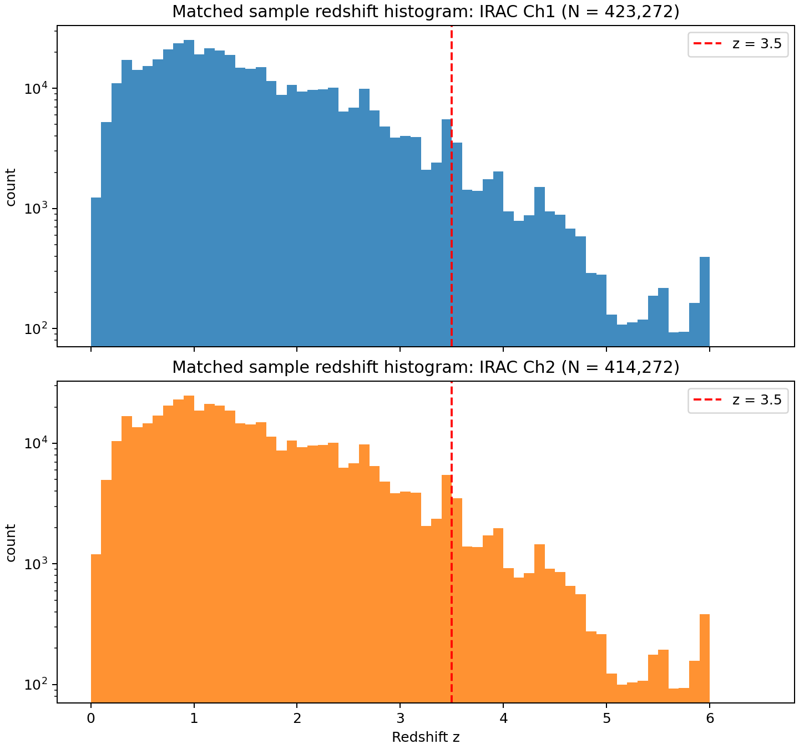
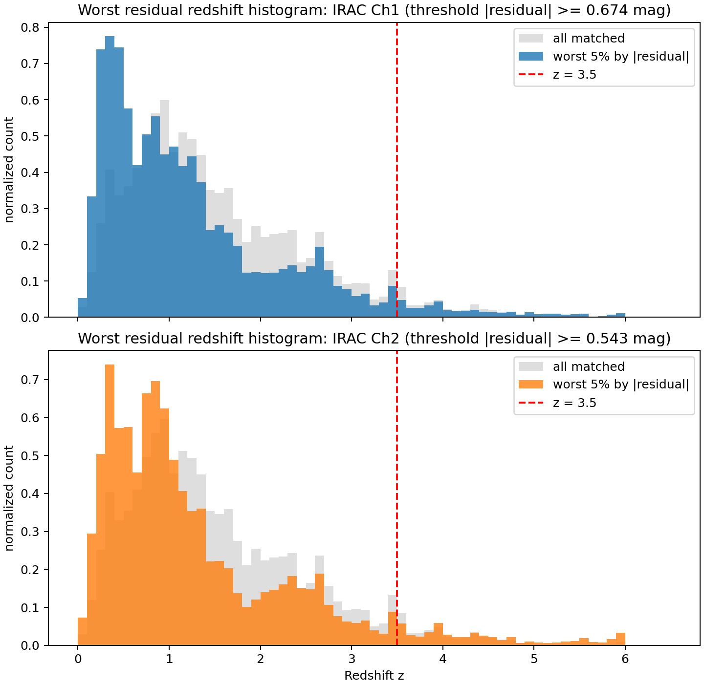
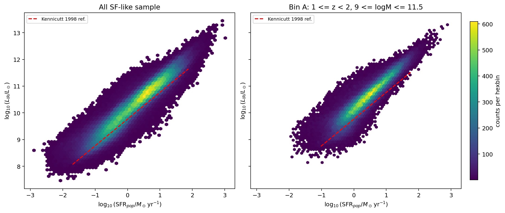
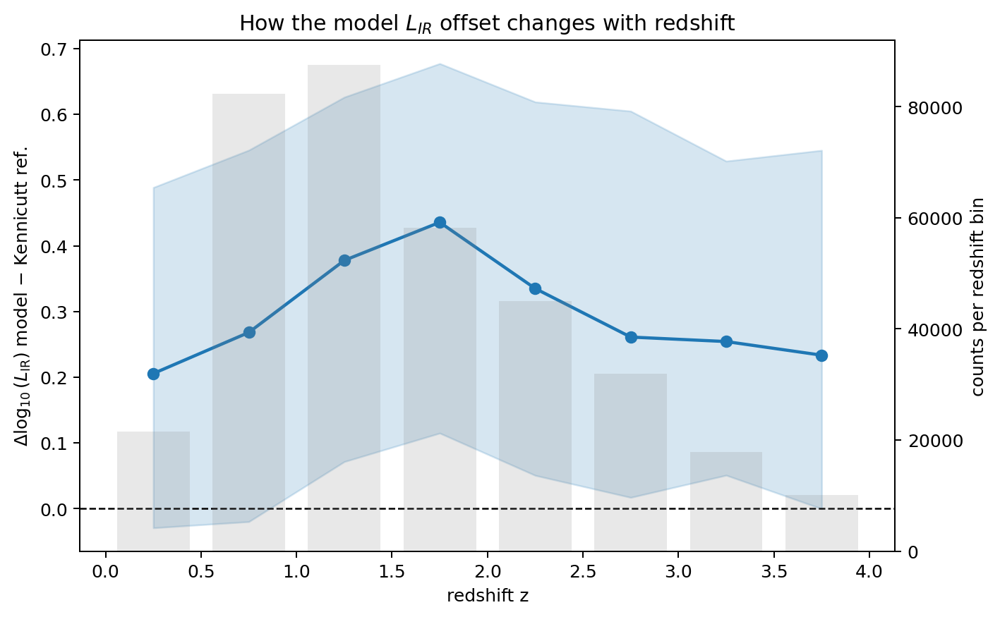
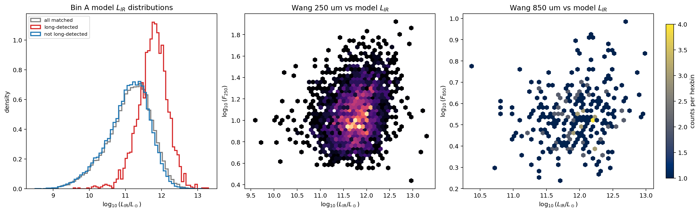
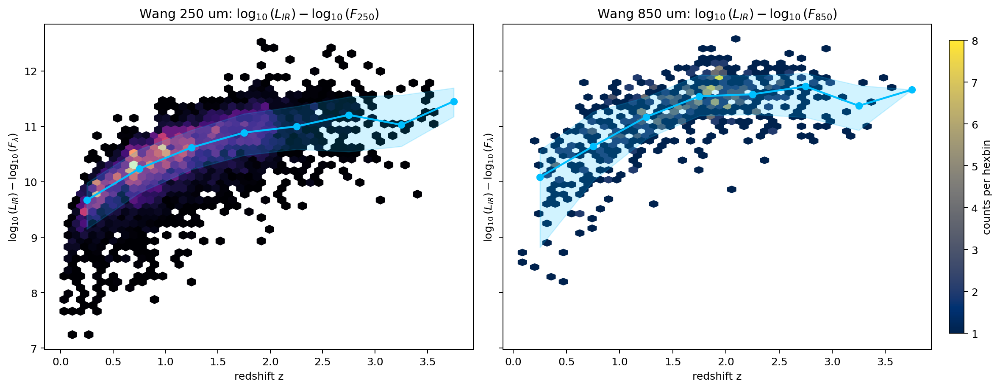

### pop-cosmos main goal:

## **Understanding Galaxy Evolution: Extending Pop-Cosmos to

Multi-wavelength Validation: FIR, Radio, and X-ray Cross
checks**

The study of galaxy evolution- how galaxies change over time, their relationship to each
other and other phenomena such as active galactic nuclei, and how various observed scaling
relations emerge- is central to modern astrophysics. This work depends on studying large
samples of galaxies at a variety of wavelengths using a range of statistical, physical and
other techniques. Recently deployed telescopes such as Euclid and the Rubin-LSST will
produce catalogues of billions of galaxies, for which traditional parametric models will not
work. To address this problem we have developed the pop-cosmos framework to model the
galaxy population using a combination of physical models, machine learning methods and
traditional statistics. This Masters project will validate and extend the pop-cosmos galaxy
population synthesis model by comparing its predictions to observational data at wavelengths
beyond its current optical/near-IR training range (0.3-5 µm). Students will leverage existing
multi-wavelength survey data from X-COSMOS, Herschel, and radio observations to test
model consistency across different emission mechanisms. Key tasks include comparing pop
cosmos star formation rate predictions with direct FIR/submm measurements, validating AGN
classifications using X-ray and radio flux cross-checks, and testing the radio-FIR relation
for non-AGN sources. The project will also involve extending the pop-cosmos framework
by running additional Flexible Stellar Population Synthesis (FSPS) calculations to generate
predictions at 24 microns and other far-infrared bands for direct comparison with MIPS,
Herschel, and ALMA data, and providing predictions for future projects such as the NASA
PRIMA mission. This work will provide crucial independent validation of the model‘s physical
assumptions while exploring its potential for multi-wavelength applications in galaxy evolution
studies.

## Task 1: Quantitative MS comparison to Speagle+2014

Method implemented in notebook:

- Speagle relation:
  - `log10 SFR(M*, t) = (0.84 - 0.026 t) log10 M* - (6.51 - 0.11 t)`
  - `t` is Universe age in Gyr (Giga year, 1 Billion)
  - Gives us the expected SFR for a galaxy given mass at a given cosmic time.
- Comparison sample:
  - finite values only
  - `log10sSFR_selected > -11`
  - `8.5 <= log10M_selected <= 11.5`
  - `0 <= z < 4`
- Residual used: If its 0, pop cosmos matches Speagle and +/- means pop cosmos predicts higher/lower SFR respectively
  - `Delta_MS = log10SFR_popcosmos - log10SFR_speagle`

Seeded run summary (`np.random.seed(7)`, `torch.manual_seed(7)`):

- Overall SF sample size: `N = 2155`
- Median `Delta_MS = -0.531 dex (dex is log10, so 10x so -0.53 is about 3x smaller)`
- Robust scatter `~ 0.460 dex`
- 16-84 half-width `~ 0.439 dex`

Per-redshift bins from notebook table:

- `[0.0, 0.5)`: `N=127`, median `Delta_MS=-0.682`, slope fit `1.018`, Speagle slope `0.596`
- `[0.5, 1.0)`: `N=547`, median `Delta_MS=-0.737`, slope fit `0.838`, Speagle slope `0.664`
- `[1.0, 2.0)`: `N=1023`, median `Delta_MS=-0.531`, slope fit `0.775`, Speagle slope `0.721`
- `[2.0, 3.0)`: `N=375`, median `Delta_MS=-0.283`, slope fit `0.720`, Speagle slope `0.769`
- `[3.0, 4.0)`: `N=83`, median `Delta_MS=-0.194`, slope fit `0.821`, Speagle slope `0.789`

Interpretation for discussion:

- Trend with mass and redshift is consistent with main seq behavior.
- Compared to Speagle’s expected SFR values, pop-cosmos sample gives lower SFR overall. The difference is biggest at low redshift, and it becomes smaller by around redshift 3.”.

## Task 2: Starburst definition applied to plot

Method implemented in notebook:

- Start bin: `1.0 <= z < 2.0`
- Starburst cut: `Delta_MS >= 0.6 dex` (relative to Speagle baseline)
- Plot added: non-starbursts (gray), starbursts (red), MS line, and `+0.6 dex` threshold line.

Measured how far each galaxy is above normal main seq line
`Delta_MS = log10SFR_galaxy - log10SFR_MS`

decided its starburst is >= 0.6dex (~4x greater)

run summary:

- In `1.0 <= z < 2.0`, `9 <= log10M <= 11.5`:

  - `N=791`, starbursts `N=5` (`0.63%` by number)
  - starburst SFR share `6.71%`

Interpretation for discussion:

* Starbursts are a **small fraction by number** (about **0.6%** in my run).
* But they still contribute a noticeable amount to total star formation (about **6–7%** SFR share in that bin).

## Task 3: What SFR means in each source

### pop-cosmos (Alsing+2024 / Thorp+2025)

- SFH is 7-bin piecewise-constant.
- First two bins fixed at `0-30 Myr` and `30-100 Myr`.
- Free SFH parameters are adjacent-bin SFR ratios `Delta log10(SFR)_k`.
- SFR definition (Thorp+2025 Appendix C):
  - `SFR/M_form = (M_form,1/M_form + M_form,2/M_form) / 0.1 Gyr`
  - i.e. SFR averaged over the latest 100 Myr.
- In this notebook:
  - `log10SFR_selected` = this 100 Myr-averaged absolute SFR in `Msun/yr`.
  - `log10sSFR_selected` is corrected to use mass remaining (`M_remain`) not mass formed.

### Speagle et al. (2014)

- Empirical, homogenized literature MS fit:
  - `log10 SFR(M*, t) = (0.84 - 0.026 t) log10 M* - (6.51 - 0.11 t)`.
- Not tied to one SPS model and not specifically the same 100 Myr SFH-bin definition.
- Reported intrinsic MS width is about `0.2 dex` after deconvolution.

### COSMOS2020 catalog SFR parameters (Weaver+2022 release docs)

- LePhare/BC03 columns at `zPDF`:
  - `lp_SFR_med`, `lp_SFR_best` (plus confidence limits)
  - based on BC03 templates, Chabrier IMF, BC03 tau+delayed SFHs.
- EAZY/FSPS columns:
  - `ez_sfr` (and percentiles)
- Important note in release docs:
  - LePhare SFR/sSFR are computed without IR, so uncertainties can be large.

## Feb 24, 2026 meeting follow-up

Notes from supervisor and actions:

Slope notes:

    At each redshift bin we fit`log10(SFR) = a log10(M*) + c`
    `slope_fit` = measured a from pop cosmos data in that bin
    `slope_speagle` = expected a from Speagle at that bin's median redsfhit/time

    So if slope fit is close to speagle they match well.

### 1) Add visual Speagle comparison plot (not only summary numbers)

Currently:

- have quantitative comparison numbers from Task 1:
- `N = 2155`
- median `Delta_MS = -0.531 dex`

to add:

- Make a direct visual plot in the same style as the existing `log10(SFR)` vs `log10(M*)` plot, but with Speagle as reference.
- Recommended figure setup:
  - keep pop-cosmos points/background as before
  - overplot Speagle MS as one or more lines (at representative redshifts, or in the selected redshift bin)
  - optionally add `pop-cosmos - Speagle` residual coloring for quick visual offset check

Goal:

- Easy side-by-side visual comparison with the previous MS plot, not just table/stat outputs.
- Added a new Task 1 visual cell in `catalogue_generation.ipynb`:

  - `Task 1 visual: pop-cosmos vs Speagle in 1 <= z < 2`
  - Uses the same `log10(SFR)` vs `log10(M*)` plane, with:
    - pop-cosmos density (hexbin)
    - Speagle MS line at median redshift of the bin
    - pop-cosmos best-fit line for direct visual comparison

explanation:

- We now have a picture where the old galaxy cloud and the Speagle “expected trend line” are in the same graph.
- This makes it easy to see by eye whether our galaxies mostly sit above, below, or on the reference line.
- In short: this is the visual version of the `Delta_MS` numbers.

### 2) Starburst test with larger mock sample

Issue in current run:

- In `1 <= z < 2` and `9 <= log10M <= 11.5`, only `5` starbursts were found.
- This is too small for stable tail/statistical interpretation.

What to add:

- Increase generated sample size (for example 5x to 10x more than 10,000 base samples).
- Re-run starburst classification (`Delta_MS >= 0.6`) and update:
  - starburst number fraction
  - starburst contribution to SFR
  - optional z~2 high-mass check

Goal:

- Improve tail statistics and reduce noise from small-number counts.

Status (implemented in notebook):

- Added a larger-sample rerun cell in `catalogue_generation.ipynb`:
  - `Task 2 rerun with larger sample size`
  - Runs starburst summary at `n_samples = 10,000`, `50,000`, and `100,000` with the same cuts/definition.

Latest rerun outputs:

- `10,000` samples:
  - `N(1<=z<2)=791`, `N_SB=5`, starburst fraction `0.632%`, starburst SFR share `6.710%`
  - `N(1.5<=z<2.5, M>=10)=126`, `N_SB=2`, fraction `1.587%`, SFR share `26.862%`
- `50,000` samples:
  - `N(1<=z<2)=3844`, `N_SB=12`, starburst fraction `0.312%`, starburst SFR share `6.041%`
  - `N(1.5<=z<2.5, M>=10)=632`, `N_SB=4`, fraction `0.633%`, SFR share `13.829%`
- `100,000` samples:
  - `N(1<=z<2)=7686`, `N_SB=20`, starburst fraction `0.260%`, starburst SFR share `7.280%`
  - `N(1.5<=z<2.5, M>=10)=1303`, `N_SB=9`, fraction `0.691%`, SFR share `12.821% (look at d.p accuracy)`

Quick read:

- Larger sample improved tail stability and reduced small-number noise, especially in the z~2 high-mass slice.

Brief explanation:

- With only a few starburst galaxies, percentages can jump around a lot.
- Increasing sample size gives us more rare objects in the tail, so the final percentages are more trustworthy.
- Here, the starburst counts increased from `5` (10k) to `20` (100k), and the SFR-share estimates became less noisy.

Matches literature ?

 **yes.., mostly consistent on SFR share; lower on number fraction**.

Source:

- arXiv: https://arxiv.org/abs/1108.0933

latest results:

- `(1 <= z < 2)`: starburst fraction `~sim 0.26%-0.63%`, SFR share `~6%-7%`
- 1.5 <= z < 2.5  fraction: ~0.63%-1.59%, SFR share ~13%-27%
  (100k run: 0.69%, 12.8%)

Literature target (Rodighiero+2011 at z~2, mass-selected SF sample:

- number fraction ~2%
- SFR density share <~ 10%

So:

- **SFR share:** at 100k value (~12.8% in the z~2 high-mass slice) is close-ish, slightly high.
- **number fraction:** at value (~0.7%) is lower than 2%

### Why not exact?

setup differs from that paper in several ways:

- different parent sample/selection (`Ch1<26`, pop-cosmos mock, spitzer/irac channel 1 ~3.6 micron near-IR on brighter than mag 26 galaxies in the band)
- different MS reference (Speagle baseline)
- your extra SF cuts and mass/redshift cuts are not exactly their selection pipeline
- finite-sample tail noise still matters, even at 100k

If we want a closer comparison, next step is: replicate their selection as closely as possible (their z range, mass completeness, SF selection, and MS definition), then recompute.

#### 3) What did Rodighiero+2011 do?

- Used **Herschel/PACS** data + optical/near-IR data in **COSMOS + GOODS-South**.
- Focused on **z = 1.5 to 2.5** (cosmic peak of star formation).
- Looked at **mass-selected star-forming galaxies**.
- Defined starbursts as galaxies with SFR **>4x above MS** (equivalent to `Delta_MS >= 0.6 dex`).
- Reported ``~2%`` by number and about ``~10%`` of SFR density at ``z~2``.

#### 4) Why our setup is not exactly the same (main differences)

- **Sample definition**:
  - Ours: pop-cosmos mock with `Ch1 < 26`
  - Paper: observed PACS-based sample in COSMOS/GOODS-S
- **MS reference**:
  - Ours: offset computed against **Speagle** relation (external baseline)

$$
\Delta MS = \log_{10}(\mathrm{SFR}_{\text{your galaxy}}) \;-\; \log_{10}(\mathrm{SFR}_{\text{Speagle}}(M, z))
$$

- Paper: MS defined from their own z~2 observed SFR-M* distribution
- **Cuts**:
  - Ours: global pre-cuts (`log10sSFR > -11`, `8.5<=logM<=11.5`, `0<=z<4`) + Task 2 bin cuts
  - Paper: their own star-forming/mass-complete cuts at z~2
- **SFR estimator origin**:
  - Ours: pop-cosmos model-derived SFR
  - Paper: observational SFR workflow tied to Herschel/PACS data

### 3) Open follow-up: wavelength dependence and external catalogs

Question to investigate:

- Are starburst conclusions changing because of wavelength coverage / selection?
- Need to trace what wavelength information the current SFR inference is sensitive to, and compare with longer-wavelength-selected catalogs.

where to go ?:

- Compare against longer-wavelength datasets (for example HERMES, H-ATLAS) after applying cuts to match pop-cosmos selection as closely as possible.
- Start with matched redshift and mass cuts, then compare starburst fraction and SFR contribution.

Brief motivation.

- Different telescopes see different parts of galaxy light.
- Dust can hide star formation in optical data, but infrared/sub-mm can reveal it.
- So we should check whether our starburst conclusion changes when we use catalogs that are more sensitive to dusty star-forming galaxies.

Data needs:

- Download external catalogs and prepare matched subsamples.
- If local files are not already available, provide/confirm data access location and preferred catalog versions.

#### Longer-wavelength expansion (new: where to get data + comparison plan)

Core equations for the comparison (use same definitions across datasets):

$$
\Delta_{\mathrm{MS}} = \log_{10}\!\big(\mathrm{SFR}_{\mathrm{gal}}\big) - \log_{10}\!\big(\mathrm{SFR}_{\mathrm{MS}}(M_\star,z)\big)
$$

$$
\text{Starburst if } \Delta_{\mathrm{MS}} \ge 0.6
$$

$$
f_{\mathrm{SB}}^{N} = \frac{N(\Delta_{\mathrm{MS}} \ge 0.6)}{N_{\mathrm{SF}}}
$$

$$
f_{\mathrm{SB}}^{\mathrm{SFR}} = \frac{\sum_{\Delta_{\mathrm{MS}} \ge 0.6}\mathrm{SFR}_i}{\sum_{\mathrm{SF}}\mathrm{SFR}_i}
$$

Optional IR conversion check (if catalogs provide total IR luminosity):

$$
\mathrm{SFR}_{\mathrm{IR}} \approx 10^{-10}\,L_{\mathrm{IR}} \quad (\text{in } M_\odot\,\mathrm{yr}^{-1} \text{ for } L_{\mathrm{IR}} \text{ in } L_\odot,\ \text{IMF-dependent})
$$

Plain-language meaning of the above:

- **Distance from the main sequence**

  $$
  \Delta_{\mathrm{MS}}
  $$

  measures “distance from the normal star‑forming trend.”
- **Starburst threshold**

  $$
  \Delta_{\mathrm{MS}} \ge 0.6
  $$

  means roughly

  $$
  \sim 4\times
  $$

  above that trend (starburst region).
- **Starburst fraction by number**

  $$
  f_{\mathrm{SB}}^{N}
  $$

  = “Out of all star‑forming galaxies, what percent are starbursts?”
- **Starburst fraction by SFR contribution**

  $$
  f_{\mathrm{SB}}^{\mathrm{SFR}}
  $$

  = “Out of total star formation, what percent is produced by starbursts?”

---

### Papers and likely data access points

1) **pop-cosmos: Star formation over 12 Gyr...**
   Link: https://arxiv.org/pdf/2509.20430
   Likely data path (pop-cosmos public releases):

- Galaxy posterior products: https://zenodo.org/records/17426655
- Mock catalogs: https://zenodo.org/records/15622325
- Code/tools: https://github.com/Cosmo-Pop

2) **ALPINE-ALMA [CII] survey: nature/LF/SFH of dusty galaxies up to z~6**
   Link: https://www.aanda.org/articles/aa/full_html/2020/11/aa38487-20/aa38487-20.html
   Useful catalog/data entry points:

- ALPINE products portal: https://cesam.lam.fr/a2c2s/
- ALPINE data-processing/catalog paper indicates CDS catalog access:
  http://cdsarc.u-strasbg.fr/viz-bin/cat/J/A+A/643/A2

3) **Ex-MORA survey (5 sigma source catalog and redshift distribution)**
   Link: https://arxiv.org/abs/2408.14546
   Current status:

- arXiv comment notes the fully reduced mosaic will be shared upon publication.
- For now, use source tables in paper/supplement and track publication repository link when posted.

---

### Short relevant notes from the 3 papers (simple terms)

1) **pop-cosmos: Star formation over 12 Gyr (arXiv:2509.20430)**

- Uses a deep IR-selected COSMOS sample and a generative SPS model.
- Reports SFRD peaking near

  $$
  z \approx 1.3
  $$
- Shows SF/Q classification can shift depending on whether you use

  $$
  \mathrm{sSFR}
  $$

  cuts or color cuts.
- Relevance for us:

  - solid pop-cosmos baseline for SFR/starburst comparisons.

2) **ALPINE continuum paper (A&A 2020, aa38487-20)**

- Characterizes 56 ALMA Band-7 serendipitous continuum sources in COSMOS/ECDFS.
- Derives IR luminosity functions and SFRD up to

  $$
  z \sim 6
  $$
- Finds dusty-obscured SF remains important at high redshift; UV/optical-only estimates can be lower.
- Reports a meaningful contribution from optically/near-IR dark sources at high

  $$
  z
  $$

  (e.g. contribution to high-z SFRD discussed in paper).
- Relevance for us:

  - direct long-wavelength benchmark for how much SF can be missed by optical/NIR selection.

3) **Ex-MORA (arXiv:2408.14546)**

- 2 mm ALMA blank-field survey in COSMOS-Web targeting dusty high-z systems.
- Reports a high-redshift-heavy sample with median around

  $$
  z \sim 3.6
  $$

  and many sources at

  $$
  z > 3
  $$
- Shows rest-optical methods miss a substantial fraction of dusty high-z galaxies.
- Relevance for us:

  - strong motivation to test starburst fractions under longer-wavelength selection.

---

### Practical methodology to compare with pop-cosmos

Step 1: Build a harmonized sample definition

- Match redshift bins first (for example

  $$
  1.5 \le z < 2.5
  $$

  and higher-z bins if needed).
- Apply a common mass floor where all datasets are reasonably complete.
- Keep a consistent star-forming selection rule across datasets.

Step 2: Harmonize SFR/Mass conventions

- Confirm Intial mass Function (IMF, implied dist of stellar masses when stars form) assumptions and convert if needed (Chabrier/Kroupa/Salpeter differences).
- Align stellar mass and SFR units/scales before computing offsets.
- Use one MS baseline consistently (e.g., Speagle or dataset-native MS), and report which was used.

Step 3: Compute the same summary metrics in each dataset

$$
f_{\mathrm{SB}}^{N} \quad \text{and} \quad f_{\mathrm{SB}}^{\mathrm{SFR}}
$$

- Median/dispersion of
  $$
  \Delta_{\mathrm{MS}}
  $$
- Optional: split by mass bins to check mass dependence of starburst incidence.

Step 4: Report wavelength-sensitive differences explicitly

- Compare optical/NIR-selected versus IR/sub-mm-selected samples at matched cuts.
- Flag where dusty systems appear in IR/sub-mm but are weak/missed in optical selections.

---

## First implemented comparison (pop-cosmos vs Wang 2024)

### Some motivation

Wang gives deblended far-IR/sub-mm photometry in COSMOS (24–850 µm).

* longer wavelengths are sensitive to dusty star formation.
* optical/NIR can miss dusty systems.
* we wanted to test if starburst fractions/SFR share change when looking at long-λ-detected subsamples.

So Wang is our first “longer-wavelength lens” on the same COSMOS population.

### Files used

- pop-cosmos:
  - `catalog data/real pop-cosmos data/mcmc_summaries.h5.gz`
  - `catalog data/real pop-cosmos data/README_v2_2_0.txt`
- Wang 2024:
  - `catalog data/wang/master.dat.gz`
  - `catalog data/wang/ReadMe.txt`

### Script walkthrough

- The script reads two catalogs:

  - pop-cosmos posterior summaries
  - Wang long-wavelength deblended catalog
- It keeps one representative value per pop-cosmos galaxy (median posterior).
- It matches galaxies between the two catalogs by shared COSMOS ID.
- It marks whether each matched galaxy is detected at long wavelengths (SPIRE/SCUBA) using SNR.
- It computes

  $$
  \Delta_{\mathrm{MS}} = \log_{10}\mathrm{SFR}_{\mathrm{pop}} - \log_{10}\mathrm{SFR}_{\mathrm{Speagle}}(M_\star,z)
  $$

  and flags starbursts with

  $$
  \Delta_{\mathrm{MS}} \ge 0.6.
  $$
- It then reports starburst fractions for:

  - all matched galaxies in each bin
  - long-lambda detected subset
  - not-long-lambdadetected subset

### run notes

Method (first pass):

1. Decompress and load pop-cosmos summaries.
2. Use median posterior values (50th percentile) for:
   - $$
     \log_{10}M_\star,\ \log_{10}\mathrm{SFR},\ \log_{10}\mathrm{sSFR},\ z
     $$
3. Load Wang master catalog via CDS schema from `ReadMe.txt`.
4. Join on COSMOS ID:
   - pop-cosmos `index_farmer` ↔ Wang `ID`
5. Define long-wavelength detection flag:
   - SPIRE/SCUBA detected if any of

     $$
     250,350,500,850\,\mu\mathrm{m}
     $$

     has (singal to noise ratio = F_lambda/sigma_lamba)
     meaning measured flux density at given wavelenght/ uncertainty on that flux
     3 => flux is three times greater than noise

     $$
     \mathrm{SNR}\ge 3
     $$

     .
6. Compute:
   - $$
     \Delta_{\mathrm{MS}} = \log_{10}\mathrm{SFR}_{\mathrm{pop}} - \log_{10}\mathrm{SFR}_{\mathrm{Speagle}}(M_\star,z)
     $$
   - starburst if
     $$
     \Delta_{\mathrm{MS}}\ge 0.6
     $$
   - fractions in the same bins used previously.

### First-pass results

What is happening:

So all matched is all galaxies in both catalog after cuts,

long_detect is only matched galaxies with the Wang long-lamba detection and not long is its compliment

So we do not recompute SFR from wang yet, we use pop cosmos SFR for all matched galaxies. wang is just used as a tag for the 250-800um or not.

using external baseline speagle that is strict +0.6 dex and script is using median posterior values per galaxy, so extreme tails are being

Data linkage:

- pop-cosmos rows (valid COSMOS IDs): `429,669`
- Wang rows used (positive COSMOS IDs): `128,387`
- Matched rows (inner join on ID): `114,048`
- Long-detected fraction (SPIRE/SCUBA, SNR>=3): `5.65%`

Bin A (`1 <= z < 2`, `9 <= log10M <= 11.5`):

- All matched: `N=37,149`, `N_SB=8`, starburst fraction `0.0215%`, SFR share `0.2628%`
- Long-detected: `N=2,673`, `N_SB=2`, starburst fraction `0.0748%`, SFR share `0.2761%`
- Not long-detected: `N=34,476`, `N_SB=6`, starburst fraction `0.0174%`, SFR share `0.2596%`

Bin B (`1.5 <= z < 2.5`, `log10M >= 10`):

- All matched: `N=15,807`, `N_SB=3`, starburst fraction `0.0190%`, SFR share `0.1695%`
- Long-detected: `N=1,494`, `N_SB=0`, starburst fraction `0.0000%`, SFR share `0.0000%`
- Not long-detected: `N=14,313`, `N_SB=3`, starburst fraction `0.0210%`, SFR share `0.2057%`

### Comparison to previous findings ?

Previous pop-cosmos mock (my 100k run)

* **1<=z<2**: starburst SFR share **7.28%(Fraction: 0.26%)**
* **1.5<=z<2.5, M>=10**: starburst SFR share **12.82%(Fraction:0.691%)**

These were in the ballpark of the expected literature range

### New pop-cosmos × Wang matched real-data run

From the CSV:

* **1<=z<2** all matched: starburst SFR share **0.2628%**
* **1.5<=z<2.5, M>=10** all matched: **0.1695%**
* long-λ detected subsets are also very low.

So Wang-matched run is **much lower** than your earlier mock result and lower than the expected 8–14% figure.

### Interpretation

- Under current Speagle-based

  $$
  \Delta_{\mathrm{MS}}
  $$

  settings, starburst fractions are extremely low in this matched real-data run.
- This is prob a calibration/definition mismatch signal (selection + MS baseline + SFR conventions), not a final physics conclusion yet.
- Next step: test alternative MS baseline choices and IMF/SFR harmonization before drawing physical conclusions.

We likely got very low starburst/SFR-share numbers because this was a much stricter and different comparison than before, not because starbursts disappear physically.

Ideas ?

* We changed sample: earlier was a mock-generated pop-cosmos sample; now it is a real-data ID-matched subset with Wang, which can remove part of the extreme high-SFR tail.
* We used an external baseline (Speagle)
  If our sample sits below Speagle normalization, very few galaxies pass the starburst cut .**Δ**MS≥**0.6.**
* SFR definitions are not identical across datasets/papers (model-based 100 Myr average vs IR-based observational SFRs), so offsets are expected.
* Detection/matching choices (e.g., SNR threshold, matched IDs only, quality cuts) can strongly reduce rare starbursts.
* Using median posterior values also suppresses extremes.

## Plain-language clarifications

### 1) What does `all_matched, N = 37,149` mean?

- `all_matched` means galaxies that are in **both** pop-cosmos and Wang after matching by ID.
- Then we apply the bin cuts (`1 <= z < 2`, `9 <= log10M <= 11.5`, and SF quality cuts).
- `N = 37,149` is the number of galaxies left in that bin after those steps.

### 2) Why is Wang smaller than pop-cosmos?

- pop-cosmos has more total objects (`429,669` valid IDs).
- Wang is a smaller long-wavelength-focused catalog (`128,387` positive IDs).
- Matched overlap is `114,048`.

Match fractions:

$$
\frac{114048}{429669} \approx 26.5\%
$$

of pop-cosmos has a Wang match, and

$$
\frac{114048}{128387} \approx 88.8\%
$$

of Wang has a pop-cosmos match.

### 3) What are we comparing in this first pass?

Starburst classification is from pop-cosmos + Speagle:

$$
\Delta_{\mathrm{MS}} = \log_{10}(\mathrm{SFR}_{\mathrm{pop}}) - \log_{10}(\mathrm{SFR}_{\mathrm{Speagle}}(M_\star,z))
$$

$$
\text{starburst if } \Delta_{\mathrm{MS}} \ge 0.6
$$

Wang is used as a **label** only:

- long-wavelength detected (`SNR >= 3` in any of `250,350,500,850` um)
- not long-wavelength detected

Important: we did **not** recalculate SFR from Wang IR photometry in this run.

### 4) How incidence is tested

We recompute starburst fraction in each subgroup:

$$
f_{\mathrm{SB}}^{N} = \frac{N(\Delta_{\mathrm{MS}} \ge 0.6)}{N_{\mathrm{group}}}
$$

Bin A results:

$$
f_{\mathrm{SB}}^{N}(\text{all matched}) = \frac{8}{37149} = 0.0215\%
$$

$$
f_{\mathrm{SB}}^{N}(\text{long-detected}) = \frac{2}{2673} = 0.0748\%
$$

$$
f_{\mathrm{SB}}^{N}(\text{not long-detected}) = \frac{6}{34476} = 0.0174\%
$$

So yes, we do recalculate the fraction in the same bin; `all_matched` is the baseline.

### 5) Why are matched-sample rates so low vs earlier mock runs?

- Different parent sample (real matched subset vs mock generation).
- External MS baseline (Speagle) can shift offsets lower.
- Median posterior values reduce extreme-tail objects.
- Matching and cuts can remove rare high-SFR galaxies.

### 6) What this means right now

- Similar all-vs-long-detected values do **not** yet prove success or failure on dusty galaxies.
- It is a first-pass consistency check; final dust validation needs IR-based SFR comparison on the same matched galaxies.

## Week of Mar 15, 2026: Light-work planning notes

### 1) How I would test pop-cosmos at extended wavelengths

What I expect physically:

- Long wavelengths (far-IR/sub-mm) are more sensitive to dusty star formation.
- So if dust is important, some galaxies that look normal in optical/NIR can move upward in SFR when I use IR-based SFR, and a subset can cross into the starburst region.

What I want to test:

$$
\Delta_{\mathrm{MS}} = \log_{10}(\mathrm{SFR}) - \log_{10}(\mathrm{SFR}_{\mathrm{MS}}(M_\star,z))
$$

and whether starburst labels change when SFR comes from longer wavelengths.

Practical steps:

1. Build one matched per-source table with: `ID, z, log10M, log10SFR_pop, DeltaMS_pop, SNR250/350/500/850, long_detect`.
2. Add an IR-based SFR estimate for the same sources (from external IR-based product/model; Wang master has fluxes and errors, not direct SFR in the subset I used).
3. Recompute:
   - `DeltaMS_IR`
   - starburst flags from pop and IR versions.
4. Make a transition matrix:
   - non-SB (pop) -> SB (IR)
   - SB (pop) -> non-SB (IR)
5. Report changes in:
   - number fraction of starbursts
   - SFR share from starbursts
     in the same bins I already use (Bin A and Bin B).

What success/failure would look like:

- If many sources go non-SB -> SB with IR SFR, optical/NIR-only likely misses dusty bursts.
- If labels are stable, pop-cosmos is more robust than I expected to dust-obscuration effects.

Simple action I can do quickly next:

- Run a short sensitivity test before full IR-SFR modeling:
  - compare `DeltaMS_pop` distributions across long-detected vs not-long-detected and across SNR thresholds (`>=2.5, >=3, >=5`).
  - this is not the final answer, but it tells me whether the long-lambda subset is already systematically shifted.

### 2) Speagle vs quenched sources (important caveat)

My understanding:

- Speagle MS relation is a star-forming main-sequence baseline.
- It is not designed as a quenched-galaxy model.

Implication for my analysis:

- If quenched galaxies enter the sample, they naturally get very negative `DeltaMS`, which can dilute starburst fractions.
- So I should keep a clear star-forming pre-selection before using Speagle offsets.

What I should state clearly in slides/notes:

- Speagle is used as a reference for SF galaxies, not for quiescent population modeling.
- Any quenched contamination can bias absolute fractions downward.

### 3) Sigma clipping: where useful and where not

Useful:

- Sigma clipping is useful when fitting a baseline MS line/slope, to reduce outlier leverage.

Not useful (or risky):

- I should not sigma-clip when measuring starburst incidence itself, because starbursts are in the high-SFR tail I care about.

Practical rule I will follow:

- Clip only for baseline fitting.
- Do not clip for final starburst counts/shares.
- Report both clipped and unclipped baseline fits if needed for transparency.

### 4) Rodighiero+2011 optical/NIR-only comparison idea (useful?)

 useful as a test.

Why ?:

- Rodighiero-style starburst framing is what I used for thresholding.
- Repeating that style but with optical/NIR-only SFR (no IR boost) gives me a direct "what do I miss without long-lambda" estimate.

How I would do it:

1. Keep Rodighiero-like bin/cuts as close as possible (especially `1.5 <= z < 2.5`, high-mass slice).
2. Compute starburst fractions using optical/NIR-based SFR definitions.
3. Compare against the same matched sources with IR-informed SFR.
4. Quantify missed-burst fraction and SFR-share difference.

Expected outcome:

- I expect optical/NIR-only to miss at least part of dusty starburst activity, especially at higher mass and around z~2.

### 5) Recap of what I'm showing this week

- I now have the matched-catalog setup done.
- Next I will do an explicit label-transition test using IR-based SFR on the same sources.
- I will keep Speagle use limited to SF-selected samples, and only use sigma clipping for baseline fitting (not for starburst counting).
- I also plan a Rodighiero-style optical/NIR-only stress test to quantify what long-lambda adds.

## Week of Mar 24, 2026: follow-up work from supervisor meeting

### 1) Simpler direct SFR comparison

This week I switched to a simpler comparison idea:

- same matched galaxies
- compare the SFR values directly between methods
- do not go through the starburst threshold first

This makes sense, and it is easier to explain.

What I can compare directly right now:

- pop-cosmos vs COSMOS2020 LePhare SFR
- pop-cosmos vs COSMOS2020 EAZY SFR

Important caveat:

- the SFR methods are not identical, so I expect some systematic offset
- but if the offset is large and consistent, that is still a useful result

Main results from the new direct SFR table:

- Overall star-forming-like matched sample:

  - LePhare minus pop-cosmos median `Delta log10(SFR) = +0.224 dex`
  - this is about a factor `1.67` higher than pop-cosmos
  - EAZY minus pop-cosmos median `Delta log10(SFR) = +0.082 dex`
  - this is about a factor `1.21` higher than pop-cosmos
- Bin A (`1 <= z < 2`, `9 <= log10M <= 11.5`):

  - LePhare minus pop-cosmos median `+0.318 dex`
  - about a factor `2.08` higher
  - EAZY minus pop-cosmos median `+0.138 dex`
  - about a factor `1.37` higher
- Bin B (`1.5 <= z < 2.5`, `log10M >= 10`):

  - LePhare minus pop-cosmos median `+0.260 dex`
  - about a factor `1.82` higher
  - EAZY minus pop-cosmos median `+0.122 dex`
  - about a factor `1.32` higher

My reading of this:

- LePhare is systematically higher in SFR than pop-cosmos on the same matched galaxies.
- EAZY is also higher than pop-cosmos, but the offset is smaller.
- So the very low pop-cosmos starburst fractions are at least partly consistent with pop-cosmos sitting lower in SFR than the COSMOS2020 estimators.

### 2) Narrower redshift-bin MS comparison

The previous MS-plane comparison used a broad `1 <= z < 2` bin.

I now also looked at narrower bins:

- `1.0 <= z < 1.5`
- `1.5 <= z < 2.0`

Direct SFR offset results in the narrower bins:

- `1.0 <= z < 1.5`:

  - LePhare minus pop-cosmos median `+0.358 dex` (factor `2.28`)
  - EAZY minus pop-cosmos median `+0.170 dex` (factor `1.48`)
- `1.5 <= z < 2.0`:

  - LePhare minus pop-cosmos median `+0.256 dex` (factor `1.80`)
  - EAZY minus pop-cosmos median `+0.091 dex` (factor `1.23`)

What I take from that:

- the same ordering stays there even after narrowing the redshift bin:
  - LePhare highest
  - EAZY in the middle
  - pop-cosmos lowest
- the offset is a bit stronger in the lower half of Bin A (`1.0 <= z < 1.5`) than in the upper half (`1.5 <= z < 2.0`)
- so the earlier broad-bin pattern was not just caused by mixing too much redshift evolution together

### 3) Wang comparison: what I can and cannot do from the current file

Supervisor suggestion was to cross-match and compare SFR more directly.

For Wang, there is one important limitation:

- the local `master.dat` file I downloaded has long-wavelength fluxes
- it does **not** have a direct SFR column

So from the current Wang file, I cannot yet do a true:

- `SFR_Wang` vs `SFR_pop-cosmos`

comparison.

What I did instead as the closest local test:

- matched Wang to pop-cosmos by ID
- checked whether galaxies with brighter long-wavelength fluxes also have higher pop-cosmos SFR

Main Wang flux vs pop-cosmos SFR results in Bin A:

- `24 um`: `N_detect = 17,571`, median `log10SFR_pop = 1.18`, Spearman `rho = 0.53`
- `250 um`: `N_detect = 2,569`, median `log10SFR_pop = 1.43`, Spearman `rho = 0.19`
- `350 um`: `N_detect = 1,875`, median `log10SFR_pop = 1.45`, Spearman `rho = 0.16`
- `500 um`: `N_detect = 834`, median `log10SFR_pop = 1.45`, Spearman `rho = 0.11`
- `850 um`: `N_detect = 294`, median `log10SFR_pop = 1.57`, Spearman `rho = 0.14`

Also, for the long-detected split in Bin A:

- long-detected median `log10SFR_pop = 1.425`
- not-long-detected median `log10SFR_pop = 0.862`
- long-detected median `log10M_pop = 10.742`
- not-long-detected median `log10M_pop = 10.143`

My reading of this:

- the Wang long-wavelength detections are, on average, the higher-SFR and higher-mass pop-cosmos galaxies
- that is qualitatively sensible
- but this is still **not** the same as a direct Wang SFR comparison
- to do the real SFR-vs-SFR test with Wang, I still need an IR-based SFR estimate for the same matched sources

### 4) Spectroscopic redshift comparison: local status

I checked whether the currently downloaded local files actually contain a spectroscopic redshift field.

Result:

- `COSMOS2020 farmer.dat.gz`: no spec-like field found
- `pop-cosmos mcmc_summaries.h5` metadata: no spec-like field found

So with the files currently downloaded, I cannot yet run a direct local:

- pop-cosmos vs spec-z
- EAZY vs spec-z
- LePhare vs spec-z

comparison.

What I would do once I have the spec-z compilation / matching file:

$$
\Delta z = \frac{z_{est} - z_{spec}}{1 + z_{spec}}
$$

then report:

- median bias
- `sigma_MAD`
- outlier fraction

### 5) Mass / luminosity functions and `1 / V_max`

I only wrote this up as methodology for now.

Why I did not run a full `1 / V_max` mass function yet:

- I need a clear parent selection band and magnitude limit
- I need a consistent `z_max` calculation
- I need to think about completeness / masking

So for now my position is:

- it is a sensible next step
- but it should come after I lock down the comparison sample and selection definition more carefully

### 6) Short recap I can say out loud

- I simplified the comparison by looking at direct SFR offsets on the same matched galaxies.
- LePhare is typically higher in SFR than pop-cosmos, and EAZY is also higher but by less.
- The same ordering stays there in narrower redshift bins, so it is not just a broad-bin effect.
- Wang is useful right now as a long-wavelength flux check, but not yet a direct SFR-vs-SFR comparison because the file I have does not include SFR.
- For spectroscopic redshift benchmarking, I need the spec-z compilation file because it is not in the currently downloaded local Farmer/pop-cosmos files.

## Week of Mar 29, 2026: MIR / IRAC follow-up from Boris

### 1) What Boris loaded

Boris sent three useful files:

- `cosmos2020_mir_photometry.h5`
- `cosmos2020_fsps_subset.h5`
- `crossmatch_cosmos2020.py`

My read of them:

- `cosmos2020_mir_photometry.h5` is the main full-sample product
  - it has `429,669` galaxies, so it lines up with the pop-cosmos sample size
  - it contains predicted MIR quantities for:
    - `Ch1`
    - `Ch2`
    - `Ch3`
    - `Ch4`
    - `MIPS24`
- `cosmos2020_fsps_subset.h5` looks like a smaller `1000` galaxy sanity-check file
  - this seems to be there to compare the faster emulator-style predictions against direct FSPS outputs on a smaller subset
- `crossmatch_cosmos2020.py` is a utility script that joins Boris's MIR predictions to:
  - the COSMOS2020 Farmer catalog
  - the pop-cosmos `mcmc_summaries.h5`

So overall, this is definitely useful for the main project goal:

- testing pop-cosmos beyond the shorter-wavelength regime
- especially by checking how well the model does in the MIR before moving further out to FIR / radio / X-ray

### 2) What the script is doing

In simple terms, the script is doing three comparisons.

First:

- take Boris's predicted MIR magnitudes
- match them to the same objects in COSMOS2020
- compare prediction vs observed MIR photometry

Second:

- load the stored pop-cosmos model values for `Ch1` and `Ch2`
- compare those directly to the observed COSMOS2020 `IRAC_CH1` and `IRAC_CH2`

Third:

- print a few example objects to sanity-check the matching

The matching itself is simple:

- COSMOS2020 match is by `index_farmer == ID`
- pop-cosmos match is by row alignment / slice

That part makes sense and is efficient.

### 3) What bands are actually available

From the local COSMOS2020 `ReadMe`, the Farmer catalog does have:

- `IRAC_CH1`
- `IRAC_CH2`
- `IRAC_CH3`
- `IRAC_CH4`
- `SPLASH_CH1`
- `SPLASH_CH2`
- `SPLASH_CH3`
- `SPLASH_CH4`

So the professor's memory on the COSMOS2020 side checks out.

On the Boris HDF5 side, I found:

- `speculator` predictions for `Ch1`, `Ch2`, `Ch3`, `Ch4`, `MIPS24`
- `photulator` predictions for `Ch1`, `Ch2`
- stored pop-cosmos validation values for `Ch1`, `Ch2`

So right now:

- `Ch1` and `Ch2` are immediately usable
- `Ch3` and `Ch4` are available on Boris's side and in COSMOS2020, so they are worth testing
- `MIPS24` is present in the file structure, but current coverage is effectively zero, so I cannot use it yet from the current product

### 4) Quick evaluation: is this useful

Yes, definitely.

But I think the usefulness is different by band.

#### `Ch1` / `Ch2`

These are the strongest immediate checks.

Why:

- they have high coverage
- the residuals are small
- we can compare directly to observed COSMOS2020 fluxes now

I checked the local Farmer photometry against Boris's full MIR file.

For residuals, I used:

- `model_mag - observed_mag`

So:

- residual near `0` means good agreement
- positive residual means the model is a bit fainter than the data
- negative residual means the model is a bit brighter than the data

Stored pop-cosmos model vs observed IRAC:

- `Ch1`: `N = 423,272`, median residual `+0.020 mag`, MAD `0.084 mag`
- `Ch2`: `N = 414,272`, median residual `-0.012 mag`, MAD `0.041 mag`

That is good.

My simple read:

- pop-cosmos is modelling `Ch1` and `Ch2` pretty well overall
- the typical bias is very small
- the scatter is modest, especially in `Ch2`

This means I can now answer the original professor question:

- yes, I can load the model fluxes for `Ch1` / `Ch2`
- and yes, they seem good enough to use as a proper validation check

#### `Ch3` / `Ch4`

These are more interesting scientifically, because they go further into the MIR.

They are also less clean right now.

Coverage in Boris's full file:

- `Ch1`: `94.8%`
- `Ch2`: `80.9%`
- `Ch3`: `55.4%`
- `Ch4`: `22.3%`
- `MIPS24`: `0%`

So the file is already telling me that longer MIR coverage gets much patchier.

Comparing Boris's `speculator` predictions to observed COSMOS2020 IRAC:

- `IRAC_CH3`: `N = 150,712`, median residual `+0.507 mag`, MAD `0.889 mag`
- `IRAC_CH4`: `N = 55,394`, median residual `+0.866 mag`, MAD `1.037 mag`

Comparing to observed SPLASH instead:

- `SPLASH_CH3`: `N = 71,800`, median residual `-0.181 mag`, MAD `0.629 mag`
- `SPLASH_CH4`: `N = 5,442`, median residual `-0.703 mag`, MAD `0.740 mag`

My read:

- `Ch3` / `Ch4` are not yet nearly as tight as `Ch1` / `Ch2`
- the answer depends quite a lot on whether I compare to `IRAC_*` or `SPLASH_*`
- so these bands are useful, but I would treat them as exploratory for now, not as the cleanest headline result

### 5) What I think this means scientifically

For the overall project, I think this is a nice bridge step.

Why:

- `Ch1` / `Ch2` are close enough to the fitted regime that they let me check whether the modelling pipeline is behaving sensibly
- `Ch3` / `Ch4` start to push further out in wavelength, so they are more like a real extension test
- `MIPS24` would be even more interesting for dust-obscured star formation, but I do not have usable coverage for it yet

So my current view is:

- `Ch1` / `Ch2` = strong validation / sanity-check bands
- `Ch3` / `Ch4` = promising extension bands, but noisier and more sensitive to which observed product I use
- `MIPS24` = potentially very useful next target if Boris can synthesise it properly

This fits the bigger project story well:

- first show the method behaves properly in the near-to-mid IR
- then push further into bands that are more sensitive to dust-obscured emission
- then later compare to FIR / radio / X-ray products

### 6) Questions

- Is `Ch2` also in the original pop-cosmos stored model output, or is it only in the new synthetic MIR file?
- For `Ch3` / `Ch4`, which observed comparison should I trust more as the main reference:
  - `IRAC_*`
  - or `SPLASH_*`
- Are the `stored_mag_Ch1` / `stored_mag_Ch2` values straight from `mcmc_summaries`, or re-derived during the MIR synthesis step?
- Why is `MIPS24` coverage currently `0%` in the full MIR file:
  - wavelength coverage issue
  - emulator coverage issue
  - or just not populated yet
- Do we want the main validation plots in:
  - magnitudes
  - fluxes
  - or residuals normalized by photometric uncertainty

### 7) What next

I think there is a clean next step here.

Immediate next plot set:

- observed vs model `Ch1`
- observed vs model `Ch2`
- residual vs redshift
- residual vs stellar mass
- residual vs dust attenuation if available

Why:

- that would directly answer "how well has pop-cosmos modelled the IRAC bands?"
- and it is already supported by the current files

Then after that:

- do the same for `Ch3` / `Ch4`
- but treat them more as a first extension test, because the scatter is much larger

And finally:

- if Boris can populate `MIPS24`, that is probably the most interesting next MIR band for the main science goal, because it gets closer to dust-obscured star formation

### 8) Short version I can say out loud

- Boris's new files are definitely useful.
- They give me predicted MIR photometry matched to the pop-cosmos sample.
- `Ch1` and `Ch2` already look good: the model-observed residuals are small, so pop-cosmos seems to be modelling those bands reasonably well.
- `Ch3` and `Ch4` are available too, but they are much noisier, so I would treat them as an extension test rather than the cleanest validation result.
- `MIPS24` would be very useful for the obscured-star-formation side of the project, but the current file does not yet have usable coverage there.

### 9) Quick note: what MIR means

`MIR` = `mid-infrared`.

Very roughly, this means wavelengths of a few to a few tens of microns.

For this work, the main MIR bands I am looking at are:

- `IRAC Ch1`
- `IRAC Ch2`
- `IRAC Ch3`
- `IRAC Ch4`
- `MIPS24`

### 10) Quick reading of Boris's 7 figures

Important note:

- most of these figures are internal checks of the synthetic MIR pipeline
- so they are mostly asking "do Boris's fast predictions agree with stored model photometry / other fast predictions?"
- they are not all direct "model vs observed COSMOS2020" plots

#### Figure 1: `fig1_speculator_vs_stored.png`

What it shows:

- `Speculator` predicted `Ch1` / `Ch2` magnitudes compared against stored photometry values
- top panels: point clouds near the `1:1` line
- bottom panels: residual histograms

My read:

- this is a strong internal consistency check
- `Ch1` and `Ch2` agree very well overall
- offsets are small:
  - `Ch1` median about `-0.024 mag`
  - `Ch2` median about `-0.052 mag`
- so the synthetic `Speculator` outputs are reproducing the stored values closely

#### Figure 2: `fig2_residuals_vs_properties.png`

What it shows:

- residuals `Speculator - Stored` for `Ch1` and `Ch2`
- plotted against:
  - redshift
  - stellar mass
  - `dust2`
  - `lnfAGN`

My read:

- the residuals stay fairly close to `0` for most of the sample
- there are some trends, especially with stellar mass and at some redshifts
- but nothing here looks like a huge catastrophic failure
- so this suggests the internal MIR prediction is mostly stable, with some mild systematic structure

#### Figure 3: `fig3_coverage_map.png`

What it shows:

- where the model wavelength coverage overlaps the observed filter bands as redshift changes

My read:

- `Ch1` and `Ch2` are well covered over a broad redshift range
- `Ch3` is more limited
- `Ch4` is even more limited
- `MIPS24` is effectively not covered in the current setup

This is useful because it explains why:

- `Ch1` / `Ch2` look like the safest first validation bands
- `Ch3` / `Ch4` are patchier
- `MIPS24` is not ready yet

#### Figure 4: `fig4_color_magnitude.png`

What it shows:

- left: predicted `Ch1` magnitude distribution
- middle: `Ch1 - Ch2` color vs redshift
- right: IRAC color-color plane

My read:

- this is more of a sanity-check / population-view figure
- the predicted MIR photometry is not random; it forms structured color trends with redshift and mass
- the model produces a sensible-looking galaxy population in MIR color space

#### Figure 5: `fig5_speculator_vs_photulator.png`

What it shows:

- `Speculator` vs `Photulator` predictions for `Ch1` and `Ch2`
- with residuals vs redshift underneath

My read:

- these two fast prediction methods agree almost perfectly
- the points sit right on the `1:1` line
- residuals are extremely small

So this is basically saying:

- the two synthetic pipelines are internally consistent for `Ch1` / `Ch2`

#### Figure 6: `fig6_example_seds.png`

What it shows:

- a few example galaxy SEDs at different redshifts
- with the IRAC / MIPS filter curves drawn on top

My read:

- this is mainly a visual explanation figure
- it helps show where the MIR filters sit relative to the galaxy spectrum as redshift changes
- it also helps explain why some bands are easier to model than others, and why coverage gets worse at longer wavelengths

#### Figure 7: `fig7_photulator_vs_stored.png`

What it shows:

- `Photulator - Stored` residuals for `Ch1` and `Ch2` as a function of redshift

My read:

- overall offsets are still small:
  - `Ch1` median about `-0.026 mag`
  - `Ch2` median about `-0.058 mag`
- but this figure makes the redshift-dependent structure easier to see
- agreement is generally fine, but it looks less clean at the highest redshifts

So I would read this as:

- still good overall for `Ch1` / `Ch2`
- but there are some redshift-dependent systematics worth keeping in mind

### 11) My overall take on the figures

The main story from these figures is:

- `Ch1` / `Ch2` look strong internally
- the synthetic MIR machinery seems self-consistent
- `Ch3` / `Ch4` are more limited by coverage and likely harder to trust as clean headline bands
- `MIPS24` is clearly the missing next step

Also, these figures are mostly telling me:

- "is the synthetic MIR pipeline behaving sensibly?"

rather than:

- "does it match the real observed COSMOS2020 photometry?"

So I think the next best step is still:

- make a small set of direct observed-vs-model plots for `IRAC Ch1` and `Ch2`
- then extend to `Ch3` / `Ch4` carefully

### 12) Direct observed-vs-model IRAC check I made now

#### What I actually did

For the same matched pop-cosmos sample:

- took the stored pop-cosmos model magnitudes for `Ch1` / `Ch2` from Boris's MIR file
- took the observed `IRAC_CH1` / `IRAC_CH2` fluxes from COSMOS2020 Farmer
- converted the observed fluxes to AB magnitudes
- plotted observed vs model directly
- then plotted residuals against redshift

Here residual means:

- `model - observed`

So:

- positive residual = model is a bit fainter than the data
- negative residual = model is a bit brighter than the data

#### Main result

Overall summary:

- `Ch1`: `N = 423,272`, median residual `+0.020 mag`, MAD `0.084 mag`
- `Ch2`: `N = 414,272`, median residual `-0.012 mag`, MAD `0.041 mag`

My quick read:

- both bands look good overall
- `Ch2` is clearly tighter than `Ch1`
- the typical bias in both bands is small

#### What the observed-vs-model plots show

For both `Ch1` and `Ch2`:

- the dense cloud sits close to the `1:1` line
- so the model is tracking the real observed magnitudes pretty well

Difference between the two:

- `Ch1` has a broader scatter around the line
- `Ch2` is tighter and cleaner

So if I want the cleanest simple validation statement right now, it is probably:

- pop-cosmos does a decent job in both `IRAC Ch1` and `Ch2`
- and the agreement looks especially strong in `Ch2`

#### What the residual-vs-redshift plot shows

`Ch1`:

- mostly near zero through a lot of the redshift range
- small positive bump around roughly `z ~ 1 to 1.5`
- small negative dip around roughly `z ~ 2 to 4`
- then it starts to drift more at the very highest redshift end

`Ch2`:

- starts slightly negative at low `z`
- stays very close to zero from about `z ~ 1.5` to `z ~ 4.5`
- gets messy at the very highest redshift end, where there are fewer objects

So the simple overall message is:

- most of the redshift range looks stable
- the high-redshift tail is less reliable / noisier
- `Ch2` looks more stable than `Ch1`

#### Why this is different from Boris's figure set

Boris's script already did the direct comparison numerically.

But the figures he shared before were mostly:

- internal consistency checks
- model vs stored
- speculator vs photulator
- coverage / sanity plots

The new three plots are different because they are the cleaner direct answer to:

- "does the pop-cosmos model reproduce the observed `IRAC Ch1/Ch2` measurements?"

So I think these are better meeting figures.

#### Short version

- I now have the clean direct `observed vs model` plots for `IRAC Ch1` and `Ch2`.
- Both look good overall.
- `Ch2` is tighter than `Ch1`.
- Residuals stay close to zero across most of the redshift range.
- The highest-redshift tail is where things start to get noisier.

## March 31, 2026 add-on: how the recent pop-cosmos papers do mass / luminosity-function style calculations

Papers checked:

- `arXiv:2506.12122` - `pop-cosmos: Insights from generative modeling of a deep, infrared-selected galaxy population`
- `arXiv:2509.20430` - `pop-cosmos: Star formation over 12 Gyr from generative modelling of a deep infrared-selected galaxy catalogue`

### Quick answer

- These are **not** doing a classic per-galaxy `1/Vmax` estimate.
- In `1/Vmax`, each observed galaxy contributes `1 / Vmax,i`, where `Vmax,i` is the maximum comoving volume over which that galaxy could have entered the survey given the flux limit.
- In the pop-cosmos papers, the workflow is instead: apply a completeness cut, normalize to the COSMOS survey area / counts, and then use the generative model to histogram or integrate galaxy properties in redshift bins.

### Paper 1: `2506.12122`

- This paper mainly uses the **stellar mass function as a shape comparison / validation test** for the generative model.
- Their Figure 11 shows:
  - pop-cosmos stellar-mass histogram
  - histogram from galaxy-level COSMOS SED fits
  - Leja+2020 double-Schechter mass function
- Important detail:
  - the caption says the histograms are **normalized to integrate to 1** between the mass-completeness limit and the high-mass cut.
- They estimate the mass-completeness limit from the **turnover** of the pop-cosmos stellar-mass distribution as a function of redshift.
- So this is **not** an absolute `1/Vmax` number-density estimate. It is more a comparison of the **shape** of the mass distribution after completeness cuts.

### Paper 2: `2509.20430`

- For the cosmic SFR density they explicitly move away from luminosity-function style methods and instead **sum individual galaxy SFRs** in redshift bins.
- Their estimator is:

`Psi_b = (N f_b / Vco,b) * mean(SFR of sampled galaxies in bin b)`

where:

- `N` = total number of COSMOS galaxies passing the selection
- `f_b` = pop-cosmos predicted fraction of galaxies in redshift bin `b`
- `Vco,b` = comoving volume of that redshift bin over the COSMOS sky area
- So the normalization is done using:

  - survey area
  - comoving volume of the bin
  - total counts / predicted fractions from the model
- This is **not** a per-object `Vmax` weighting scheme.
- For the stellar mass functions in that paper, they again work above a **mass-completeness threshold** and use the COSMOS normalization plus redshift-bin volume / count information. I did **not** find any explicit `Vmax` or `1/Vmax` weighting in the paper text.
- Their uncertainties are described in terms of **Poisson noise + cosmic variance** (and compared against Weaver+2023b Schechter-function results).

### Bottom line for meeting

- If asked "is this the same as `1/Vmax`?" the answer is:

  - **No, not formally.**
- Better wording:

  - `1/Vmax` is a **per-galaxy observational weighting estimator**
  - these pop-cosmos papers are using a **forward-model / survey-normalized population estimate**
- So they are trying to estimate the same kind of physical quantities:

  - stellar-mass distributions
  - cosmic SFR density
- But they are **not** doing it with the standard `sum_i (1 / Vmax,i)` recipe.

### April 20, 2026 add-on: IRAC redshift histograms + Kennicutt / obscured-SFR follow-up

This is the follow-up to the meeting note:

- do histogram for the 2 IRAC plots
- check the build-up around `z ~ 3.5`
- read Kennicutt
- pick a standard IMF
- think about how to go from pop-cosmos SFR to IR / FIR luminosity for an obscured-SFR test

### 1) Histogram check for the IRAC validation sample

* **model** = pop-cosmos stored **Ch1** / **Ch2** magnitudes from Boris’s MIR file
* **observed** = real **IRAC_CH1** / **IRAC_CH2** measurements from COSMOS2020 Farmer

Plots:





#### What I did

For the same matched `Ch1` / `Ch2` validation sample:

- took the redshifts of all galaxies used in the direct `observed vs model` plots
- made full redshift histograms for `Ch1` and `Ch2`
- then defined the "worst residual" objects as the top `5%` in absolute residual
- and made redshift histograms for those worst-residual subsets

Residual means:

- `model - observed`

So this histogram check is not changing the photometry result. It is just asking:

- are the odd-looking redshift features in the residual plot real model problems,
- or are they just places where the sample has a lot of galaxies?

#### Threshold I used for the "worst residual" subset ( are the bad fit galaxies concentrated at some ~z)

- `Ch1`: top `5%` means `|residual| >= 0.674 mag`
- `Ch2`: top `5%` means `|residual| >= 0.543 mag`

Counts:

- `Ch1 matched`: `423,272`
- `Ch2 matched`: `414,272`
- `Ch1 worst 5%`: `21,164`
- `Ch2 worst 5%`: `20,714`

### 2) What the histograms show

#### Full matched sample

Main redshift pile-up for both `Ch1` and `Ch2` is not at `z ~ 3.5`.

The biggest counts are around:

- `z ~ 0.8 to 1.2`

Examples from the top bins:

- `Ch1` highest bin: `0.9 <= z < 1.0` with `25,341` galaxies
- `Ch2` highest bin: `0.9 <= z < 1.0` with `24,730` galaxies

### 4) Where do the worst residuals seem more concentrated?

The highest worst-residual fractions are mostly:

- very high redshift bins (`z > 5`)
- and, for `Ch1`, also some low-redshift bins around `z ~ 0.2 to 0.5`

I do not want to over-interpret the `z > 5` bins too much because:

- the total counts there are small
- so the fraction is noisy

### 5) IMF choice for the Kennicutt step

I need to pick one IMF convention and keep everything in that system.

My working choice:

- use **Chabrier-equivalent** as the standard comparison IMF

Reason:

- COSMOS2020 physical parameters already use `Chabrier` in the LePhare setup
- modern COSMOS-area work often reports results in `Chabrier`
- Wang+2024 also states they adopt `Chabrier (2003)` in the paper

But:

- the classic Kennicutt 1998 IR calibration is written for a **Salpeter** IMF over `0.1-100 stellar masses (IMF tells us how many low/high mass stars form when they do, dist of stars masses at birth)`

So the safe workflow is:

1. write the Kennicutt relation in its original Salpeter form
2. convert it to a Chabrier-equivalent form before comparing across modern catalogs

So I am not going to mix IMF conventions silently.

### 6) What I got from Kennicutt 1998

The key relation I need is the IR luminosity calibration:

$$
\mathrm{SFR}\;[M_\odot\,\mathrm{yr}^{-1}] = 4.5\times10^{-44}\;L_{\mathrm{IR}}\;[\mathrm{erg\,s^{-1}}]
$$

Equivalent solar-luminosity form:

$$
\mathrm{SFR}\;[M_\odot\,\mathrm{yr}^{-1}] \approx 1.7\times10^{-10}\;L_{\mathrm{IR}}\;[L_\odot]
$$

So inverted:

$$
L_{\mathrm{IR}}\;[L_\odot] \approx 5.8\times10^{9}\;\mathrm{SFR}\;[M_\odot\,\mathrm{yr}^{-1}]
$$

Important assumptions:

- this is for **integrated IR luminosity**, not just one FIR band
- it is a dust-obscured star-formation calibration
- it assumes a Salpeter IMF in the original paper

So this does **not** let me convert one raw `250 micron` flux directly into SFR.

It only works cleanly if I have:

- total integrated `L_IR`

### 7) What pop-cosmos SFR I should feed into this

I re-checked the local pop-cosmos notes / notebook setup.

Current working definition is:

- pop-cosmos `log10SFR` is the **average SFR over the most recent `100 Myr`**

This comes from the first two SFH bins:

- `0-30 Myr`
- `30-100 Myr`

So for this exercise I should treat the pop-cosmos SFR as:

$$
\mathrm{SFR}_{100}
$$

That is useful because it makes the timescale explicit.

It also means I should be careful when comparing to any IR-based SFR catalog, because:

- IR SFRs are observationally calibrated tracers of obscured recent star formation
- but they are not the same in definition to the pop-cosmos `100 Myr` model average

### 8) Which long-wave catalog looks like the best next one if I want `L_IR`

From what I checked, the best immediate next catalog is probably:

- **Jin et al. 2018 COSMOS super-deblended catalog**

Why this looks better than Wang for the obscured-SFR test:

- my local Wang `master.dat` file gives deblended long-wave photometry, but no direct `L_IR` column
- so Wang is good for a flux-based sanity check, but not the cleanest first `SFR -> L_IR` comparison

Why Jin looks promising:

- it is in the same COSMOS field
- it is FIR/(sub)mm focused
- the abstract says the **photometric and value-added catalogs are publicly released**
- later COSMOS papers explicitly describe the super-deblended sample as having SFR derived from integrated IR luminosity `L_IR`

So right now:

- `Wang 2024` = good for deblended long-wave flux checks
- `Jin 2018 super-deblended` = better next step if I want direct `L_IR` / obscured-SFR style validation

### 9) What I think the next concrete step should be

 I want to actually test obscured SFR with Kennicutt:

1. download the COSMOS super-deblended value-added catalog
2. check whether it has:
   - `L_IR`
   - or an IR-based SFR column
3. cross-match it to pop-cosmos / COSMOS2020 IDs
4. convert pop-cosmos `SFR_100` to predicted `L_IR` using one IMF convention
5. compare:
   - predicted `L_IR` from pop-cosmos
   - observed `L_IR` from the long-wave catalog

That would be the first real direct obscured-SFR test.

### 10) quick summary..

- I made the redshift histograms for the IRAC validation sample and the worst-residual subsets.
- The main sample build-up is around `z ~ 0.8-1.2`, not `z ~ 3.5`.
- There is a smaller bump around `z ~ 3.4-3.6`, but the worst-residual fraction there is only around `3-4%`, so it is not a standout failure region.
- For the Kennicutt step, I am going to use a Chabrier-equivalent convention overall, but convert the original Salpeter Kennicutt calibration first.
- The pop-cosmos SFR I should use is the `100 Myr`-averaged recent SFR.
- For a real obscured-SFR test, Jin+2018 super-deblended COSMOS looks like the better next catalog because it is more likely to give me `L_IR` directly, unlike the local Wang flux table.

### May 5, 2026: first check with the new `L_IR` catalog

For today's meeting I used `fsps_lir_scalars.h5` as the first proper FIR-side quantity from pop-cosmos.

Recap:

- `L_IR` is the total infrared luminosity integrated over rest-frame `8-1000 um`.
- simply, bigger `L_IR` means more energy is coming out in the infrared, so more dust-reprocessed / obscured emission.
- Important: this is still a **model-derived** quantity from the pop-cosmos posterior medians, not a direct Herschel observation.

#### What I checked

- merged `fsps_lir_scalars.h5` onto the real pop-cosmos catalog using the Farmer ID
- confirmed the match is exact:
  - `index` in the new file matches `metadata/index_farmer`
  - `z` matches exactly too (`max |z_pop - z_lir| = 0`)
- kept the same broad SF-like cut as before:
  - `8.5 <= log10M <= 11.5`
  - `z < 4`
  - `log10sSFR > -11`
- compared model `L_IR` to pop-cosmos `log10SFR`
- compared model `L_IR` to a simple Kennicutt 1998 IR-SFR reference line
- re-used the Wang matched sample to see whether long-wavelength detected galaxies sit at higher model `L_IR`, which is what I would expect physically

For the quick Kennicutt reference I used the original simple form:

$$
L_{\mathrm{IR,K98}}\,[L_\odot] \approx 5.8\times 10^9\; \mathrm{SFR}\,[M_\odot\,\mathrm{yr}^{-1}]
$$

or in log form:

$$
\log_{10} L_{\mathrm{IR,K98}} = \log_{10}(\mathrm{SFR}_{pop}) + \log_{10}(5.8\times 10^9)
$$

I am treating this as a quick/general reference , not a final truth, because:

- Kennicutt is a simple calibration
- the new `L_IR` values come from the full FSPS dust-emission model (more detailed model, not just one formula but full Spectral energy dist model)
- the file was generated with the AGN torus switched on (so some of the L_IR may come from the AGN-heated dust)
- IMF / timescale conventions are not fully harmonized yet (which IMF used or what recent time period SFR is defined over)

So if the model sits above the Kennicutt line, that is not automatically a failure. It is just the first thing to quantify.

#### Main results from the summary table

Saved table:

- `outputs/popcosmos_lir_summary.csv`

Key rows:

- `all_sf_like`: `N = 354,562 (all galaxies in the pop cosmos cat after cuts: finite mass, SFR, redshift)`

  - median `z = 1.40`
  - median `log10SFR = 0.20`
  - median `log10LIR = 10.31`
  - median offset from the simple Kennicutt line = `+0.32 dex`
  - `rho(logSFR, logLIR) = 0.95 (how strongly SFR and L_IR rise together): closer to 1 = stronger`
- `Bin A (1 <= z < 2, 9 <= logM <= 11.5)`: `N = 107,628`

  - median `z = 1.42`
  - median `log10SFR = 0.33`
  - median `log10LIR = 10.51`
  - median offset from the simple Kennicutt line = `+0.42 dex`
  - `rho(logSFR, logLIR) = 0.92`
- `Bin B (1.5 <= z < 2.5, logM >= 10)`: `N = 19,300`

  - median `z = 1.89`
  - median `log10SFR = 1.25`
  - median `log10LIR = 11.54`
  - median offset from the simple Kennicutt line = `+0.60 dex`
  - `rho(logSFR, logLIR) = 0.82`

Simple read:

- the new model `L_IR` tracks pop-cosmos SFR very strongly, which is good as a first sanity check
- the relation stays tight in the narrower Bin A / Bin B samples too
- the model `L_IR` is usually **above** the simple Kennicutt reference line by about `0.3-0.6 dex`
- the offset is bigger in the higher-mass / higher-SFR Bin B sample

`0.3 dex` is about a factor of `2`, and `0.6 dex` is about a factor of `4`, so these are noticeable offsets, not tiny ones.

#### Plot: model `L_IR` vs pop-cosmos SFR



What this plot is showing:

- x-axis = pop-cosmos SFR
- y-axis = model total infrared luminosity
- red dashed line = the simple Kennicutt reference
- yellow = where most galaxies are

What I take from it:

- there is a very clear positive relation, so galaxies with higher pop-cosmos SFR usually also have higher model `L_IR`
- most of the dense cloud sits **above** the simple Kennicutt line
- that means the FSPS-based `L_IR` is generally higher than what the simple one-line Kennicutt conversion would predict from the pop-cosmos SFR alone
- this doesn't necessarily mean the model is wrong, just that the simple calibration is maybe not capturing all the complexity
- **What assumptions is the Kennicutt model making??, pop cosmos wrong in FIR?..**

#### Plot: how the offset changes with redshift



**Legend**:

Blue line - Main result, shows the median offset in each redshift bin, so all above the ---0-- line meaning predicting L_IR higher than Kennicutt

Blue area - Spread around mean, the ~16th to 84th percentile. Where most galaxies in that redshift bin sit. Narrow = more tightly grouped. Here it's pretty wide so though the median trend is clear, there is a decent amount of galaxy-to-galaxy srpead.

Histograms: How many galaxies in each redshift bin (read from right side counts axis)

Saved table for the exact redshift-bin values:

- `outputs/popcosmos_lir_offset_redshift_bins.csv`

Main numbers from that table:

- `z ~ 0.25`: median offset `+0.21 dex`
- `z ~ 0.75`: median offset `+0.27 dex`
- `z ~ 1.25`: median offset `+0.38 dex`
- `z ~ 1.75`: median offset `+0.44 dex` (largest median offset in this quick check)
- `z ~ 2.25`: median offset `+0.33 dex`
- `z ~ 2.75`: median offset `+0.26 dex`
- `z ~ 3.25`: median offset `+0.25 dex`
- `z ~ 3.75`: median offset `+0.23 dex`

quick interpretation:

- the offset is not flat with redshift
- it grows from low z up to around `z ~ 1.5-2`
- then it drops back down a bit at higher z
- so if I keep using the simple Kennicutt line as a reference, the mismatch looks strongest around the main `z ~ 1-2` regime where a lot of the sample lies

#### Wang cross-match: does the new model `L_IR` agree against the longer-wave detections?

Saved tables:

- `outputs/popcosmos_wang_lir_group_summary.csv`
- `outputs/popcosmos_wang_lir_band_summary.csv`

For the same matched Bin A sample as before:

- `all_matched`: `N = 37,149 (all galaxies in both pop-cosmos and Wang after cuts)`

  - median `log10LIR = 11.18`
  - median `log10SFR = 0.90`
- `long_detect`: `N = 2,673 (those where Wang has a significant long-wavelenght detection)`

  - median `log10LIR = 11.78`
  - median `log10SFR = 1.42`
- `not_long_detect`: `N = 34,476`

  - median `log10LIR = 11.13`
  - median `log10SFR = 0.86`

Simple read:

- the long-detected Wang subset sits at clearly higher model `L_IR`
- it also sits at higher pop-cosmos SFR and higher mass, which is physically sensible
- the difference in median `log10LIR` between long-detected and not-long-detected is about `0.65 dex`, so roughly a factor of `4-5`

That is encouraging, because it means the galaxies that really do show up at longer wavelengths are also the ones the model is flagging as more IR-luminous.

#### Plot: Wang split + direct flux checks



What I take from this figure:

- left panel: the long-detected galaxies are shifted to higher `L_IR` than the rest of the matched sample
- middle panel (`250 um`): there is a positive trend, but it is broad rather than very tight: (x axis: Model L_IR from file vs Wang flux,)
- right panel (`850 um`): the trend is still in the expected direction, but it is much noisier because the sample is smaller and the single-band flux is a rougher tracer of total `L_IR`

Band-by-band Spearman rank correlations in Bin A:

- `250 um`: `rho = 0.23` (`N = 2,569`)
- `350 um`: `rho = 0.22` (`N = 1,875`)
- `500 um`: `rho = 0.17` (`N = 834`)
- `850 um`: `rho = 0.16` (`N = 294`)

So the direct single-band flux to total-`L_IR` correlation is only weak-to-moderate here. I do **not** think that is surprising, because one observed-frame FIR/sub-mm flux depends on more than just total `L_IR`:

- redshift
- SED shape
- dust temperature
- bandpass / K-correction effects

So the group split is the cleaner result here than the single-band correlation strength.

#### What this gives me for the project

This is the first real step from:

- "pop-cosmos optical/NIR fit"

to

- "does pop-cosmos imply sensible FIR-side dusty emission?"

So this feels like the right bridge into the multi-wavelength-validation part of the project.

At the moment the strongest safe takeaway is:

- the new model `L_IR` behaves sensibly with pop-cosmos SFR
- it also behaves sensibly with the Wang long-wavelength detected subset
- but I still need a true **observed `L_IR` or IR-based SFR catalog** to turn this into a direct observed-vs-model obscured-SFR comparison

#### What I would do next

- use this `L_IR` file as the main pop-cosmos FIR-side quantity from now on
- next real external comparison should be against a catalog that gives observed `L_IR` (or an IR-based SFR), not just a long-wave detection flag
- if I can get a COSMOS super-deblended value-added catalog with observed `L_IR`, that should be the cleanest next comparison (any quantity that proves FIR, what model constraints there even if they dont hv L_IR)
- **AGN, dust params,.. of galaxies and plot against the metrics as b4 to find where/what is causing the discrepencies in our data.**
- (how did wang extract data here.. Sed etc.), lack of correlation suprising ? .. email Dave.

#### Files

Code used here in:

- `pop_cosmos_notebook/popcosmos_lir_obscured_sfr_check.py`

### May 12, 2026: follow-up from Pf Clements on Wang flux vs model `L_IR`

suggested checking whether the ratio of the model FIR quantity to the Wang single-band flux changes with redshift.

So this week I did the direct diagnostic:

$$
\log_{10}(L_{IR}) - \log_{10}(F_{\lambda})
$$

for the Wang bands, using the matched pop-cosmos redshift.

Important note:

- this isn't a physically calibrated luminosity/flux conversion by itself because the units are mixed (`L_\odot` and observed flux units)
- so I am **not** using the absolute value of the ratio as the main result
- I am only using it as a trend diagnostic: does the ratio change systematically with redshift?

If it does, that supports the idea that part of the scatter is coming from the fact that:

- `L_IR` is a **rest-frame integrated** quantity (`8-1000 um`)
- Wang `250/350/500/850 um` are **observed-frame single-band** fluxes

So the same observed Wang band is sampling different parts of the IR SED at different redshifts.

#### Files

Code inside:

- `pop_cosmos_notebook/popcosmos_wang_lir_redshift_ratio_check.py`

Outputs:

- `outputs/popcosmos_wang_lir_fluxratio_summary.csv`
- `outputs/popcosmos_wang_lir_fluxratio_redshift_bins.csv`
- `outputs/popcosmos_wang_lir_fluxratio_vs_redshift.png`

#### Main plot



What this plot shows:

- x-axis = redshift
- y-axis = `log10(L_IR) - log10(F_band)`
- left panel = Wang `250 um`
- right panel = Wang `850 um`
- colored hexagons = where most galaxies are
- blue line = median trend with redshift
- blue shaded area = spread around that median trend

Simple interpretation:

- both panels show the ratio rising with redshift
- this is strongest and clearest for `250 um`
- `850 um` is noisier, but still broadly rises with redshift too

That is exactly the kind of effect I would expect if observed-frame vs rest-frame shifting is part of the reason the direct `L_IR` vs Wang flux relation looked broad.

#### Summary table

From `outputs/popcosmos_wang_lir_fluxratio_summary.csv`:

- `250 um`

  - `N = 5,896`
  - median `z = 1.03`
  - Spearman `rho(ratio, z) = 0.75`
- `350 um`

  - `N = 3,787`
  - median `z = 1.17`
  - Spearman `rho(ratio, z) = 0.68`
- `500 um`

  - `N = 1,603`
  - median `z = 1.32`
  - Spearman `rho(ratio, z) = 0.65`
- `850 um`

  - `N = 588`
  - median `z = 1.66`
  - Spearman `rho(ratio, z) = 0.63`

Simple read:

- all four bands show a fairly strong positive correlation between the `L_IR / F_band` style ratio and redshift
- the clearest case is `250 um`, which also has the biggest sample
- so the Wang flux discrepancy is **not** just random scatter: a lot of it looks redshift-dependent

#### A few exact redshift-bin values

From `outputs/popcosmos_wang_lir_fluxratio_redshift_bins.csv`:

For `250 um`:

- `z ~ 0.25`: median ratio `9.67`
- `z ~ 0.75`: median ratio `10.24`
- `z ~ 1.25`: median ratio `10.62`
- `z ~ 1.75`: median ratio `10.89`
- `z ~ 2.25`: median ratio `11.00`
- `z ~ 2.75`: median ratio `11.21`

For `850 um`:

- `z ~ 0.25`: median ratio `10.08`
- `z ~ 0.75`: median ratio `10.64`
- `z ~ 1.25`: median ratio `11.17`
- `z ~ 1.75`: median ratio `11.54`
- `z ~ 2.25`: median ratio `11.58`
- `z ~ 2.75`: median ratio `11.72`

So even without over-interpreting the exact numbers, the direction is clear: the ratio gets larger as redshift increases.

#### What I think this means

This supports Pf Clements idea

My current interpretation is:

- the weak direct `L_IR` vs Wang single-band correlations are at least partly expected
- a single observed-frame band is not tracing the same rest-frame part of the dust SED at all redshifts
- so one reason the `250 um` / `850 um` plots looked broad is simply that the same flux does not map to the same total `L_IR` in the same way across the whole sample

So this makes me less worried that the low direct Spearman coefficients automatically mean pop-cosmos is failing.

#### main conclusion is

- the Wang discrepancy now looks at least partly like a **redshift / observed-frame effect**, not just a bad model-vs-data mismatch
- this means the direct single-band Wang comparison is useful as a sanity check, but not the best final validation metric
- for a stronger obscured-SFR test, I still want a catalog with observed `L_IR` or IR-based SFR rather than only single-band fluxes

#### Next steps from here

- keep the Wang analysis as a useful long-wave sanity check
- do not over-interpret the raw `L_IR` vs `250/850 um` by itself
- try get a COSMOS catalog with observed `L_IR` (or IR-based SFR) so the next comparison is more apples-to-apples

### May 18, 2026: planning reset - what is actually worth comparing next?

Taking a step back, the main question now is not "what else can I plot?" but:

- what comparison is actually close to apples-to-apples
- what public COSMOS data already exists
- what is the highest-yield route to the project goal without getting lost in side quests

#### Big-picture reminder

Project goal:

- test whether pop-cosmos, which is built from optical/NIR SED fitting, still gives galaxy properties that make sense when checked against **independent FIR, radio, and X-ray data**

Where I am now:

- I already checked the optical/NIR side quite a lot (`IRAC`, `COSMOS2020`, SFR comparisons)
- I now have model `L_IR` from Boris, so I finally have a proper FIR-side model quantity
- I tested Wang fluxes against model `L_IR`
- that was useful, but the Wang scatter is clearly redshift-dependent, so it is **not** the cleanest final apples-to-apples test

So the gap now is:

- I still do **not** have the clean external comparison of the same physical quantity to the same physical quantity, especially on the FIR side

#### What I mean by "apples-to-apples"

Best case:

- compare the **same physical quantity** on both sides
- ideally with similar assumptions / IMF / timescale / rest-frame definition

Examples of good apples-to-apples comparisons:

- observed `L_IR` vs model `L_IR`
- observed IR-based SFR vs model SFR
- observed MIPS24 flux vs model MIPS24 flux
- observed radio luminosity vs model quantity that should track radio star formation
- observed X-ray luminosity / AGN flag vs model AGN-related parameters

Examples that are **not** as apples-to-apples:

- model `L_IR` vs one observed `250 um` flux over a broad redshift range
- model SFR vs raw SPIRE flux without any rest-frame or color correction

Those are still useful sanity checks, but not the cleanest final validation.

## Ranked list: easiest + most impactful next comparisons

### 1) Quickest high-yield subset: VLA-COSMOS 3 GHz AGN catalog

What it gives me:

- public IRSA catalog
- `7,903` radio sources with optical/NIR counterparts
- best redshift
- rest-frame radio luminosities
- AGN flags
- **`L_TIR_SF`** = total infrared luminosity from star formation
- **`SFR_IR`** = IR-based star-formation rate

Why this is so attractive:

- it already contains the exact kind of quantities I want on the **observed side**
- it gives me a bridge to **both FIR and radio** at once
- it already includes AGN classification information, which is useful for separating star formation from AGN contamination

Pros:

- very high yield for effort
- public and well documented
- gives me observed `L_IR`, observed `SFR_IR`, radio luminosity, and AGN flags in one place
- naturally connects to the full project goal, not just FIR

Cons:

- it is a **radio-selected subset**, so it is not the full pop-cosmos sample
- selection bias will matter
- I will need to be careful about interpreting it as representative of all galaxies

Why I rank it first:

- this is probably the fastest route to a genuinely interesting external comparison that is much more apples-to-apples than the Wang flux plots

Useful source:

- IRSA 3 GHz AGN catalog docs: https://irsa.ipac.caltech.edu/data/COSMOS/gator_docs/cosmos_3ghzagn_colDescriptions.html
- NASA dataset page: https://data.nasa.gov/dataset/cosmos-3ghz-agn-catalog
- COSMOS public data overview: https://irsa.ipac.caltech.edu/data/COSMOS/overview.html

Download note for later:

- this is probably the single quickest high-yield file to grab first
- once downloaded, the main columns I want to inspect first are:
  - `L_TIR_SF`
  - `SFR_IR`
  - radio luminosity
  - AGN flags / source classification

### 2) Best pure FIR target: Jin et al. 2018 super-deblended COSMOS value-added catalog

What it gives me:

- FIR to (sub)mm photometry across COSMOS
- value-added catalog publicly released
- validated against ALMA in the paper

Why it matters:

- this is probably the cleanest **FIR-first** route if I want observed `L_IR` style quantities for a much larger and more directly FIR-relevant sample

Pros:

- strong FIR focus
- public release
- validated against ALMA
- likely the best target for a clean observed-`L_IR` vs model-`L_IR` test

Cons:

- I still need to get the exact value-added file and inspect its columns carefully
- deblended FIR catalogs are more complex than a standard optical catalog
- matching may be less trivial than with COSMOS2020/Farmer IDs

Why I rank it second:

- probably the best **physics** comparison on the FIR side
- just a bit less turnkey right now than the 3 GHz AGN catalog

Useful source:

- Jin et al. 2018 paper page: https://authors.library.caltech.edu/records/nrs4v-z2v88/latest
- COSMOS public data overview: https://irsa.ipac.caltech.edu/data/COSMOS/overview.html
- COSMOS datasets page: https://cosmos.astro.caltech.edu/page/datasets

Download note for later:

- this is probably the best pure-FIR file to chase after the 3 GHz AGN catalog
- once downloaded, the first thing to check is whether the value-added catalog includes:
  - observed `L_IR`
  - or an IR-based SFR column
  - and what ID / matching scheme it uses relative to COSMOS2020 / Farmer IDs

### 3) Same-band observed vs model: MIPS 24 um

What it would be:

- compare observed MIPS `24 um` flux to model observed-frame MIPS `24 um` flux

Why this is useful:

- it is a more direct same-band comparison than raw SPIRE plots
- avoids some of the broad confusion that comes from comparing integrated `L_IR` to a single long-wave band over wide redshift ranges

Pros:

- very intuitive
- same observed band on both sides
- public S-COSMOS MIPS products already exist

Cons:

- only useful if Boris can populate the model `MIPS24` fluxes properly for the sample
- still only one band, so still not as physical as full `L_IR`
- mid-IR can be affected by AGN and template details

Why I rank it here:

- very nice direct check if the model file becomes available
- but not as fundamental as observed `L_IR` vs model `L_IR`

Useful sources:

- COSMOS IRSA overview: https://irsa.ipac.caltech.edu/data/COSMOS/overview.html
- S-COSMOS maps/products: https://cade.irap.omp.eu/dokuwiki/doku.php?id=s-cosmos

### 4) Radio validation proper: radio luminosity / `q_IR`

What it would be:

- compare radio luminosity to model `L_IR` or model SFR
- or compare against the infrared-radio correlation (`q_IR`) literature

Why this matters:

- radio is one of the big wavelength regimes in the project title
- it is also a strong obscured-SFR tracer when AGN contamination is handled properly

Pros:

- genuinely independent check from FIR
- strong literature benchmark already exists in COSMOS
- moves the project beyond just FIR

Cons:

- I need to handle radio K-corrections / spectral index assumptions
- AGN contamination matters a lot
- interpreting radio-selected subsets takes care

Why I rank it fourth:

- very important scientifically
- but I would rather enter radio with a clean plan and good observed `L_IR` support, not too early

Useful benchmark already out there:

- Delhaize et al. 2017 find the COSMOS infrared-radio correlation evolves with redshift as

$$
q_{\mathrm{TIR}}(z) = (2.88 \pm 0.03)(1+z)^{-0.19 \pm 0.01}
$$

Source:

- arXiv page: https://arxiv.org/abs/1703.09723

### 5) X-ray AGN validation: Chandra COSMOS Legacy

What it would be:

- compare X-ray detection / X-ray luminosity / AGN flag against pop-cosmos AGN-related parameters like `lnfAGN` or the torus settings

Why this matters:

- X-ray is the cleanest external AGN regime in the project title
- useful for testing whether pop-cosmos AGN-related parameters line up with real AGN indicators

Pros:

- very important for the full project scope
- public and mature catalog
- counterpart catalog already exists with redshifts and optical/IR IDs

Cons:

- this is more AGN validation than star-formation validation
- non-detections and selection effects matter
- interpretation is less direct than the FIR-side `L_IR` test

Why I rank it fifth:

- important, but I do not think it is the first thing I should do before closing the FIR/radio story a bit more

Useful sources:

- Chandra COSMOS Legacy overview: https://authors.library.caltech.edu/records/8w96h-04689/latest
- counterpart catalog summary: https://scholarship.miami.edu/esploro/outputs/journalArticle/THE-CHANDRA-COSMOS-LEGACY-SURVEY-OPTICALIR/991031713706602976
- COSMOS public data overview: https://irsa.ipac.caltech.edu/data/COSMOS/overview.html

### 6) Population-level SPIRE check: number counts

What it would be:

- synthesize observed-frame `250/350/500 um` model fluxes
- make source counts / number counts
- compare to published Herschel counts

Why this matters:

- this is the route Dave was hinting at
- it tests whether the model gets the **population statistics** right, not just individual matched objects

Pros:

- scientifically useful
- population-level check avoids needing perfect source-by-source matching
- good connection to Herschel literature

Cons:

- needs model SPIRE fluxes first
- needs careful treatment of noise, completeness, and what counts should be compared to
- less apples-to-apples at the individual-galaxy level

Why I rank it sixth:

- still worth doing
- but I think it is a second-wave test after I get a cleaner source-level observed `L_IR` comparison

Useful sources:

- Wang 2024 deblended FIR/submm COSMOS catalog and methodology: https://ui.adsabs.harvard.edu/abs/2024A&A...688A..20W
- COSMOS public Herschel data overview: https://irsa.ipac.caltech.edu/data/COSMOS/overview.html

### 7) Keep Wang, but only as a sanity-check lane

What I have already learned from Wang:

- model `L_IR` is higher for the long-detected subset, which is sensible
- direct `L_IR` vs single-band flux correlations are weak
- a lot of that weak correlation is redshift-dependent and probably expected

Pros:

- I already have the data and code
- useful for quick checks and for understanding the observed-frame problem

Cons:

- not the cleanest final comparison
- easy to over-interpret if I am not careful

So I think Wang should stay in the project, but more as:

- sanity check
- diagnostic tool
- supporting figure

rather than the main headline comparison.

## Useful public data already out there

### FIR / submm

- **Wang et al. 2024**

  - deblended `24-500 um` + `850 um` COSMOS photometry
  - validated against ALMA in the paper
  - great for flux-level sanity checks
  - not the cleanest direct observed-`L_IR` dataset from the local file I have
- **Jin et al. 2018 super-deblended COSMOS**

  - FIR to (sub)mm photometry
  - value-added catalogs publicly released
  - likely the best next FIR target for observed `L_IR`-style comparison

### MIR

- **S-COSMOS / Spitzer MIPS**
  - public `24`, `70`, `160 um` products and catalogs in COSMOS
  - useful if Boris can synthesize model `MIPS24`

### Radio

- **VLA-COSMOS 3 GHz Large Project**
  - public source catalog and counterpart catalog
  - public AGN catalog at IRSA
  - includes radio luminosities and AGN classification
  - AGN catalog also includes `L_TIR_SF` and `SFR_IR`

### X-ray

- **Chandra COSMOS Legacy**
  - public point-source catalog
  - public multiwavelength counterpart catalog
  - `4016` X-ray sources, with `97%` optical/IR counterparts and photo-z in the counterpart paper

## Useful literature benchmarks I can lean on instead of reinventing everything

- **Wang 2024** already validates the deblended long-wave fluxes against ALMA, so if I use Wang I am not starting from a random noisy observed product.
- **Jin 2018** also validates the super-deblended FIR/(sub)mm photometry against ALMA and releases value-added products.
- **Delhaize 2017** already gives the COSMOS infrared-radio correlation trend with redshift, so if I later do radio I already have a benchmark curve.
- **Civano 2016 / Marchesi 2016** already provide the X-ray catalog and counterpart infrastructure, so the X-ray side is not a data-discovery problem anymore.

## My current plan

If I want the best return for the next stage, I think the order should be:

1. try get the **VLA-COSMOS 3 GHz AGN catalog** or the **Jin 2018 value-added catalog** loaded locally first
2. do the first real observed `L_IR` / `SFR_IR` vs model `L_IR` / SFR comparison
3. if the 3 GHz catalog comes first, use it to extend naturally into the radio side with `Lradio`, `SFR_IR`, `L_TIR_SF`, and AGN flags
4. only after that, come back to population-level SPIRE number counts or more advanced Wang corrections
5. keep Chandra as the next independent AGN-validation lane once FIR/radio are more settled

## Short version of where I think the project should go next

- the cleanest final FIR comparison is still **observed `L_IR` vs model `L_IR`**
- the quickest high-yield public route may actually be the **VLA-COSMOS 3 GHz AGN catalog**, because it already contains observed `L_TIR_SF`, `SFR_IR`, radio luminosity, and AGN flags
- the best broader FIR-only route is probably the **Jin 2018 super-deblended value-added catalog**
- Wang remains useful, but mainly as a supporting sanity-check / observed-frame diagnostic lane

### May 25, 2026: response to Prof feedback + possible AI/agents pivot

Feedback from last week:

the validation does not have to be only on physical quantities like `L_IR` or SFR. It can also be on observed quantities like number counts.

So I could instead:

- observed side: how many sources are there above a flux limit?
- model side: how many pop-cosmos sources would I predict above the same observed flux limit?
- no need to convert `250 um` flux into `L_FIR`
- fewer assumptions about dust templates, IMF, IR-SFR conversion, etc.

#### How this changes my ranked list

I think I should move **population-level observed-flux validation** higher up.

so the better way might be:

1. **Observed-quantity validation**

   - MIPS24 / SPIRE / SCUBA style fluxes and number counts
   - compare observed counts to model-predicted counts
2. **Physical-quantity validation**

   - observed `L_IR`, `SFR_IR`, radio SFR, etc.
3. **AGN validation**

   - X-ray / radio AGN flags against pop-cosmos AGN parameters

#### Number counts as the bridge between astronomy and AI

This is also a surprisingly good hook for the AI/agents idea.

The recent AI-agent work is very evaluator-driven:

- generate an idea or analysis
- run it
- score it with an automatic evaluator
- keep the useful changes
- iterate

That is basically what Google DeepMind's **AlphaEvolve** does for algorithms: LLMs propose code, automated evaluators score it, and the system evolves better solutions.

Source:

- https://deepmind.google/blog/alphaevolve-a-gemini-powered-coding-agent-for-designing-advanced-algorithms/

For my project, number counts can become the evaluator.

Instead of saying:

- "agent, go discover galaxy evolution"

which is too vague and probably silly, I can say:

- "agent, build a reproducible comparison between pop-cosmos predicted 250/350/500/850 um counts and published observed counts"
- "agent, check which cuts, flux thresholds, and completeness assumptions change the agreement"
- "agent, produce a short validation report with plots, caveats, and next tests"

That is much more concrete.

#### Recent AI work that feels relevant

Some relevant examples:

- **AlphaEvolve**: evolutionary coding agent from Google DeepMind. The key idea for me is not the exact algorithm, but the evaluator loop: propose code, score it automatically, keep improvements.

  - https://deepmind.google/blog/alphaevolve-a-gemini-powered-coding-agent-for-designing-advanced-algorithms/
- **AI Scientist-v2**: an end-to-end research agent that formulates hypotheses, runs experiments, analyzes data, makes figures, and writes manuscripts using agentic tree search.

  - https://arxiv.org/abs/2504.08066
- **The AI Cosmologist**: more directly relevant because it is about automating cosmology/astronomy-style data analysis workflows.

  - https://huggingface.co/papers/2504.03424
- **Astrophysics RAG-agent evaluation**: useful because it treats literature QA in astrophysics as something that needs actual evaluation, not just vibes. They test multiple RAG agent setups on cosmology QA pairs.

  - https://arxiv.org/abs/2507.07155
- **Kosmos AI Scientist**: interesting because it explicitly uses a structured "world model" to keep literature search and data analysis coherent over longer runs.

  - https://arxiv.org/abs/2511.02824
- **Self-evolving agent surveys / self-improving coding agents**: relevant, but I should be careful here. The useful version for a thesis is not a fully autonomous self-modifying system; it is a controlled loop where the agent proposes analysis improvements and a human/evaluator accepts or rejects them.

  - https://arxiv.org/abs/2507.21046
  - https://huggingface.co/papers/2504.15228

#### Concrete expansion idea: an agentic validation pipeline

The best AI-flavoured addition would be a small but real pipeline, not just a paragraph in the intro.

Possible title:

> Agentic multi-wavelength validation of a generative galaxy-population model

What it would do:

1. **Data/literature agent**

   - reads catalog docs / ReadMe files
   - records units, column meanings, flux limits, survey areas, caveats
   - finds which observed benchmark is usable
2. **Benchmark builder**

   - turns each comparison into a standard config:
     - band
     - flux column
     - flux limits
     - survey area
     - completeness rule
     - comparison metric
3. **Analysis agent**

   - writes/runs the code to compute counts or matched comparisons
   - saves plots and CSVs
   - refuses to overwrite old outputs without versioning
4. **Critic/checker agent**

   - checks whether the comparison is apples-to-apples
   - flags unit mistakes, selection mismatch, missing completeness correction, AGN contamination, etc.
5. **Report agent**

   - writes a short meeting-style summary:
     - what was compared
     - what matched
     - what failed
     - what is probably selection/systematics
     - what to try next

The important thing: this should be **human-in-the-loop**.

I do not want the thesis to depend on an agent hallucinating science. The agent should automate boring/repetitive validation work, while I still make the scientific judgement.

#### Recursive improvement?

- the agent proposes alternative analysis choices
- runs them
- scores them against explicit metrics
- logs what improved or got worse
- I decide what is scientifically valid

Example loop for number counts:

1. start with raw Wang `250 um` counts
2. compare to published HerMES / COSMOS counts
3. score mismatch in flux bins
4. try:
   - SNR threshold changes
   - completeness corrections
   - deboosted vs raw flux if available
   - COSMOS-only vs generic-field benchmark
   - excluding radio-only negative IDs
5. log which choice changes the result and whether it is scientifically justified

This gives me the AI/recursive-improvement story without making the project fragile.

#### Public observed-count benchmarks worth using

For `250/350/500 um`, the obvious benchmark family is Herschel/SPIRE number counts.

Useful sources:

- HerMES SPIRE number counts at `250/350/500 um`:

  - https://arxiv.org/abs/1005.2184
- NASA/IPAC HerMES 250 micron StarFinder catalog:

  - https://data.nasa.gov/dataset/hermes-250-micron-starfinder-catalog
- S2CLS / SCUBA-2 `850 um` number counts:

  - https://academic.oup.com/mnras/article/465/2/1789/2454739

Ideas recap.

1. build a small agentic validation assistant around the repeated workflow:
2. - find benchmark
   - parse catalog/docs
   - run comparison
   - score agreement
   - generate meeting report
3. use one concrete case first:
   - `250 um` number counts, probably Wang/COSMOS or HerMES
4. only then extend to:
   - `350/500 um`
   - `850 um`
   - radio `q_IR`
   - X-ray AGN flags

### May 26, 2026: Just spitballing some ideas on implementing AI.

how will it be used ?

I think the answer should be one of these:

1. help me decide **which validation test to run next**
2. help me run **controlled model interventions**
3. help me identify **which model parameters cause failures**
4. help me build a small **extension/calibration layer** without pretending I retrained pop-cosmos
5. help me make the workflow reproducible enough that it looks like a real scientific system

#### Can I directly modify pop-cosmos?

There are different levels:

1. **Full retraining of pop-cosmos**

   - probably out of scope
2. **Changing generated samples / latent draws**

   - more realistic
   - I can generate mock catalogs, then perturb or filter them
   - examples:

     - change dust parameters
     - change AGN fraction-related parameters
     - change SFH/SFR-ratio parameters
     - change selection cuts
     - change assumed FIR flux limits
3. **Post-hoc reweighting**

   - keep pop-cosmos as the base generative model
   - learn weights on galaxies / regions of parameter space so the mock better matches observed counts
   - then ask:
     - what got upweighted?
     - dusty high-SFR galaxies?
     - high AGN fraction objects?
     - specific redshift ranges?
     - high-mass systems?
   - this turns external validation into model diagnosis
4. **Add an extension layer**

   - keep pop-cosmos fixed
   - train a small calibration model from pop-cosmos outputs to external observables
   - example:
     - inputs: `z`, `logM`, `logSFR`, `dust2`, `lnfAGN`, `lntauAGN`, `L_IR`
     - outputs: predicted probability of Wang `250 um` detection, or predicted flux/count bin
   - then inspect what the model needs to explain the FIR/radio/X-ray data
   - this feels more defensible than pretending I can retrain the whole galaxy model

#### Where AI can add value beyond longer-wavelength validation

##### X) parameter-intervention loop

similar to recursive improvement

propose a model intervention, run the validation metric, save the score and keep log of what got better/worse.
Here that would be things like agreement between observed quantities like number counts, flux dist..
Then repeat.

Workflow:

1. pick a benchmark, e.g. `250 um` number counts
2. compute baseline mismatch
3. agent proposes one controlled intervention:
   - reweight high-dust galaxies
   - perturb `lnfAGN`
   - alter SFR cut
   - split by redshift
   - change flux threshold / completeness rule
4. run the comparison again
5. score whether the mismatch improved
6. record what changed

This could produce a table like:

| intervention            | metric improved? | interpretation                              |
| ----------------------- | ---------------: | ------------------------------------------- |
| upweight high dust      |              yes | FIR deficit may be dust/SFR tail issue      |
| remove AGN-like objects |               no | mismatch probably not AGN dominated         |
| split at z=2            |              yes | observed-frame K-correction/redshift effect |

That would look much more like a real model-diagnosis workflow.

##### 4) AI as benchmark builder

For every new catalog need to:

- find columns
- identify units
- identify IDs
- identify detection flags
- identify flux errors
- identify survey area
- identify completeness limits
- write the loader
- write a short caveat summary

An agent can help build a structured benchmark card:

```yaml
name: Wang2024_250um_counts
observable: F250
unit: mJy
match_key: COSMOS2020_ID
selection: ID > 0, SNR250 >= 3
comparison_type: number_counts
model_requirement: model observed-frame 250um flux
main_caveat: deblended fluxes and completeness
```

This is more like something we would use for a RAG/data engineering project though.

Recap

> The core project remains multi-wavelength validation of pop-cosmos. The AI addition is a human-supervised agentic model-diagnosis workflow: it builds benchmark cards from survey catalogs, runs observed-space validation tests such as number counts, proposes controlled parameter-space interventions or reweightings, and records which model regimes cause agreement or disagreement.

#### next steps?....

If I want to make this real, the first small build should be:

1. create a `benchmarks/` folder
2. recap of where things are going right/wrong in pop cosmos.
3. define one benchmark config for Wang `250 um` counts
4. write a script that computes observed counts from Wang
5. later add model-predicted counts when I have model `250 um` fluxes
6. add a simple "critic report" that says:
   - what assumptions were used
   - what cuts were used
   - what changed from last run
   - what parameter split looks most suspicious

#### Sources worth mentioning if needed

- **AI Cosmologist** is the closest reference for agentic astronomy/cosmology data analysis:

  - https://arxiv.org/abs/2504.03424
- **AlphaEvolve** is useful as the general evaluator-loop inspiration:

  - https://deepmind.google/blog/alphaevolve-a-gemini-powered-coding-agent-for-designing-advanced-algorithms/
- **Kosmos AI Scientist** is useful for the idea that longer scientific workflows need structured memory / world models:

  - https://arxiv.org/abs/2511.02824

> I probably wouldnt't try to retrain pop-cosmos. But I can use AI to make validation more diagnostic: build benchmarks, run number-count comparisons, test controlled parameter interventions, and maybe learn a post-hoc reweighting or extension layer that tells us which galaxy populations cause the mismatch.
