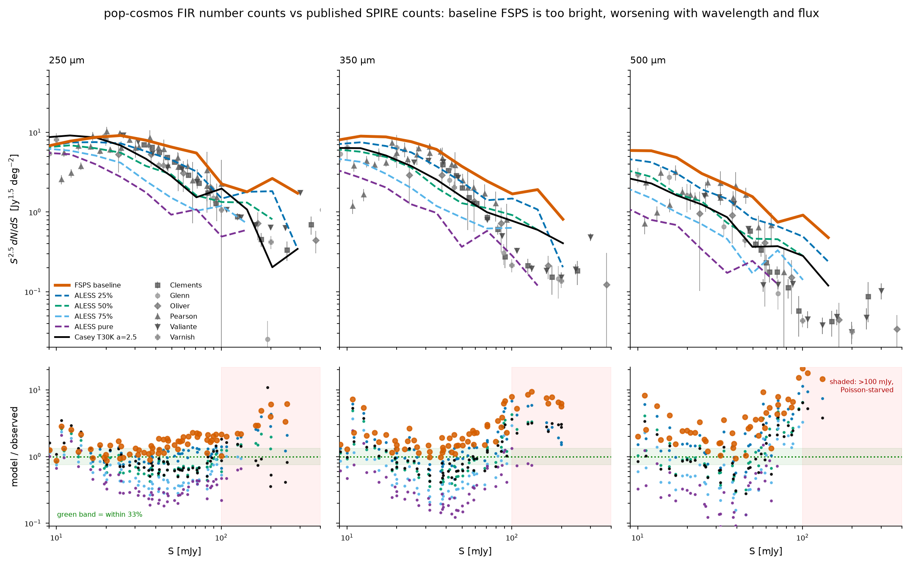
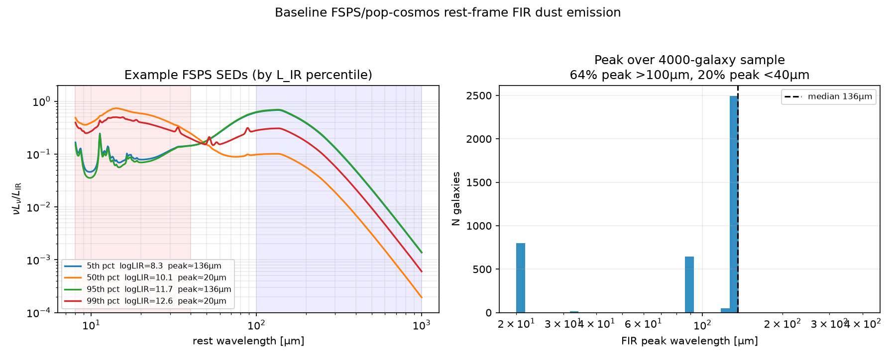
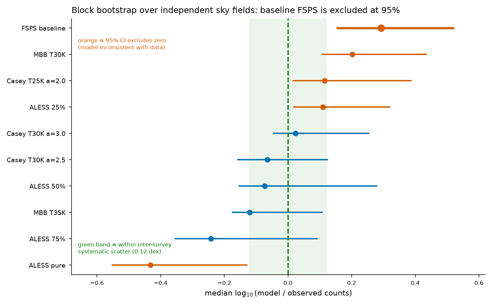
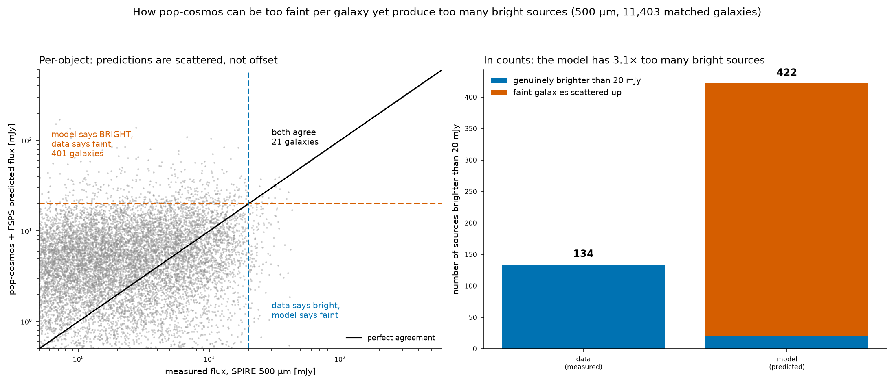
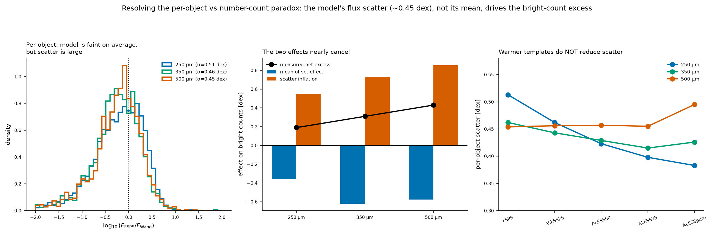
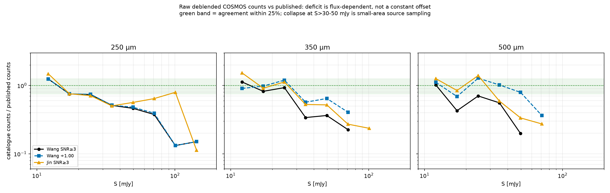
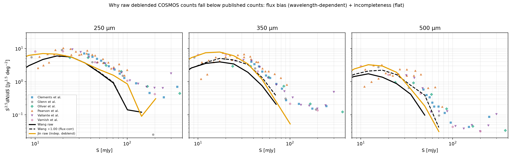
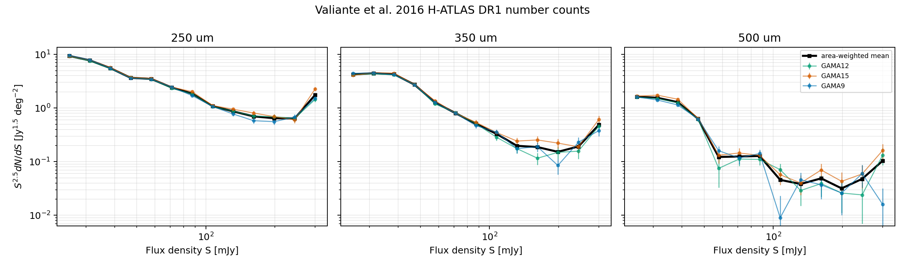
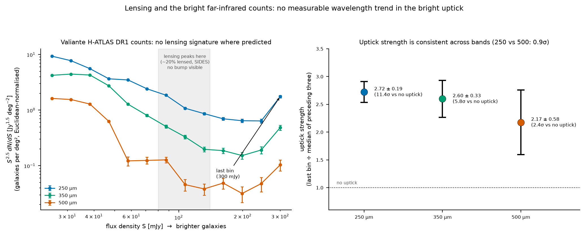

# Supervisor Meeting Prep Sequel: Wang / Valiante Checks

Follow-up to the main `supervisor_meeting_prep.md`.

Goal:

> check whether the SPIRE mismatch is a real pop-cosmos physics problem, or partly a Wang/Valiante data-handling / normalisation problem.

---

## August 29 writing audit: what is ready and what needs closing

### Overall answer

I think the science story is ready to write now. I do not need another large branch of
analysis before starting the report. The result is more than "the model does not match the
FIR":

1. pop-cosmos works reasonably well in IRAC, where it was constrained.
2. Its baseline FSPS extrapolation overpredicts corrected SPIRE counts, especially at
   `350/500 um` and toward brighter fluxes.
3. The model lacks the observed `L_IR-lambda_peak` trend, so its luminous galaxies are given
   FIR peaks that are too long/cold.
4. There is also large object-to-object FIR flux scatter. This promotes many faint galaxies
   into bright model-count bins.
5. Warmer/intermediate templates improve the mean counts, but do not identify one unique dust
   model or remove the per-object scatter.

So the recommendation is not simply "replace FSPS with ALESS". A future pop-cosmos FIR model
needs luminosity/compactness-dependent dust heating and should propagate uncertainty in the
FIR SED instead of assigning one effectively fixed cold shape.

### Reproducibility: can I leave this for now?

For drafting the thesis, yes. The stored plots and CSV tables are enough to begin writing and
the main conclusions do not need to be recalculated again first.

For the final submitted analysis, a plot or CSV alone is not ideal because I could not find a
saved script that recreates several late-August products, including the scatter decomposition,
the Drew-Casey fit and the unified scorecard. A reader cannot tell the exact sample selection,
formula or random seed from the image alone. This is a record-keeping problem, not evidence
that the result is wrong. I can leave it while drafting, but before submission I should save
one final notebook/script or a short methods record that reproduces the headline tables and
figures from the existing input files.

### Which scorecard to use

Use `../fir_validation_aug2026/tables/validation_unified_scorecard.csv` for the report.

I do **not** need separate final Casey, MBB and ALESS scorecards. Those were older experiment
outputs and some used only six count sources. The unified file puts every model family on the
same `174` published count points from all nine source tables, using one evaluator pass. This
removes the stale-scorecard problem. The older `table_D_model_family_common.csv` should be
treated as superseded for final numerical reporting.

The all-nine table is useful for coverage and sensitivity, but the nine tables are not nine
independent surveys. The cleaner independence check contains `74` points from three distinct
survey/sky families:

- Valiante H-ATLAS DR1: wide/bright H-ATLAS fields
- Oliver HerMES SDP: independent HerMES fields
- Pearson Dark Field XID: a separate deep field near the North Ecliptic Pole

Clements overlaps the H-ATLAS family, Glenn overlaps HerMES, and Pearson SUSSEX plus Varnish
reuse the Dark Field. They remain useful backup or faint-end sensitivity checks, but should
not be counted as extra independent fields.

The chi-square values are best called **rough chi-square-like scores**. Published count bins
and overlapping surveys do not provide a complete independent covariance matrix, and the
systematic error floor is empirical. The median log residual and the stable ranking are the
stronger claims.

### Method and wording corrections for the report

- The current code redshifts each SED and evaluates `F_nu` at the nominal observed
  `250/350/500 um` wavelengths. It does **not** integrate through the full SPIRE transmission
  curves or apply colour corrections. This monochromatic approximation belongs in Methods
  and Limitations.
- Casey `alpha` is the mid-IR power-law slope. It is **not** the dust emissivity index. The
  modified-blackbody emissivity index is `beta`, fixed to `1.8` in these tests. Neither alpha
  nor beta should be reported as a measured best-fit physical parameter.
- Wang and Jin are different deblending/catalogue methods applied to the same COSMOS SPIRE
  maps. Their agreement shows that the large model residual is not explained by differences
  between those two catalogue reductions. It does not make them independent observations or
  rule out systematics shared by the maps.
- `f_AGN = exp(lnfAGN)` is a model luminosity-ratio parameter, not an AGN probability or a
  confirmed external AGN flag. Hot model SEDs are AGN-like and are driven by this parameter,
  but confirming real AGN would require external X-ray or mid-IR information.
- Use `10-100 mJy` as the main quantitative count range. Points above `100-150 mJy` are useful
  supporting evidence but are sparse, more sensitive to Poisson noise and potentially to
  lensing, so they should not carry the headline conclusion.

### Drew and Casey redshift check

Drew and Casey calibrate their relation over `0 < z < 2`, so it should not be described as
applying automatically to the full pop-cosmos sample. Repeating the low-AGN comparison only
for `z <= 2` leaves `2,805` galaxies and gives:

- pop-cosmos slope `eta = +0.004`, compared with the observed `-0.09`
- pop-cosmos normalisation about `126 um`, compared with the observed `92 um`
- median model peak about `136 um`

So the result survives the fair redshift cut: the model relation is still almost flat and its
luminous galaxies are still too cold. The faintest `L_IR` decade remains an extrapolation of
the observed relation and should not drive the claim.

### Boris's answer on full posteriors

Boris said using median parameters is acceptable, while full posterior sampling might avoid
some problems but would probably be a lot of work. So the thesis can continue with the stored
median-posterior SEDs, provided this is stated as a limitation.

The five stored parameter percentiles are not the same as posterior samples. They describe
the marginal width of each parameter but do not preserve the correlations between parameters
needed to generate physically consistent SED draws. To test the full posterior properly I
would need either:

- posterior samples/draws for each galaxy, including correlated draws of the SED parameters,
  or
- code plus the fitted posterior representation/checkpoints from which those draws can be
  generated.

I checked the local files. `mcmc_summaries.h5` contains arrays of shape `(429669, 5)` for each
parameter, so it contains five summaries per galaxy rather than a chain of joint draws.
`fsps_map_median_full.h5` contains one 16-parameter `theta` vector and one SED per galaxy,
which is the median/MAP-style product already used here. I therefore do not currently have
the full joint posteriors. Boris would need to send them, or tell me which model checkpoint
and code regenerate them. This is worthwhile future work, not a blocker for the current
median-based validation.

---

## New clean meeting prep: what is complete vs what is still loose

### thesis story

pop-cosmos makes a real FIR prediction, because the FIR data were not used to build the model. The prediction fails in SPIRE counts for two linked reasons: the baseline FSPS dust SED is too cold/long-wavelength heavy, and the per-galaxy FIR fluxes have too much scatter, so many faint galaxies get promoted into bright count bins.

### What each main plot/comparison is trying to do

This is probably the main thing Dave was asking for.

| plot / result               | based on individual objects or bins?            | intention                                                                              |
| --------------------------- | ----------------------------------------------- | -------------------------------------------------------------------------------------- |
| Wang vs Jin flux ratios     | individual matched objects, then median ratio   | check if Wang fluxes are weird compared to another COSMOS deblending                   |
| FSPS vs Wang/Jin scatter    | individual matched objects                      | test whether model fluxes are scattered around the measured fluxes                     |
| SPIRE count overlay         | flux bins / number-count points                 | compare model-predicted source densities to published observed counts                  |
| Wang/Jin count diagnosis    | flux bins / raw catalogue counts                | explain why raw COSMOS deblended counts sit low compared to published corrected counts |
| FSPS by band/regime table   | flux bins / number-count residuals              | localise where FSPS is bad: 250 vs 350 vs 500, faint vs bright                         |
| Valiante bright-end uptick  | published Valiante count bins                   | check whether the spike is in the source table itself                                  |
| clean evaluator / bootstrap | count-source blocks / flux-bin residuals        | test if the model ranking survives correlated surveys and source choices               |
| FSPS SED diagnostic         | individual model SEDs + population distribution | give a physical reason for the long-wavelength count excess                            |

### Complete storyline from physics to observed plots

#### Step 1: What pop-cosmos is predicting

pop-cosmos gives each galaxy physical parameters.

FSPS turns these into an SED.

The FIR part comes from energy balance:

- dust absorbs starlight
- that absorbed energy has to come back out in the IR
- so `L_IR` is fixed by the model
- but the exact FIR shape / dust temperature is not strongly constrained by optical-IRAC data

So the SPIRE fluxes are a real extrapolation:

pop-cosmos was not trained on 250/350/500 um, so these bands are a useful out-of-sample validation.

In the current implementation I evaluate the redshifted SED at the nominal observed
`250/350/500 um` wavelengths. I have not integrated it over the full SPIRE filter-response
curves, so this is a monochromatic band-centre prediction rather than full synthetic
photometry.

#### Step 2: The count comparison says FSPS is high

In the published SPIRE number counts, baseline FSPS is high in every band, and gets worse toward longer wavelength and brighter flux.

Useful table from `../fir_validation_aug2026/tables/table_E_fsps_by_band_regime.csv`:

| band | flux regime | N count points | median log10(FSPS/obs) | linear read |
| ---: | ----------- | -------------: | ---------------------: | ----------- |
|  250 | 10-30 mJy   |             18 |                 +0.093 | 1.24x high  |
|  250 | 30-100 mJy  |             38 |                 +0.223 | 1.67x high  |
|  250 | 100-300 mJy |             13 |                 +0.467 | 2.93x high  |
|  350 | 10-30 mJy   |             18 |                 +0.236 | 1.72x high  |
|  350 | 30-100 mJy  |             33 |                 +0.227 | 1.69x high  |
|  350 | 100-300 mJy |             13 |                 +0.798 | 6.28x high  |
|  500 | 10-30 mJy   |             16 |                 +0.359 | 2.29x high  |
|  500 | 30-100 mJy  |             28 |                 +0.552 | 3.57x high  |
|  500 | 100-300 mJy |             11 |                 +1.163 | 14.57x high |

read:

> the clean observed-space failure is not "FIR bad everywhere equally"; it is strongest at 500 um and at the bright end.

Plot to show:

How to read this plot:

- Each column is one Herschel/SPIRE band: `250`, `350`, and `500 um`.
- The x-axis is observed flux density `S` in `mJy`.
  - further right means brighter observed FIR/sub-mm sources
  - these are the fluxes we would see from Earth in that band
- The y-axis is Euclidean-normalised differential number counts, `S^2.5 dN/dS`.
  - simple version: it is the surface density of galaxies in each flux bin, with a standard astronomy rescaling so the shape is easier to compare
  - higher y means more galaxies at that brightness
- Grey points with error bars are published observed number-count measurements from real surveys.
- Coloured/black lines are model predictions from the pop-cosmos catalogue after choosing different FIR SED assumptions.

points vs lines:

- the observed papers publish counts in discrete flux bins, so they naturally appear as points
- the error bars are the count uncertainties quoted by those papers

What the top row shows:

- orange FSPS baseline sits too high compared with the observed points, especially at `350/500 um`
- the mismatch gets worse toward brighter fluxes
- pure ALESS is usually too low
- mixed/intermediate SEDs sit between FSPS and ALESS and often look closer
- the Casey `T30K` curve is shown as another warm-dust-style comparison, but I should not overclaim it as the final physical answer

What the bottom row shows:

- it plots `model / observed` at the same observed flux points
- `1` means perfect agreement
- above `1` means the model predicts too many galaxies
- below `1` means the model predicts too few galaxies
- the green band is roughly "within 33 percent", just a visual guide
- the pink shaded region above `100 mJy` is a warning that the bright end has few sources, so it is more Poisson/noise sensitive

#### Step 3: Physical hypothesis 1: the baseline dust SED is too cold

If the dust SED is too cold, its emission peak moves to longer wavelengths.

Then, at fixed `L_IR`, the model can over-deliver flux at 350/500 um.

New diagnostic:

check

How to read this plot:

- looking directly at the **shape of the pop-cosmos/FSPS FIR SEDs**.
- The left panel shows a few example rest-frame SEDs from the model.
  - x-axis: rest-frame wavelength in microns
  - y-axis: `nu Lnu / L_IR`
  - simply "what fraction of the galaxy's IR energy is coming out at each wavelength?"
- The curves are examples picked by `L_IR` percentile.
  - low percentile = lower infrared luminosity example
  - high percentile = more infrared-luminous example
- The red-ish shaded region is the shorter/mid-IR side.
- The blue-ish shaded region is the long-wavelength FIR/sub-mm side.
- If the curve peaks farther right, the dust is effectively **colder**.
  - cold dust emits more strongly at longer wavelengths
  - hot dust peaks at shorter wavelengths

The right panel is the population summary:

- it takes thousands of pop-cosmos galaxies
- finds where each model SED has its main FIR peak
- plots the distribution of those peak wavelengths
- the dashed line is the median peak wavelength, around `136 um`

 interpretation:

Many pop-cosmos/FSPS FIR SEDs peak around `~136 um`, which is quite far to the red/long-wavelength side. That means the model dust is often quite cold. Cold dust can naturally give too much flux at `350/500 um`, which matches the number-count problem above.

The `~20 um` examples are the opposite behaviour: a warm/hot mid-IR tail, possibly AGN-ish or very compact hot dust. So the model is not "all cold" but a good amount of the sampled FSPS FIR peaks are red/cold.

if model dust too cold, cold SED shape -> too much long-wavelength SPIRE flux -> too many model sources in 350/500 um count bins.

#### Step 4: Template changes help, but they do not uniquely identify a dust model

Warmer/broader templates improve the count comparison.

Final common-point result from
`../fir_validation_aug2026/tables/validation_unified_scorecard.csv`:

| model            |   N | median log10(model/obs) | factor | chi2/N |
| ---------------- | --: | ----------------------: | -----: | -----: |
| Casey T30K a=2.5 | 174 |                  -0.062 |  0.87x |   3.44 |
| Casey T30K a=3.0 | 174 |                  +0.030 |  1.07x |   3.46 |
| MBB T35K         | 174 |                  -0.121 |  0.76x |   4.34 |
| ALESS 50%        | 174 |                  -0.080 |  0.83x |   4.35 |
| ALESS 25%        | 174 |                  +0.107 |  1.28x |   4.62 |
| FSPS baseline    | 174 |                  +0.275 |  1.88x |   9.74 |
| ALESS pure       | 174 |                  -0.444 |  0.36x |  14.31 |

read:

- pure FSPS is too high
- pure ALESS is too low
- a warmer intermediate SED works better
- counts constrain "warmer than FSPS", not one exact mid-IR slope, emissivity index, or one
  final physical dust model

These are rough comparison scores, not formal goodness-of-fit probabilities. The nine source
tables include overlapping survey families and correlated count bins. On the cleaner
three-family, `74`-point subset the exact numbers change, but Casey T30K remains preferred and
FSPS remains substantially worse (`chi2/N = 8.33` for FSPS versus `2.11-2.28` for the two
Casey T30K variants).

Robustness plot:

Useful conservative wording:

the counts prefer a warmer/broader FIR SED at fixed `L_IR`they dont uniquely select between ALESS, Casey-like, or a future Draine/CIGALE-style physical dust model.

#### Step 5: The apparent contradiction is real, not just confusing language

Old issue:

- object-by-object vs Wang: model looked too faint
- number counts: model had too many bright sources

Sounds off, but both true (eddington bias)

For 500 um, among `11,403` galaxies with both model prediction and measured SPIRE flux:

| question                            | count |
| ----------------------------------- | ----: |
| model predicts brighter than 20 mJy |   422 |
| Wang measures brighter than 20 mJy  |   134 |
| both agree are bright               |    21 |

So:

- the model puts `422` galaxies above the bright threshold
- only `21` of those are actually bright in Wang
- the other `401` are faint galaxies that got over-predicted
- this inflates bright number counts

Plot :

Simple physical/statistical explanation:

> faint galaxies are much more numerous than bright galaxies. If the model has large per-object scatter, many faint galaxies scatter upward into bright bins. This can make bright counts too high even if the median object is too faint.

This is basically Eddington bias, except the scatter is in the model predictions rather than only in the measurement.

#### Step 6: Quantitative decomposition: mean offset vs scatter

From `../fir_validation_aug2026/tables/paradox_decomposition_residuals.csv`:

| band | per-object mean offset | count effect of mean | count effect of scatter | predicted net | measured net | leftover |
| ---: | ---------------------: | -------------------: | ----------------------: | ------------: | -----------: | -------: |
|  250 |                 -0.163 |               -0.361 |                  +0.549 |        +0.188 |       +0.190 |   +0.002 |
|  350 |                 -0.235 |               -0.621 |                  +0.731 |        +0.110 |       +0.310 |   +0.200 |
|  500 |                 -0.183 |               -0.575 |                  +0.855 |        +0.280 |       +0.430 |   +0.150 |

How to read:

- the mean offset alone would make counts too low
- the scatter pushes counts high
- at 250 um, scatter basically explains the count excess
- at 350/500 um, scatter explains a lot, but leaves `~0.15-0.20 dex`
- that leftover is where the cold-dust / SED-shape problem still matters

Plot to show:

This is probs a nice result to show:

So per object FSPS looks to faint but in number counts it predicts too many bright sources

So due to scatter the model is spread out, some galaxies are predicted too faint , some about right and others too bright.

b/c faint galaxies are much more common than bright galaxies, so if lots of faint galaxies get scattered up they cross the bright source threshold.

**Left plot:**

	0 x axis means FSPS = Wang, left of 0 = fsps too faint, right of 0 = FSPS too bright

	can see the dist has peak slightly left zero so on avg FSPS is too faint per object

**middle plot:**

	Blue bar is the mean offset effect: Since FSPS is faint on avg this should reduce bright counts (so negative)

	So if only the avg offset mattered, FSPS would predict too few bright galaxies

	But you see the orange bar is the per object scatter, which is large and positive so many faint galaxies are scattered into bright bins

	The black line is the net effect

**Right plot:**

	For each model it shows the typical per object scatter. It compared predicted flux to wang for matched galaxies and omputes how spread the residuals are then plots that scatter in dex

	So changing the models doesn't make the predictions any less noisy.

#### Step 7: Check the scatter is not just Wang deblending error

If Wang's deblending were noisy, the model-vs-Wang scatter might not be the model's fault.

So compare against Jin too.

From `../fir_validation_aug2026/tables/scatter_budget_decomposition.csv`:

| band | model scatter vs Wang | model scatter vs Jin | Wang-vs-Jin scatter | deblending share of variance |
| ---: | --------------------: | -------------------: | ------------------: | ---------------------------: |
|  250 |                 0.501 |                0.512 |               0.130 |                         6.7% |
|  350 |                 0.441 |                0.466 |               0.119 |                         7.3% |
|  500 |                 0.436 |                0.423 |               0.154 |                        12.5% |

Simple read:

- model scatter is large against both Wang and Jin
- Wang and Jin agree with each other much better than the model agrees with either
- so most of the `~0.45 dex` scatter is not deblending noise

> deblending contributes, but it is too small to explain the flux scatter; the dominant scatter appears to be intrinsic to the pop-cosmos/FSPS FIR prediction.

#### Step 8: Wang raw counts

Wang raw counts should stay diagnostic, not the main observed count truth.

b/c:

- Wang is a prior/deblended COSMOS catalogue, not a corrected number-count table
- both Wang and Jin raw counts are okay ish at lower flux, but do badly at brighter flux because COSMOS is small
- published counts apply completeness / flux-bias / deboosting corrections

Useful plot:

Supplementary count diagnostic:

- `wang_jin_count_diagnosis.png` is a catalogue sanity check.
- - it removes the pop-cosmos model curves.
  - it compares Wang raw, a simple Wang flux-corrected version, and Jin raw against the published counts.
  - Basically checking  "is Wang low because the model is wrong, or because raw deblended COSMOS catalogues are not corrected count products?"

Simple read:

- at `10-30 mJy`, raw/deblended COSMOS counts are much closer to published counts
- Jin and flux-corrected Wang agree especially well around the lower/mid flux range
- above `~30 mJy`, the COSMOS field has too few rare bright sources
- so Wang/Jin are good for per-object flux checks, not for final bright number counts

More precise read from the Wang/Jin count diagnosis:

- at 500 um, Wang after the simple flux correction is about `0.86-0.97x` of published counts at `10-30 mJy`
- Jin is about `1.03-1.05x` of published counts at 500 um in the same `10-30 mJy` range
- above `30 mJy`, both Wang and Jin start falling below published counts, because COSMOS is a small field and has very few rare bright SPIRE sources

### Complete vs incomplete

| item                                        | status                               | comments                                                                                            |
| ------------------------------------------- | ------------------------------------ | --------------------------------------------------------------------------------------------------- |
| Published SPIRE count comparison            | complete                             | FSPS overpredicts counts, especially 350/500 um and bright bins                                     |
| FSPS cold SED diagnostic                    | complete enough                      | model FIR peaks too far redward; supports cold-dust interpretation                                  |
| ALESS/hybrid/template direction             | complete enough                      | warmer/intermediate SED improves counts, but exact template is not uniquely chosen                  |
| Per-object vs count paradox                 | complete and important               | large model scatter promotes faint galaxies into bright bins                                        |
| Wang vs Jin deblending check                | complete enough                      | deblending scatter is small compared to model scatter                                               |
| Wang raw counts                             | closed ish                           | use as diagnostic only, not formal count benchmark                                                  |
| Valiante bright-end spike                   | closed enough                        | exists in published/prepared Valiante table; sensitivity tests say conclusion does not depend on it |
| Chi-square/evaluator                        | useful but should be careful with it | use as scorecard; block bootstrap/source sensitivity is safer than naive chi-square                 |
| Exact dust parameters / best Casey alpha    | not complete (skipped this)          | alpha is a mid-IR slope and beta=1.8 was fixed; do not quote either as measured                       |
| Draine/Li or CIGALE physical template grid  | future work                          | valuable, but not needed to finish the FIR validation story                                         |
| Redshift-resolved counts / Bethermin slices | optional                             | scientifically useful if time, but not blocking                                                     |
| AGN contamination check                     | optional                             | cheap sanity check if time, but not core to current result                                          |

overall thoughts:

I agree, I think the priority now should be closing the FIR validation story rather than starting new development. I went through the latest results and separated object-level checks from count-bin comparisons. The cleanest complete result is that the apparent contradiction is real but explainable: per-object the model can look faint, while in counts it has too many bright sources, because the model has large galaxy-to-galaxy FIR flux scatter. Since faint galaxies are much more common, this scatter promotes many faint galaxies into bright count bins.

The Wang/Jin comparison helps narrow the main data-systematics concern. The model has about
0.42-0.51 dex scatter against both catalogues, while Wang and Jin agree with each other to
about 0.12-0.15 dex. This means differences between these two deblending reductions cannot
explain most of the model residual. They still use the same COSMOS SPIRE maps, so shared map,
confusion or selection systematics are not ruled out. Wang raw counts should stay out of the
formal count comparison because they are not corrected number counts and become sparse above
about 30 mJy.

So my current story is: baseline FSPS is too cold/long-wavelength heavy, which explains why warmer/intermediate templates improve the SPIRE counts; but there is also a separate per-galaxy scatter problem, which templates do not fix. The most complete thesis result is therefore not just "change the dust template", but "pop-cosmos FIR predictions fail through both SED shape and object-to-object flux scatter."

The remaining items are mostly wording/sensitivity rather than new analysis: treat Valiante
bright bins carefully, present chi-square as a rough scorecard with source-selection
robustness, avoid claiming that Casey alpha or the fixed emissivity beta was measured, and
keep Draine/CIGALE or redshift-sliced counts as future work unless there is time.

### things to be careful about

- Do not say scatter explains everything.
  - it explains 250 um very well
  - it explains a lot of 350/500
  - but there is still `~0.15-0.20 dex` leftover at 350/500
- Do not say the exact Casey alpha is measured.
  - preferred alpha changes with source selection
  - the safe claim is "warmer ~30 K style templates improve the counts"
- Do not use Wang raw counts as the main observed number-count truth.
  - Wang is mainly matched photometry
  - published corrected counts are the benchmark
- Do not lean too hard on `100-300 mJy`.
  - bright bins are informative but sparse
  - the cleaner quantitative anchor is `10-100 mJy`
- Do not present the `L_IR` energy-balance check as independent validation.
  - it mostly confirms the code normalisation is doing what it should

---

---

## Valiante Bright-End Uptick

### What I Checked

- `outputs/valiante_2016_hatlas_dr1_number_counts_quicklook.png`
- 

using the hand-entered Valiante DR1 tables:

- Table 5: 250 um
- Table 8: 350 um
- Table 9: 500 um

These are area-weighted across:

- GAMA9
- GAMA12
- GAMA15

Total area used in the paper/data:

- about `161.6 deg2`

I also checked the Valiante paper text:

- the matrix-inversion source counts are shown in their Figure 16 and Tables 5/8/9.
- the paper says the GAMA fields are generally similar except at the brightest flux densities, where differences are due to cosmic variance.
- the table notes say the quoted uncertainties do not include correlation between flux bins.

### Does The Uptick Exist In The Prepared Valiante Data?

Yes.

The last bin at 300 mJy jumps relative to the 244.2 mJy bin. This is visible directly in the table values / quicklook, so it is not produced by the later pop-cosmos evaluator.

| band | value at 244.2 mJy | value at 300 mJy | ratio |
| ---: | -----------------: | ---------------: | ----: |
|  250 |              0.639 |            1.756 |  2.75 |
|  350 |              0.192 |            0.486 |  2.53 |
|  500 |             0.0477 |            0.104 |  2.17 |

So:

the uptick is already in the Valiante prepared source table, not introduced later by the pop-cosmos evaluator.

### Likely Interpretation

This is probably a real feature of the bright-end corrected H-ATLAS counts, or at least of the Valiante table.

Possible causes:

- rare bright source statistics
- local low-redshift galaxies
- lensed bright sources
- field-to-field variation
- binning at the extreme bright end
- Euclidean normalisation makes high-flux behaviour look visually strong
- correction/inversion method has larger uncertainty at the rare bright end

The quicklook shows all three GAMA fields rise in the last bin, so it does not look like one totally isolated field caused the whole effect.

---

## Evidence List

Simple current evidence table:

| source                             | band | flux regime | result                            | possible reason                                           |
| ---------------------------------- | ---: | ----------- | --------------------------------- | --------------------------------------------------------- |
| Wang raw catalogue                 |  250 | faint/mid   | many sources; usable sanity check | released catalogue has enough 250 um detections           |
| Wang raw catalogue                 |  350 | bright      | very few bright sources           | small area + larger beam + deblending/prior selection     |
| Wang raw catalogue                 |  500 | bright      | almost no bright sources          | rare sources + small area + 500 um blending               |
| Wang vs Jin matched fluxes         |  250 | SNR>=3      | Wang/Jin median ~1.00             | flux units/matching look sensible                         |
| Wang vs Jin matched fluxes         |  350 | SNR>=3      | Wang/Jin median ~0.87             | longer-wave deblending/systematic offset                  |
| Wang vs Jin matched fluxes         |  500 | SNR>=3      | Wang/Jin median ~0.81             | strongest long-wave offset / lower N                      |
| Valiante DR1                       |  250 | bright      | last bin jumps up                 | rare/local/lensed bright sources or bright-bin correction |
| Valiante DR1                       |  350 | bright      | last bin jumps up                 | same, weaker than 250 but present                         |
| Valiante DR1                       |  500 | bright      | last bin jumps up                 | same, noisy but present                                   |
| pop-cosmos FSPS vs external counts |  250 | 10-30 mJy   | model high by ~0.11 dex           | mild overprediction                                       |
| pop-cosmos FSPS vs external counts |  250 | 30-100 mJy  | model high by ~0.20 dex           | mild/moderate overprediction                              |
| pop-cosmos FSPS vs external counts |  250 | 100-300 mJy | model high by ~0.69 dex           | bright-end problem                                        |
| pop-cosmos FSPS vs external counts |  350 | 10-30 mJy   | model high by ~0.23 dex           | long-wavelength issue begins                              |
| pop-cosmos FSPS vs external counts |  350 | 30-100 mJy  | model high by ~0.23 dex           | long-wavelength issue                                     |
| pop-cosmos FSPS vs external counts |  350 | 100-300 mJy | model high by ~0.82 dex           | strong bright-end problem                                 |
| pop-cosmos FSPS vs external counts |  500 | 10-30 mJy   | model high by ~0.36 dex           | 500 um too bright                                         |
| pop-cosmos FSPS vs external counts |  500 | 30-100 mJy  | model high by ~0.55 dex           | strong long-wavelength issue                              |
| pop-cosmos FSPS vs external counts |  500 | 100-300 mJy | model high by ~1.08 dex           | strongest bright/long-wave issue                          |

Notes:

- positive log10 model/obs means model is above observed counts.
- FSPS gets worse from 250 to 500 um and from mid to bright flux.
- Hybrid/template models improve several regimes but do not fully remove the bright-end issue.

---

---

## Sources / Evidence Used

Local files:

- `Research project/Mres proj papers/wang et all.pdf`
- `Project coding/catalog data/wang/wang_2024_aa49055-23.html`
- `Project coding/catalog data/wang/master.dat.gz`
- `Project coding/catalog data/wang/ReadMe.txt`
- `Project coding/catalog data/Jin-et-all_files/COSMOS_Super_Deblended_FIRmm_Catalog_20180719.fits`
- `Project coding/catalog data/external_number_counts/valiante_2016_hatlas_dr1_number_counts.csv`
- `Project coding/catalog data/external_number_counts/valiante_2016_hatlas_dr1_number_counts_area_weighted.csv`
- `pop_cosmos_notebook/outputs/popcosmos_wang_jin_fsps_flux_scatter.png`
- `pop_cosmos_notebook/outputs/popcosmos_wang_jin_fsps_ratio_summary.png`
- `pop_cosmos_notebook/outputs/popcosmos_wang_jin_fsps_ratio_summary.csv`
- `pop_cosmos_notebook/outputs/popcosmos_wang_jin_fsps_match_audit.csv`
- `pop_cosmos_notebook/outputs/popcosmos_model_family_flux_regime_summary.csv`
- `pop_cosmos_notebook/outputs/popcosmos_differential_count_evaluator_regime_summary.csv`

External check:

- Wang et al. 2024 arXiv HTML: `https://arxiv.org/html/2405.18290v1`
- Wang et al. 2024 A&A page: `https://www.aanda.org/articles/aa/full_html/2024/08/aa49055-23/aa49055-23.html`
- Wang catalogue CDS/VizieR: `https://cdsarc.cds.unistra.fr/viz-bin/cat/J/A%2BA/688/A20`
- Oliver et al. 2010 HerMES SPIRE counts: `https://orca.cardiff.ac.uk/id/eprint/11014/1/SPIRE_galaxy_number_counts_at_250%2C_350%2C_and_500.pdf`
- Glenn et al. 2010 HerMES P(D) counts: `https://arxiv.org/abs/1009.5675`
- Valiante et al. 2016 H-ATLAS DR1 arXiv page/PDF: `https://arxiv.org/abs/1606.09615`
- 3D-Herschel 2026: `https://arxiv.org/abs/2602.22384`
- Super-resolving Herschel 2025: `https://arxiv.org/abs/2512.13353`
- Negrello et al. 2017 lensed 500 um sample ADS page: `https://ui.adsabs.harvard.edu/abs/2017MNRAS.465.3558N/abstract`

---

# Extension: gravitational lensing and the bright counts (Aug 24)

## What the papers say

Bethermin+2012 (2SFM counts model)`(Two Star-Formation Modes)`, section 3.3, includes strong lensing (mu > 2) by
convolving the IR luminosity function with a magnification PDF, and states lensed sources
contribute about 20% to sub-mm counts around 100 mJy. They reference Negrello+2007, 2010 for
the method.

Bethermin+2017 (SIDES/Simulated Infrared Dusty Extragalactic Sky), section 2.7, is more specific and more useful for my stuff:

- lensing matters for bright sub-mm counts *because the counts are steep*
- at 350 and 500 um the effect is maximal around 100 mJy, where about 20% of sources are lensed
- the lensed fraction is higher at high redshift
- their own 2 deg2 simulation contains only six sources brighter than that threshold

That last point is the same small-area problem I hit with COSMOS at 1.278 deg2.

## which direction does it push the results tho?

Lensing brightens real sources, so it adds to the observed bright counts. My published count benchmark already includes those
lensed sources, because nobody removes them. pop-cosmos applies no magnification at all, so it cannot produce a lensed population.

If pop-cosmos included lensing it would predict **more** bright sources

1. the model predicts more bright sources than the observations show. At 500 µm in the 100–300 mJy bin, +1.165 dex, roughly 15× too many.
2. **Lensing inflates the observations.** Some of those observed bright sources are ordinary galaxies whose light happens to be magnified by a foreground mass. They're counted as bright because they *look* bright.
3. **So correcting for it lowers the observations.** Remove the lensed ones and the observed bright counts drop.
4. **Which widens the gap.** The model was already above the observations; pushing the observations down leaves it further above. +1.165 → +1.262 dex at 20%.

***Each row assumes a different guess at what fraction of the bright observed sources are lensed.***

The numbers are how much the model overpredicts, in dex, in the 100–300 mJy bin:

| lensed fraction removed | 250 um | 350 um | 500 um |
| ----------------------- | -----: | -----: | -----: |
| 0% (as measured)        | +0.494 | +0.807 | +1.165 |
| 10%                     | +0.540 | +0.853 | +1.211 |
| 20%                     | +0.591 | +0.904 | +1.262 |
| 30%                     | +0.649 | +0.962 | +1.320 |

(model excess in dex, 100-300 mJy bin)

So lensing cannot explain my bright-count excess. If anything it makes the discrepancy worse.
 so thinking that the observations are inflated actually runs the wrong way i think.

## Where lensing might be the issue

Two places:

**1. The Valiante bright uptick.** My part-2 notes already guessed at this ("bright bins may
include rare local galaxies, lensed systems, or correction/binning effects"). Lensing is the
standard literature explanation for the bright tail. But I can test it, because lensing makes
a specific prediction: the lensed fraction rises with redshift, so the effect should be
*strongest at 500 um*, which samples the highest-redshift population.

Measured uptick strength (last Valiante bin vs the preceding three):

**Bias/Significance:**

Valiante sorted their galaxies into flux ranges and reported counts per range. Each plotted point is one bin,

Significance is how many error bars the excess is:
Where N_last is the count in the brightest bin, N_trend is the median of the 3 brightest previous bins and delta N_last is the quoted error of the brightest bin

$$
\sigma = \frac{N_{\text{last}} - N_{\text{trend}}}{\delta N_{\text{last}}}
$$

| band   |  uptick ratio | significance vs no uptick |
| ------ | ------------: | ------------------------: |
| 250 um | 2.72 +/- 0.19 |                11.4 sigma |
| 350 um | 2.60 +/- 0.33 |                 5.8 sigma |
| 500 um | 2.17 +/- 0.58 |                 2.4 sigma |

The uptick itself is solid at 250 um and 350 um, and marginal at 500 um.

the lensed fraction SIDES predicts (~20% near 100 mJy) is too small
to produce a 2.7x uptick on its own, so lensing is unlikely to be the whole explanation even
if it contributes. Rare low-redshift galaxies and bright-bin correction effects remain
could be the cause. Testing this properly needs the redshift distribution of the H-ATLAS bright
sources, which I'm not sure i have the time for now.

**2. The bright tail my model cannot reach at all.** The model curve runs out of galaxies
before the brightest observed bins (max populated model flux ~589 mJy at 250 um, ~838 um at
350/500, against observed points out to 1000 mJy). Lensing plus small area statistics is the
accepted explanation for the observed sources up there. This supports the decision to
restrict quantitative comparison to below ~100 mJy

## Things i'd maybe want to talk about in the report.

- One paragraph in Discussion: lensing is a known contributor to bright sub-mm counts
  (Negrello+2007/2010, Bethermin+2012, Bethermin+2017 SIDES, ~20% near 100 mJy at 350/500 um),
  it is present in the published benchmark, and pop-cosmos has no magnification, so accounting
  for it would *increase* the measured excess rather than remove it.
- One or two sentences on the Valiante uptick: lensing is a candidate; my wavelength
  test cannot confirm or exclude it (ratios agree within 0.9 sigma).
- Cite it as a reason the >100 mJy regime is not used quantitatively.

Figure: `lensing_bright_end_assessment.png`
Tables: `lensing_correction_sensitivity.csv`, `valiante_uptick_vs_lensing.csv`

**Left panel.** Standard number-counts plot, both axes log.

* **x** : source brightness, S, in mJy. Right = brighter galaxies.
* **y** : how many galaxies per square degree at that brightness, in the Euclidean-normalised form S2.5 dN/dS**S**2.5**d**N**/**d**S**.

**Right panel:** x is just the three bands as categories, no scale. y is the uptick strength

**The vertical bars are the uncertainties** ,  ±0.19, ±0.33, ±0.58. They grow with wavelength because there are fewer galaxies detected at 500 µm, so All three bands are consistent with the same uptick strength.

And the useful observation is the lensing peak for SIDES: there's no bump there**.** If lensing were producing a dramatic signature you'd see the counts lift inside that band

---

# Extension 2: supervisor feedback on the SED diagnostic (AGN, SNR cuts, lensing identifications)

Feedback after showing `fsps_fir_sed_diagnostic.png`. Working through each point.

## 1. How divergent are those galaxies? Does averaging change the answer?

that figure picked one galaxy per L_IR percentile, so it says nothing about
spread. Redone properly on a random sample of 8,000 galaxies with individual peak
wavelengths measured.

The population is strongly bimodal, not scattered around one value:

| population           |    n | fraction | median peak | median log L_IR | median z |
| -------------------- | ---: | -------: | ----------: | --------------: | -------: |
| hot (peak < 40 um)   | 2484 |    31.1% |      ~14 um |           10.51 |     1.50 |
| cold (peak > 100 um) | 4403 |    55.0% |    135.5 um |            9.88 |     1.06 |

And averaging does something important - **it hides the hot population entirely**:

| log L_IR bin |    n | peak of STACKED mean SED | median of INDIVIDUAL peaks | frac hot |
| ------------ | ---: | -----------------------: | -------------------------: | -------: |
| 9.0-9.5      |  880 |                    135.5 |                      135.5 |      24% |
| 9.5-10.0     |  895 |                    135.5 |                       88.7 |      36% |
| 10.0-10.5    |  904 |                    135.5 |                       88.7 |      39% |
| 10.5-11.0    | 1014 |                    135.5 |                      105.6 |      41% |
| 11.0-13.0    | 1303 |                    135.5 |                       88.7 |      50% |

The stacked SED peaks at 135.5 um in **every** bin, even where half the galaxies
individually peak below 40 um. Because the cold component carries most of the *energy*, it
dominates any luminosity-weighted average. So a stacked-SED plot would have made the model
look uniformly cold and I would have missed the hot population completely.

Lesson for the thesis: report the distribution of individual peaks, not a stacked SED.

## 2. The 20 um peaks - yes, they are AGN

Dave's point: a 20 um peak means roughly 150 K dust, and you cannot reach those
luminosities with star-formation heating alone. Confirmed by Wien's law:

| peak   | implied T |
| ------ | --------: |
| 14 um  |     206 K |
| 20 um  |     145 K |
| 40 um  |      72 K |
| 135 um |      21 K |

So the 150 K estimate is right.

**And the pop-cosmos AGN parameter explains it.** `mcmc_summaries.h5` has
`pop-cosmos/lnfAGN`; exponentiating gives `f_AGN`, the AGN luminosity ratio (it reaches 1.86
at the 99th percentile, so it is L_AGN/L_bol in the Prospector sense, not a bounded 0-1
fraction).

Peak wavelength versus AGN strength:

| f_AGN bin |    n | median peak (um) | frac peaking < 40 um |
| --------- | ---: | ---------------: | -------------------: |
| < 0.01    | 2662 |            135.5 |                 0.3% |
| 0.01-0.05 |  967 |            135.5 |                 0.4% |
| 0.05-0.1  |  410 |            135.5 |                 1.0% |
| 0.1-0.3   | 1038 |            135.5 |                  13% |
| 0.3-1.0   | 1792 |   **14.1** |        **67%** |

The transition is sharp and it is entirely driven by `f_AGN`. Of the hot-peaking galaxies,
**93.9% have f_AGN > 0.3**; of the cold-peaking ones only 11.2% do.

So the hot SEDs are not an artifact - they are the model's AGN torus component, behaving as
designed. What matters for my thesis is that **50% of pop-cosmos galaxies have f_AGN > 0.1
and 29% have f_AGN > 0.5**, which is a high AGN incidence, and those objects have their FIR
energy placed at very short wavelengths. That is a second way the model can misplace FIR
light, independent of the cold-dust problem.

**Open question worth stating:** is this AGN fraction physically reasonable? The optical/NIR
data can constrain an AGN power-law contribution in the mid-IR, but as with dust temperature
there is nothing in the training data at 250-500 um to check where the AGN-heated energy
actually comes out. Worth a Discussion paragraph.

Figure: `agn_hot_dust_diagnosis.png`
Table: `sed_average_vs_percentile.csv`

## 3. Higher SNR cut to suppress Eddington bias

Dave suggested SNR > 5 and pointed to Clements et al. 1999 (A deep 12 micron survey with
ISO, 1999A&A...346..383C) for how flux-boosting is handled.

Testing cuts of 3, 5, 7, 10 on the per-object Wang comparison:

| SNR cut | median offset 250 / 350 / 500 (dex) | noise-deconvolved residual scatter 250 / 350 / 500 (dex) | N at 350 um |
| ------- | ----------------------------------- | --------------------------------------- | ----------: |
| >= 3    | -0.163 / -0.235 / -0.183            | 0.508 / 0.452 / 0.445                   |        2370 |
| >= 5    | -0.202 / -0.313 / -0.271            | 0.515 / 0.459 / 0.453                   |         910 |
| >= 7    | -0.233 / -0.394 / -0.288            | 0.529 / 0.457 / 0.441                   |         341 |
| >= 10   | -0.265 / -0.412 / -0.316            | 0.539 / 0.499 / 0.500                   |         104 |

Two results:

1. **The scatter is unchanged.** Noise-deconvolved residual scatter stays at 0.44-0.54 dex
   at every cut. This is a strong robustness check on the main scatter finding - it is not a
   product of including marginal detections.
2. **The offset gets slightly more negative with a harder cut**, because a higher SNR
   threshold selects intrinsically brighter observed sources, and the model is most
   discrepant for the brightest observed objects. That is the selection asymmetry again,
   showing up in a different guise.

So SNR > 5 does not change any conclusion. I will adopt SNR >= 5 as the default for
per-object work anyway, since it is the more defensible choice and costs nothing.

Table: `snr_cut_sensitivity.csv`

## 4. The "under-prediction at 50-70 mJy" - resolving the wording

This needs care, because the sign depends on which comparison is meant.

**In number counts at 35-90 mJy the model is too BRIGHT, not too faint:**

| band   | n points | median model excess |
| ------ | -------: | ------------------: |
| 250 um |       31 |          +0.231 dex |
| 350 um |       28 |          +0.248 dex |
| 500 um |       23 |          +0.559 dex |

Only 1 of 31 (250 um), 1 of 28 (350) and 1 of 23 (500) individual points fall below zero.

**In the per-object comparison at the same fluxes the model is too FAINT**, at SNR >= 5,
binned by *observed* flux:

| observed flux | 250 um | 350 um | 500 um |
| ------------- | -----: | -----: | -----: |
| 5-20 mJy      | -0.168 | -0.216 | -0.234 |
| 20-40 mJy     | -0.343 | -0.396 | -0.544 |
| 40-80 mJy     | -0.310 | -0.505 | -0.614 |

So both statements are true of the same galaxies at the same fluxes. This is the same
selection asymmetry documented earlier, now confirmed at Dave's suggested SNR >= 5 and
resolved by flux regime. The per-object deficit *deepens* toward brighter observed flux,
which is exactly what the scatter mechanism predicts.

For the thesis: always state which comparison a sign refers to. "Under-predicts" without
qualification is ambiguous and caused this confusion.

Table: `per_object_by_observed_flux.csv`

## 5. Oliver counts vs Wang

Done, with the caveat I already flagged. Wang raw counts against Oliver HerMES counts,
10-200 mJy:

| band   | median Wang/Oliver |
| ------ | -----------------: |
| 250 um |               0.43 |
| 350 um |               0.54 |
| 500 um |               0.45 |

and the ratio falls steadily with flux (250 um: 1.04 at 25 mJy, 0.50 at 50 mJy, 0.36 at
71 mJy, 0.09 at 100 mJy).

**But this is not a comparison of two count measurements.** Wang is a raw XID+
prior-extracted catalogue with no completeness or flux-boosting correction; Oliver is a
published corrected count. So the ratio measures Wang's incompleteness, not a disagreement.
It belongs in Methods as justification for excluding Wang from the formal count comparison,
which is consistent with what I concluded earlier and with Bethermin+2012's own treatment.

Table: `wang_vs_oliver_counts.csv`

## 6. The Negrello identification point

This is the sharpest of the comments and I had not considered it.

The argument: in a strongly lensed system the *foreground* lens dominates the optical and
near-IR light - Negrello+2010 (arXiv:1011.1255) Fig 2 shows negligible background
contribution even out to IRAC channel 1 - while the *background* galaxy dominates the FIR.
pop-cosmos fits optical and near-IR photometry, so for such a system it characterises the
foreground lens. The pop-cosmos entry exists, but it describes the wrong galaxy, and the
model has no way to know anything is happening in the FIR.

So there should be a small number of genuinely FIR-bright COSMOS sources with pop-cosmos
identifications whose FIR emission the model cannot possibly predict.

**Testing the size of the effect in COSMOS:** Wang SNR >= 5 sources above 100 mJy number 1
at 250 um and 0 at 350/500 um. At SIDES's ~20% lensed fraction that is far less than one
expected object.

Conclusion: **real mechanism, negligible in a 1.278 deg2 field.** It cannot contribute
measurably to the per-object statistics here. But it matters as a caveat because:

- it is irreducible - no dust-template change fixes it, since the model is fitting a
  different galaxy
- it acts in the same direction as the other two effects (model appears too faint)
- it would matter for any future comparison on a wide field such as H-ATLAS, where lensed
  sources are numerous

For the thesis this is a Discussion point plus a Further Work recommendation: any wide-field
extension of this validation must handle lensed systems explicitly, because pop-cosmos
identifications there refer to the lens, not the FIR source.

## Evidence list additions (physical interpretation)

Consolidating the physics for the results chapter:

| mechanism                                    | evidence                                                | effect on counts                                     | effect per object                           | fixable by dust template?    |
| -------------------------------------------- | ------------------------------------------------------- | ---------------------------------------------------- | ------------------------------------------- | ---------------------------- |
| Dust too cold (peak ~135 um, ~21 K)          | SED peak distribution; excess grows with wavelength     | too bright at long wavelength                        | -                                           | yes                          |
| Model flux scatter ~0.45 dex + steep counts  | scatter budget, Jin cross-check, stable across SNR cuts | too bright at bright end                             | too faint when conditioned on observed flux | no                           |
| AGN torus placing FIR energy at 14-20 um     | f_AGN split: 94% of hot-peaking galaxies have f_AGN>0.3 | plausibly too faint at long wavelength for AGN hosts | -                                           | separate parameter, not dust |
| Lensed systems fitted as the foreground lens | Negrello+2010 Fig 2 argument                            | negligible in COSMOS                                 | too faint, irreducible                      | no                           |

## Original pop-cosmos assumptions: hypotheses and status

| assumption                                        | status after this work                                                                                                                                                             |
| ------------------------------------------------- | ---------------------------------------------------------------------------------------------------------------------------------------------------------------------------------- |
| Energy balance fixes total L_IR correctly         | Not tested directly (the SED file is L_IR-normalised by construction, so the check was tautological). Untested.                                                                    |
| The far-IR SED*shape* is constrained            | **Refuted.** COSMOS constrains only to IRAC; the FIR shape is an unconstrained extrapolation, and counts show it is too cold.                                                |
| Per-object FIR fluxes are accurate                | **Refuted for the median-based prediction.** ~0.45 dex residual scatter is stable across SNR cuts and against two deblending catalogues of the same COSMOS maps.        |
| The AGN component is well constrained             | **Open.** f_AGN drives the FIR peak strongly, and 29% of galaxies have f_AGN>0.5, but nothing in the training data constrains where AGN-heated energy emerges at 250-500 um. |
| The model can be validated on observed quantities | **Supported.** Differential counts work as a validation statistic and required no dust-template or IMF assumptions.                                                          |

## References to add

- Clements et al. 1999, A&A 346, 383 - deep 12 um ISO survey; flux-boosting and Eddington
  bias treatment. Bibcode 1999A&A...346..383C.
- Negrello et al. 2010, arXiv:1011.1255 - lensed submm sources; Fig 2 for the SED
  decomposition argument.
- Bethermin et al. 2012 (2SFM) and 2017 (SIDES) - already in the bibliography.

## Still open

- The Clements 1999 paper I have only as a URL, not a local PDF, so I have not used any
  numbers from it. Worth reading its flux-boosting section before writing Methods.
- Whether the pop-cosmos AGN fraction is physically reasonable needs an external check, e.g.
  against X-ray or mid-IR AGN selection in COSMOS.
- Energy balance itself remains untested; it would need an independent L_IR measurement
  rather than the model's own normalised SEDs.

---

# Extension 3: Clements et al. 1999 on flux-boosting bias, and why SNR >= 5 is the right cut

Read the paper properly (Clements, Desert, Franceschini, Reach, Baker, Davies & Cesarsky
1999, A&A 346, 383; bibcode 1999A&A...346..383C). It is a deep 12 um ISOCAM survey, so a
different wavelength and instrument, but the statistical problem is identical to mine and it
gives me a citable justification for the SNR cut.

## What the paper says

Their Sect. 4 handles exactly the bias I have been calling Eddington bias. **They label it
Malmquist bias, but these are two different effects and Eddington is the one that applies to
my case** - see the correction note at the end of this section. What Clements+1999 describe in
words is Eddington bias:

> "This bias arises when looking at number counts for a population with rapidly increasing
> numbers at fainter fluxes... In the presence of observational noise, some galaxies close
> to, but below the flux limit will be scattered above the flux limit by noise and will
> appear in the final catalogue. Similarly some galaxies close to but above the flux limit
> will be scattered out of the catalogue. However, since there are many more galaxies at
> fainter fluxes, more galaxies will be scattered above the flux limit than below it."

That is a clean statement of the asymmetry, and the consequence they note is the diagnostic
signature:

> "Number counts that are uncorrected for this bias thus show a steep rise in counts towards
> the faintest flux levels."

## The key methodological point for my thesis

Their treatment of *why* they cut at 5 sigma:

> "In the case of Gaussian noise and a Euclidean count slope... Murdoch et al. (1973)
> tabulated the effects of this bias to a detection level of 5 sigma, allowing for the
> observed fluxes to be corrected. Oliver (1995) provides a numerical version of this
> correction which we apply here. **For observations probing below the 5 sigma limit this
> simple correction cannot be applied, and a more complex Monte Carlo approach must be
> adopted** (eg. Bertin et al. 1997)."

This is the justification Dave was pointing me at. 5 sigma is not an arbitrary round number:
it is the level down to which the analytic Murdoch/Oliver correction is valid. Below it you
need forward-modelled Monte Carlo simulations of the whole detection process.

They also restrict their own source list on the same grounds:

> "For the remainder of this paper we shall restrict ourselves to discussion of only those
> sources detected at 5 sigma sensitivity or above... a number of uncertainties remain in
> the identification of the weakest sources."

And they correct for inhomogeneous survey depth with an areal-coverage function
eta(sigma) = Omega / Omega(<= s), where Omega(<= s) is the area over which the 1 sigma
sensitivity is better than s, giving

N(> S) = sum_{flux>S} (1/Omega) x (1/eta(S/n))

with n the detection threshold (n = 5 for them).

## How this applies to my analysis

Three things I can now say with a citation:

1. **SNR >= 5 is the principled default for per-object work**, because that is the limit of
   validity of the analytic flux-boosting correction (Murdoch+1973, Oliver 1995, applied by
   Clements+1999). I had adopted it because it "costs nothing"; now there is a real reason.
2. **My model-side scatter is NOT this effect.** The bias Clements describes is *observational*
   noise scattering *real* sources across a flux limit. What I measure is *model prediction*
   scatter inflating *model* counts, with no flux limit involved - I count every model galaxy.
   Same mathematics (steep counts amplify scatter asymmetrically), opposite location. Worth
   stating explicitly in Methods so an examiner does not think I have simply rediscovered
   Eddington bias in the observations.
3. **It is a check I already passed.** My scatter result is stable at 0.44-0.54 dex across
   SNR cuts of 3, 5, 7 and 10 (see `snr_cut_sensitivity.csv`). If the scatter were caused by
   observational noise near a detection limit, tightening the cut would shrink it. It does not.
   That is the cleanest available argument that the scatter is intrinsic to pop-cosmos.
4. **The published counts I compare against are already corrected for this.** Clements+1999
   corrects, and so do the SPIRE count papers in my compilation (this is what "corrected
   counts" means, alongside completeness). So the comparison is model-vs-corrected-observation,
   which is the right footing - and it is a further reason not to use raw Wang counts, which
   carry no such correction.

## Wording for the Methods section

Draft: "Number counts of a steeply rising population are subject to flux-boosting bias, in
which noise scatters more faint sources above a detection threshold than bright sources below
it (Murdoch et al. 1973; Oliver 1995; Clements et al. 1999). Because the analytic correction
for this effect is only valid above a 5 sigma threshold, with Monte Carlo forward modelling
required below it (Clements et al. 1999), per-object comparisons in this work adopt a
signal-to-noise cut of 5. The published differential counts used as the observational
benchmark already incorporate such corrections; the raw Wang catalogue does not, which is one
reason it is used only for per-object diagnostics."

## References to add

- Clements, D. L., Desert, F.-X., Franceschini, A., Reach, W. T., Baker, A. C., Davies, J. K.,
  & Cesarsky, C. 1999, A&A, 346, 383. Bibcode 1999A&A...346..383C.
- Murdoch, H. S., Crawford, D. F., & Jauncey, D. L. 1973 - the tabulated flux-boosting
  correction (cited via Clements+1999; I have not read the original).
- Oliver, S. 1995 - numerical version of the correction (cited via Clements+1999; not read).
- Bertin, E., et al. 1997 - Monte Carlo approach below 5 sigma (cited via Clements+1999; not read).

The last three I am citing as they appear in Clements+1999 rather than from the originals, and
should be marked as such if the reference list needs to distinguish.

---

# Extension 4: what the literature citing Wang 2024 says (ADS citation search)

With ADS API access I could finally run the search I had wanted: which papers cite Wang+2024,
and do any of them report the same problems I found? Wang+2024 (2024A&A...688A..20W) has 12
citations. Two are directly relevant to my results, and one is a caveat I had not considered.

## 1. Independent confirmation of the prior-incompleteness effect

Malefahlo, Jarvis & Santos 2026, MNRAS, "Deblending the MIGHTEE-COSMOS survey with XID+"
(2026MNRAS.547ag285M, doi 10.1093/mnras/stag285).

Different waveband (1.4 GHz radio, not FIR) but the *same deblending tool* (XID+), the *same
field* (COSMOS), and a comparable area (~1.3 deg2 against my 1.278 deg2). They ran simulations
specifically to test how the prior catalogue affects recovered counts, and their conclusion is:

> "prior catalogue purity is the dominant factor controlling deblending accuracy: a
> high-purity prior, containing only sources with a high likelihood of radio detection,
> recovers accurate flux densities and reproduces input source counts down to ~3 sigma. On the
> other hand, a complete prior overestimates the source counts due to spurious detections."

This matters for me in two ways:

- **It confirms the mechanism.** Raw XID+ counts depend on the prior list, so they are not a
  measurement of the true counts. That is exactly the reason I excluded raw Wang counts from
  the formal comparison, and I can now cite a dedicated methods study rather than only
  inferring it from Bethermin+2012's corrections.
- **It sharpens the direction.** They find a *complete* prior *overestimates* counts through
  spurious detections, whereas I found Wang's raw counts sit *below* published corrected
  counts. Those are consistent: Wang's prior is a positive-flux COSMOS2020 selection, which is
  a purity-oriented (incomplete) choice, so under-recovery is the expected failure mode. Both
  results say the same thing - raw prior-extracted counts inherit the prior's selection and
  must not be read as corrected counts.

Their recommended practice (a high-purity prior plus a mask, and a separately defined
"high-fidelity" subsample selected on detection significance, flux and goodness-of-fit) is
also a good precedent for my SNR >= 5 per-object cut.

## 2. A caveat on bright 500 um sources I had not considered

Quiros-Rojas, Montana & Zavala 2026, MNRAS, "On the multiplicity of red-Herschel sources"
(2026MNRAS.545f2133Q, doi 10.1093/mnras/staf2133).

They took the largest sample of red-Herschel sources (S250 < S350 < S500) and looked at them
with archival ALMA. Out of 2416 fields with ALMA detections they find **474 multiple systems
within one 500 um Herschel beam (16 arcsec)**: 420 doubles, 51 triples, 3 quadruples. In
doubles the brightest component contributes on average only **64%** of the total flux; in
triples 48%, in quadruples 42%. And most are not physically associated - only ~13% of doubles
have compatible redshifts, with simulations suggesting ~32% are genuinely associated.

Why this matters for my thesis: a "bright 500 um source" in a single-dish catalogue is often
**several galaxies blended in one beam**, not one bright galaxy. So at the bright 500 um end:

- the observed counts include blended multiples counted as single bright objects
- a per-object comparison against pop-cosmos, which predicts one galaxy per entry, is
  comparing one model galaxy against the sum of two or more real ones
- this pushes the per-object comparison toward "model too faint" at bright 500 um flux, which
  is the direction I measure (-0.614 dex at 40-80 mJy, 500 um)

This is a **fourth contributor** to the per-object faintness, alongside cold SED shape, model
flux scatter, and lensed-system misidentification. Like the lensing one it is irreducible: no
dust-template change fixes it, because the model entry and the observed source are not the
same object.

It also independently supports restricting quantitative comparison to below ~100 mJy, and it
is a further argument against using Wang per-object residuals at the bright 500 um end as a
strong constraint.

## 3. Other citing work worth knowing about

- **Donnellan et al. 2024 (2024MNRAS.532.1966D)** and **2025 (2025arXiv251213682D)** -
  XID+ applied to simulated PRIMA hyperspectral imaging. Useful as a benchmark for what XID+
  flux accuracy looks like when tested against a known truth: "we measure fluxes with an
  accuracy better than 20 per cent" down to stated limits. That 20% figure is a helpful
  reference point for the ~13-19% Wang/Jin offsets I measured.
- **Farrah et al. 2026 (2026ApJ...997..150F)** - directly relevant to my energy-balance and
  AGN questions. They test how well SED fitting recovers obscured luminosities as a function
  of what data is available, and conclude "the most important factors are wavelength coverage
  that spans the peak in a SED, and dense wavelength sampling", with "Starburst luminosities
  best recovered with far-infrared observations, while AGN luminosities are best recovered
  with near- and mid-infrared observations". This is a published statement of exactly the
  problem my thesis identifies: pop-cosmos has no coverage spanning the FIR peak, so it cannot
  constrain the FIR SED shape. **This is the single most useful citation I found** - it
  supports my central argument from an independent direction.
- **Koopmans et al. 2025 (2025arXiv251213353K)** - deep-learning super-resolution of SPIRE
  500 um, trained on SIDES. Relevant to further work on resolving the blending problem.

## Additions to the reference list

| bibcode             | use in thesis                                                                         |
| ------------------- | ------------------------------------------------------------------------------------- |
| 2024A&A...688A..20W | Wang deblended catalogue (already cited)                                              |
| 2026MNRAS.547ag285M | XID+ prior purity controls recovered counts; justifies excluding raw Wang counts      |
| 2026MNRAS.545f2133Q | Multiplicity of red-Herschel sources; brightest component only 64% of flux in doubles |
| 2026ApJ...997..150F | SED coverage spanning the peak is required to recover obscured luminosities           |
| 2024MNRAS.532.1966D | XID+ flux accuracy benchmark (~20%) against simulated truth                           |
| 2025arXiv251213353K | Super-resolution deblending, further work                                             |

## Updated mechanism table

| mechanism                                      | evidence                                                  | effect per object                      | fixable by dust template? |
| ---------------------------------------------- | --------------------------------------------------------- | -------------------------------------- | ------------------------- |
| Dust too cold (peak ~135 um, ~21 K)            | SED peak distribution; excess grows with wavelength       | -                                      | yes                       |
| Model flux scatter ~0.45 dex                   | scatter budget, Jin cross-check, stable across SNR cuts   | too faint conditioned on observed flux | no                        |
| AGN torus placing FIR energy at 14-20 um       | f_AGN split: 94% of hot-peaking galaxies have f_AGN > 0.3 | -                                      | no, separate parameter    |
| Lensed systems fitted as the foreground lens   | Negrello+2010 Fig 2 argument                              | too faint; negligible in COSMOS        | no                        |
| Blended multiples counted as one bright source | Quiros-Rojas+2026: brightest is 64% of flux in doubles    | too faint at bright 500 um             | no                        |

## Note on what I have and have not read

I have read the abstracts of all of the above from ADS metadata, and the full text of
Clements+1999, Bethermin+2012, Bethermin+2017 and Farrah+2026. For Malefahlo+2026 and
Quiros-Rojas+2026 the quoted statements are still from their abstracts.

---

# Extension 5: testing pop-cosmos against the observed L_IR-lambda_peak relation

Found via ADS search: Drew & Casey 2022, ApJ 930, 142 (2022ApJ...930..142D, doi
10.3847/1538-4357/ac6270), "No Redshift Evolution of Galaxies' Dust Temperatures Seen from
0 < z < 2". They standardised IR SED fitting (their public code MCIRSED) across IRAS,
Herschel and SCUBA-2 reference samples and calibrated the empirical anticorrelation between
IR luminosity and rest-frame peak wavelength:

lambda_peak = lambda_t (L_IR / L_t)^eta,  with eta = -0.09 +/- 0.01, L_t = 1e12 Lsun,
lambda_t = 92 +/- 2 um

and they find **no redshift evolution** out to z ~ 2, which makes it directly usable as a
fixed benchmark for my sample without needing to match redshift distributions.

This is a much better test than anything I had, because it turns "the model's dust is too
cold" from a qualitative statement into a comparison against a calibrated relation.

## Result: two distinct failures

The initial exploratory calculation used 8,000 random pop-cosmos galaxies and restricted to
low-AGN objects (`f_AGN < 0.1`). Because the observed relation is calibrated only over
`0 < z < 2`, the final fair comparison also applies `z <= 2`, leaving 2,805 galaxies. Fitting
the same functional form gives:

| quantity                          | pop-cosmos (low AGN) | Drew & Casey 2022 |
| --------------------------------- | -------------------: | ----------------: |
| slope eta                         |     **+0.004** |    -0.09 +/- 0.01 |
| normalisation at L_IR = 1e12 Lsun |     **126 um** |       92 +/- 2 um |

**Failure 1 - normalisation.** At 1e12 Lsun the model peaks at 126 um where the data say
92 um, i.e. too cold by 0.14 dex in peak wavelength. This is the cold-dust problem I already
knew about, now measured against a calibrated relation rather than against ALESS templates.

**Failure 2 - no luminosity trend, which is new.** The observed relation says more luminous
galaxies are warmer (shorter peak). The model slope is **+0.004, i.e. flat**. pop-cosmos does
not reproduce the L_IR-lambda_peak anticorrelation at all.

Per luminosity decade this produces a *sign change* in the offset:

| log L_IR | model peak | Drew & Casey |                     offset |
| -------- | ---------: | -----------: | -------------------------: |
| 8-9      |   135.0 um |     182.6 um | -0.13 dex (model too warm) |
| 9-10     |   135.0 um |     157.0 um |                  -0.07 dex |
| 10-11    |   135.0 um |     125.2 um |                  +0.03 dex |
| 11-12    |   135.0 um |     105.9 um | +0.11 dex (model too cold) |

So the model is slightly too *warm* for faint galaxies and clearly too *cold* for luminous
ones. The two curves cross around 1e10 Lsun.

**Why this matters for the counts result.** Bright number counts are dominated by luminous
galaxies, which is exactly where the model is coldest relative to observations. So this
independently predicts the failure mode I measure: excess bright counts, growing with
wavelength. Two independent lines of evidence, one from SED shape against an empirical
relation and one from number counts, pointing at the same defect.

## How narrow the model's dust temperature distribution is

While checking whether the flat slope was a wavelength-gridding artifact I found something
worth reporting in its own right. The rest-frame grid has ~1 um spacing near 135 um, so it is
*not* coarse; the peaks pile up because the model's dust temperature is very similar from
galaxy to galaxy. For the exploratory low-AGN sample the 16-84 percentile range of peak
wavelength is **88.5-135.0 um, only 0.18 dex wide**, and the median is 135.0 um in *every*
luminosity decade.

Real galaxies show substantially more diversity in dust temperature than that. This is
consistent with the FIR shape being effectively fixed by the model rather than inferred:
there is nothing in optical/NIR data to drive galaxy-to-galaxy variation in FIR peak, so the
model produces almost none.

Verified robust to both the redshift restriction and gridding: the `z <= 2` fit gives
`eta = +0.004`, while a parabolic sub-grid interpolation in the exploratory sample gave
`eta = +0.005` and normalisation `126.4 um`.

Figure: `drew_casey_peak_relation.png`
Tables: `drew_casey_peak_comparison.csv`, `drew_casey_slope_fit.csv`

## Also found: a directly supporting paper

Farrah et al. 2026, ApJ (2026ApJ...997..150F) - already noted in Extension 4, but worth
repeating here because it speaks to precisely this test. They find the dominant factors in
recovering obscured luminosities from SED fitting are "wavelength coverage that spans the peak
in a SED, and dense wavelength sampling", and that starburst luminosities are best recovered
with far-infrared observations. pop-cosmos has neither: no coverage spanning the FIR peak and
no FIR sampling at all. This supports the general reason for treating the FIR extrapolation
cautiously, but Farrah et al. do not test pop-cosmos and therefore do not directly establish
the failure found here.

## Wording for the Results section

Draft: "The rest-frame far-infrared peak wavelength of pop-cosmos galaxies was compared to the
empirically calibrated L_IR-lambda_peak relation of Drew & Casey (2022), which shows no
redshift evolution over 0 < z < 2. Restricting both to this redshift range and to galaxies
with negligible model AGN contribution, the model peaks at 126 um at L_IR = 1e12 Lsun
against an observed 92 +/- 2 um, and shows no dependence of peak wavelength on luminosity
(fitted slope +0.004, against an observed -0.09 +/- 0.01). The model is therefore too cold for
luminous galaxies, which dominate the bright number counts, and does not reproduce the
observed luminosity-temperature relation. The 16-84 percentile spread in model peak wavelength
is 0.18 dex, substantially narrower than observed dust-temperature diversity, consistent with
the far-infrared spectral shape being effectively unconstrained by the optical and
near-infrared data used to fit the model."

## References to add

- Drew, P. M., & Casey, C. M. 2022, ApJ, 930, 142. doi 10.3847/1538-4357/ac6270.
  ADS 2022ApJ...930..142D. The L_IR-lambda_peak relation and no-redshift-evolution result.

## Caveats

- I compare the model's *median-posterior* SEDs to a relation calibrated on *fitted* peak
  wavelengths from observed photometry. Both are luminosity-weighted peak measures, but the
  fitting procedures differ (MCIRSED versus FSPS energy balance), so a small systematic
  offset between the two definitions cannot be excluded. The flat slope, which is the main
  new result, is not sensitive to this.
- Drew & Casey's relation is calibrated on detected, mostly IR-bright samples. At the faint
  end (log L_IR < 9) it is an extrapolation of their fit, so the "model too warm" offset in
  the lowest decade is the least secure row in the table.
- Peak wavelength is a proxy for luminosity-weighted dust temperature, not a direct
  temperature measurement. Quoting the Wien temperature is indicative only.

## Attribution audit of Extension 4 (added after checking)

I verified every quoted fragment in Extension 4 character-by-character against the ADS
abstract text. All 14 quoted fragments and all 10 supporting details (fields, areas, tool
names, percentages) are verbatim or directly stated in the abstracts. Nothing was invented.

But four statements in Extension 4 are **my interpretation, not claims the papers make**, and
they must not be written up as though the authors said them:

| my claim                                                                                   | status                                                                                                           |
| ------------------------------------------------------------------------------------------ | ---------------------------------------------------------------------------------------------------------------- |
| "Wang's prior is purity-oriented, so under-recovery is the expected failure mode"          | My reconciliation of Malefahlo's over-prediction result with my under-prediction. Malefahlo do not discuss Wang. |
| "Blended multiples push the per-object comparison toward model-too-faint at bright 500 um" | My inference from Quiros-Rojas's 64% figure. They do not discuss pop-cosmos or SED models.                       |
| "Farrah+2026 supports my central argument"                                                 | My reading. They test SED fitting in general and never mention pop-cosmos.                                       |
| "Donnellan's ~20% XID+ accuracy is a reference point for my 13-19% Wang/Jin offsets"       | My comparison. They measure simulated PRIMA data, not Herschel or Wang.                                          |

In the report these should be phrased as "consistent with", "which would imply", or
"by analogy with", not as findings of those papers. The underlying numbers are theirs; the
connection to pop-cosmos is mine.

Update: Farrah+2026 has now been read in full. It supports the general importance of sampling
the FIR peak for starburst-luminosity recovery, but it does not directly test pop-cosmos.
Malefahlo+2026 and Quiros-Rojas+2026 are still currently supported here from their abstracts.

---

# Extension 6: why the AGN fraction is a problem, and what to ask Boris

Following up on the f_AGN finding. Two new checks, one of which refines my own earlier wording.

## 1. How far beyond the data am I testing?

The reddest band used to fit pop-cosmos is IRAC Ch2 at 4.5 um **observed frame**. At the
sample median redshift of z = 1.28 that probes **2.0 um rest-frame**. The SPIRE bands I test
against are 250-500 um observed, i.e. **110-219 um rest-frame**.

So the validation is a factor of roughly **56-111 in wavelength beyond the reddest
constraint**. Worth stating in the Introduction as a single number, because it makes the
"untested extrapolation" claim concrete rather than rhetorical.

## 2. Where AGN hosts put their infrared energy

Fraction of total L_IR (8-1000 um) emerging in each range, median over 5,000 galaxies:

| population | 8-40 um | beyond 200 um |
|---|---:|---:|
| low AGN (f_AGN < 0.1) | 16.0% | 13.0% |
| high AGN (f_AGN >= 0.3) | **55.3%** | **6.4%** |

So in the model, an AGN host puts over half its infrared energy in the mid-IR and about
**half as much** at long wavelengths as a star-forming galaxy does. With 37% of the sample at
f_AGN >= 0.3, that is a large fraction of the population whose 250-500 um flux is suppressed
by the AGN component.

This is the mechanism: energy balance fixes the *total* L_IR, so any energy the model assigns
to a hot torus is energy it does *not* put at 250-500 um. Two galaxies with identical L_IR
can differ by an order of magnitude in predicted SPIRE flux depending on f_AGN alone.

## 3. The important check: is f_AGN actually constrained by the data?

pop-cosmos stores 5 posterior percentiles per parameter, so I can compare the per-galaxy
posterior width to that of parameters the photometry does constrain well:

| parameter | median 16-84 posterior width |
|---|---:|
| redshift z | 0.111 |
| dust2 (attenuation) | 0.204 |
| **ln f_AGN** | **2.152** |

ln f_AGN posteriors are **~10x wider** than dust2, and the median per-galaxy uncertainty
(2.15 in ln units) is **87% of the entire population spread** (2.48). In other words the data
barely constrains f_AGN for any individual galaxy - the posterior is close to the prior.

There is also a second AGN parameter, `lntauAGN` (torus optical depth), with median tau ~ 27
and a 5-95% range of 12-55. Same issue applies: it shapes where the AGN energy emerges, and
it is being inferred from photometry that stops at ~2 um rest-frame.

### This refines my own earlier claim

In Extension 2 I wrote that "50% of pop-cosmos galaxies have f_AGN > 0.1". That is accurate
as a statement about the stored median-posterior values, but it should **not** be read as
"50% of COSMOS galaxies host strong AGN". Given the posterior widths, those medians are
weakly informative per object and largely reflect the population prior. The correct phrasing
is: *the model's median-posterior parameters place 50% of galaxies above f_AGN = 0.1, but the
per-object constraint is weak.*

What this does **not** undermine: the finding that hot SED peaks are driven by f_AGN
(93.9% of hot-peaking galaxies have f_AGN > 0.3). That is a statement about the model's
internal mechanics - how the SED responds to the parameter - and is unaffected by how well
the parameter is constrained. If anything a weak constraint makes it more concerning, because
it means a poorly determined parameter is doing a lot of work in setting FIR flux.

## 4. Questions for Boris

Short and specific:

1. **What sets f_AGN when there is no mid-IR data?** The reddest band is IRAC Ch2, so at
   z ~ 1.3 nothing beyond ~2 um rest-frame constrains the torus. Is f_AGN mainly prior-driven
   for most galaxies, and if so what is the prior?

2. **Is the AGN torus template fixed or free?** I see `lnfAGN` and `lntauAGN` stored. Is that
   the Prospector/CLUMPY-style torus, and are those the only two AGN parameters, or is the
   torus SED shape itself fixed?

3. **Should the median-posterior f_AGN be used at all for a population prediction?** I have
   been using the stored 50th-percentile parameters to generate SEDs. Given how wide the
   f_AGN posterior is, would it be more correct to draw from the posterior, or to marginalise?
   This matters because the hot-vs-cold SED split is entirely controlled by this parameter.

4. **Is a 37% fraction at f_AGN >= 0.3 expected?** That seems high compared with X-ray or
   mid-IR AGN selection fractions in COSMOS. Is that a known feature of the fits, or a sign
   the AGN component is absorbing something else (e.g. compensating for the dust or SFH model)?

5. **Was the far-IR ever intended to be predictive?** My results suggest the FIR SED shape is
   effectively set by model assumptions rather than inferred. Is that the intended reading -
   that pop-cosmos gives total L_IR but not its spectral distribution?

Question 3 is the one that could change my analysis, so worth asking first.

Table: `agn_posterior_width_check.csv`

## Caveat on this section

I assume the 5 stored percentiles are (5, 16, 50, 84, 95) based on column 2 being used as the
median throughout the existing code. If the ordering differs, the posterior widths above are
wrong, though the ~10x ratio to dust2 would survive any consistent relabelling. Worth
confirming with Boris.

---

# Extension 7: two corrections from supervisor feedback

Two things Dave flagged that I had wrong. Both are recorded here rather than silently edited,
because the corrected version is what goes in the report.

## 7.1 Eddington bias vs Malmquist bias - I conflated them

Dave: *"Eddington bias and Malmquist bias are different effects - check which one applies to
your case."*

He is right. They are distinct:

| | what it is | what it biases |
|---|---|---|
| **Malmquist bias** | A flux-limited survey preferentially detects intrinsically luminous objects at large distance | The **mean luminosity** of the sample, biased high |
| **Eddington bias** | Measurement noise scatters sources across a flux threshold; with steeply falling counts more faint sources scatter up than bright ones scatter down | The **number counts near the flux limit**, biased high |

**Eddington bias is the one that applies to my work.** Nothing in my analysis involves
inferring luminosities from a flux-limited sample, which is what Malmquist bias concerns.
Everything is about noise redistributing sources between flux bins in a steeply falling count
distribution. The same applies to my model-side scatter result: it is Eddington-like in its
mathematics (scatter plus a steep count slope inflates the bright end), with the scatter
living in the model predictions rather than in the measurements.

**Where my confusion came from, and it is worth stating.** Clements+1999 Sect. 4 describes,
in words, noise scattering sources across a flux limit with more faint sources scattering up
than bright ones scattering down - which is Eddington bias - but labels it *Malmquist bias*
(citing Oliver 1995 and Murdoch et al. 1973 for the correction). So the terminology in that
paper is loose by modern usage. I inherited the label from the paper rather than checking the
definitions, which I should have done.

**For the thesis:** use "Eddington bias" throughout, define it explicitly on first use, and
note that Clements+1999 refer to the same effect as Malmquist bias. The Murdoch/Oliver
correction and the 5 sigma validity limit are unaffected - only the name of the effect changes.

## 7.2 The high AGN fraction is a KNOWN pop-cosmos property (Thorp et al. 2025)

Dave: *"the AGN parameter being high is a known problem in pop-cosmos - check Thorp 2025."*

Found it. The paper is Thorp et al. 2025, *"pop-cosmos: Insights from generative modeling of a
deep, infrared-selected galaxy population"* - I already had it locally as
`Mres proj papers/pop cosmos insights (2).pdf`. Section 4.5, "Individual Galaxy Inference:
AGN", addresses this directly.

Key points from that section:

- The prior on ln(f_AGN) is **bimodal**, with the two modes corresponding to a low-AGN state
  (f_AGN <~ 3%) and a high-AGN state (f_AGN >~ 3%). They note this bimodality is also present
  in Alsing+2024.
- **"For the pop-cosmos model trained in this work, we find that ~40% of model galaxies have
  f_AGN > 3%."**
- They validate against 1,951 COSMOS2020 galaxies with Chandra X-ray detections and find
  ~67% of those have posterior median f_AGN > 3%, *"with the distribution of posterior medians
  ... skewing strongly towards the high-AGN mode of the prior"*. The full catalogue shows a
  weaker skew.
- Table 2 confirms the parameter bounds: ln(f_AGN) runs from -5 ln(10) to ln(3), and there is
  a second AGN parameter ln(tau_AGN) (torus optical depth) bounded by ln(5) to ln(150). This
  matches the max f_AGN = 2.82 I measured.
- They name the limitation themselves: incorporating *"a more flexible and complete AGN
  model"* is flagged as important future work.

### What this means for my thesis

My measured 37% of galaxies with f_AGN > 0.3 **is the same population as their stated ~40%
above f_AGN = 3%** (different thresholds, same high-AGN mode). So this is a documented,
acknowledged property of the model, not something I discovered going wrong.

That is a **better** position for the thesis, not a worse one. The framing changes from
"I found a problem with pop-cosmos" to:

> A known bimodality in the pop-cosmos AGN prior (Thorp et al. 2025, Sect. 4.5) places ~40%
> of galaxies in a high-AGN state. This work shows that this has a direct and previously
> unexamined consequence for far-infrared predictions: because energy balance fixes only the
> total L_IR, galaxies in the high-AGN mode place the majority of their infrared energy in the
> mid-IR, suppressing their predicted 250-500 um flux by roughly a factor of two at fixed
> L_IR and redshift.

That is defensible, gives proper credit, and the authors' own statement that the AGN model
needs to be more flexible supports rather than undermines it.

### Correction to my Extension 6 posterior-width argument

In Extension 6 I reported that high-f_AGN galaxies have *narrower* posteriors (median 16-84
width 1.09) than low-f_AGN galaxies (3.04), and read this as the fits confidently preferring a
large AGN component. **The bimodal prior explains this differently and my reading was wrong.**

With a bimodal prior, galaxies get pulled toward one mode or the other. The high-AGN mode is
narrow, so objects assigned to it inherit a narrow posterior. The narrowness reflects the
structure of the prior, not the amount of information in the data. So a narrow posterior here
is not evidence of a confident, data-driven inference.

What survives unchanged:

- 37% of the full catalogue (429,669 galaxies) have f_AGN > 0.3, and this is not a selection
  effect of any subset I sampled.
- The AGN fraction is *lowest* among far-IR-bright objects (9% above 50 mJy predicted 250 um,
  against 48% in the 1-5 mJy bin).
- It rises with L_IR (12% at log L_IR 8-9 to 78% above 10^12) and peaks at z = 1.5-2 (62%).
- At fixed L_IR **and** redshift, high-f_AGN galaxies have ~half the predicted 250 um flux
  (median ratio 0.53).
- f_AGN controls the FIR peak: 93.9% of hot-peaking galaxies have f_AGN > 0.3.

What must be dropped: any claim that the high f_AGN values are "confidently data-driven"
because their posteriors are narrow.

### Comparison with Kim et al. 1995 / Sanders & Mirabel 1996

Dave also noted that observationally you only reach >50% of sources with some AGN contribution
once L_FIR > 10^11 Lsun. Against my measured trend:

| log L_IR | fraction f_AGN > 0.3 |
|---|---:|
| 8-9 | 12% |
| 9-10 | 27% |
| 10-11 | 45% |
| 11-12 | 57% |
| 12-15 | 78% |

The model crosses 50% at around 10^11, which matches Kim et al. So the *shape* of the
luminosity dependence is roughly right. The discrepancy is at the faint end, where the model
assigns significant AGN to 27% of galaxies at 10^9-10^10 and 12% even at 10^8-10^9 - regimes
where the observational expectation is close to zero.

So the sharper statement is: **the model reproduces the observed 50% crossing at 10^11 but has
too high an AGN floor at low luminosity**, consistent with a bimodal prior assigning galaxies
to the high-AGN mode in the absence of constraining data.

Caveat: Kim et al. use L_FIR while I quote L_IR (8-1000 um rest-frame), which runs somewhat
higher for the same galaxy. This does not change the picture but the definitions should be
matched before the comparison goes in the report.

## References to add

- Thorp, S., Peiris, H. V., Jagwani, G., Deger, S., et al. 2025, "pop-cosmos: Insights from
  generative modeling of a deep, infrared-selected galaxy population". Sect. 4.5 and Table 2.
  **Local copy: `Mres proj papers/pop cosmos insights (2).pdf`.** Bibliographic details need
  completing from ADS.
- Kim, D.-C., et al. 1995, ApJS, 98, 129 - AGN contribution fraction vs L_FIR.
- Sanders, D. B., & Mirabel, I. F. 1996, ARA&A, 34, 749 - review; same point.

The last two are from Dave's message and I have not read either; they must be checked before
citing.
