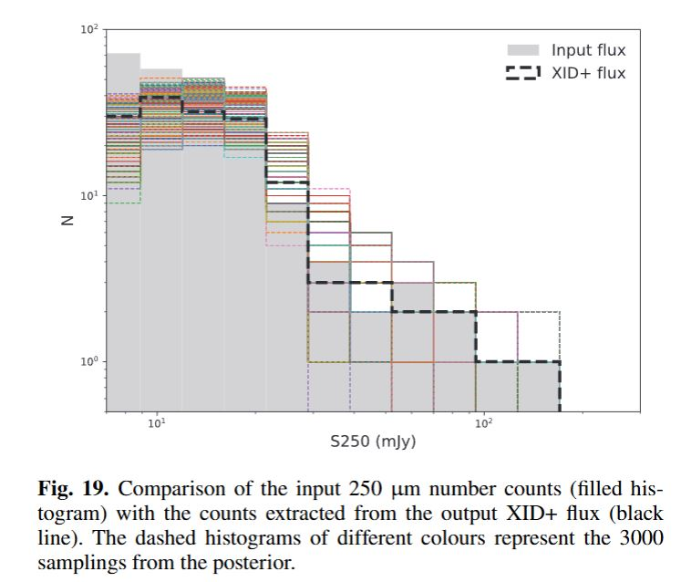
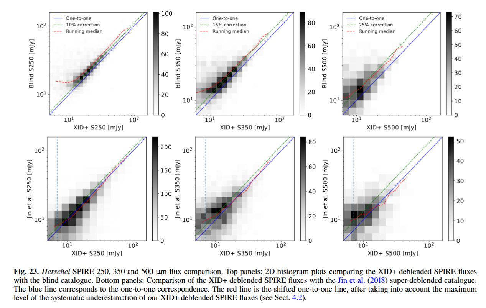

# Archived Thesis Part 2 Wang/Jin Duplicate Notes

Moved out of Thesis_part2.md so the main file keeps the cleaner story while preserving the older working notes.

Archived on 2026-08-24.

---

## 0. Rundown:

THe main comparisons I'm doing

### A. Wang vs Jin is an object-by-object flux check

Question:

> for the same matched source, does Wang measure about the same SPIRE flux as Jin?

What it uses:

- Wang `master.dat.gz`: XID+ deblended fluxes for COSMOS2020/Farmer sources.
- Jin 2018 FITS: older COSMOS2015-style super-deblended fluxes.
- COSMOS2020 Farmer `ID_COSMOS2015` bridge to match the two catalogues.
- matching and units are sane.
- Wang and Jin agree well at 250 um.
- Wang is lower than Jin at longer SPIRE wavelengths.

| band | matched strong sources | median Wang/Jin flux | read                        |
| ---: | ---------------------: | -------------------: | --------------------------- |
|  250 |                   2297 |                0.996 | basically same as Jin       |
|  350 |                    885 |                0.870 | Wang about 13 percent lower |
|  500 |                    265 |                0.815 | Wang about 19 percent lower |

So:

> the Wang/Jin plot supports a modest long-wavelength flux-scale offset, not a factor-of-10 count problem.

### B. Wang paper itself says the SPIRE XID+ fluxes can be low

Wang's own SPIRE simulation/validation says:

- output flux is close to unbiased at the bright end.
- toward fainter fluxes, median flux underestimation grows to roughly:
  - `10%` at 250 um
  - `15%` at 350 um
  - `25%` at 500 um
- they say this gets worse at longer wavelength because prior-source density increases from `0.34` to `1.34` sources per beam from 250 to 500 um.

Figures that support this:

- Wang Fig. 15: simulation input flux vs XID+ output flux.
- Wang Fig. 19: simulation input number counts vs XID+ output counts.
- Wang Fig. 23: real COSMOS SPIRE flux comparison against HELP blind catalogue and Jin; red shifted line marks the expected systematic underestimation.

But:

> 10-25 percent in flux can move sources between bins, but it is not by itself enough to explain our largest factor 5-12 number-count offsets.

### C. The area-corrected overlay is a number-count comparison

Question:

> how many sources per deg2 per flux bin does each model/catalogue imply?

This is the plot:

Important:

- Clements / Glenn / Oliver / Pearson / Valiante / Varnish are **published observed number-count tables**.
- FSPS / ALESS / hybrid curves are **pop-cosmos model-predicted number counts** from the synthetic catalogue.
- Wang raw is **not a published corrected count table**. It is raw positive-flux source counts from Wang `master.dat.gz`, divided by the COSMOS/Farmer area `1.278 deg2`.

So it is only partly apples-to-apples:

| curve/data                                          | what it is                                                                                      | apples-to-apples with published counts?   |
| --------------------------------------------------- | ----------------------------------------------------------------------------------------------- | ----------------------------------------- |
| Clements, Glenn, Oliver, Pearson, Valiante, Varnish | published observed differential counts, usually corrected for completeness/flux bias/deboosting | yes, these are the main benchmarks        |
| FSPS                                                | pop-cosmos model fluxes converted into differential counts                                      | mostly yes as a model-vs-observation test |
| ALESS / hybrid SEDs                                 | alternative model SED assumptions converted into counts                                         | mostly yes as model-vs-observation tests  |
| Wang raw                                            | raw deblended catalogue counts in COSMOS                                                        | no, useful context only                   |
| Wang vs Jin                                         | matched-object flux comparison                                                                  | no, not a count comparison                |

### D. How far off are the model count curves?

This is from `popcosmos_differential_count_evaluator_pooled_summary.csv`, using all scored published count points.

Positive dex means model is above the observed published counts like Clements, Glenn, Pearson etc..
Each point is an individual flux-bin measurement

| model curve | N points | median log10(model/obs) | linear read        |
| ----------- | -------: | ----------------------: | ------------------ |
| 50% ALESS   |      188 |                  -0.044 | 0.90x low (-10%)   |
| 25% ALESS   |      188 |                  +0.126 | 1.34x high (+34%)  |
| 75% ALESS   |      188 |                  -0.200 | 0.63x low (-37%)   |
| FSPS        |      188 |                  +0.327 | 2.12x high (+112%) |
| ALESS       |      188 |                  -0.367 | 0.43x low (-57%)   |

Simple read:

- baseline FSPS is high overall.
- pure ALESS is too low overall.
- hybrid SEDs sit between them.
- the overlay is not saying every curve is high; it says the SED choice strongly changes the counts.

### E. How bad is FSPS by band and flux regime?

| band | flux regime | N points | median log10(FSPS/obs) | linear read          |
| ---: | ----------- | -------: | ---------------------: | -------------------- |
|  250 | 10-30 mJy   |       17 |                 +0.109 | 1.29x high (+29%)    |
|  250 | 30-100 mJy  |       32 |                 +0.204 | 1.60x high (+60%)    |
|  250 | 100-300 mJy |        7 |                 +0.689 | 4.88x high (+388%)   |
|  350 | 10-30 mJy   |       17 |                 +0.234 | 1.71x high (+71%)    |
|  350 | 30-100 mJy  |       27 |                 +0.227 | 1.69x high (+69%)    |
|  350 | 100-300 mJy |        7 |                 +0.817 | 6.56x high (+556%)   |
|  500 | 10-30 mJy   |       15 |                 +0.361 | 2.30x high (+130%)   |
|  500 | 30-100 mJy  |       22 |                 +0.552 | 3.57x high (+257%)   |
|  500 | 100-300 mJy |        5 |                 +1.076 | 11.92x high (+1092%) |

To understand where we get this:
obs is the published number counts from the paper tables

We Take each published obs point e.g Valiante 500um at some flux bin (one point)

Interpolate the FSPS model curve to that same flux
Compute log10(FSPS/ obs point)
Then Group those ratios by the band and regime
Then take median offset for each group

Simple read:

> FSPS gets worse toward longer wavelength and brighter flux.

That is much larger than Wang's 10-25 percent flux bias.

### F. Is Wang raw lower than the published count tables?

 In the overlay, the black Wang raw curve is below the published observed count tables.

This is from `popcosmos_differential_count_evaluator_scorecard.csv`, using Wang raw counts with area `1.278 deg2`.

| band | comparison points | median log10(Wang raw / published obs) | linear read      |
| ---: | ----------------: | -------------------------------------: | ---------------- |
|  250 |                60 |                                 -0.315 | 0.48x low (-52%) |
|  350 |                42 |                                 -0.340 | 0.46x low (-54%) |
|  500 |                27 |                                 -0.276 | 0.53x low (-47%) |
|  all |               129 |                                 -0.315 | 0.48x low (-52%) |

Simple read:

> Wang raw counts are about a factor of two below the published count tables.

But this might make sense because Wang raw is not a corrected number-count product.

Likely reasons:

- small COSMOS area: `1.278 deg2`.
- Wang is prior-selected and deblended, not a blind count catalogue.
- raw counts are not completeness-corrected.
- 350/500 um have larger beams and stronger blending.
- rare bright sources are poorly sampled in such a small field.

### G. Current best interpretation

> Wang helps explain a modest long-wavelength flux offset, but the much larger FSPS bright-end number-count excess is probably a model/SED/population issue, not just Wang calibration.

Table of all the main discrepencies + idea on why ?

| thing seen                          |                                  size | what it probably means                                                       |
| ----------------------------------- | ------------------------------------: | ---------------------------------------------------------------------------- |
| Wang vs Jin flux offset at 350/500  |                     13-19 percent low | Wang XID+ long-wave fluxes are slightly lower than Jin for matched sources   |
| Wang paper expected SPIRE bias      | up to 10/15/25 percent at 250/350/500 | confusion/prior density causes wavelength-dependent underestimation          |
| Wang raw counts vs published counts |                            about 0.5x | Wang raw catalogue should not be treated as formal corrected counts          |
| FSPS vs published counts            |    up to 5-12x high at bright 250-500 | model/SED/bright dusty population problem                                    |
| ALESS vs published counts           |                   about 0.43x overall | pure ALESS-like SED is too low overall                                       |
| hybrids                             |                       closest overall | mixing FSPS with ALESS-like long-wave SED helps, but bright 500 remains hard |

### H. Literature / web audit for explanations

Quick web audit, done to see whether this is a known kind of problem:

- I didn't find a paper that directly explains this exact pop-cosmos discrepancy. Wang is recent; ADS currently lists it as cited, but the strongest directly useful explanation is still Wang's own validation plus older SPIRE number-count papers.
- Wang et al. 2024 is itself the most directly relevant source. It says SPIRE XID+ flux underestimation grows from about `10%` to `25%` from 250 to 500 um at the faint end, and links this to the higher prior-source density per beam. Source: `https://arxiv.org/html/2405.18290v1`
- Wang Fig. 23 uses the HELP blind SPIRE catalogue, not a Wang-published blind catalogue. It has `9382` blind 250 um sources in COSMOS and `3591` matches to Wang. Source: `https://arxiv.org/html/2405.18290v1`
- Oliver et al. 2010 HerMES says many models fail at bright SPIRE counts above `100 mJy`, and suggests model issues could involve SED variety/evolution or redshift distributions. Source: `https://orca.cardiff.ac.uk/id/eprint/11014/1/SPIRE_galaxy_number_counts_at_250%2C_350%2C_and_500.pdf`
- Glenn et al. 2010 P(D) counts say many galaxy count models overpredict bright galaxies, and that beam/systematic uncertainties matter. Source: `https://arxiv.org/abs/1009.5675`
- Valiante et al. 2016 H-ATLAS DR1 gives the wide-area corrected counts and says H-ATLAS counts are similar to HerMES at 250/350 with a small difference at 500. It also includes completeness and flux-bias corrections. Source: `https://arxiv.org/abs/1606.09615`
- Recent Herschel work still treats source confusion and deblending as the central limitation. 3D-Herschel 2026 says Herschel can often only provide upper limits for lower-mass high-z sources because of source confusion, and warns MIR-to-FIR template conversions can be wrong without FIR data. Source: `https://arxiv.org/abs/2602.22384`
- Super-resolution/deblending work after Wang explicitly motivates itself by the poor angular resolution of Herschel/SPIRE and the difficulty/fine-tuning of prior-driven deblending. Source: `https://arxiv.org/abs/2512.13353`
- Bright 500 um counts can include strongly lensed galaxies. Negrello et al. selected `F500 >= 100 mJy` lensed candidates from H-ATLAS. This can matter for bright observed counts, though lensing would usually make observed bright counts higher, not explain FSPS being high. Source: `https://ui.adsabs.harvard.edu/abs/2017MNRAS.465.3558N/abstract`

---

## 1.

Plots used below:

---

## 2. Wang Check

### What I Tried

The relevant Wang paper figure for counts is Fig. 19:

> input 250 um number counts vs XID+ output counts in a SIDES-style simulation.

can't exactly recreate Wang Fig. 19 from the released `master.dat`, because Fig. 19 uses simulated truth + XID+ output/posterior samples. The released `master.dat` is the real COSMOS deblended catalogue, not the simulation truth table.

### Wang Catalogue

The Wang catalogue is not mainly a number-count table.

It  provides:

- deblended point-source fluxes at known COSMOS/radio positions
- median fluxes and errors in `master.dat`
- posterior samples in `master_post.fits` in the full CDS release
- cross-matched long-wavelength photometry for galaxy studies

 limitation:

I only have `master.dat.gz`

can't exactly recreate plots that need:

- simulation truth
- posterior samples
- map cutouts
- blind catalogue inputs
- ALMA comparison catalogues
- COSMOS2020 physical parameters not stored in `master.dat`

### Wang Paper Details That Matter

From the Wang paper / local HTML:

- `FLAG_COMBINED = 0` COSMOS2020 area is `1.278 deg2`.
- SPIRE map units are already `mJy/beam`.
- Wang catalogue SPIRE fluxes are in `mJy`.
- SPIRE confusion noise is about:
  - `6.8 mJy` at 250 um
  - `6.3 mJy` at 350 um
  - `5.8 mJy` at 500 um
- Wang say their output counts are close to true counts above the 1-sigma instrument/noise scale, but fall below at fainter fluxes.
- Their SPIRE validation uses simulations, not the same object as published corrected observed count tables.

### Wang Figure

I went through the Wang figures again. Short version:

the best local comparison from our data is not the simulation count figure. It is a Wang-vs-Jin SPIRE matched-source diagnostic, similar in spirit to Wang Fig. 23 bottom panels.

| Wang figure  | what it shows                                    | can I reproduce from current local data?                                                                                | useful for normalisation?                                 |
| ------------ | ------------------------------------------------ | ----------------------------------------------------------------------------------------------------------------------- | --------------------------------------------------------- |
| Fig. 1       | CIGALE predicted 24 um / IRAC flux ratios        | no, needs CIGALE runs/training library                                                                                  | no                                                        |
| Fig. 2       | DLNN 24 um predictions vs CIGALE                 | no, needs DLNN test set                                                                                                 | no                                                        |
| Fig. 3       | prior catalogue sky distribution                 | partly, only with positions in`master.dat`, but not initial prior construction                                        | no                                                        |
| Fig. 4       | progressive deblending flowchart                 | no, method schematic                                                                                                    | no                                                        |
| Fig. 5       | DLNN PACS 100 um predictions                     | no, needs DLNN/CIGALE test set                                                                                          | no                                                        |
| Fig. 6       | DLNN SPIRE 250 um predictions                    | no, needs DLNN/CIGALE test set                                                                                          | no                                                        |
| Fig. 7       | real vs simulated map cutouts                    | no, needs maps/SIDES cutouts                                                                                            | no                                                        |
| Fig. 8-13    | MIPS simulation validation                       | no, needs simulation truth and posterior samples                                                                        | no                                                        |
| Fig. 14-19   | PACS/SPIRE simulation validation                 | no exact recreation; needs SIDES true fluxes and XID+ posterior samples                                                 | useful conceptually                                       |
| Fig. 19      | input 250 um number counts vs XID+ output counts | no exact recreation from`master.dat`; it is simulation truth/output, not real catalogue counts                        | useful as warning: counts reliable above noise, not below |
| Fig. 20      | joint posterior for two close simulated sources  | no, needs posterior samples/simulation                                                                                  | no                                                        |
| Fig. 21      | MIPS flux comparison to blind catalogue and Jin  | partly possible if Le Floc'h 2009 MIPS blind catalogue is local                                                         | maybe                                                     |
| Fig. 22      | PACS flux comparison to blind catalogue and Jin  | partly possible if PEP PACS blind catalogue is local                                                                    | maybe                                                     |
| Fig. 23      | SPIRE flux comparison to blind catalogue and Jin | partly possible if HELP SPIRE blind catalogue is local; current version only does Wang-vs-Jin matched-source diagnostic | yes, useful sanity check                                  |
| Fig. 24-25   | 850 um comparison to ALMA                        | no, needs AS2COSMOS/A3COSMOS ALMA catalogues                                                                            | no                                                        |
| Fig. 26      | stellar mass vs redshift                         | not from`master.dat`; needs COSMOS2020 physical properties                                                            | not for flux normalisation                                |
| Fig. 27      | SFR vs stellar mass by redshift                  | not from`master.dat`; needs SFR/Mstar catalogue                                                                       | not for flux normalisation                                |
| Fig. 28      | q250 distribution for MIGHTEE radio-only sources | not from current local files                                                                                            | maybe radio-specific only                                 |
| Fig. B.1-B.2 | uncertainty/confusion-noise checks               | no exact recreation without posterior/confusion products                                                                | useful conceptually                                       |

### Wang Raw Count Result

Using positive COSMOS2020 IDs and `1.278 deg2`:

| band | N(>10 mJy) / deg2 | N(>20 mJy) / deg2 | N(>50 mJy) / deg2 | N(>100 mJy) / deg2 |
| ---: | ----------------: | ----------------: | ----------------: | -----------------: |
|  250 |            3011.7 |             849.0 |              36.8 |                1.6 |
|  350 |            2041.5 |             476.5 |               9.4 |                0.0 |
|  500 |             797.3 |             115.0 |               0.8 |                0.0 |

read:

- 250 um has enough raw Wang sources to be useful.
- 350 um bright end is thin.
- 500 um bright end is basically one object above 50 mJy and none above 100 mJy.
- So the Wang bright-end drop is not surprising once I look at the raw counts.

Raw count plot:

### Wang Bright-End Issue

Bright sources should normally be easier to detect.

But for Wang, the issue is probably not simple detectability. It is more likely:

- small COSMOS area: `1.278 deg2`
- rare bright sources
- prior-selected catalogue
- deblending choices
- radio-prior negative-ID rows
- 350/500 um larger beams and more blending
- raw catalogue counts are not corrected formal number counts

Useful numbers:

- Using `1.278 deg2` instead of `2 deg2` raises densities by `1.56x`.
- Including all Wang prior rows instead of only positive COSMOS2020 IDs raises counts by roughly:
  - `1.3x` to `1.8x` depending on band/cut.
- SNR >= 3 barely changes bright counts above 20-50 mJy, so the bright issue is not mostly SNR threshold.

---

## 2b. Wang / Jin Normalisation Check

This is the best local diagnostic similar to something Wang actually does.

Wang Fig. 23 compares:

Wang XID+ deblended SPIRE fluxes vs blind catalogue / Jin super-deblended fluxes.

I can't reproduce the blind-catalogue top panels unless we have the HELP SPIRE blind catalogue locally.

But I can make a Jin-style matched-source comparison because we have:

- Wang `master.dat.gz`
- Jin super-deblended FITS catalogue
- pop-cosmos FSPS predicted SPIRE fluxes

Method:

- Wang IDs are COSMOS2020 Farmer IDs.
- Jin IDs are mostly older COSMOS2015-style IDs.
- use COSMOS2020 Farmer's `ID_COSMOS2015` bridge to match Wang/pop-cosmos sources to Jin.
- compare 250/350/500 um fluxes
- plot Wang vs Jin and FSPS vs Jin

ID bridge sanity check:

| check                                    |        value |
| ---------------------------------------- | -----------: |
| pop-cosmos/Wang rows used                |       114048 |
| rows with COSMOS2015 bridge              |       108153 |
| ID-bridge matches to Jin                 |        72982 |
| coordinate matches within 1 arcsec       |        80518 |
| matched by both ID bridge and coordinate |        72982 |
| coordinate-only extras                   |         7536 |
| ID-bridge median separation              | 0.121 arcsec |

Matched-object scatter:

Ratio summary:

Key ratios for sources with both Jin and Wang SNR >= 3:

| band |    N | median Wang/Jin | median FSPS/Jin | median FSPS/Wang |
| ---: | ---: | --------------: | --------------: | ---------------: |
|  250 | 2297 |           0.996 |           0.899 |            0.896 |
|  350 |  885 |           0.870 |           0.728 |            0.849 |
|  500 |  265 |           0.815 |           0.614 |            0.692 |

read:

- 250 um: Wang and Jin agree very well for strong common detections.
- 350 um: Wang is lower than Jin by about 14 percent in the median.
- 500 um: Wang is lower than Jin by about 19 percent in the median.
- FSPS is also lower than Jin in this matched strong-detection subset, especially at 500 um.

---

